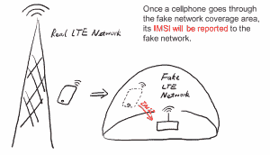

# 4G LTE 漏洞支持窃听对话和所有数据流量

> 原文：<https://www.xda-developers.com/4g-lte-vulnerability-enables-eavesdropping-on-conversations-and-all-data-traffic/>

对于我们论坛上注重隐私的读者来说，当你外出时，你可能会避开任何开放的 WiFi 热点。如果你是少数几个幸运的人之一，拥有一个由谷歌的 WiFi 助手支持的精选 Nexus 或 Pixel 设备，那么也许你不那么担心使用不安全的网络。但对于我们其他人来说，我们严重依赖运营商的 4G 网络来通过互联网传送任何重要的金融、教育或私人数据。然而不幸的是，我们的 4G LTE 连接**似乎并不像我们之前被误导的那样安全。奇虎 360 的中国网络安全研究员张万桥最近在今年 8 月的 DEFCON 24 上做了一次报告，描述了 LTE 漏洞。**

 <picture></picture> 

Source: Wanqiao Zhang

在研究论文中，该团队描述了一种方法**,迫使目标智能手机离开其 LTE 网络，进入一个不安全的受威胁网络。**攻击包括收集 LTE 设备的 IMSI，然后诱骗设备连接到一个虚假的 LTE 网络。一旦受害者连接到被入侵的网络，攻击者就能够执行各种恶意行为，包括**拒绝服务**、**呼叫/文本重定向**，或者在最糟糕的情况下甚至**监听所有语音和数据流量**。她的团队的演示特别针对目前在英国、美国和澳大利亚运行的 FDD-LTE 网络。然而，张说，这种类型的攻击可能发生在世界上任何 LTE 网络上，包括在许多亚洲国家更常见的 TDD-LTE 网络。

可悲的是，负责监督和执行 LTE 标准的监管机构早在 2006 年就承认了这一漏洞，当时他们承认了张的中间人攻击的可能性。最近在 5 月，3GPP 提出了一个潜在的安全漏洞解决方案:拒绝单向认证，并放弃来自基站的加密降级请求。这些措施将防止恶意的[毫微微蜂窝基站](https://en.wikipedia.org/wiki/Femtocell)单方面劫持你的手机并降低其网络安全措施。

这个漏洞并没有受到太多关注，直到去年安全研究人员写了一篇关于它的论文。这篇论文发表后不久，我们看到美国公民自由联盟获得了描述政府的黄貂鱼项目具有相同功能的文件。许多人仍然不知道黄貂鱼跟踪设备实际上是如何操作的，尽管人们已经开始将这项技术与最近研究的 LTE 漏洞相提并论。

对于那些想要保持他们的数据和通信隐私的人来说，使用 OpenVPN 及其 TLS 协议的 VPN 将能够保持你的数据隐私。你应该远离使用 PPTP/L2TP/SOCKS 连接方式的 VPN，因为它们仍然容易受到攻击。自从 3GPP 意识到这个问题已经超过 10 年了，他们还没有实施更新的 LTE 协议来弥补这个安全漏洞。然而，现在已经有现成的硬件可以完成这些攻击了，因此，保持数据的私密性就取决于你了。

[**来源:登记簿**](http://www.theregister.co.uk/2016/10/23/every_lte_call_text_can_be_intercepted_blacked_out_hacker_finds/)