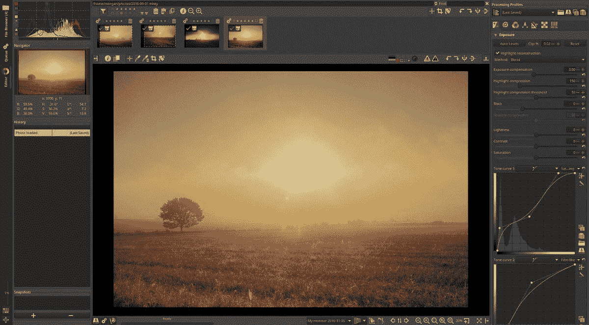
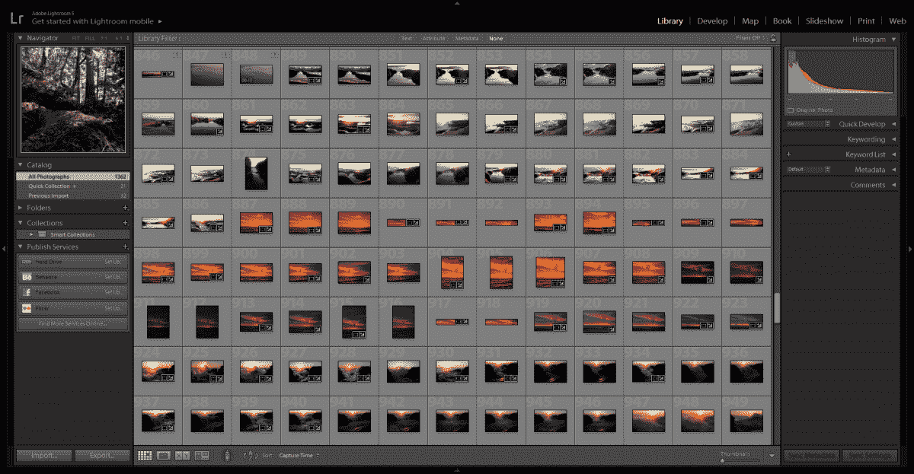
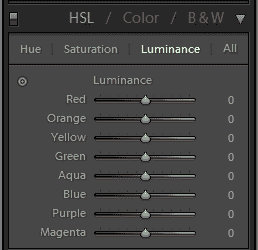

# 为智能手机图片编辑 RAW 照片的指南

> 原文：<https://www.xda-developers.com/a-guide-to-editing-raw-photography/>

­­

在探索了我的 OnePlus 3T 和索尼 NEX-5 相机的 RAW 功能后，许多读者对 RAW 摄影和他们的体验提出了问题和评论。许多人表示希望更好地学习如何编辑摄影，特别是如何在移动设备和桌面操作系统上处理 RAW 文件格式，我很高兴看到这样的人愿意参与 RAW 摄影这样的新事物。我也非常高兴有几个读者告诉我，我激励他们再一次甚至是第一次探索摄影——这可能会让许多人感到惊讶，他们口袋里的设备往往是他们探索的最佳选择。鉴于这些发现，我希望对那些努力开始的人的一些帮助将继续鼓励那些对摄影感兴趣的人，不管是不是原始的，坚持下去。

回想起我第一次涉足摄影和编辑，我很幸运地一点一点地进入前景，从我的 HTC Incredible 2 的图库应用程序中内置的编辑器这样简单的东西开始。如果我没记错的话，我偶然发现 Adobe Lightroom 是我 iPad 3 的一个应用程序，在我建造我的第一台台式电脑之前，它一直是我的首选编辑设备。在一个月左右的时间里，我基本上探索了每个滑块和选项，直到我相对熟悉了这个程序。我可以很容易地把它推荐给任何有耐心和好奇心的人，因为在学习独立使用强大的编辑套件的同时，你会不可避免地发现自己的喜好。

然而，有人指导你完成编辑的第一步，并打破 Lightroom 和其他编辑器呈现给用户的危险外观，当然是非常有用的。我将努力成为那个向导！

* * *

## 第一步

正如一些好奇而无畏的读者很快发现的那样，用 RAW 拍摄不一定是最直观的体验，尤其是当人们去查找或编辑他们制作的 RAW 格式文件时。由于原始文件，尤其是 dng，天生就不是直接从相机中取出的图像，几乎所有的图库应用程序都不会注册它们的存在，无论是在移动还是桌面操作系统上。这不是对画廊应用的批评，而是 RAW 格式不可避免的现实。因此，你要么想安装一个免费的原始文件管理器，要么硬着头皮去买一个像 Photo Mate R3 这样的东西(约 8 美元)。[面向移动设备的 Adobe Lightroom](https://play.google.com/store/apps/details?id=com.adobe.lrmobile&hl=en) 可能是你的最佳选择，免费且设计精良。

对于那些想寻找一些不同的东西的人来说， [Photo Mate R3](https://play.google.com/store/apps/details?id=com.tssystems.photomate3&rdid=com.tssystems.photomate3) 是一个成熟的移动编辑器，几乎拥有 Lightroom 和其他桌面编辑器提供的所有粒度控制。它还提供了一个带有一系列排序选项的图库功能，允许查看者有选择地只查看 RAW 格式的图像并预览它们的缩略图。我注意到的唯一主要缺点是缺少 Lightroom 提供的那种精细的降噪控制。RAW 文件表达了相机产生的所有噪声(很多),如果没有首先考虑到 JPEGs 等有损格式包括一些通常在原始数据转换和压缩时发生的强力降噪，它可能会显得相当令人不快。RAW 让*你*决定需要降噪多少，潜在地防止了智能手机相机经常臭名昭著的过度柔和的图像。

如果你有电脑，有很多免费的选项可以编辑原始照片，比如 [GIMP](https://www.gimp.org/) 和[rawthrapee](http://rawtherapee.com/)。Rawtherapee 提供了一个真正令人印象深刻的程序，专门用于编辑 RAW 格式的图像，并且易于推荐。还有谷歌的免费 Nik 编辑套件，它提供了一个[专用的降噪程序](https://www.google.com/nikcollection/products/dfine/)，以帮助那些预算有限但无法忍受噪音但希望尽可能保持编辑工作流程移动性的人。

 <picture></picture> 

A brief glance at Rawtherapee 5.0's interface (Rawtherapee).

不过，对于那些愿意掏钱的人来说，我真正喜欢的照片编辑一直是 Adobe Lightroom。它可能是我最熟悉的程序的一个不合理的附件，但我发现它提供了一个奇妙的，直观的界面和一个几乎无价的组织方面，允许你舒适地备份一个大约 40+ GB 的编辑过的照片的数据库，同时仍然保留确切的更改历史和原始文件。虽然与专业摄影师或非常认真的业余爱好者相比几乎没有什么，但在我活跃的 5 年里，我已经拍摄并编辑了数千张照片，并且在我的 Lightroom 库中几乎有每张照片的历史。

 <picture></picture> 

A small snippet of my primary Lightroom catalog. My edited photos can be found at my [Flickr](https://www.flickr.com/photos/ericralph/) and [VSCO](http://vsco.co/ericralph/) accounts.

在验证我对 Adobe Lightroom mobile 的理解是否准确时，我发现免费用户实际上可以编辑 RAW 格式，而无需订阅 CC！虽然免费版失去了一些功能，但它仍然功能良好，包括几个降噪滤波器，尽管没有控制它的能力(除了选择低，中，高降噪选项)。像 Photo Mate R3 一样，Lightroom 应用程序提供了一个有用的图库功能，允许您预览原始缩略图并过滤掉非原始图像。**这款应用绝对是我推荐给那些寻找巧妙、用户友好解决方案的人的。**虽然有经验的用户可能会发现 Photo Mate R3 更广泛的选择范围带来了一些改进，但 Lightroom 对大多数移动编辑器来说已经足够了。[本文](https://petapixel.com/2016/02/22/lightroom-android-2-0-worlds-first-end-end-mobile-raw-app/)提供了该应用程序及其原始编辑功能的概述。

* * *

## 编辑摄影的一般提示和建议

虽然为上面提到的每一个应用程序提供详细的教程超出了本文的范围，但是我能做的是解释一些您可以随意使用的更常见的选项，不管您选择采用哪一个。我将使用桌面版的 Adobe Lightroom (5.4)来演示这些功能。在找到原始文件的过程之后(通常。用于移动设备的 DNGs)并将其导入到您选择的应用程序中，您将看到几个选项。一般来说，这些选项旨在修改照片的色调(曝光/照明)、白平衡和颜色。

Lightroom 中一些最有用、最直观的编辑方法对 it 来说是相对独特的，甚至只有在桌面应用程序中才有。我最喜欢的修改照片色调的方法是通过直方图(下面截图顶部的图表)，它允许你单击五个部分(黑色、阴影、曝光、白色、高光)中的一个，然后向左或向右拖动它们，以减少或增加特定光线类型的流行程度。基本部分下方的色调曲线也可以以类似的方式拖移，但通常只需要稍微修改接近完整的图像或恢复曝光过度或不足的图像中的细节。这通常也可以用你在右边看到的滑块来完成，但是这需要更长的时间，而且也不那么有趣！在这里可以找到对直方图的效用以及如何读取直方图[的深入探索。](https://photoserge.com/dailytips/post/how-to-use-histograms-to-properly-expose-raw-files-in-adobe-lightroom-part-3-of-3-the-importance-of-proper-exposure-to-workflow)

两幅图像及其相关直方图。

沿着下图菜单中的选项往下走，我们从“白平衡”开始。这用于提高照片中颜色表现的准确性，通过修改温度和色调来实现，以便将图片导向您喜欢的结果，这可能包括修复相机中不完美的白平衡。在桌面和移动 Lightroom 中，您可以选择滴管，一旦您将滴管指向照片上您知道应该是中性灰色或白色的点，滴管就会有效地自动校正白平衡。

接下来是色调设置，从曝光和对比度选项开始。曝光会无选择地修改全局亮度。对比度进一步使图像的较暗区域变暗，并使较亮区域变亮。在这些更重的选项之后，还有更精确的控制，也可以通过顶部的直方图来控制，正如我之前解释的那样。“高光”滑块将只修改图像中最亮的部分，让您可以驯服曝光过度的图像(您可能见过或听过术语“高光溢出”)。相反，阴影可以帮助恢复图像黑暗区域中丢失的细节。最后，白色和黑色直觉上允许倾向于白色或黑色的像素变得更亮或更暗。细心的读者可能会注意到迄今为止的一个主题，即提供较大变化(白色、黑色)的控件与对图像较小部分(高光、阴影)提供更详细修改的控件的组合。

延续这种趋势，清晰度是一种有效的方法，只增加中间色调的对比度(中间意味着直方图的中间)。这样，清晰度滑块可以提供增加对比度的好处，同时防止过度使用全局对比度滑块可能带来的噪点或颗粒(通常是更丑的图像)。此选项通常是 Lightroom 独有的，但可以通过试验白色和黑色级别来部分复制(增加对比度意味着黑色更暗，白色更亮)。这种方法不会增加清晰度之类的边缘细节，但会更微妙地增加对比度。

饱和度和鲜明度是最不常用的基本设置。饱和度是曝光的颜色等价物，允许用户全局加深或变亮图像中的所有颜色。通过只调整最小(+)或最大(-)饱和度的颜色，鲜明度有助于避免整体饱和度变化的下降。

最后，在 Lightroom 和其他桌面编辑套件中可以找到几个更复杂和更精细的设置。我经常使用的是详细的饱和度、色调和亮度控制(在右侧)，这使我能够恢复过饱和的蓝色或绿色，或者更好地表达白平衡低于标准的日落照片中的黄色和橙色。细节部分(在左边)是降噪和锐化设置的地方，这是编辑 RAW 文件时非常有用的选项。Lightroom 提供了一个具有高度放大视图的小窗口，这使得在修改清晰度和添加降噪功能时，避免引入难看的伪像或模糊细节变得相当容易。

 

* * *

# 练习，练习，再练习！

作为许多指导者屡试不爽的比喻，我对那些刚刚开始伸展摄影编辑腿的人的最好建议是不要放弃，继续尝试。会犯错误，修改会过头，但随着时间的推移，你会开始对编辑有更本能的理解，并可能形成自己的风格和工作流程。我的照片花了很多年才发展出来，我清楚地记得最初的挣扎，以及看一眼我几年前编辑的照片，却被过去的我的审美决定吓呆了。我已经学了 5 年多了，在写这篇文章的过程中，我甚至学会了一些关于编辑照片的新东西。就其广度而言，摄影本质上是一项不断有机会学习的活动，它不仅没有让人望而生畏，反而让它变得更加令人兴奋和有意义。

在我上一篇文章收到的令人羞愧的回应中，许多读者分享了他们自己的一些令人印象深刻的智能手机照片，让我大吃一惊。如果你用手机拍下了任何你引以为豪并愿意分享的照片，请随意发表在本文下方的评论中，以及相应的脸书帖子或推文中。本系列即将发布的一篇文章将收集用户提交的摄影作品，所以不要错过！

前面还有一个简短的教程，介绍如何使用许多现代智能手机相机上的手动模式，以便最好地利用它们的功能。