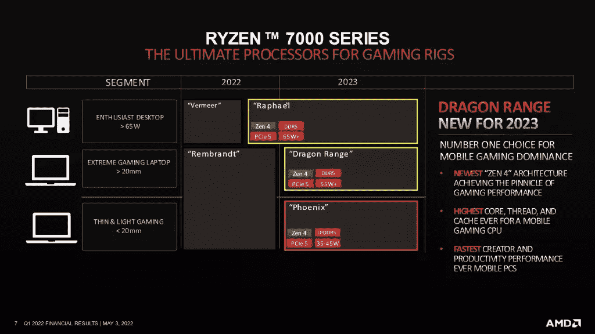

# AMD 正在为高端游戏笔记本电脑开发 55W Zen 4 处理器

> 原文：<https://www.xda-developers.com/amd-working-55w-zen-4-processors-high-end-gaming-laptops/>

AMD 分享了其即将推出的个人电脑市场产品路线图，特别是其基于 Zen 4 架构的[锐龙 7000](https://www.xda-developers.com/amd-ryzen-7000/) 处理器。在这张路线图中，该公司透露了其下一代游戏笔记本电脑处理器的计划，包括 Phoenix 系列和新的 Dragon 系列。这些基于 AMD Zen 4 架构的新 Dragon 系列处理器非常独特，因为它们的额定功率为 55W+。

直到最近，笔记本电脑处理器通常只有 45W，这是你在更强大的游戏笔记本电脑中可以找到的。然而，看起来 AMD 正在用这种新的 55W 系列迎合超大游戏笔记本电脑的用户，这应该以更高的功耗为代价提供更高的性能。AMD 在这方面并不孤单，因为据报道，英特尔正在开发一个被称为 HX 系列的类似产品线，而[戴尔已经宣布了其配备 55W 英特尔 CPU 的最新工作站](https://www.xda-developers.com/dell-13-inch-business-laptop-the-latitude-9330/)，尽管官方细节仍然很少。

 <picture></picture> 

AMD Zen 4 roadmap | Image credit: Tom's Hardware

根据 *Tom's Hardware* 分享的幻灯片，新的 Dragon Range 系列不仅使用最新的 Zen 4 内核架构，还将拥有移动游戏 CPU“有史以来最高的内核、线程和高速缓存”。这里值得注意的是，目前内核和线程数量的领先者是英特尔酷睿 i9-12900H，它有 14 个内核和 20 个线程。然而，英特尔 HX 系列的报告表明，我们可以看到 16 个内核和 24 个线程，所以看看 AMD 是否能超过这一数字将会很有趣。英特尔最新的处理器也有高达 24MB 的高速缓存。

虽然最强大的游戏笔记本电脑将使用这些新的 55W 处理器，但 AMD 仍将为轻薄游戏笔记本电脑制造 35W-45W 范围内的基于 Zen 4 的 CPU 和 APU。我们已经听说了即将发布的锐龙 7000 台式机处理器，代号为 Raphael，这个新的路线图证实了他们确实会在今年晚些时候发布。像往常一样，这些产品的 TDP 从 65W 开始。Zen 4 架构的所有处理器的一个共同点是支持 PCIe 5 和 DDR5 或 LPDDR5 RAM，它们将基于 5 纳米工艺构建。

不幸的是，路线图并没有告诉我们更多，所以具体的规格将不得不等到以后。最有可能的是，AMD 将在今年晚些时候或明年初举行一次专门的活动来揭示这些细节。不过，想要在笔记本电脑上获得最佳体验的游戏玩家现在可能有所期待了。

* * *

来源:[汤姆的硬件](https://www.tomshardware.com/news/amd-confirms-zen-4-dragon-range-phoenix-apus-for-2023)