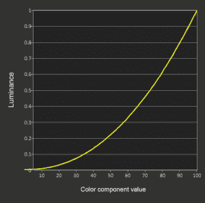

# 不，“AMOLED 黑”并不比深灰更省电

> 原文：<https://www.xda-developers.com/amoled-black-vs-gray-dark-mode/>

黑暗模式设计最近吸引了很多关注，谷歌和苹果都在以最快的速度在[他们的应用](https://www.xda-developers.com/google-app-dark-theme-search-discover/)中推出[黑暗主题设计](https://www.xda-developers.com/files-by-google-dark-theme/)，为他们[下一个主要操作系统发布](https://www.xda-developers.com/android-q-beta-3-released/)做准备，这两个都以黑暗模式为主要特征。在计算机世界，人们一直在问一个古老的问题:黑暗模式主题设计应该使用纯“AMOLED 黑色”还是深灰色？

虽然我不会在这里回答哪种色调看起来更好——这是个人问题，在这一点上基本上是政治问题——但我想回答另一个常见的问题，那就是在深色主题的设计中使用深灰色是否比有机发光二极管显示器中的纯“AMOLED 黑色”更节省电池。

答案是**是的，深灰色仍然节省电池**，但这是大多数人说*的部分，“但纯黑色节省更多的电力，因为像素实际上是关闭的！”*我在这里要反驳一下我自己的头衔，但是没错，这两种说法都是正确的。*然而*，纯黑*实际上*比深灰省电多少？要回答这个问题，我们需要先了解一些基本的有机发光二极管解剖学。

### 有机发光二极管展示基础

在有机发光二极管显示器中，每个像素都产生你所看到的自己的光。每个像素都有一个红色、蓝色和绿色子像素(为简单起见，假设为条纹 RGB)，这些是以特定亮度发射各自颜色的单个 OLED，亮度取决于发送到 LED 的电流量。显示器产生的每一种颜色都是这三种不同亮度的 OLED 的混合物，白色只是这三种 OLED 的混合物。如前所述，黑色是所有三种颜色混合的缺失，没有电流发送到任何三个 OLEDs。

那么，深灰是怎么做出来的呢？灰色、深灰色和浅灰色实际上都只是白色的阴影。灰色像素是通过形成白色像素，然后根据像素需要的亮度或暗度按百分比降低三个 OLEDs 的电流而形成的。这在 RGB 颜色代码中更容易想到，其中#FFFFFF/rgb(100%、100%、100%)是纯白，#000000/rgb(0，0，0)是黑色，灰色阴影是具有相同红色、绿色和蓝色成分的任何三重。输入色码的单个红/蓝/绿分量值基本上被传递到像素各自的 RGB 有机发光二极管。

然而，当输出这些颜色代码时，还有一个步骤，那就是*伽马校正*。我不会太深入地解释伽马，但简单地说，伽马校正采用范围从 0%到 100%的线性颜色代码值，并将其提升到幂。行业标准显示伽马使用 2.2 的幂指数，因此每个输入颜色分量被提升到 2.2，这就是相应有机发光二极管的输出亮度。

 <picture></picture> 

OLED Brightness vs Color component value. Notice how the response isn't linear.

总之，输入 RGB 颜色代码分量被提升到 2.2，然后被传递到像素各自的红色、蓝色和绿色有机发光二极管。简单。

现在可以开始回答问题了。

### 深灰像素耗电多少？

我们将使用 [Google Material 深色主题规范](https://material.io/design/color/dark-theme.html)推荐的表面颜色#121212，转化为 rgb(7%，7%，7%)。经过伽马校正(0.07^2.2)后，我们得到的值为 0.3%，这意味着谷歌的深灰色表面输出的亮度是纯白色表面的 0.3%。

> 深灰色是纯白色亮度的 0.3%

回想一下，有机发光二极管的亮度取决于输送给它的电流。只需要白色的 0.3%的功率来渲染深灰色。但我知道你在想什么，

*“0.3%还是高于 0%！”*

你是绝对正确的，但是让我们得到一些真实世界的数字。

 <picture></picture> 

Device Power vs. Display Luminance - OnePlus 7 Pro

我测量了一加 7 Pro 显示器的发光效率(60hz ),使用了绘制设备功率与输出显示器亮度的线性回归。显示器在打开时也会消耗电能，显示器驱动器会变得活跃，并准备好从 SoC 向薄膜晶体管发送和接收信号。我在显示器呈现全黑图像时测量了设备功率，在显示器关闭时测量了另一个功率，然后减去两者之差。一加 7 Pro 显示器的基准功耗为 400mW，每尼特(亮度单位)的额外功耗为 4mW。

现在我们已经收集了真实的功耗数据，我们可以模拟深灰与纯“AMOLED 黑”的功耗让我们假设纯白的显示亮度为 100 尼特，这样计算就简单了。在这个白色水平下，一加 7 Pro 显示器应该消耗 400 MW+(4mW/尼特× 100 尼特)= 800mW。当只显示黑色时，显示器应该只消耗其基准功率，即 400mW。对于深灰色，回想一下，我们计算出它的输出亮度是白色级别亮度的 0.3%，因此它应该输出 0.3 尼特。4mW/尼特× 0.3 尼特= 1.2mW，所以深灰应该只比纯黑多消耗 1.2mW。

> 400 兆瓦与 401.2 兆瓦相比，功耗仅微增 0.3%

因此，理论上来说，与使用黑色相比，深灰色消耗的额外能量*可以忽略不计*。但也许你仍然怀疑它在黑暗模式下的功效，并且不相信数学，所以让我们来测量这个该死的东西。

### 真实设备功率测量

我使用测光表将我的一加 7 Pro 设置为 100 尼特的显示白色水平，并在只有白色、黑色和深灰色的完整图像上停留五分钟，然后测量设备的总功率。一加 7 Pro 显示器在其阴影中具有更高的伽马，因此当测量#121212 的输出亮度时，它读取的是 0.18 尼特，而不是我们预计的 0.3 尼特，因此它将消耗更少的功率。

当一加 7 Pro 以 100 尼特显示全白时，该设备在五分钟内平均消耗 1000mW。当显示“AMOLED 黑色”图像时，一加 7 Pro 的平均功耗为 600mW，与我们在上面的建模中的 400mW 相差无几。最后，在测量深灰色时，该设备的平均功耗在 600mW-610mW 之间。所有这些测得的功率数字都符合我们之前建模的结果。深灰色测试的 10 毫瓦额外功率可能不是来自显示器，而是来自设备中的其他东西——也许是无线电，短暂的 SoC 爆发，谁知道呢——功率日志消耗显示最后一个列表中的安培数突然增加，平均从 0.6W 增加到 0.61 w。[这里是相同场景的另一次运行，除了在这次运行中纯黑色测试消耗了 50mW 多的功率——同样，最有可能是来自外部因素。](https://imgur.com/a/lEn9k9H)

但是最坏的情况下，让我们假设 10mW 不是侥幸。在平均设备电压为 4.03V 的情况下，额外的 10mW 转化为平均 2.5mA 的安培数。对于一加 7 Pro 的 4000mAh 电池，这意味着深灰色主题每小时消耗额外的 0.063%的设备电池。哇哦。

那么对于黑暗模式，AMOLED 黑色还是深灰色？选择你喜欢的，两者都节省同样数量的宝贵电池。