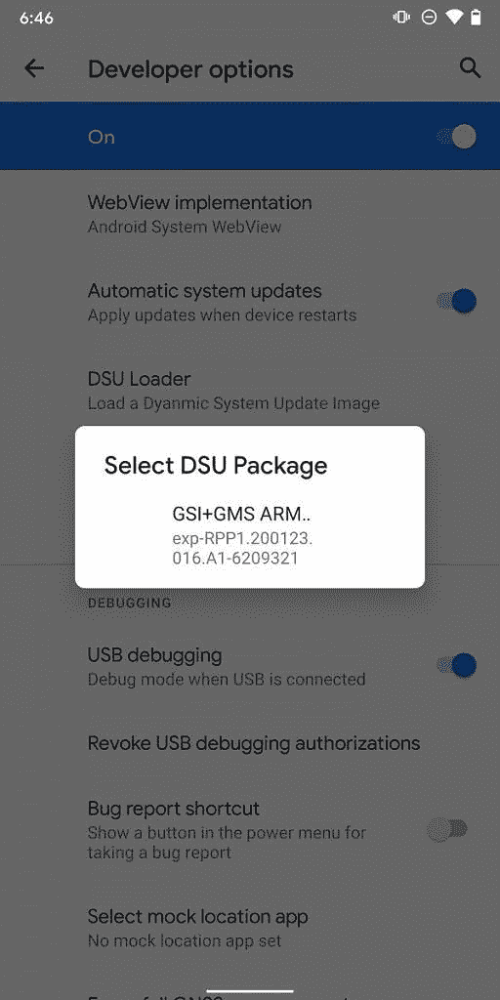

# Android 11 中的 DSU 加载器帮助开发者在现有的 Android 上测试应用

> 原文：<https://www.xda-developers.com/android-11-dsu-loader-gsi-locked-bootloader-developers-test-apps-stock-android/>

良好的应用生态系统是操作系统成功的最重要支柱之一。谷歌和苹果都认识到在他们的平台上拥有优秀应用的价值，因此两家公司都试图平衡用户和应用开发者的需求。用户不断推动操作系统的变化，尽管大多数人普遍喜欢新功能，但这些变化对应用程序开发人员来说并不总是有趣的，因为它们可以改变许多核心功能和行为。对于不断努力保持应用程序相关性的开发人员来说，处理这些变化增加了他们不断增长的工作列表。即使这些变化不会直接影响他们的应用程序，开发人员仍然需要确保他们的应用程序能够在新的操作系统更新上工作。谷歌多年来做了许多改变，让 Android 应用程序开发人员更容易完成这一过程，现在，Android 11 中一个名为 DSU 加载器的新功能将使应用程序开发人员更容易在新的 Android 版本上测试他们的应用程序。

## 从高音项目开始

Android 8.0 中引入的 Project Treble 是对 Android 操作系统的重大[重新架构。Project Treble 的目标是将 Android 操作系统分成两大块:框架和供应商实现(“供应商”在这里是指设备中任何专有硬件组件的制造商，通常指芯片)。Android OS 框架是操作系统本身，包括所有系统应用程序、UI 及其组件，以及跨 Android 设备共享的 API。供应商实现包含供应商 HALs(硬件抽象层)以及 Linux 内核和 Linux 内核模块。](https://www.xda-developers.com/googles-project-treble-modularize-android-so-oems-can-update-devices-faster/)

由于原始设备制造商从许多不同的供应商那里发运带有许多不同硬件组件的智能手机，他们不得不做大量的工作，仅仅是让硬件在一个单一的 Android 操作系统版本上运行。然后，随着每个新的 Android 操作系统更新，他们必须做更多的工作，以确保他们的硬件与新版本兼容。但随着 Project Treble 标准化 Android OS 框架和特定 Android 版本的 HALs 之间的 ABI(应用程序二进制接口)，Android OEMs 可以开始测试他们设备的更新，而无需等待芯片制造商和其他组件制造商更新他们这边的代码。这一变化明显加快了 Android 更新的处理速度。

这是 Project Treble 为 Android 更新所做工作的要点，但对应用程序开发人员来说，更重要的是 Treble 支持使用通用系统映像(GSI)进行兼容性测试。

## GSIs 的出现

为了让原始设备制造商测试他们是否正确实施了 Project Treble，谷歌要求原始设备制造商应该能够在设备上引导来自 AOSP 的干净的 Android 版本。这种干净的 Android 版本被称为通用系统映像，或 GSI。如果 GSI 启动并且大多数基本硬件功能正常，那么 OEM 知道他们的设备满足 Project Treble 的要求。因此，GSIs 的最初目的是测试三重兼容性，但正如我们在 XDA 开发者社区看到的那样，它们可以用于其他目的。[我们看到了 GSIs](https://www.xda-developers.com/how-project-treble-revolutionizes-custom-roms-android-oreo/) 如何让搭载大量 Android UXs 的设备在新版本发布后的几天内享受最新版本的 Android 功能。但谷歌设想了 GSI 背后的另一个目的:让应用程序开发者能够在他们已经拥有的物理设备上，在新的安卓版本上测试他们的应用程序。

在 Android 10 中，谷歌为开发者发布了自己的 GSI 版本。谷歌坚持认为，应用程序开发人员应该使用 GSI 在他们自己的硬件上引导一个干净的 Android 版本，这样更容易测试他们的应用程序在普通 Android 上的行为。因此，这种方法增加了在不改变 OEM 行为的情况下在现有 Android 上测试应用兼容性的现有选项，其他选项包括使用 Pixel 智能手机，在 Android Studio 中使用官方 Android 仿真器，或将应用构建部署到云上的设备实例。

尽管 GSIs 带来了诸多便利，但它们的安装仍然是一个繁琐的过程。应用程序开发人员可能不习惯在 Android 设备上手动刷新系统映像，因为这通常只有业余爱好者或 Android 操作系统开发人员才会熟悉。安装 GSI 需要通过快速启动刷新系统映像，这需要禁用 Android 验证启动并解锁启动加载程序。反过来，引导加载程序解锁需要完整的用户数据擦除。众所周知，没有一个完全单一的过程或指南来解锁所有 Android 设备的引导程序，所以没有一致性可言。例如，三星设备没有快速启动功能，而小米设备需要你跳过几道关卡才能解锁启动程序。这是一个方便的混乱，有可能被解开成更简单的东西。

这就是动态系统更新的用武之地。

## 动态系统更新只需安装 GSIs

谷歌意识到目前安装 GSIs 的方法并不是一个完美的解决方案，所以他们开始研究一个更好的解决方案。在 Android 10 中，[谷歌开始测试动态系统更新](https://www.xda-developers.com/android-q-dynamic-system-updates-project-treble/)，即 DSU。DSU 是一种临时安装 GSI 的新方法，不需要使用 fastboot 命令来刷新系统映像，覆盖原来的安装。有了 DSU，你可以启动进入 GSI，测试你的应用程序，然后方便地重新启动到你的原始安装，保持不变。

DSU 可以安装一个 GSI 而不接触原来的安装的原因是它创建了新的系统和数据分区镜像，这些镜像临时存储在 */data/gsi* 中。然后在引导过程中挂载这些映像，而不是原始的系统和数据分区。因为手机需要额外的存储空间来存储这些新的临时图像，所以你的手机必须有“逻辑分区”，这是可动态调整大小的分区。逻辑分区是 Android 的一个新的用户空间分区系统，对于使用 Android 10 的设备是强制性的。如果你的设备安装了 Android 10，那么它应该支持通过 DSU 安装 GSI。

在 Android 10 中，通过 DSU 安装一个 GSI[所需要做的就是更改一个系统属性，然后通过发送一个带有 GSI 路径的意向作为意向额外项来启动*DynamicSystemUpdatesInstallationService*。](https://developer.android.com/topic/dsu)

虽然这个过程可能看起来不熟悉，但与使用 fastboot 命令和处理一切麻烦(包括删除原始安装)相比，它要简单得多，干扰也少得多。你确实需要一些亚洲开发银行的知识和利用 DSU 的意图，但这对大多数应用程序开发人员来说应该不是问题。尽管如此，没有理由让这个过程变得更简单。另外，通过 DSU 安装 GSI 仍然需要你解锁引导程序，在这个过程中清除所有用户数据。为此，谷歌实施了一些改变，以改善 GSI 安装的两个方面。在 Android 11 中，他们不再需要使用命令行来安装 GSI。另外，他们还使得在不解锁引导程序的情况下安装 GSI 成为可能。

## Android 11 中的 DSU 加载器

DSU 加载器是 Android 11 开发者选项中的一个新工具，它允许你从谷歌下载**和**安装最新的 GSI，而不需要输入任何快速启动或 ADB 命令。只需点击“设置”中的“DSU 加载器”选项，就会出现一个对话框，其中列出了直接来自谷歌的支持的 GSI。这些受支持的 GSI 将基于您当前的操作系统和架构，因此您只能安装比您的操作系统版本更新且与您的 SoC 架构匹配的 GSI。只需选择你想要安装的 GSI，它就会从谷歌的服务器上下载并自动安装在后台。

 <picture></picture> 

DSU Loader on Android 11

有了 DSU 加载器，开发人员永远不必接触命令行来安装 GSI。至少，这是梦想，因为还有一个问题需要解决。

## 前进的道路

目前，要通过 DSU 加载器安装 GSI，你需要一个解锁的引导加载器。虽然这可能会挫败整个磨难的目的，但它不应该是这样的，我们被告知它会得到修复。谷歌计划让用户能够通过 DSU 启动谷歌签名的 GSI，而无需解锁引导程序。事实上，谷歌要求所有 Android 10 发布设备都包含谷歌签署的 Android 10、Android 11 和 Android 12 GSIs 的 Android 验证启动公钥。在设备的内存中包含 AVB 公钥将确保 AVB 不会拒绝你试图启动的 GSI。这就是为什么当前的方法包括解锁引导加载程序——通过将一个空的 vbmeta 映像刷新到 vbmeta 分区，您可以禁用 AVB，这样它就不会拒绝您将要刷新的 GSI。然而，禁用 AVB 是一个主要的安全风险，因为这意味着任何修改过的系统/引导/产品/供应商分区都可以加载到设备上，这就是为什么谷歌希望取消这一要求。

 <picture></picture> 

Android 10 GSI Launch Requirements

那么，你什么时候能指望通过 DSU 引导 GSI 而无需解锁引导程序或使用任何命令行工具呢？希望很快，因为谷歌向我们提到，他们有一些问题要解决，最初的 Android 11 开发者预览版才能正常工作。展望未来，人们可以通过 DSU 安装未来的开发者预览版 GSIs，而无需解锁引导加载程序。或许当 Android 12 开发者预览版发布时，你甚至可以完全通过使用 Android 11 开发者选项中的 DSU 加载器来启动它。对于应用开发者来说，这意味着你将有另一种方法在运行新版本 Android 的物理硬件上测试你的应用。