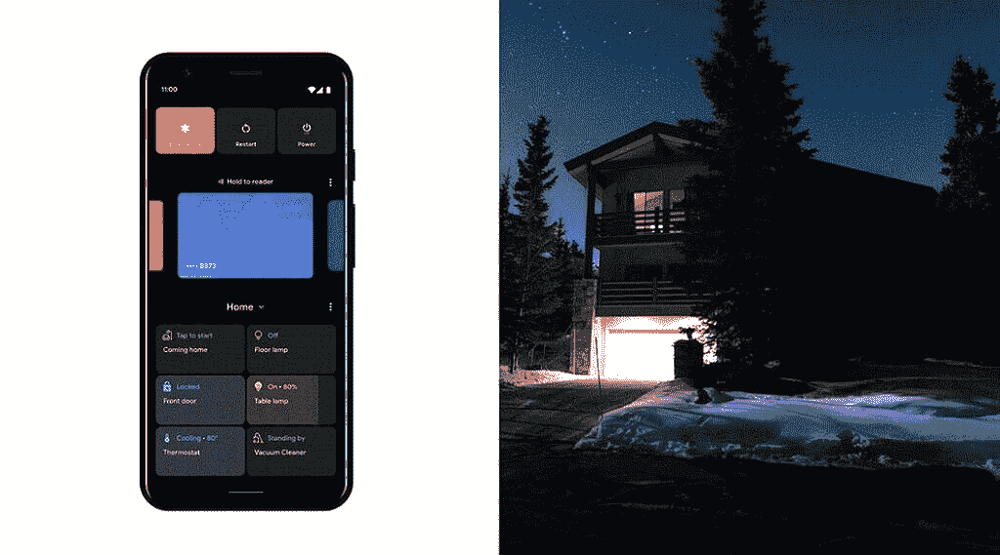
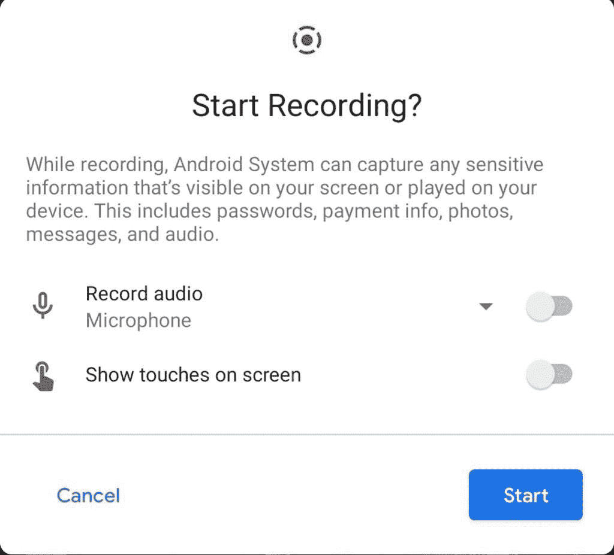
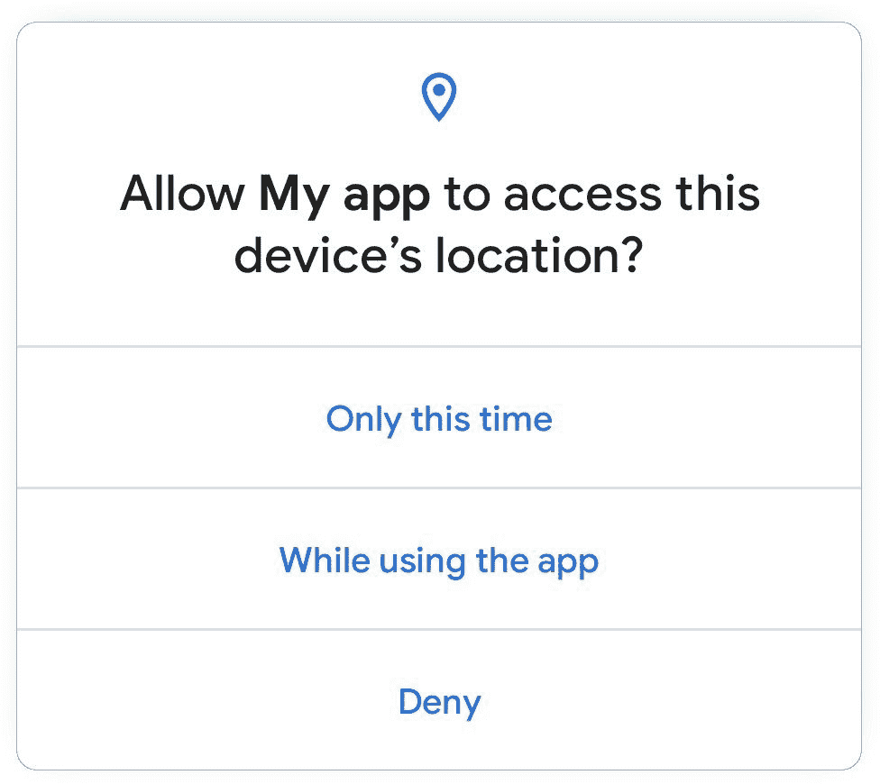
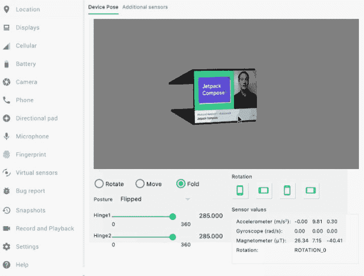

# Android 11 特性——开发者需要了解的新 API

> 原文：<https://www.xda-developers.com/android-11-features-developers-new-apis/>

Android 11 已经推出，随之而来的是 Android 10 的一系列变化。这些变化意味着开发者将需要更新他们的应用程序，以利用 Android 11 提供的一切(以及它限制的一切)。

这篇文章回顾了 Android 11 中更重要的 API 和特性的变化和增加。我们有[一篇关于更关注用户的特性的独立文章](https://www.xda-developers.com/android-11-stable-google-pixel-oneplus-xiaomi-realme-oppo/)，你也可以看看。现在，让我们开始吧！

## 设备控制

Android 11 中引入的一个更大的功能是设备控制。设备控制的目的是让控制智能设备变得更容易。打开电源菜单，您将能够看到任何已连接的智能设备并与之快速互动。这也不是一个封闭的特性。任何开发者都可以为设备控件制作自己的小部件。

目前，有 5 种不同的小部件类型可用:Toggle，这是一个简单的状态指示器，具有开/关功能；范围，可以用来调整 0-100%之间的某个值；带滑块的切换，结合了切换和范围的功能；无状态，这是一个简单的按钮，没有状态指示器；和温度面板，它允许您查看和控制恒温器的温度设置。

虽然很明显这些小部件是用来装灯和百叶窗之类的东西，但肯定有可能“滥用”它们来获得更多功能。如果你想开始开发自己的设备控件，请查看谷歌的文档。如果你想了解更多为什么设备控制可能有用的信息，[看看我们的社论](https://www.xda-developers.com/android-11-power-menu-device-controls-smart-home-dream/)。

在 Android 11 中控制媒体相当有趣。除了标准的播放通知，您还可以在快速设置面板中显示媒体控制。这部分面板还将显示多达 5 个媒体“会话”，允许用户滑动并轻松恢复其他应用程序和设备的播放。似乎单个应用程序甚至可以有多个会话。

不过，实现这一点并不是完全自动的。您的应用程序需要支持新的媒体控件。查看[谷歌的文档](https://developer.android.com/preview/features/media-controls)和[我们的文章](https://www.xda-developers.com/android-11-media-controls/)了解更多信息。

## 屏幕录制

Android 终于内置了屏幕录制功能。在 Android 11 中，记录您的屏幕就像添加一个快速设置磁贴并点击它一样简单。在开始录制之前，您可以选择是否要录制来自麦克风的音频，以及是否要在屏幕上显示触摸。

不过，这对开发人员来说还是有些意义的。市场上有大量的屏幕录制应用程序。虽然 Android 11 没有破坏它们的功能，但这确实意味着第三方屏幕记录器需要提供一些引人注目的功能，如果它们想被用来取代 Android 内置的功能。

## 一次性和自动撤销权限

谷歌最近在 Android 中集中了很多用户隐私功能，他们并没有在 Android 11 中停止。这个版本对运行时(或“危险”)权限模型有两个非常重要的更改。

在之前的 Android 版本中，如果你的应用需要危险级别的权限，它会向用户请求访问权限，差不多就是这样。您的应用程序将保留该权限，直到它被卸载、其数据被清除或用户手动撤销。

然而，Android 11 不再有这种保证。现在，当用户被提示授予权限时，他们可以选择“只在这一次”授予权限只有当应用程序在前台时，权限才会授予该应用程序。以下是谷歌对其行为的描述:

> #### “当你的应用程序的活动可见时，你的应用程序可以访问数据。
> 
> #### 如果用户将你的 app 带到后台，你的 app 可以短时间内继续访问数据。
> 
> #### 如果你在活动可见时启动前台服务，然后用户将你的应用移动到后台，你的应用可以继续访问数据，直到前台服务停止。
> 
> #### 如果用户撤销一次性权限，比如在系统设置中，无论你是否开通前台服务，你的 app 都无法访问数据。与任何权限一样，如果用户撤销你的应用程序的一次性权限，你的应用程序的进程就会终止。”

显然，这里对开发人员有一些非常重要的影响。由于权限撤销的行为类似于强制停止，它可能会导致警报和作业失败。根据[*common sware*博客](https://commonsware.com/blog/2020/08/28/android-r-one-time-permission-expiration-sometimes-kills-alarms-jobs.html)的说法，你的应用程序可以在后台工作的“短时间”只有大约一分钟。因此，如果你的应用程序需要精确唤醒，你需要建议用户不要使用一次性许可选项。

不过，一次性权限并不是 Android 11 中唯一增加的东西。如果 Android 检测到你有一段时间没有使用某个应用程序，它会自动撤销所有授予的权限。理论上这是一个很好的隐私功能，但同样，它也有一些严重的影响，特别是对于主要目的是在后台运行和收集数据的应用程序(如电池跟踪器)。

## 消息应用通知

Android 11 显然非常“以人为本”。虽然这是一个有点模糊的术语，但至少有一部分涉及到更好的消息体验，正确标记的消息通知出现在通知中心顶部自己的类别中。这也意味着支持 Android 的 Bubbles 功能，类似于 Facebook Messenger 的聊天头。

如果你对在你的应用中实现新的“以人为本”的信息功能感兴趣，[前往谷歌的文档](https://developer.android.com/preview/features/conversations)。

## 文件管理器和作用域存储

作用域存储一团糟。好了，我说了。作为一个特性，它对开发者来说已经够混乱的了，谷歌怪异的半推出和政策只会让事情变得更糟。

以前，在 Android 10 中，开发人员可以通过`requestLegacyExternalStorage`标志选择不使用作用域存储。如果你的应用仍然针对 Android 10，这在 Android 11 中仍然是可能的。但是你一针对 Android 11，这个标志就被忽略了。

如果您正在迁移您的数据模型以支持作用域存储，您可以使用`preserveLegacyExternalStorage`标志。这将允许您的应用程序继续访问外部存储，只要用户升级到包含此标志的版本。如果用户清除应用程序的数据，重新安装，或者是新用户，此标志将不会有任何影响。

不过，Google 至少部分认识到了完全用户空间文件系统访问的重要性。有一个新的权限(MANAGE_EXTERNAL_STORAGE)允许您再次拥有几乎完全的访问权限。[然而，直到 2021 年](https://www.xda-developers.com/google-play-july-2020-policy-update-introduces-extended-timeline-compliance-detailed-violation-emails-other-changes-developer-console/#gallery-1:~:text=%E2%80%9CAll%20Files%20Access%E2%80%9D%20Permission%20update)的某个时候，发布到 Play Store 的应用程序才允许这种许可。如果你在 Play Store 上有一个文件管理器或杀毒软件，你需要暂时不要瞄准 API 30。

然而，这些并不是作用域存储的唯一变化。在任何情况下，即使拥有 MANAGE_EXTERNAL_STORAGE 权限，也无法再访问`/sdcard/Android/`下的`data`和`obb`目录。您也不能再使用 ACTION_OPEN_DOCUMENT_TREE 来定位任何“可靠”存储或下载文件夹的根目录。什么是“可靠的”存储取决于设备制造商，但可以肯定地说，内部存储和采用的存储可能都算在内。

## 背景位置

如果您的应用程序需要在后台访问位置数据，这个过程现在会更加复杂。Android 10 增加了只允许应用程序在前台访问位置数据或允许它一直访问的功能。Android 11 进一步分离了这些选项。

现在，用户不必选择这个或那个，他们必须首先在使用应用程序时允许访问位置，然后进入设置以允许后台访问。如果你的应用目标是 Android 11 (API 30)，你需要在后台访问位置数据，你需要更新你的权限流来考虑这一点。看一看谷歌的文档中关于实现这一点的说明。

## 生物计量提示 API

随着指纹识别器和人脸识别等身份验证方法变得越来越普遍，能够指定您希望允许的身份验证形式非常重要。Android 11 中的一个新 API 将让你指定你想要允许的生物认证的“强度”。

## 身份凭据 API

随着我们的支付方式通过 Google Pay 和 Samsung Pay 等应用虚拟化，推动各种形式的身份虚拟化也是很自然的。Android 11 正在致力于正确支持虚拟身份的功能。Android 11 中有原生 API，但谷歌也在为早至 Android 7.0 牛轧糖的 Android 版本开发 T2 Jetpack 库。

## 5G APIs

“耶！5G！”-说从来没有人。

Android 11 有一些新的 API，可以帮助应用程序开发人员更多地了解设备连接的当前 5G 网络。你可以检查 5G 的类型(5Ge，5G sub6，5G mmW)，检查它是否是计量的，甚至可以获得连接的估计带宽值。最重要的是，如果你没有支持 5G 的设备(或你所在地区的 5G 服务)，Android 模拟器将支持虚拟 5G，因此你将能够正确测试你的应用程序如何响应不同的网络模式。

## 显示剪切 API

缺口，洞，屏幕曲线，无论什么。如今，Android 设备的屏幕上有很多障碍物。这些障碍物看起来好不好取决于你。

但是，从开发人员的角度来看，解决剪切问题可能有点像噩梦。虽然 Android 已经有了一段时间的显示剪切 API，但它们还不完整。Android 11 正在努力解决这个问题，为剪切 API 增加了更多的灵活性，以及对弯曲或“瀑布”显示的支持。

## 铰链折叠 API

可折叠手机最近变得非常流行。随着三星和华为等大型制造商以及摩托罗拉等更小的制造商发布了许多不同的可折叠设计，它们只会越来越受欢迎。

Android 11 已经为此做好了准备，它提供了一个新的 API，让应用程序检测设备何时折叠。你可以[在这里](https://developer.android.com/reference/android/hardware/Sensor#TYPE_HINGE_ANGLE)查看。Android Studio 中的 Android 模拟器也[获得了支持铰链的“硬件”升级](https://www.xda-developers.com/android-studio-android-11-emulator-hinge-sensor-support-foldable/)。

## 来电显示

垃圾电话现在是一个相当大的问题。像号码欺骗这样的事情，很难区分来电是真实的还是垃圾邮件。在美国和其他地区，运营商已经实施了 STIR/shake 标准，试图验证呼叫者 ID 并防止号码欺骗。然而，并不是每个运营商都会屏蔽未通过验证的电话，所以你仍然可能会收到一些不想要的电话。

Android 11 有一个新的 API，允许应用程序检查来电的搅拌/震动状态。这意味着第三方(和第一方)呼叫拦截器可以更好地过滤呼叫，而不必求助于不稳定的黑客。你可以在这里了解更多关于这个[的信息。](https://developer.android.com/about/versions/11/features#callscreening)

## 活页夹缓存

然而，隐私并不是 Android 11 的唯一焦点。谷歌也一直致力于整体性能的提升。Android 有一个有趣的进程间通信系统，允许第三方应用程序使用 aidl/Binders 与系统服务器进行交互。该系统提供的隔离对于安全性来说非常重要，但是在性能方面有很大的折衷。进程间的调用可能比同一进程内的类似调用花费更长的时间。

为了帮助解决这个问题，Android 11 将缓存某些绑定器调用的返回值，以提高使用它们的应用程序的性能。谷歌表示，它目前专注于高使用率和相对静态的 API。

## WindowInsetsAnimation。回收

Android 更有趣的部分之一是应用程序如何处理输入法和系统栏的出现和消失。虽然一些制造商可能会在他们的皮肤或应用程序中实现自定义动画，但过渡并不通用。

不幸的是，Android 11 并没有完全解决这个问题，但它至少提供了帮助开发人员自己解决问题的工具。添加了一个新的 API，可以让你监听并响应应用程序窗口插入的变化。通过正确的窗口配置，这将让您检测键盘或系统栏何时显示或隐藏，并相应地调整应用程序的布局。

如果你有兴趣将它放入你自己的应用程序中，请查看这篇中型文章。

## 动画 HEIF 支持

gif 太可怕了。当然，他们让你分享动画，但是他们太大了。对于网速慢和/或数据量大的人来说，上传 gif 是不可行的。在某些情况下，可以使用更有效的 WebM 格式，但 Android 11 现在也支持动画 HEIFs。

## NDK 图像解码器

如果你使用 NDK 用 C++开发你的 Android 应用程序的一部分，你可能已经注意到缺少框架端的图像解码器和编码器。从应用程序大小的角度来看，包含 C 库可能是昂贵的，尤其是如果你正在为多个架构构建。

嗯，Android 11 在框架中增加了一个图像解码和编码 API。显然，现在这不是很有帮助，但是在接下来的几年里，它肯定会让一些应用程序变得更小，更容易维护。

## 低延迟视频解码

低延迟视频对于流媒体视频等东西来说是一个非常重要的功能，特别是随着云游戏平台的即将推出，如 NVIDIA 的 GeForce NOW T1、T2 的谷歌 Stadia T3 和 T4 的微软 x cloud T5。Android 11 的 MediaCodec API 现在已经完全支持低延迟视频流的编码和解码。

## 可变刷新率

随着高刷新率显示器变得越来越普遍，硬件设备之间的功能变得越来越分散。为了解决这个问题，Android 11 引入了一个选项来设置应用程序的首选帧率。因此，如果您需要显示器以指定的刷新率运行(例如，电影的刷新率为 24Hz)，这个 API 可以提供帮助。

查看谷歌文档网站的详细信息。

## 动态资源

Android 11 最令人兴奋的新增功能之一可能是动态加载和修改资源的能力。以前，这是不可能的。如果您想“改变”一个资源，您必须要么在 XML 中有预定义的值，要么完全避免使用 XML 资源，而是依赖代码。

现在，您可以使用 [ResourcesLoader](https://developer.android.com/reference/kotlin/android/content/res/loader/ResourcesLoader) 和[resources provider](https://developer.android.com/reference/kotlin/android/content/res/loader/ResourcesProvider)API 来加载额外的资源和资产，或者更改/覆盖现有的资源和资产。

## 应用退出原因

当你的应用程序[在你无法控制的设备](https://www.xda-developers.com/phone-software-killing-apps-background/)上崩溃时，总是令人沮丧，因为这使得找出原因变得更加困难。您可以实现像 Crashlytics 这样的库来获得发生的事情的更多细节，但是这些库并不能捕获所有信息。

Android 11 增加了[activity manager . gethistoricalprocessexitreasons()](https://developer.android.com/reference/kotlin/android/app/ActivityManager#gethistoricalprocessexitreasons)API，可以查询你的 app 是否可能有强制退出的情况以及原因。原因包括 anr、崩溃、本机崩溃等等。

## 亚行增量

如果你正在开发一个大型应用程序，你可能知道试图通过 ADB 安装它是多么乏味。它可能会中途失败，即使没有，也有很多时间浪费在等待 APK 转移上。

Android 11 在此力挽狂澜，亚行增量。该功能安装足够的应用程序，以允许它在后台运行额外的数据。此功能的阈值目前为 2GB，它要求您的应用程序使用 APK 签名方案 v4 进行签名。它还要求目标设备支持[增量文件系统](https://www.xda-developers.com/google-incremental-file-system-android-big-games/)，目前仅在 Pixel 4 上支持，但这是 Android 11 的启动要求。

## 更多可空性注释

Kotlin 已经成为开发 Android 应用程序的最流行的语言之一。由于一些方便的语法特性，比如内置的空保护，它已经成为相当多开发人员(包括我)的最爱。

由于这种受欢迎程度的上升，谷歌一直在致力于 Android 框架，使其对 Kotlin 更加友好。这主要是以向方法和变量添加显式可空性注释的形式出现的。虽然 Kotlin 可以处理来自 Java 的不明确的方法返回，但这是以显式空保护为代价的。

Android 11 为框架添加了更多的可空性注释，使得使用 Kotlin 开发 Android 应用程序更加容易。

由于 Android 11 中所有新的隐私限制，如果不针对 API 30 并抱着最好的希望，可能很难看到它们如何影响你的应用程序。

为了让调试和更新更容易，Android 11 有一个功能，允许你[手动切换新的限制](https://www.xda-developers.com/android-11-new-app-compatibility-developer-option-dev-test-new-platform-changes/)，即使你的应用程序不是针对 API 30。您可以单独启用它们进行更细致的测试，或者一次启用它们来查看是否有任何问题。

查看[谷歌文档](https://developer.android.com/preview/test-changes)了解更多细节。

## 数据访问审计

与兼容性工具类似，Android 11 还增加了审计应用程序正在访问哪些数据的功能。你可以用这个来确保你不会遇到 Android 11 上新的范围存储限制的问题。

有关实现和使用说明，[请访问 Google 的文档](https://developer.android.com/preview/privacy/data-access-auditing)。

## APK 侧装许可

由于新的范围存储模型在 Android 11 上得到进一步加强，侧装 apk 变得更加困难，至少在开发者端是这样。

在 Android 11 的早期开发者预览版中，授予应用程序侧载 APKs 的权限会立即强制退出。对于用户和开发者来说，这都是一种令人困惑的体验，因为用户被赶出了他们正在使用的应用程序，而开发者必须处理他们的应用程序被强制停止的情况。

虽然 Android 11 的完整版本没有完全解决这个问题，但至少使它变得易于管理。现在，不是退出整个应用程序，授予权限只是导致当前活动重新开始。如果你的应用程序从一个带有嵌套片段的活动或其他形式的导航中安装 apk，确保你正确地保存它的状态，以备可能的重新创建。

## 列出已安装的软件包

Android 11 中的另一个隐私功能是它对检索已安装应用程序列表的限制。在之前的 Android 版本中，使用`PackageManager.getInstalledPackages()`方法会列出设备上所有匹配的应用程序。

然而在 Android 11 中，这个方法只会返回你的应用和预装应用的列表。这样做的原因可能是为了避免应用程序能够通过检查你安装的其他应用程序来识别你的设备。然而，绕过这个限制很容易，至少是部分地。如果你的应用需要看到用户安装的包，你可以使用`<queries>` manifest 元素来说明你想要看到什么类型的应用。这不需要任何用户交互；您将自动获得查看与您的查询相匹配的应用的权限。

查看[这篇 *Commonsware* 的博文](https://commonsware.com/blog/2020/04/05/android-r-package-visibility-holes.html)了解更多细节。

## 快速存取钱包

这项功能在 Android 10 中部分引入，允许开发者在功能菜单中显示支付方式。在 Android 10 中，该功能被默认禁用，只能在装有 Google Pay 的 Pixel 设备上使用。而 Android 11，[增加了合适的 API 来访问它](https://developer.android.com/reference/android/service/quickaccesswallet/QuickAccessWalletService)。

要了解它如何工作的更多信息，请查看我们之前关于快速访问钱包的文章。

## 第三方相机应用程序限制

Android 的一个很大的优势是能够指定你想为某项服务使用哪个应用。不幸的是，这变得越来越难，至少对于相机应用程序来说是这样。

一般来说，在 Android 11 中，当应用程序请求拍照时，第三方相机应用程序将不再显示在相机选取器中。要了解全部细节和推理，请查看我们之前关于这个的文章。

## 自动低延迟模式

基于 Android 11 的电视和电视盒子现在允许应用程序请求电视禁用显示图像的所有后期处理，以降低延迟。查看[我们关于新 Android 电视功能](https://www.xda-developers.com/android-tv-gets-google-play-instant-apps-pin-code-purchases-board-auto-low-latency-mode-gboard-more/)的文章，了解更多信息。

## 块存储库

[Android 11 增加了开发者将用户的应用凭证备份到 Google Drive 的功能，以便在新设备上更容易登录](https://www.xda-developers.com/google-new-block-store-library-easier-sign-in-apps-new-devices-migration/)。虽然该功能是可选的，但它应该使实现它的应用程序更容易迁移到新设备。

## 画廊回收站

虽然一些制造商已经在他们自己的图库应用程序中添加了垃圾桶或回收站功能，但这是 Android 本身所缺少的功能。 [Android 11 为 MediaStore 添加了一个新的 API，允许“丢弃”照片和视频，而不是直接删除它们](https://www.xda-developers.com/android-11-hidden-recycle-bin-trashed-photos-videos/)。

Android 11 中新的 MediaStore Trash API。演职员表:[塞维多夫·米索琴科](https://medium.com/@sdex/new-mediastore-trash-api-in-android-r-9a7000c4037)。

## 不再过度扫描

过扫描是 Android 的一个功能，它允许过扫描。虽然它主要用于电视，但这些 API 也存在于移动 Android 中，对第三方导航手势应用程序等尤为有用。不幸的是，[谷歌已经在 Android 11](https://www.xda-developers.com/google-confirms-overscan-gone-android-11-crippling-third-party-gesture-apps/) 中完全移除了 overscan。

## 异步任务折旧

如果你使用 AsyncTask，可能是时候找一个替代品了，比如 RxJava 或者 Kotlin 的协同程序。 [Android 11 官方正在贬低 AsyncTask API](https://www.xda-developers.com/asynctask-deprecate-android-11/) 。虽然这只是一种反对，而不是删除，但尽快迁移到其他地方可能仍然是一个好主意。

Android 9 引入了隐藏的 API 黑名单，目的是以稳定性的名义阻止第三方应用程序开发者使用不属于 SDK 的 Android 框架部分。不过，通过使用元(或双)反射，解决这个问题甚至完全禁用这个限制是很容易的。

[然而 Android 11 正在打击这个旁路](https://www.xda-developers.com/android-11-harden-hidden-api-restriction-meta-reflection/)。元反射将不再起作用，甚至更多隐藏的 API 也受到限制。虽然[似乎仍然有可能绕过新的限制](https://github.com/ChickenHook/RestrictionBypass/)，但是绕过需要使用本地代码，这可能并不是所有开发人员都想要的。

## 共享到打印

由于新的[共享打印意图](https://www.xda-developers.com/android-11-share-to-print-feature/)，Android 11 上的打印应该更容易。这使得开发人员可以绕过普通的共享屏幕，直接将文档共享给打印服务，从而使用户的打印更加方便。

## 仍然没有电话录音 API

Android 11 开发者预览版 2 中引入了一个功能，即[允许第三方拨号器应用记录通话](https://www.xda-developers.com/android-11-call-recording/)。然而，这在开发者预览版 3 中很快被移除。如果你看到了关于这个功能的故事，很抱歉让你失望了，但它在 Android 11 中不可用。

## DSU 装载机

Android 10 增加了“临时”[安装直接来自谷歌](https://www.xda-developers.com/android-11-dsu-loader-gsi-locked-bootloader-developers-test-apps-stock-android/)的 GSI 的功能，以便更容易地在新版本的 Android 上测试你的应用。这项功能可以在任何运行 Android 10 的谷歌认证设备上运行。不幸的是，它需要一个解锁的引导装载程序，因为正确的签名验证没有完全实现。

然而，在 Android 11 中，现在应该可以直接从开发者选项中选择并安装谷歌 GSI，而无需解锁的引导程序。请记住，我们还不能测试这一点，所以如果你有，让我们知道它是如何进行的！

* * *

正如你所看到的，Android 11 发生了很多事情。文件访问的工作方式发生了变化，新的功能涉及智能设备，甚至可以在没有解锁的引导加载程序的情况下安装 GSIs。

希望这篇文章能帮助你了解在 Android 应用程序开发中你需要考虑些什么。如果没有，哦好吧。如果你有兴趣在你的 Pixel 设备上启动 Android 11，我们在这里为你提供了[下载链接](https://www.xda-developers.com/android-11-stable-google-pixel-oneplus-xiaomi-realme-oppo/)。如果你有来自一加、小米、OPPO 或 Realme 的 OEM 设备，[查看这篇文章](https://www.xda-developers.com/android-11-update-tracker/)，看看你的设备是否有资格进行测试。或者，你可以启动 Android Studio 来启动最新的 Android 11 模拟器版本，或者你可以刷新今天发布的 Android 11 GSIs。快乐发展！