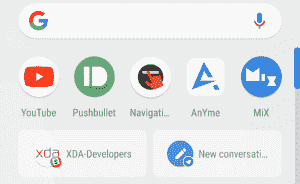
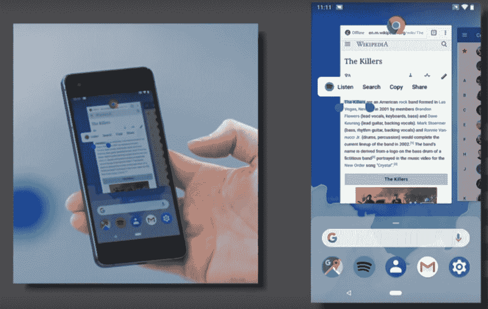

# Android P 的智能选择和应用程序操作仅限于谷歌 Pixel 2

> 原文：<https://www.xda-developers.com/android-p-smart-selection-app-actions-limited-google-pixel-2/>

# Android P 的智能选择和应用程序操作仅限于谷歌 Pixel 2

Android P 的智能选择和 App Actions APIs 仅限于 Google Pixel 2 (2017+)设备，因此最初的 Google Pixel 不会支持它们。

在 Android P 的[最新开发者预览中，我们已经看到](https://www.xda-developers.com/android-p-beta-3-google-pixel/)[引入了](https://www.xda-developers.com/android-p-beta-3-google-pixel-2-xl/)许多很酷的新功能。其中两个功能是多任务窗口中的智能选择，另一个功能称为应用程序操作。虽然 Android P 仍然有许多其他伟大的功能，但这两个功能一直是为 2017 年或更晚发布的谷歌 Pixel 设备保留的(指的是谷歌 Pixel 2/Pixel 2 XL 和即将推出的谷歌 Pixel 3/Pixel 3 XL)。此前，一名用户在谷歌问题跟踪器上报告称，智能选择在他们最初的谷歌 Pixel 上消失了。他们被告知这是有意的行为。

对于那些不知道的人来说，智能选择和应用程序操作是 Android P 中添加的两个新功能，用户很高兴看到这两个功能。[智能选择](https://www.xda-developers.com/everything-new-android-p-developer-preview-2/)允许您从多任务窗口中的应用程序复制文本和图像，而无需实际打开它们。至于应用程序的动作，这个功能为用户提供了预测的动作供选择，最明显的是在谷歌像素启动器中。这些操作可以包括“在 YouTube 上观看视频”或“在 Spotify 上播放音乐”[应用动作 API](https://www.xda-developers.com/slices-app-actions-android-p-google-assistant/) 使用与谷歌助手上的[动作相同的](https://www.xda-developers.com/actions-on-google-media-playback-subscriptions-custom-commands/)[意图](https://developers.google.com/actions/reference/built-in-intents)，你可以在多个应用中找到它们，例如谷歌应用、Play Store、谷歌助手和 Pixel Launcher。

 <picture></picture> 

App Actions in Android P

 <picture></picture> 

Smart Selection in Android P, as demonstrated by David Burke during Google I/O 2018\. Source: [Google](https://www.youtube.com/watch?v=ogfYd705cRs)

虽然可以理解为什么谷歌打算保留这些功能作为谷歌像素的独家功能，但不清楚为什么最初的谷歌像素将不会支持它们。开发者预览版 2 上的用户能够毫无问题地使用该功能，所以我们知道它确实可以在设备上工作。我们希望谷歌改变对此的立场，但就目前而言，只有 2017 款谷歌 Pixel 和更高版本的设备能够支持这两种功能。

* * *

[**来源:谷歌问题追踪**](https://issuetracker.google.com/issues/79500604#comment9)

[**Via: /r/Android**](https://www.reddit.com/r/Android/comments/8vwlr7/smart_selection_and_action_suggestions_will_only/)