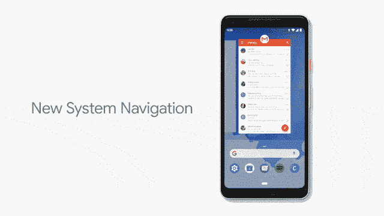

# 谷歌可能会为 Android Q 的新手势杀死 Android 的后退按钮

> 原文：<https://www.xda-developers.com/android-q-gestures-back-button/>

自从苹果在 iPhone X 上移除了标志性的 home 键以支持手势导航以来，我们已经看到一些最好的 Android 手机背后的公司推出了他们自己的手势控制实现。一些手势控制系统，如一加和小米的手势控制系统，因其直观性和引人注目的动画而广受好评，而谷歌的 Android Pie 手势控制系统则得到了褒贬不一的评价。正如谷歌[在谷歌 I/O 2018 之前意外泄露了](https://www.xda-developers.com/android-p-iphone-x-navigation-gesture/) Android P 的手势一样，我们已经从上个月[获得的一个泄露的 Android Q 版本中找到了导航手势原型改造的证据](https://www.xda-developers.com/android-q-dark-theme-desktop-mode-permission-revamp/)。

## Android Pie 中的手势控制

在 Android 9 Pie 中，3 键导航系统[被 2 键系统](https://www.xda-developers.com/android-p-iphone-x-gestures-official/)取代。虽然“最近应用”按钮被移除了，但“后退”按钮却保留了下来。然而，home 键变成了一个手势药丸。以下是手势在 Android Pie 中如何工作的总结:

*   Tap 药丸:回家
*   长按药丸:启动谷歌助手
*   快速向上滑动药丸:打开横向最近应用概述
*   长时间向上滑动药丸:应用程序抽屉
*   向右滑动药丸:滚动浏览最近的应用程序
*   向右快速滑动药丸:打开最后一个应用程序
*   后退按钮:返回(隐藏在启动屏幕上)

 <picture></picture> 

Gestures in Android Pie. Source: Google.

人们对 Android Pie 手势的大多数抱怨都集中在专用后退按钮的存在以及执行长时间向上滑动药丸以打开应用抽屉的困难。虽然我不知道 Android Q 是否会改变后一种手势，但谷歌很有可能会取消专用的后退按钮。下面是我们对 Android Q 中手势的了解。

## Android Q 中的手势控制

以下信息基于我们获得的 Android Q 预发布版本。这个建筑是在一月底建造的。虽然我们有信心到目前为止我们发现的主要功能，如全系统黑暗模式和权限修改将出现在发布版本中，但谷歌可能会在开发的任何时候取消这些对手势控制的可能更改。

在 Android Q 中，谷歌正在试验对 Android Pie 的手势进行两项重大改变:用手势取代专用的后退按钮，并提高“最后一个应用程序”过渡动画的流畅性。您也不能再通过三按钮导航系统[禁用手势](https://www.xda-developers.com/disable-android-pie-gestures-google-pixel-3/)来返回垂直卡最近应用概述。在发布之前可能会有更多的变化，但这是我们目前所发现的。

### 后退无按钮导航

Android 专用的 back 按钮从一开始就有了，但不难想象 Google 是如何在 Android Pie 中摆脱它的。为什么我们不能向左滑动药丸来执行向后的动作呢？我可以理解为什么谷歌没有在 Android Pie 中去掉返回键。普通人将他们的 Pixel、Pixel XL、Pixel 2 或 Pixel 2 XL 升级到 Android 9 Pie 可能已经太习惯于专用的后退按钮，所以它的突然删除可能会让他们感到困惑。但是现在所有的 Pixel 所有者都已经尝到了手势导航控制的滋味，可能是时候放弃专用的后退按钮了。通过 Android Q 中启用的实验手势，你可以**向左滑动药丸以返回**。这正是我一直希望看到的，就像听起来那么简单！

### 更好的过渡动画

看起来谷歌可能会更像 iPhone 的最后一个应用程序手势动画。在 Android Q 中，在任何应用程序中向右滑动药丸都可以让你平稳地切换到上一个应用程序。您可以通过继续向右滑动药丸来循环浏览您最近的所有应用程序，这将使您在水平的最近应用程序概览列表中向左移动，直到您到达列表中最早的应用程序。如果你在启动器上滑动药丸，你可以在一个连续的手势中循环所有的应用程序。

[video width = " 480 " height = " 640 " MP4 = " https://static 1 . xdaimages . com/WordPress/WP-content/uploads/2019/02/qlastapp . MP4 "]

### 摘要

以下是 Android Q 中实验手势的工作原理总结:

*   Tap 药丸:回家
*   长按药丸:启动谷歌助手
*   快速向上滑动药丸:打开横向最近应用概述
*   长时间向上滑动药丸:应用程序抽屉
*   向右滑动药丸:滚动浏览最近的应用程序
*   向右快速滑动药丸:打开最后一个应用程序
*   向左滑动药丸:返回

### 我们什么时候能看到这些新手势？

虽然谷歌可能已经修复了我在新手势控制原型中看到的一些问题，但我非常怀疑我们会在 [Android Q 开发者预览版 1](https://www.xda-developers.com/google-test-android-q-project-treble-gsi/) 中看到新手势。Android 原生手势导航控制的一个重大改进是一个变化，我觉得谷歌将保留到[谷歌 I/O 2019](https://www.xda-developers.com/google-io-2019-may-7-9/) 为止。 [Android P 开发者预览版 1](https://www.xda-developers.com/android-p-developer-preview-1-google-pixel-xl-pixel-2-xl/) 没有手势控制功能，而在 [Google I/O 2018](https://www.xda-developers.com/tag/io-2018/) 期间发布的 [Android P 开发者预览版 2](https://www.xda-developers.com/everything-new-android-p-developer-preview-2/) 则有。我们距离 Android Q 的第一个开发者预览版的预计发布日期只有几周了，所以我们很快就会知道手势是否会进入那个版本。同样，也有可能谷歌在我们获得泄露的版本后的一个月里已经取消了手势的这些改变。然而，鉴于许多商店和用户对 Android Pie 手势的强烈反应，如果谷歌不对导航手势做出重大改变，我们会感到惊讶。

*不要脸塞:在任何安卓设备上寻找手势控制？查看我们在谷歌 Play 商店上的“导航手势”应用程序！*

* * *

关于 Android Q 的更多信息:

非常感谢 PNF 软件公司为我们提供使用许可 [JEB Decompiler](https://www.pnfsoftware.com/?aid=xdadev) ，这是一款用于 Android 应用的专业级逆向工程工具。使用 JEB Decompiler，在 XDA 知名开发者 luca020400 和 Quinny899 的帮助下，我能够找到隐藏的功能并了解如何激活它。