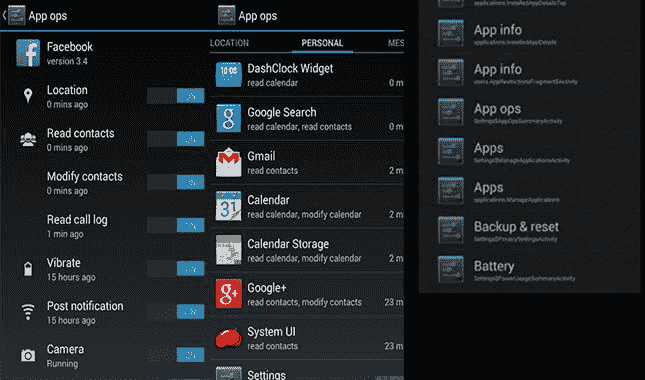
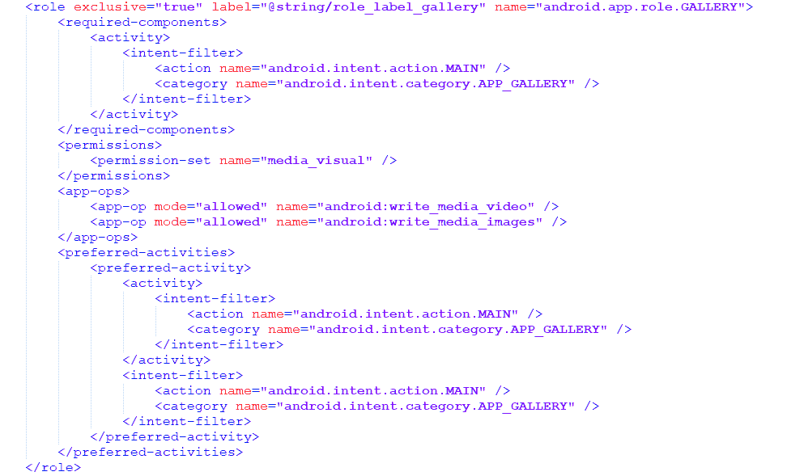
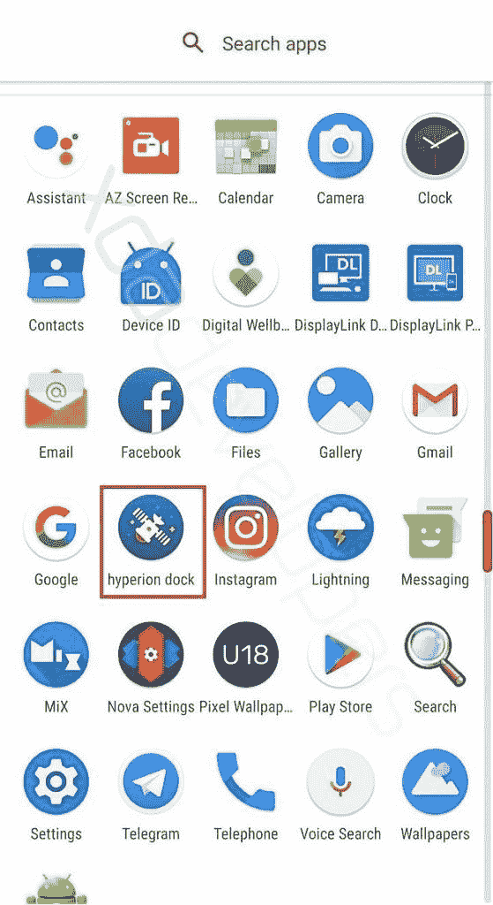

# Android Q 如何改进 Android Pie 的隐私和权限控制

> 原文：<https://www.xda-developers.com/android-q-privacy-permission-controls/>

与旧版本的 Android 相比，Android 9 Pie 的市场渗透率几乎是雷达上的一个光点，但这不会推迟谷歌发布下一版本 Android，Android Q 的计划。我们预计谷歌将在下个月的某个时候推出 Android Q 的第一个开发者预览版，但在谷歌宣布之前，我们已经设法获得了 Android Q 版本，这可能是谷歌开发周期中的一个很长的版本。在我们的第一篇文章中，详细介绍了下一个 dessert 版本的变化，我们谈到了新的权限控制接口。然而，我只展示了修改后的权限管理系统的一些截图，所以我想跟进更多的细节。我还做了更多的测试，收集了更多关于 Android Q 中新权限的信息,“角色”功能，新的包安装程序等等。但是首先，这里简单回顾一下 Android 中的权限管理。

## Android 权限管理简史

Android 4.3 Jelly Bean [首次通过“App Ops”功能引入了](https://www.xda-developers.com/app-ops-brings-granular-permissions-control-to-android-4-3/)粒度权限管理，尽管它对用户是隐藏的。Android 4.4 KitKat 甚至在 App Ops 界面中引入了新的用户可控权限，尽管你需要 root 权限和一个暴露的模块来访问它。最后，Android 6.0 Marshmallow 引入了我们都熟悉的权限系统，尽管对您可以限制的权限有所限制。旧的 App Ops 功能仍然存在于 Android 中，尽管它只能通过命令行(`cmd appops`)访问。[谷歌 Play 商店上的某些应用](https://play.google.com/store/apps/details?id=rikka.appops)利用 App Ops 的命令行实现来提供更强大的权限管理接口。谷歌不向用户公开应用操作，因为用户可能不知道他们在做什么，这导致他们拒绝了某个应用正常运行可能真正需要的一些权限。不幸的是，自从 Android Marshmallow 引入权限管理以来，我们还没有看到该功能的任何重大变化——也就是说，直到 Android Q。

 *安卓 4.3 中的 App Ops 果冻豆*

Android 6.0 Marshmallow 在向应用程序授予某些权限的方式上也发生了重大变化。在 Android 6.0 之前，在[应用的清单文件](https://developer.android.com/guide/topics/manifest/manifest-intro)中定义的所有[权限都是在安装时授予的。在 Android 6.0 中，谷歌](https://developer.android.com/guide/topics/manifest/uses-permission-element)[为他们认为危险的某些权限引入了运行时权限管理](https://www.youtube.com/watch?v=C8lUdPVSzDk)，比如外部存储访问、摄像头访问、位置访问等等。运行时权限仅在安装应用程序后授予，用户必须在请求时通过点击权限对话框上的“允许”来明确同意授予这些权限。在谷歌[打击针对旧 API 级别的应用](https://www.xda-developers.com/play-store-updated-requirements-api-level-64-bit/)之前，应用开发者可以通过针对 API 级别 22 或更低(Android Lollipop 或更旧)来绕过运行时权限。)Android Q [将警告试图运行针对 API 级别 22 或更低的应用的用户](https://www.xda-developers.com/android-q-warn-apps-target-android-lollipop/)，进一步激励开发者更新他们的应用，以避免被操作系统羞辱。因此，当 Android Q 进入设备时，用户设备上的几乎每个应用都应该受到 Android 6.0+中引入的权限管理控制。考虑到这一点，谷歌正在清理 Android Q 中的权限控制，让用户更容易管理他们设备上应用程序的访问级别。

## 与 Android Pie 相比，Android Q 中的权限管理更简单

从 Android 6.0 棉花糖到 Android 9 Pie，现有的运行时权限管理只让用户允许或拒绝某个 app 的某些权限。我们在之前的文章中提到，Android Q 将允许用户仅在应用程序正在使用时限制权限。这个功能让很多人兴奋不已，但我们必须澄清的是**只有位置权限可以被限制在应用程序正在使用的时候**。这意味着您不能仅在应用程序正在使用时限制麦克风或摄像头。不过，你不应该对此感到失望，因为 Android Pie 已经[引入了](https://www.xda-developers.com/android-p-privacy-updates/)对后台使用[摄像头](https://www.xda-developers.com/android-p-background-apps-camera/)和[麦克风](https://www.xda-developers.com/android-p-audio-recording-limitations-privacy/)的一些限制，要求应用程序在前台或使用前台服务。此外，Android Q 在这一点上做了进一步的扩展，通过**向用户披露任何应用程序何时使用麦克风、摄像头或访问设备的位置**。这作为右上角的状态栏图标显示给用户。当状态栏展开时，图标旁边显示的文本告诉用户哪个应用程序当前正在使用这 3 个敏感权限中的一个。最后，如果用户点击这个图标，会显示一个对话框，告诉用户哪个应用程序使用哪个权限。同样，这仅适用于摄像机、位置和麦克风权限。

谷歌似乎鼓励用户将位置访问限制在应用程序正在使用的时候，因为他们已经在 Android Q 中设置了一个**提醒，当用户授权应用程序总是访问他们的位置**时。这种提醒以通知的形式出现，告诉用户一个应用程序一直在使用他们的位置，并且它总是有能力这样做。点击通知会将您带到该应用程序的位置权限页面，让用户选择仅在该应用程序正在使用时限制位置权限。这值得称赞，谷歌。

最后，在我的构建中，特殊应用程序访问权限的 UI(如电池优化、设备管理、请勿打扰访问、通知访问等。)不变。然而，一个新的“金融应用程序短信访问”特殊权限已被添加到列表中，尽管我不确定它与“高级短信访问”权限有何不同，后者是应用程序向高级号码发送短信所需的权限。根据 [Google Play 限制短信和通话记录权限的新政策](https://www.xda-developers.com/google-play-developer-policy-call-log-sms/)，这一新权限可能是针对使用短信进行某些交易的银行应用程序的。

### 在 Android Q 中管理权限

这里有一个截图展示了 Android Q 中新的权限管理界面的变化。我已经在每个图片的标题中包括了每个页面的详细描述。

### 在 Android Q 中授予权限

下面是展示 Android Q 中运行时权限管理的截图。我们已经讨论过前两个截图显示的内容，但第三个截图是一个全新的 Android Q 功能，我以前没有讨论过。Android 允许用户在运行传统应用程序(定义为针对 API 级别< 23) is something that's already possible in Android Pie with the [正确配置](https://android.googlesource.com/platform/frameworks/base/+/master/core/res/res/values/config.xml#3229)的应用程序)之前控制权限的能力，但谷歌最终在 Android Q 中启用了这一功能。

### Android Q 中权限的实时监控

这里有一些截图，展示了当一个应用程序正在访问几个敏感/危险权限之一时，Android Q 将如何提醒用户，这些权限包括摄像头、位置和麦克风。

## 对剪贴板访问、外部文件访问的新限制

### 后台剪贴板访问限制

在我之前的文章中，我提到了 Android Q 框架中的一个新权限，该权限表明后台运行的非系统应用程序将不再能够读取系统剪贴板。在我们让谷歌 Play 商店正常工作后，我决定安装一些流行的剪贴板管理器应用程序，比如[剪贴板管理器](https://play.google.com/store/apps/details?id=devdnua.clipboard)、[剪贴器](https://play.google.com/store/apps/details?id=org.rojekti.clipper)和[剪辑堆栈](https://play.google.com/store/apps/details?id=com.catchingnow.tinyclipboardmanager)来测试我是否正确。无论是好是坏，谷歌在 Android Q 中阻止了后台剪贴板访问，因为我测试的应用程序都无法检测到我复制到剪贴板的任何文本。我甚至通过使用下面的 App Ops 命令确认这些应用程序确实拥有它们所请求的“`READ_CLIPBOARD`”权限:

```
 adb shell cmd appops query-op  
```

幸运的是，在任何应用程序之间复制和粘贴文本仍然有效，但在后台运行的应用程序无法再读取正在复制的文本。现在说这一变化是否会扼杀剪贴板管理器应用还为时过早，因为谷歌有可能引入一种新的 API，使应用程序成为默认的“剪贴板管理器”处理程序。然而，我没有在 Android Q 中看到任何发生这种情况的证据。

### 外部存储文件访问

我在之前的文章中已经介绍了关于这一变化的所有内容，但是这里总结一下 Google 在 Android Q 中关于外部存储文件访问的变化。首先，我们需要定义“外部存储”的含义。在 Android 中，外部存储是当你将手机插入电脑时可以看到的所有文件和文件夹的存储位置，如下载、DCIM、音乐、电影和图片。应用程序应该只在外部存储器中存储其他应用程序可能想要访问的文件，如音乐、图像、视频、文档等。

对于访问外部存储上的文件的应用程序，应用程序需要持有 [READ_EXTERNAL_STORAGE](https://developer.android.com/reference/android/Manifest.permission.html#READ_EXTERNAL_STORAGE) 和/或 [WRITE_EXTERNAL_STORAGE](https://developer.android.com/reference/android/Manifest.permission.html#WRITE_EXTERNAL_STORAGE) 权限，这两个权限都是运行时权限。一旦应用程序拥有这些权限，它就可以读取或修改外部存储上的文件。在 Android Q 中，谷歌将这两种权限分解为更细粒度的权限，允许用户限制应用程序，使其只能读取或写入某些文件类型。具体来说，Android Q 中的新权限将允许用户限制应用程序，因此它只能:

*   从媒体中读取位置。
*   读取或写入音乐文件。
*   读取或写入照片/图像文件。
*   读取或写入视频文件。

在用户升级到 Android Q 之前已经被授予 READ_EXTERNAL_STORAGE 权限的应用将自动被授予上面列出的“读取”权限，而不是“写入”权限。

### 后台位置访问

去年,《纽约时报》 的一篇报道揭露了追踪用户位置并卖给广告商的应用程序的普遍存在。不恰当的位置追踪是谷歌很清楚的一个问题，他们自己也被[指控过。Android 8.0 Oreo 引入了](https://apnews.com/828aefab64d4411bac257a07c1af0ecb)[限制](https://www.xda-developers.com/android-oreo-background-location-whitelist/)在后台运行的应用程序访问设备位置的频率。来自后台运行的应用程序的位置请求受到严格限制，因此如果一个应用程序想要以任何精度跟踪你的位置，它需要披露它正在通过一个可见的活动或前台服务和一个持久的通知来这样做。

然而，每次谷歌改变核心 Android APIs 的工作方式，其应用程序合法使用这些 API 的开发者都会受到影响。我们已经看到最近 Google Play 对短信和通话记录权限的限制，导致许多[热门应用失去关键功能](https://www.xda-developers.com/google-restriction-sms-call-log-permissions/)。当谷歌限制后台位置访问时，也发生了同样的情况，一个受欢迎的[高尔夫应用](https://play.google.com/store/apps/details?id=com.contorra.golfpad) [的用户抱怨](https://www.reddit.com/r/Android/comments/6yjawo/oems_are_required_to_implement_android_oreos/dmnuwre/)他们不能再用它来跟踪他们的击球。幸运的是，Android Q 增加了一个新的“`ACCESS_BACKGROUND_LOCATION`”权限，当授予时，总是允许应用程序访问设备的位置，即使应用程序在后台运行。因此，新的 Android 版本不仅将继续保护用户免受不希望的后台位置访问，还将为用户提供一种机制，允许他们选择的应用程序*在后台监控他们的位置。*

## Android Q 中“角色”的添加

在 Daniel 为我们的 [XDA 电视 YouTube 频道](https://www.youtube.com/user/xdadevelopers)制作的[动手视频](https://www.youtube.com/watch?v=u6L8Q61N4fM&t=1s)中，你可能已经听到他在默认应用设置中提到了一个新的“角色”部分(设置- >应用&通知- >默认应用)。视频中显示的唯一“角色”是浏览器、电话和短信，这似乎是多余的，因为浏览器、电话应用和短信应用已经有了默认的应用类别。在 Pixel 3 XL 上花了更多时间使用 Android Q 后，我发现了一个“角色”服务，我可以通过'`dumpsys role`'命令来转储状态。这样做之后，我发现有几个“角色”与已经存在的默认应用程序类别不匹配:`CAR_MODE_DIALER_APP`、`CALL_COMPANION_APP`、`CALL_SCREENING_APP`和`PROXY_CALLING_APP`。在安装了一些谷歌的第一方应用程序后，我设法让“汽车模式电话应用程序”和“来电过滤应用程序”出现在“角色”页面中，如下所示。

我反编译了负责 Android Q 权限管理界面的新系统 APK，一个名为“PermissionController”的新应用，并找到了一个 roles.xml 文件，该文件暗示了“角色”在下一个 Android 版本中将做什么。我不打算在这里粘贴整个 XML，但我将分享其中一个角色的片段，这应该有助于您理解角色将做什么。

 <picture></picture> 

PermissionController.apk/res/xml/roles.xml

假设我选择了一个应用程序来扮演“图库”角色。为了让一个应用程序显示为有效的图库应用程序，它需要有一个必需的组件:一个分别使用动作和类别意图过滤器`android.intent.action.MAIN`和`android.intent.category.APP_GALLERY`启动的活动。如果这是真的，应用程序被用户赋予了“gallery”角色，那么应用程序将自动被授予“media_visual”权限集中的权限，我相信这是指我前面描述的新的音频、视频和图像权限。事实上，新的`WRITE_MEDIA_VIDEO`和`WRITE_MEDIA_IMAGES`权限被明确允许应用程序使用“图库”功能。最后，当另一个应用程序发送调用图库应用程序的意图时，该应用程序成为首选处理程序。

基本上，任何被授予特定“角色”并声明了所需组件和权限的应用程序都会被自动授予与其用例相关的其他权限集。在我上面发布的示例中，一个具有图库“角色”的应用程序被自动授予了它需要工作的文件访问相关权限集的权限。据推测，这意味着一个被用户授予图库角色的应用程序不需要请求用户的许可来读取或写入图像或视频文件。

从名字来看，`CAR_MODE_DIALER_APP`、`CALL_COMPANION_APP`、`CALL_SCREENING_APP`和`PROXY_CALLING_APP`角色将让用户在驾驶时选择不同的拨号器应用程序，在用户打电话时执行各种功能的应用程序，在用户接听电话前筛选电话的应用程序，以及方便使用中介号码进行呼叫的应用程序。从我们在 AOSP 看到的情况来看，我们不认为来电显示功能与谷歌 Pixel 的[来电显示](https://www.xda-developers.com/google-pixel-call-screen-testing-speaker-button/)功能有直接关系。相反，它是为那些想要充当垃圾电话保镖的应用程序设计的，比如电话过滤器。

## 改进的软件包安装程序

Android 的默认软件包安装程序(处理新应用程序安装的应用程序)正在重新设计。当你想安装一个新的应用程序时，Android Q 中更新的软件包安装程序会在屏幕中间显示一个小对话框，而不是全屏显示。这个迷你包安装程序 UI 已经在 Android 平板电脑上使用了很长时间，但这是我们第一次在 Android 智能手机上看到它。

在 Android Q 中，运行任何针对 API 等级 22 或以下的应用(Android 5.0 Lollipop)都会显示一个警告，提示该应用已经过时。我怀疑，这一警告足以阻止大多数用户使用针对前 Android 棉花糖版本的应用程序。再加上谷歌将要求 2019 年 8 月后提交到 Play Store 的任何应用程序都以 API 级别 28 为目标，你可以看到拥有过时应用程序的开发者如何被迫修改他们的应用程序，以实现新的 API 级别。所有这些与新的软件包安装程序有什么关系？嗯，由于 Android 5.0 Lollipop 是最后一个没有对某些敏感权限进行强制运行时权限请求的 API 级别，所以针对 API 级别 22 及以下的应用程序的最终死亡意味着谷歌不再需要在软件包安装程序消息中腾出空间来显示应用程序在安装时被授予的一长串权限。

不过，你可能不会在所有 Android Q 设备上看到这个简化的软件包安装程序。例如，华为用内置的病毒和恶意软件扫描器(我讨厌的东西)以及内置的权限管理器(我喜欢的东西)定制包安装程序。)因此，EMUI 10 可能会坚持我们都习惯的全屏包安装程序。

## 新的呼叫阻止选项

一个我们认为会出现在 Android Pie 中的功能实际上已经进入了 Android Q，向你展示了我们离 Android Q 核心功能的最终完成还有多远。我们当时发现的功能可以让你阻止来自未知、私人、付费电话号码或任何不在联系人列表中的号码的来电。这是 AOSP 拨号器应用程序的功能截图。谷歌手机应用程序还没有更新这一功能，但我们认为它会很快得到它。

## 所有已安装的应用程序现在显示启动器图标(可能的错误？)

你设备上的大多数应用程序都有启动器图标，因为它们是用户界面的入口。然而，并不是每个应用程序都有 UI，在这种情况下，开发者可以选择不分别用动作和类别意图过滤器`android.intent.action.MAIN`和`android.intent.category.LAUNCHER`来声明活动。我不确定这是否只是一个 bug，但在 Android Q 中，所有的应用程序，甚至那些试图以上述方式隐藏其启动器图标的应用程序，都会在启动器中显示图标。我在运行泄露的 Android Q build 的谷歌 Pixel 3 XL 上测试了股票 AOSP 启动器、Pixel 启动器和 Nova 启动器，并将其与运行最新 Android 9 Pie build 的谷歌 Pixel 2 XL 进行了比较。当你点击其中一个图标时，它会把你带到设置中的应用信息页面。

 <picture></picture> 

Hyperion dock, an add-on for Hyperion Launcher, normally doesn't show a launcher icon. It does in Android Q, though.

如果这不仅仅是一个错误，那么这将是一种让用户快速判断是否安装了新应用程序的方法，即使该应用程序试图对用户隐藏自己。

## “传感器关闭”快速设置图块

有一个新的快速设置磁贴叫做“传感器关闭”，它不仅可以打开飞行模式，而且**还可以禁用设备**上的所有传感器读数。我通过安装来自 XDA 公认的开发商 flar2 的 [DevCheck](https://www.xda-developers.com/devcheck-hardware-system-information-app/) 并比较有和没有“传感器关闭”开关的传感器读数输出来确认这一点。当“传感器关闭”图标打开时，设备停止报告设备上的所有传感器。我不确定这个快速设置磁贴是否只供谷歌工程师调试，但对于真正关心他们的设备正在收集哪些环境数据的人来说，这将是一个有用的功能。

* * *

### 关于 Android Q 的更多信息

这是我目前为止在 Android Q 中发现的所有与隐私和权限相关的内容。请继续关注我的最后一篇文章，其中涵盖了所有较小的 UI 和 UX 调整。关注我们的 [Android Q 标签](https://www.xda-developers.com/tag/android-q/)获取更多类似的文章。这里有一些我经常引用的文章的链接，以及一些我认为你应该阅读的其他文章: