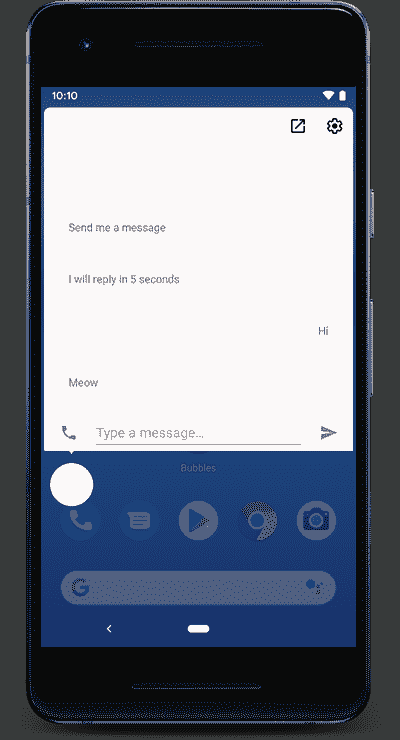

# Android Q 中的气泡将在未来的 Android 版本中取代覆盖 API

> 原文：<https://www.xda-developers.com/android-q-system-alert-window-deprecate-bubbles/>

谷歌的年度 I/O 开发者大会充斥着关于谷歌所有应用、服务和开发者工具的新闻，但 Android 操作系统是最大的话题之一。Android 现在在全球超过 25 亿台设备上使用，占据了谷歌 I/O 的大量时间。该平台有很多变化——事实上，如此之多，以至于谷歌不可能对每个变化都给予同等的关注。在 2019 年 I/O 第一天的“Android 的新功能”演讲中，谷歌宣布了一个非常古老的 API 即将发生的重大变化: [SYSTEM_ALERT_WINDOW](https://developer.android.com/reference/android/Manifest.permission.html#SYSTEM_ALERT_WINDOW) 。该 API 允许开发人员在屏幕顶部绘制一个覆盖图，其最著名的用途是聊天头部气泡(想想 Facebook Messenger)。既然谷歌在 Android Q 中以[气泡的形式提供了 SYSTEM_ALERT_WINDOW 的替代 API，谷歌已经决定最终在未来的 Android 版本中弃用 SYSTEM_ALERT_WINDOW。](https://www.xda-developers.com/android-q-beta-2-notification-bubbles/)

SYSTEM_ALERT_WINDOW 即将被弃用，这是板上钉钉的事情。允许一个应用程序在其他应用程序上覆盖窗口会带来明显的安全风险；臭名昭著的“[斗篷和匕首](https://www.xda-developers.com/cloak-and-dagger-exploit-uses-overlays-and-accessibility-services-to-hijack-the-system/)”漏洞证明 SYSTEM_ALERT_WINDOW 需要被控制。

谷歌开始限制 Android Oreo 中覆盖图可以后退的区域，他们已经完全删除了 Android Q (Go Edition)的 API。)SYSTEM_ALERT_WINDOW 的最大问题是，尽管用户应该通过特殊的权限管理屏幕手动授予权限，但谷歌 Play 商店会在安装时自动授予访问权限。在 Android Q 中，对 SYSTEM_ALERT_WINDOW 权限[的访问是短暂的](https://www.androidpolice.com/2019/03/16/android-q-steps-up-the-fight-up-against-overlay-based-malware/):侧装应用只能在 30 秒内访问该权限，通过 Google Play 安装的应用可以访问该权限，直到设备重新启动。

但在未来的 Android 版本中，SYSTEM_ALERT_WINDOW 将被完全否决，所有使用它的 Android 应用程序都必须过渡到 Android Q beta 2 中引入的新的 [Bubbles API](https://developer.android.com/preview/features/bubbles) 。

 <picture></picture> 

Bubbles API in Android Q. Source: Google.

然而，气泡是通知 API 的一部分，所以它不能完全取代 SYSTEM_ALERT_WINDOW。尽管气泡以微小的、可调整大小的活动的形式出现，但它们必须由用户从满足一个或多个条件的通知中发出。

使用 SYSTEM_ALERT_WINDOW API 的应用程序开发者有很多，在不久的将来，他们将不得不开始寻找替代的 Bubbles API。我们试图得到一个时间表，谷歌何时计划放弃这个 API，但没有得到答案。假设这个 API 不会存在太久:我敢打赌它将不再出现在 Android R 中。

你可以通过下面的 YouTube 链接观看整个“Android 中的新功能”会议(从 16:53 开始。)