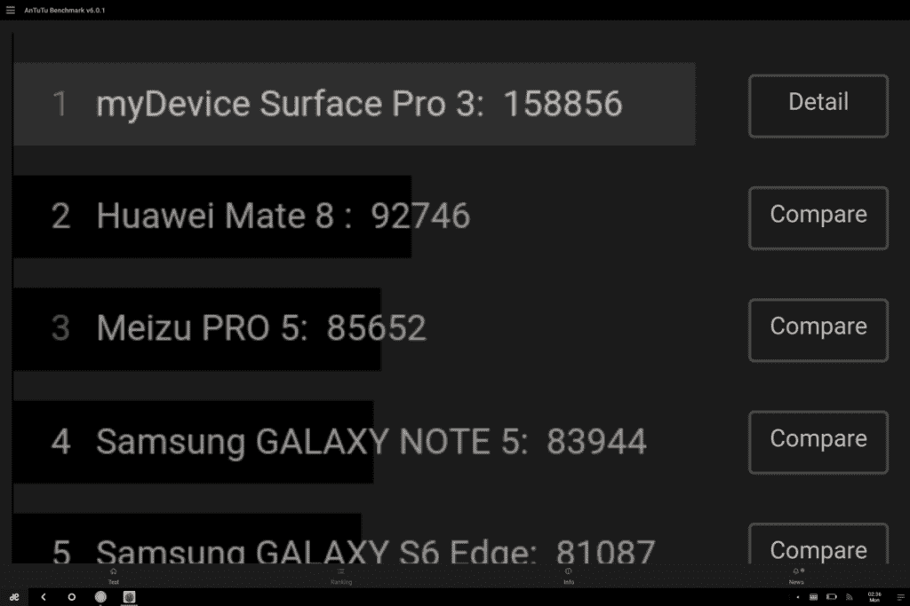

# Android-x86 和 Remix OS 如何创造更好的 Android 平板电脑

> 原文：<https://www.xda-developers.com/android-x86-and-remix-os-are-creating-better-android-tablets/>

不久前，我们讨论了 Android 平板电脑 T1 和 T2 的 Pixel C T3，我们探讨了大屏幕 Android 设备在硬件和软件方面的变化，这些变化与整个平板电脑市场是一致的。

在我们对 Pixel C 在平板电脑世界的地位的[分析中，我们将这款设备与 Surface 系列进行了对比，Surface 系列是微软对功能强大、以生产力为导向的平板电脑需求的回应(或许也是其发起者)。Surface 系列不仅仅是一个消费设备，它提供了基于桌面的操作系统的全部功能，而 Android Marshmallow 未能解决我们最喜爱的移动操作系统在大屏幕上观看和操作时的明显缺点。](http://www.xda-developers.com/pixel-c-gigantic-yet-insufficient-leap-for-android-tablets/)

微软无意中打造了最好的安卓平板电脑硬件

但是很多人可能会很快想起我们提出的另一点:Android 是 *而不是* 绑定到 Android OEM 设备上的，尤其是 Surface 也可以运行 Android。

正因为如此，微软无意中打造了最好的 Android 平板电脑硬件，部分原因是因为没有所谓的“纯 Android 硬件”。Android-x86 和 Remix 正在将 Android 体验带到各种计算机上，包括全塔式台式机、笔记本电脑、超极本，当然还有混合平板电脑。我认为最后一点是最有趣的一点，因为涉及到硬件。如果我们看看混合平板电脑，它们通常比 Android 平板电脑装载更多的 RAM，有些型号配备了非常强大的 x86 处理器。我个人拥有一台 Surface Pro 3，配有 i7 处理器和 8GB 内存，对于移动中的半桌面体验和我购买它的目的(工作和学校)来说绰绰有余。但当我启动安卓系统时，我觉得这款设备更加多功能了。

我在技术论坛上看到过提出这个问题的讨论， *“你为什么希望 Android 出现在你的 Surface 上？”。* 鉴于我为该网站撰写文章，我显然有失偏颇，但众所周知，微软也提供了低于标准的平板电脑体验。Windows RT 令人厌恶，Windows 8 也是被迫实现的，Windows 10 的平板模式也不是最佳的。Metro 应用程序确实比简单地用食指使用桌面应用程序要好得多，但我确实认为，平板电脑上的 Android 尽管有种种缺点，但在媒体消费方面仍优于 Windows 的平板模式。Metro 应用甚至超越了这个领域，但在我看来，它们中的许多仍然遭受着糟糕的 UI 分配。

这就是 Android-x86 和 Remix 的用武之地。有了这些传统电脑的操作系统替代品，以及推而广之的混合平板电脑，我可以把我的 Surface——一个我专门为工作和大学购买的设备——变成一个 Android 平板电脑，我可以用它来进行媒体消费，甚至进行修改。现在，当启动 Android-x86 时，Android 的平板电脑 UX 的所有缺点都会带到你的混合设备上，但至少，你会得到(通常)更好的硬件和一个额外的二合一设备。不过，Android-x86 有时与 PC 硬件不太兼容，我知道 XDA 编辑马修在他的前沿游戏机上没有最好的体验。但 Remix 旨在通过将平板电脑上最好的 Android 生态系统与最好的桌面功能相结合，同时充分利用硬件，来解决这些体验差异。

Surface Pro 3 上的 Remix OS 确实让我大吃一惊。运行 Alpha 版本让我对未来和即将到来的三月发布有了一个很好的了解。不过，截至目前，我对自己在这款硬件上从 Android 中获得的东西非常满意。Remix OS 允许我像在 Android 平板电脑上一样运行应用程序，但也允许一种既聪明又熟悉的严肃的多窗口体验。在 Remix 上滚动 reddit 的同时观看 youtube 视频感觉非常自然，因为你可以使用自由定位或分屏的横向和纵向浮动应用程序，所以你不会花太多时间找到理想的设置。

 <picture></picture> 

Running off USB 3.0, not SSD.

Remix OS 的另一个优点是，除了 alpha 版本的错误，体验非常流畅，尤其是在性能方面。现在你可能会指出，这可能只是因为过度使用硬件，但无论如何都必须声明——Remix OS 在我的 Surface 上运行得非常流畅，材料动画从未跳过一拍，我最喜欢的应用程序几乎没有加载时间。Surface Pro 3 上的 Chrome 特别平滑，是我见过的 Android 上最平滑的 Chrome，我认为这可能与我在 ZenFone 2 上注意到的硬件架构有关。基准测试高得离谱，游戏运行正常…这是用 USB 3.0 棒运行的。三月份发布的将允许在固态硬盘分区上轻松安装。请注意，您可以找到将操作系统复制到一个分区上的指南，以使它以这种方式工作，但 Jide 将提供一个更简单的解决方案，并将操作系统扩展到 32 位系统。

体验远非完美(特别是在配件兼容性/完全硬件支持方面)，但 [Android-x86 和 Jide 现在已经与](http://www.jide.com/en/remixos-for-pc/announcement)合作，我们只能假设这将加速两种选择的完善。不过，总的来说，Android 的开放性最终意味着你可以在预装的任何东西上享受操作系统，我们看到像 Remix OS、Phoenix OS 和不朽的 Android-x86 这样的项目使前者成为可能。

我希望谷歌已经记下了这些项目和公司，以及其他像 T2 这样的公司正在做的事情。这种创新将 Android 计算带到了生产力的新层面，也带到了更广泛的设备上。希望我们从他们那里收集的经验教训将在 Android N 和 Pixel C 的继任者中实现。在那之前，当前 Pixel C 的所有者应该真正期待一个可能的 Remix OS 移植——现在*,*将是一个很好的组合。