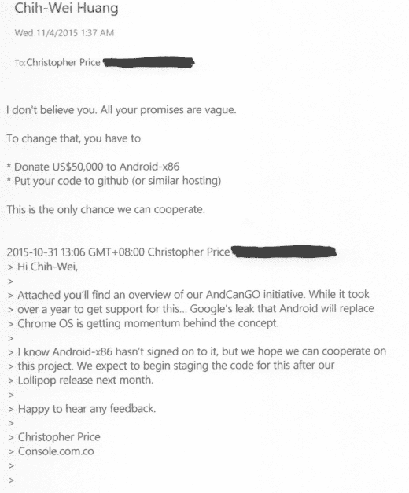
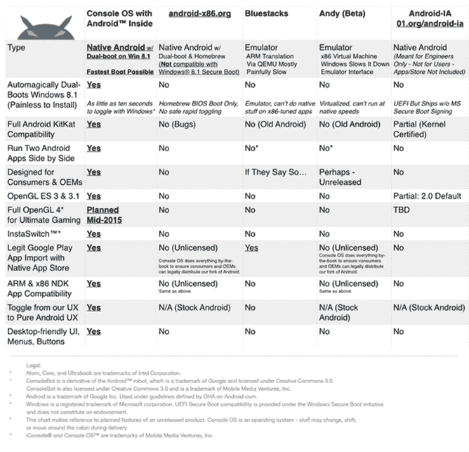
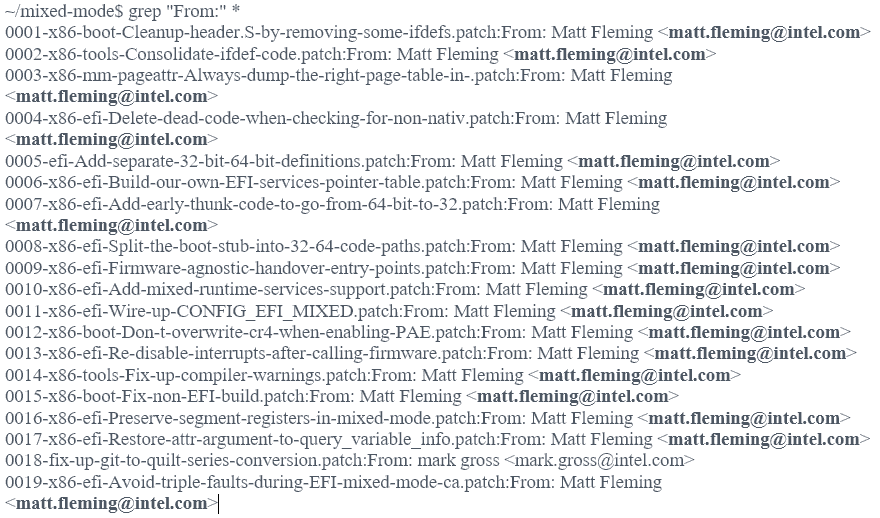

# Android-x86 指责控制台操作系统诈骗-发生了什么

> 原文：<https://www.xda-developers.com/android-x86-console-os-controversy-explained/>

Android-x86 开发者社区正在酝酿一场风暴。众筹项目“控制台操作系统”的首席执行官因未能兑现承诺而被指控诈骗他的 Kickstarter 支持者。多亏了社交媒体网站[上的热门话题，比如 reddit](https://www.reddit.com/r/Android/comments/3y6eqc/console_os_stole_androidx86/) ，这场风暴发展成了一场全面的戏剧飓风。

但是参与的各方是谁，发生了什么，以及这在更广阔的开源开发世界中是如何发生的？我深入研究了过去和现在关于这个问题的许多帖子，为您带来了控制台操作系统和 Android-x86 之间发生的事情的全面概述。

* * *

# 谁是玩家？

*   *[Android-IA](https://01.org/android-ia/) :* 英特尔架构上的 Android 是一项开源合作，旨在将 Android 引入英特尔硬件。英特尔本身为该小组提供了大量支持，这对于修复硬件特定的错误和让必要的驱动程序在 Android 上正常运行至关重要。在没有太多警告的情况下，英特尔在除了 [MinnowBoard MAX](https://01.org/android-ia/downloads) 之外的所有硬件上都放弃了对该项目的支持。目前还不清楚这一举动发生的确切原因。
*   *[Android-x86](http://www.android-x86.org/) :* 一项开源的合作项目，旨在将 Android 移植到运行英特尔架构的各种计算机上。该项目由志愿者维护，没有任何供应商的支持，并且[已经成功地将 Android](https://drive.google.com/open?id=1mND8K-AXbMMl8-wOTe75NOpM0xOcJbVy8UorryHOWsY) 移植到多种设备上。
*   *[黄志伟](https://en.wikipedia.org/wiki/Chih-Wei_Huang):*Android-x86 开源项目的首席维护者。这位来自台湾的开发者自 2009 年以来一直致力于 Android-x86。一年半前对黄志伟[的采访在 Gamasutra](http://www.gamasutra.com/blogs/RuthanielVandenNaar/20140612/219170/Current_state_of_Androidx86_PC_OS_interview_with_ChihWei_Huang.php) 上播出，这让我们对他在 Android-x86 上的工作有了一些了解。
*   *[克里斯多佛·普里茨](http://www.christopherprice.net/)*[e](http://www.christopherprice.net/)**[:](http://consoleos.com/)**Console，Inc .的 CEO，以及 Console OS 的公开代言人。因之前的投资项目“Mechaworks”和“iConsoleTV”而闻名。
*   *[控制台操作系统](http://consoleos.com/)* *:* 由*移动媒体风险投资公司(MMV)(现更名为控制台公司)*众筹的一项努力，旨在将 Android 移植到运行英特尔架构的计算机上。据称是 Android 开源项目的一个分支，旨在通过授权英特尔的驱动程序，在各种流行的台式机/笔记本电脑配置上引入功能性 Android 构建。Kickstarter 于 2014 年 8 月 11 日结束，总共从 5695 名支持者那里筹集了 78497 美元。据首席执行官称，该项目的长期目标是“T10 升级[到] Vulkan，并利用控制台操作系统构建一个与主要玩家竞争的游戏控制台。

* * *

# 相关事件的时间线

*注意:有许多较小的事件对双方的不满都有影响，但是，与下面列出的事件相比，它们就显得微不足道了。*

**2014 年 6 月 12 日:**控制台 OS 在 Kickstarter 上公布。

**~ 2014 年 6-8 月** : Christopher Price，以及所有关于主机 OS 的讨论，都被禁止出现在 Android-x86 讨论板上。该组织禁止的原因是，他们在与 Price 交谈后很快确定该项目是一个骗局。

**2014 年 8 月 11 日**:主机 OS Kickstarter 结束。

【2015 年 1 月:英特尔停止对 Android-IA 的支持，不再支持 Core 和 PC 平板电脑。

**2015 年 12 月 11 日**:黄志伟公开指责克里斯托弗·普莱斯(Christopher Price)和游戏机操作系统，称普莱斯未能兑现承诺，正在欺骗他的 Kickstarter 支持者。

**2015 年 12 月 25 日**:随着几家商店和开发商开始报道这个问题，反弹开始冒泡。当这个故事被发布到 Android subreddit 上时，它就像病毒一样传播开来。同一天，克里斯托弗·普莱斯(Christopher Price)在控制台 OS Kickstarter 页面上发布了一个更新，回应了这些批评。

2015 年 12 月 31 日:为了回应 Kickstarter 更新中对黄志伟的指控，黄志伟向克里斯托弗·普莱斯(Christopher Price)提出挑战，要求他在新的一年里完成他承诺的至少 10%的功能，并给他 5 万美元。克里斯托弗·普莱斯(Christopher Price)做出了回应，但没有接受黄的挑战，他表示，Android-IA 邮件列表不是这么做的合适地方。

* * *

# 有哪些委屈？

*黄志伟- >* *克里斯托弗·普莱斯/控制台 OS:*

*   指责普莱斯没有履行他在 Kickstarter 上的承诺，欺骗了他的支持者。
*   声明 Christopher Price 没有为控制台操作系统编写任何原始代码，并且控制台操作系统实际上并不存在。
*   声明控制台操作系统的存在损害了 Android-x86 的声誉，因为任何阅读 iConsole 的 git 日志的人都会看到[“cwhuang”是该项目的最大贡献者](https://groups.google.com/forum/#!msg/android-x86/qkWG2TwVBqs/-thv8Nk3DQAJ)。如果他默许的话，他可能会“在[法庭上]被当作共犯对待。”
*   声明在他们无数次的通信尝试中(甚至一次面对面)，Price 拒绝了他演示控制台操作系统的请求。

 <picture></picture> 

Conversation between Mr. Huang and Mr. Price

*克里斯托弗·普莱斯- >* *黄志伟:*

*   声称黄志伟试图通过要求他支付 50，000 美元从 Android-x86 项目中提取代码来“勒索”价格。为了证明这一点，他上传了一份他与黄光裕的电子邮件对话。由于黄志伟是 Android-x86 项目的主要管理员，他负责管理拉请求。
*   声明称，黄先生要求捐款退出 Android-x86 是不合理的，称这是“不幸的”和“开源的耻辱”他指出，黄先生是华硕的员工，并认为员工提出这一要求是不专业的。
*   指出黄志伟对英特尔和游戏机操作系统过于挑剔。

*Christopher Price/控制台 OS - >* *Android-IA*

*   对英特尔放弃对 Android-IA 的支持感到失望，因为控制台操作系统严重依赖 Android-IA 来使 Android 在较新的英特尔硬件上正常工作。

*社区- >* *克里斯多夫·普莱斯/控制台 OS*

*   相信控制台操作系统只是 Mechaworks、iConsoleTV 和现在的控制台操作系统/iConsole Micro 的一长串失败项目中的一个。项目的主要问题源于对项目从哪里获取资源缺乏诚实。
*   担心 Android-x86 [会因为 Price 没有兑现承诺而成为替罪羊](https://www.reddit.com/r/Android/comments/3y6eqc/console_os_stole_androidx86/cybm78p)。
*   有人指责 Price 在明知 Android-IA 支持不会持续的情况下发起了 Kickstarter 活动。

* * *

# 调查冤情

显然，有很多很多的说法被抛出。我们将检查每一个，让你决定事情背后的真相。请注意，许多这些链接是基于各种博客和文章的评论部分。关于这个话题的讨论已经严重破裂，因此很难跟上。

## *对抗克里斯托弗·普莱斯/控制台 OS*

1.  控制台操作系统交付失败了吗？
    1.  Console OS proudly displays a list of differences between itself and other Android-on-Intel OSes. As we have yet to see a working build outside of an initial KitKat DR1 ROM (which is based on Android-IA, but without any of the promised features).
    2.  Christopher Price 表示，一旦英特尔停止支持，他们已经烧完了 Kickstarter 的资金，试图继续构建 Android-IA。他们声称，他们已经花费了大量资金来许可和开发控制台操作系统，并且在亚马逊/Kickstarter 采取削减措施后，他们现在不能退款。此外，他说他的 6 人团队[在过去的一年里依靠筹集的 7.8 万美元](http://www.xda-developers.com/xda-external-link/console-os-just-a-fork-of-android-x86/?utm_source=feedburner&utm_medium=feed&utm_campaign=Feed%3A+xda-developers%2FShsH+%28xda-developers%29)生活。
    3.  作为其 Kickstarter 的一部分，该团队承诺向其支持者提供 t 恤、笔记本电脑和其他商品，迄今为止， ****这些尚未交付。****<picture></picture>

        主机 OS 功能对比

2.  **主机操作系统有没有不诚实？**
    1.  在 Kickstarter 的“风险”部分，确实没有迹象表明该项目严重依赖 Android-IA 进行开发。
    2.  在 Kickstarter 页面上的 10 月 29 日^日更新中，控制台操作系统很可能已经使用 Android-x86 作为基础，但没有提及。至此，Android-IA 支持已成定局，但在更新价格声明中，他们能够从一台“英特尔酷睿 2 合 1 电脑”上*【观看】三部高清电影*当时，Price 表示，控制台操作系统团队将不再需要*“竭尽全力构建引擎”*，鉴于他们已经重新基于 Android-x86 的披露，这现在是有意义的。
    3.  普莱斯现在表示，Kickstarter 的支持者们也已经对[控制台操作系统网站和论坛](https://www.reddit.com/r/Android/comments/3yslc1/androidx86_offers_christopher_price_console_os/cyh1csn)进行了[投资](https://www.kickstarter.com/projects/mmv/console-os-dual-boot-android-remastered-for-the-pc/comments)。在 Kickstarter 页面上没有直接指出这一点，但似乎 Price 打算让行业支持继续致力于控制台操作系统。通过建立一个网站和社区，并将控制台操作系统开源，Price 希望他能吸引开发者和原始设备制造商支持这个项目。
    4.  普莱斯是否在知道 Android-IA 支持将持续的情况下推出了 Kickstarter，这一点无法得到证实。在他的 Kickstarter 更新中，Price 声称他已经从英特尔获得了*“指定的营销和工程合同”*，然而这些合同*“直到 Kickstarter 活动结束后，才通知[他们]英特尔支持的重大修改。”* Price 也从未真正证明他得到过英特尔的任何支持，这对于支持他声称自己与英特尔有密切关系至关重要。
3.  【Console OS 贡献过什么原始代码吗？
    1.  在他关于主机操作系统的第一篇文章中，黄志伟提到 Price 没有原创作品。作为证据，[他执行了一个 git diff](https://groups.google.com/forum/#!msg/android-x86/qkWG2TwVBqs/tW1Rm9u9DAAJ) 来表明所做的唯一更改是更改了名称并包含了 Trebuchet (Cyanogenmod 的启动器)。普莱斯声称他们所做的改变[“不会出现在 git diff 上。”](https://www.reddit.com/r/Android/comments/3y6eqc/console_os_stole_androidx86/cybn3yw)他对为什么会出现这种情况的解释是，根据 Price，[只有 70%的代码](https://groups.google.com/forum/#!msg/android-x86/qkWG2TwVBqs/Q9WvqiIiDQAJ)是在 Github 上发布的，因此这种[批评是不成熟的](http://www.cnx-software.com/2015/12/13/is-console-os-just-a-scam-based-on-a-fork-of-android-x86-with-little-modifications/)。他进一步声称，控制台操作系统具有任何 Android-x86 发行版都不具备的“尖端英特尔驱动程序”。
    2.  在一次更新中，Price 声明他已经*“开源了几十个内核补丁。”*但是，如果您点击他提供的链接并打开 zip 文件，您会发现 zip 文件主要包含直接来自英特尔员工的补丁。<picture></picture>

        补丁来自英特尔员工

    3.  在 reddit 的[评论中，Price 声称控制台操作系统*“动态翻译 ARM NDK 代码到 x86 代码”*，黄志伟指出这是取自 Android-IA 的一个功能，已经存在于 Android-x86 中。](https://www.reddit.com/r/IAmA/comments/2d506l/i_started_an_android_fork_ama/cjm6ioy)
    4.  在一些地方，Price 承诺在未来将代码上游提交给 Android-x86(甚至可以追溯到 2014 年 7 月的),但尚未这样做。*“一旦我们全面推出 GitHub，我们肯定会向社区提供激励，让他们做出有利于 Android-IA、Android-x86 和控制台操作系统的改进和奖励。”*然而，普莱斯拒绝支付[【勒索过路费】](http://www.cnx-software.com/2015/12/13/is-console-os-just-a-scam-based-on-a-fork-of-android-x86-with-little-modifications/)来分叉 Android-x86。普莱斯表示，控制台操作系统将成为[Android-x86]AOSP 的[“Cyanogenmod。”](http://www.xda-developers.com/xda-external-link/console-os-just-a-fork-of-android-x86/?utm_source=feedburner&utm_medium=feed&utm_campaign=Feed%3A+xda-developers%2FShsH+%28xda-developers%29)
4.  ****主机 OS 兑现过什么承诺吗？**

    1.  控制台 OS 声称完全支持 [Unity、Havok 项目 Anarchy 和虚幻引擎 4](https://www.reddit.com/r/IAmA/comments/2d506l/i_started_an_android_fork_ama/cjm6ioy) 。然而，没有任何工作构建来显示它，我们不能说这个声明已经得到满足。
    2.  普莱斯承诺将建立一个名为“InstaSwitch”的管理程序，允许在没有 GPU 开销的情况下在 Windows 和 Android 之间无缝切换。他声称[几个未透露姓名的原始设备制造商正在与他](https://www.reddit.com/r/IAmA/comments/2d506l/i_started_an_android_fork_ama/cjm5605)就这项技术进行谈判。
    3.  普莱斯承诺在 2015 年夏天推出 iConsole Micro，并在 3 月份推出游戏操作系统的 alpha 版本和夜间版本，但这两个目标都没有实现。
    4.  在 UX 方面，普莱斯已经承诺要做一个用户界面，看起来像是个人电脑操作系统界面标准的主线这个用户界面应该有一个“支持多任务处理”的应用菜单，一个“新的导航栏”，一个单页主屏幕，和一个鼠标友好的状态栏。最后，他声称有一个“AOSP 模式”，可以关闭所有的控制台操作系统增强功能。这款 UX 据说被送到了各种个人电脑制造商那里，他们说他们“喜欢它”
    5.  关于 Wi-Fi 卡和 USB 控制器，Price 声称他们是 Realtek、Broadcom、高通、Atheros 和 Intel 的授权驱动程序，但他们正在与 Marvell 竞争。他还声称 USB 3.0 能以“[超高速](http://www.usb.org/developers/ssusb)的速度工作<picture></picture>

        游戏机 OS 曾经许诺给我们带来游戏的未来** 
***   **主机 OS 是不是在偷代码？**
    1.  [不](https://groups.google.com/forum/#!msg/android-x86/qkWG2TwVBqs/N4uoUIw7DQAJ)，正如黄志伟所指出的，派生 Android-x86 是*“绝对(合法)和允许的。”如果分叉可以开发出对项目有用的东西，他甚至会鼓励这样做。*
    2.  大多数 Android-x86 都是在 Apache 2.0 许可证下授权的，禁止在没有正确授权的情况下重新分发软件。普莱斯先生表示，他已经[对所有从 Android-x86 中提取的代码做出了全部贡献](https://www.reddit.com/r/Android/comments/3y6eqc/console_os_stole_androidx86/cybgg9n)，如果属实，这意味着他没有违反任何许可协议。Android 中使用的 Linux 内核也要求源代码在 GPL 下发布，而控制台操作系统似乎满足了这一要求。黄志伟在最近的声明中没有指责控制台操作系统未能对其代码进行归因，因此可以肯定地说这没有任何争议。**

 **## *反对黄志伟*

1.  黄先生是否犯有压价交易罪？
    1.  根据普莱斯发布的电子邮件对话，黄建华使用的确切措辞是“捐赠”给“Android-x86 . org”。[据黄建华](https://www.reddit.com/r/Android/comments/3y840w/console_os_response_to_accusations/cyfcmxs)称，5 万美元的要求是为了测试普莱斯，看他这次能否展示“一些真实的东西”。黄先生要求将游戏机操作系统的视频演示或代码上传到 Github。
2.  黄先生使用 Android-IA 有困难吗？
    1.  你可以在这里阅读对他的相关指控。此后，在 Android-x86 的谷歌团队中回应了这些指控。

* * *

# 这在大局中处于什么位置？

这样的场景对于开源世界来说并不陌生。类似的失败发生在 2005 年 CherryOS 和 PearPC 之间。流行的开源渲染程序 Blender 面临着许多企图[分叉其代码库以获取利润](https://www.blender.org/press/re-branding-blender/)，却没有看到上游提交的许多改进。一个更近的相关例子，涉及[的 Menuet 操作系统和它的派生 Kolibri 操作系统](http://board.flatassembler.net/topic.php?t=18112)。Christopher Price 声称他的叉子与前面的例子完全不同。在一篇博客文章中，他将控制台操作系统比作 Boxee、CyanogenMod 和苹果的 WebKit。

普莱斯承诺[将在 2016 年](https://www.reddit.com/r/Android/comments/3y6eqc/console_os_stole_androidx86/cybevel)恢复开发，声称[将为他的开源项目的任何贡献者](https://www.reddit.com/r/Android/comments/3y840w/console_os_response_to_accusations/cybe1by)提供奖励，并声明他将把所有剩余的津贴发给他的支持者。另一方面，黄志伟已经完全停止开发 Lollipop-x86，转向 Marshmallow-x86 分支，以便[“更快地戳穿骗局。”](https://groups.google.com/forum/#!msg/android-x86/qkWG2TwVBqs/nDJiQm1ZDQAJ)

我们列出了背景、指控和证据，希望给你一个围绕控制台操作系统的争议的全面概述。我们希望你将此视为一个提醒，提醒你在投资众筹项目之前，要严格审查众筹项目的申请。向前看，我们将不得不等待，看看控制台操作系统团队是否能够产生任何有价值的代码。在此之前，鉴于 Android-x86 团队披露的内容，Android 社区已经对该项目失去了信心。

* * *

在这个问题上，你的立场是什么？请在下面的评论中告诉我们。

**更新:** Chris Price 已经回复了 r/Android 上关于这篇文章的几条评论，在这里 找到它们**