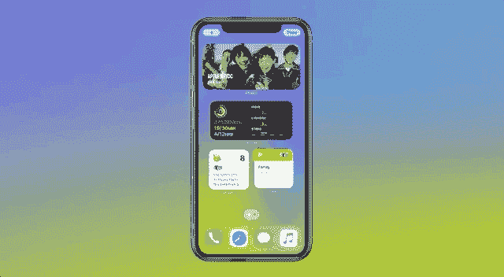
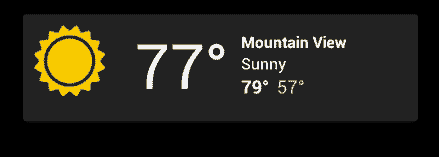

# 苹果的 iOS 14 终于有了插件，它们可能比安卓的更好

> 原文：<https://www.xda-developers.com/apple-ios-14-widgets-better-than-android/>

如果有一个功能可以概括苹果 iOS 和 Android 之间的哲学差异，那就是 widgets。从第一天开始，主屏幕窗口部件就已经是 Android 的一部分，它们可以是开发者想要的任何样子。苹果已经半心半意地通过通知中心和“ [Today View](https://support.apple.com/en-us/HT207122) ”向 iOS 添加了最少的小工具，但 iOS 14 最终将它们带到了主屏幕上。

在典型的苹果时尚中，主屏小工具的加入是在它们成为其他平台的标准功能很久之后。甚至微软的 Windows Phone 操作系统也有“动态磁贴”形式的小部件。但是苹果很少仅仅因为其他人都这样做而做一些事情，所以他们的小部件实现也有一点不同。

如果你见过 iOS 或 Apple Watch，苹果的小部件看起来和你想象的差不多。角落是圆形的，以匹配应用程序图标，它们整齐地放在主屏幕网格中。iOS 14 的 Widget 可以在“Widget Gallery”中找到，基本上和 Android 的 widget picker 菜单一样。这是用户可以选择部件大小的地方，它们有三种尺寸。

有趣的是一个叫做“窗口小部件堆栈”的特性这些实际上是多达 10 个不同部件的“堆栈”。用户可以在它们之间滑动，这样他们就可以在一个窗口中使用多个小部件。Widget Gallery 中还有一个“智能堆栈”,它为 Widget 堆栈带来了一些智能。

智能堆栈小工具使用苹果的设备智能来显示它认为与一天中的时间相关的小工具。例如，它可以在早上显示新闻，在一天结束时显示你的健身活动。苹果还有一个“Siri 建议”小工具，它会根据你的使用情况显示你可能采取的行动。例如，当你通常购买咖啡时，它可以显示星巴克应用程序。

 <picture></picture> 

iOS 14 home screen

小部件堆栈和智能小部件对我来说似乎非常方便。将多个小部件放在同一个位置可以节省空间和在多个页面上查找小部件的工作量。另外，知道你想要哪个部件/动作的智能是非常有用的。这似乎是谷歌可以借用的完美功能。毕竟，谷歌已经用 Assistant 做了大量的预测工作。Pixel Launcher 甚至已经建议抽屉中的[应用程序动作，所以它可以很容易地被做成一个小部件。](https://www.xda-developers.com/slices-app-actions-android-p-google-assistant/)

Android 小工具的问题是它们已经被遗忘了。看看 Android 官方[“App widgets Overview”页面上的 Widgets 示例。](https://developer.android.com/guide/topics/appwidgets/overview)其中几个小工具已经不存在了，截图来自 *Nexus 5* 。 [Android 11 即将推出](https://www.xda-developers.com/android-11-beta-1-5-google-pay-fix-minor-patches/)，没有任何新功能与小工具相关。我相信我们的主屏幕上都有一些小工具，但是你还会对小工具感兴趣吗？

 <picture></picture> 

This ancient widget is shown on Android's widget guidelines page

小配件的质量也存在巨大差异。谷歌在 Android 小工具上没有太多的设计限制。它们有各种形状和大小，这对于定制来说很好，但对于像智能堆栈这样的功能来说就不太好了，因为设计中有太多的变化，以至于无法使其具有凝聚力。苹果对 iOS 主屏幕的外观控制得很紧，这使得所有的小部件都感觉相似。我并不是说这一定是一件好事情，但它确实让某些能力变得更加可行。

不过，最终，我认为这是 iOS 14 widgets 比 Android widgets 更好的方法。事实上，苹果实际上有一种方法，而不仅仅是“当然，一个小部件可以是任何东西！”谷歌已经很久没有认真对待小工具了。苹果正在以全新的视角展示它们有多有用，而这正是安卓在这一特定领域所缺乏的。