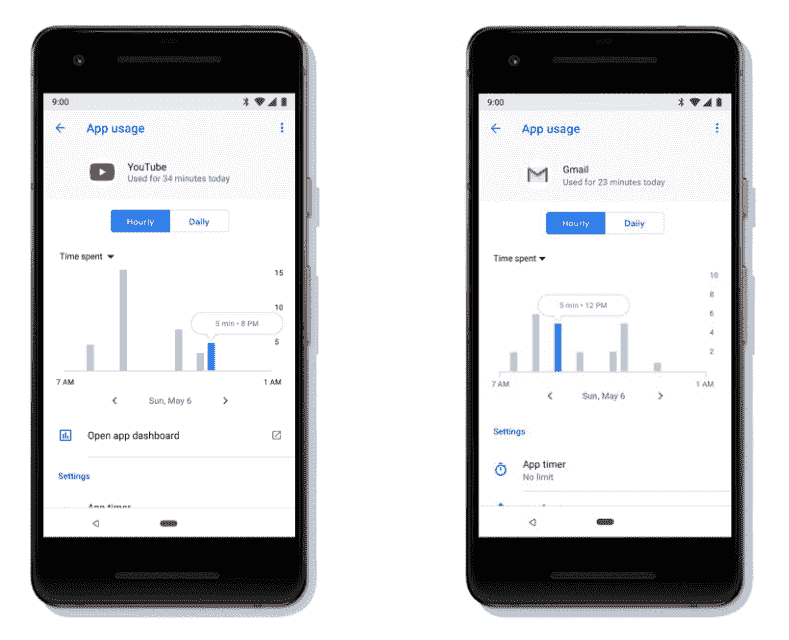
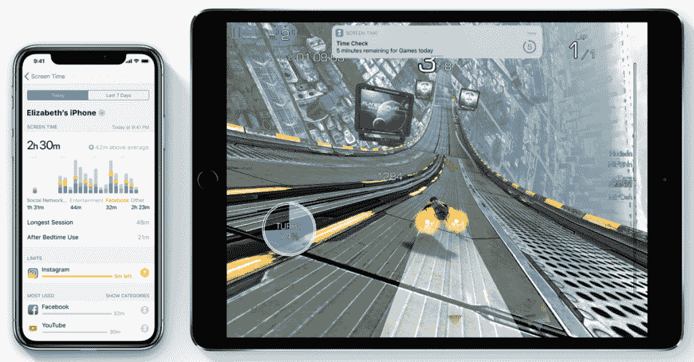
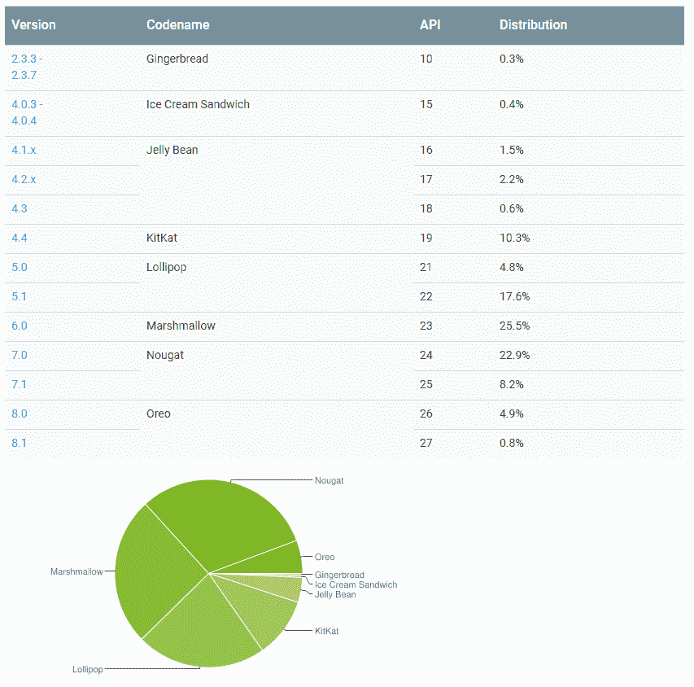

# 随着 iPhone 获得 5 年的支持，我的 Galaxy S9+仍然落后

> 原文：<https://www.xda-developers.com/apple-iphone-vs-galaxy-s9-security-updates/>

苹果的 WWDC 于本周举行，就在谷歌的 I/O 大会之后不久。每家公司都花时间宣布他们计划的新功能，以及新的 API，新的应用程序和新的想法。毫不夸张地说，Android 和 iOS 都已经成为拥有完整且具有竞争力的功能集的高级操作系统。我一直在我的谷歌 Pixel 2 XL 上运行 Android P，不管喜欢还是讨厌，在用户体验的小而关键的领域发生了很多变化。相反，iOS 12 *看起来*与之前的版本几乎相同，但它有一些“引擎盖下”的变化和一些生活质量的改善。苹果大多承诺更快的性能，AR 的改进，像 Android 一样的分组通知(终于)，以及内置的类似 Tasker 的 Siri 功能，这些功能看起来相当实用。

这两种手机操作系统都在向“自我意识”中枢和屏幕时间监控功能迈进。谷歌将他们的功能集命名为“[数字健康](https://www.xda-developers.com/android-p-beta-features/)”，并承诺习惯监控和软限制控制功能。例如，你可以设置应用程序屏幕时间限制和静音通知，以最大限度地减少干扰，并且全天操作系统将建立一个功能仪表板。

 <picture></picture> 

Digital Wellbeing Chart

苹果采取了大体上类似的方法，但整合程度更高一些。像谷歌的解决方案一样，操作系统将建立一个屏幕时间的图表，人们可以设置限制。与谷歌不同的是，这可以由家长管理，并对全天的应用程序使用进行硬性限制。苹果的“请勿打扰”功能也比它的 Android 对手更彻底，在锁屏等地方调整用户界面，实际上使通知更少打扰。

 <picture></picture> 

Apple's Screen Time

一如既往，每年的这个时候都充满了令人兴奋的功能和真正有用的升级。总的来说，Android P 似乎有很多面向用户的变化。等式中 Android 这一边的问题仍然和往常一样:**更新对我们大多数人来说永远都需要推出**，购买新的智能手机通常仍然是保持最新的最佳(或者对一些人来说，唯一)方式。

## 更新的高音

即使是后期项目 Treble，Android 更新情况也很糟糕。诚然，这可能是因为 Treble 还没有足够的时间来提供切实的结果，特别是因为它在推出时甚至还没有完成。但我的三星 Galaxy S9 是直接从三星购买的，有资格获得每月的 Android 安全更新，目前在安全补丁上落后四个月。三星的[自有支持页面](https://security.samsungmobile.com/workScope.smsb)称:

“在三星，我们非常重视安全和隐私问题，并尽最大努力尽快做出回应。 *保护您的设备并维持您对我们的信任是我们的首要任务。”*

嗯，感觉一点也不像是真的。这对于一个直接从 OEM 购买的解锁设备来说是完全不可接受的——尤其是在 Android 世界中拥有最多资源的最大 OEM。

上个月在 I/O，[我们报道了](https://www.xda-developers.com/google-require-oem-regular-security-patches/)谷歌已经修改了他们的 OEM 协议，加入了常规的 Android 安全补丁。关于这个项目的细节很少，但其含义是显而易见的——这很重要，因为谷歌和原始设备制造商的共同努力到目前为止还没有提供令人尊敬的结果。特别是对于三星的更新频率来说，这意味着什么还有待观察。

我知道在 XDA，我们喜欢为我们的设备刷新定制的 rom，但即使是有些“开发者友好”的设备制造商，如华为和小米[正在终止](https://www.xda-developers.com/huawei-stop-providing-bootloader-unlock-codes/)或[限制](https://www.xda-developers.com/xiaomi-locks-bootloaders-unlock-approval-takes-up-to-21-days-bricked-devices-must-wait/)对引导加载解锁的支持。更好的更新提供商之一(也提供引导加载程序解锁)，Essential，[的未来也仍然不确定](https://www.xda-developers.com/essential-phone-2-canceled-andy-rubin-selling-essential/)，即使他们[继续显示出出色的设备支持](https://www.xda-developers.com/essential-phone-android-p-beta-2-june-security-patches/)。谢天谢地，一加似乎仍然服务于 Android 市场的修补部分。

每年在 WWDC，苹果都会展示一张总结安卓更新情况的幻灯片。今年他们展示了以下数据:

| 操作系统 | iOS 11 | 安卓( *想必是魔神* ) |
| 安装基数 | 81 % | 6 % |

当然，我们可以吹毛求疵地说老款 iPhones 没有获得 iOS 11 的所有新功能。我们可以指出 Play Store 和 Google Play 服务是 Android 更新情况的创口贴，谷歌已经变得非常狡猾，确保较新平台应用程序的改进至少在旧 Android 版本中得到部分支持。然而，事实仍然是，旗舰 Android 设备甚至在 Android 安全更新方面也落后太多，在功能更新方面更是如此。谷歌自己的统计数据显示**几乎 64%的安卓设备都是 6.0 或更低版本**。

 <picture></picture> 

Android's Latest Version Distribution

供参考，安卓棉花糖 2015 年 10 月 5 日推出，快 3 年了。2015 年 9 月 25 日是 iPhone 6S 的发布日期。顺便说一下，iPhone 6S 将获得 iOS 12 以及更高的性能。甚至 iPhone 5S(2013 年 9 月发布的手机)也将接受 iOS 12，*同一天*作为旗舰 iPhone x。**9 月，将是 iPhone 5S 支持 5 年。**

## 消费者应该从 Android OEMs 那里得到更多

显然，在幕后有很多事情在进行，并且有很多原因说明为什么两个操作系统之间的更新情况不同。当一个 Android 版本涉及一个额外公司的参与时，期望完全平等是不合理的，有时是两个运营商。Treble 项目也很有可能会帮助这种情况向前发展，而我们还没有意识到它的全部好处。但是 ***不*** 不合理的是期待非常昂贵的硬件更及时的 Android 安全更新。尤其是在过去的两年里，有如此多的巨大漏洞被揭露出来。

Android 设备不仅*没有获得 Android 安全补丁，*而且有时它们甚至没有准确报告收到了什么补丁。最近，SRL 实验室[测试了 1200 台设备，结果令人失望](https://www.xda-developers.com/android-oem-lying-security-patches/)。一些公司比他们报告的晚了四个或更多的补丁，误导客户他们期望“最新”软件的安全水平(在大多数情况下，这意味着*比*晚了几个月)。

这些设备包含非常私人的信息。信用卡账户、照片、银行信息，坦白说就是我们所有的东西。如果三星和其他公司希望在支持方面与苹果相提并论，他们必须做得更好。随着时间的推移，压力只会越来越大，而不会随着某个或另一个解决方案的出现而减轻。

特别是对 XDA 社区来说，Treble 项目已经取得了极大的成果，但是它还没有开始解决它所要解决的更大的问题。在改进和维护操作系统这一特定领域，苹果有很多优势，而谷歌能做的也就这么多。如这篇文章所示，很明显公司*确实*关心这个问题，*正在*采取措施纠正这个问题。但由于这是一个多变量问题，我们不仅应该向谷歌和运营商施压，还应该直接向原始设备制造商施压。在这种特殊情况下，是三星为其各种设备变种提供了不一致的软件更新。鉴于三星被定位为最大的安卓原始设备制造商和苹果最大的竞争对手，他们也应该成为安卓的光辉榜样，而苹果在这个领域不可否认地盖过了安卓。