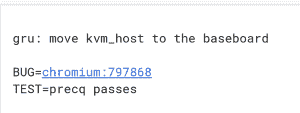
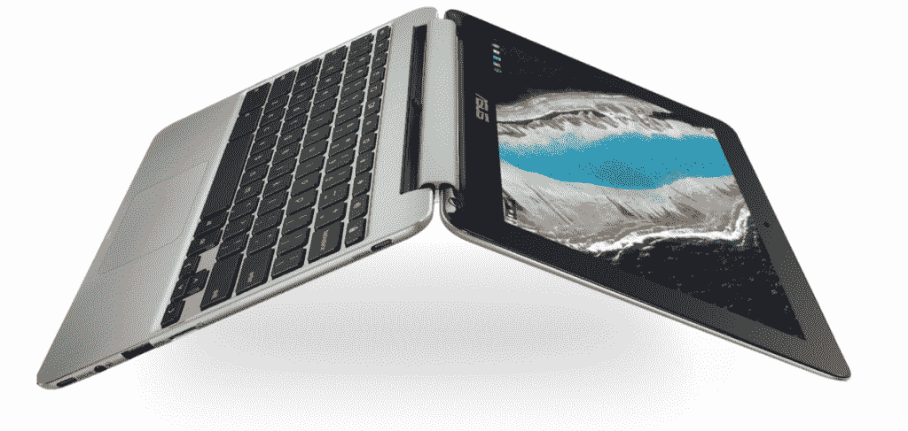

# 华硕 Chromebook Flip C101 是下一款获得 Linux 应用支持的 Chromebook

> 原文：<https://www.xda-developers.com/asus-chromebook-flip-c101-linux-apps/>

# 华硕 Chromebook Flip C101 是下一款获得 Linux 应用支持的 Chromebook

华硕 Chromebook Flip C101 将很快获得 Linux 应用程序支持，这一点由 Chromium 开源 Gerrit 上的新承诺所证实。

就在我们提供了一份带有和不带有 Linux 应用程序支持的 Chromebook 最终清单之后几个小时,[的一份承诺在 Chromium Gerrit 上着陆](https://chromium-review.googlesource.com/c/chromiumos/overlays/board-overlays/+/1102491)，确认 Linux 应用程序支持将在华硕 Chromebook Flip C101 上实现。

 <picture></picture> 

Gru is the parent board for both the Samsung Chromebook Plus and the Asus Chromebook Flip C101

华硕 Chromebook Flip C101 是一款全铝 10.1 英寸 2 合 1 设备，采用与三星 Chromebook Plus 相同的处理器(OP1/Rockchip RK339)。翻盖得名于它的 360°铰链，允许您在标准笔记本电脑模式、帐篷模式、平板模式和支架模式下使用设备。

 <picture></picture> 

Source: [Asus](https://www.asus.com/us/Commercial-Laptops/ASUS-Chromebook-Flip-C101PA/Design/)

Plus 和 Flip 在 Chromium 库上共享一个母板。开发人员只是将 Linux 应用的开关从 Kevin(chrome book Plus)移到了主板(Gru)上。华硕 Chromebook Flip C101 是唯一一款配备主板 Gru 的设备，因此这款设备也将获得 Linux 应用支持[，就像三星 Chromebook Plus 获得的支持](https://www.xda-developers.com/samsung-chromebook-plus-linux-apps/)一样。

对于金丝雀频道的用户来说，对 Linux 应用程序的支持应该会很快到来。作为参考，金丝雀频道在一次类似的提交被合并的一天内获得了惠普 Chromebook X2 的支持。开发者、测试版和稳定版的用户需要等待一段时间才能看到该功能的推出。

Chrome OS 上的 Linux 应用是一个相当新的发展，因为该功能在上个月的谷歌 I/O 2018 上才宣布。它首次出现在谷歌 Pixelbook 上，但此后开始在其他一些 Chromebooks 上推出。我们将[跟踪哪些 Chromebook 设备获得支持](https://www.xda-developers.com/chromebooks-linux-app-support/)，所以如果你是一名开发人员，想在 Chromebook 上编码，请继续关注！