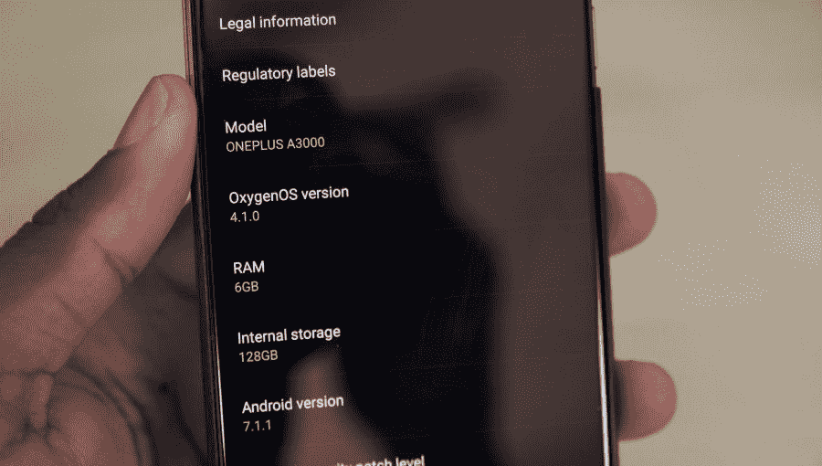
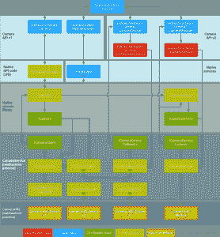
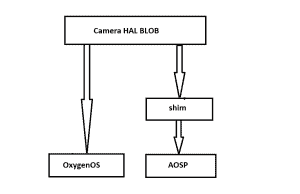
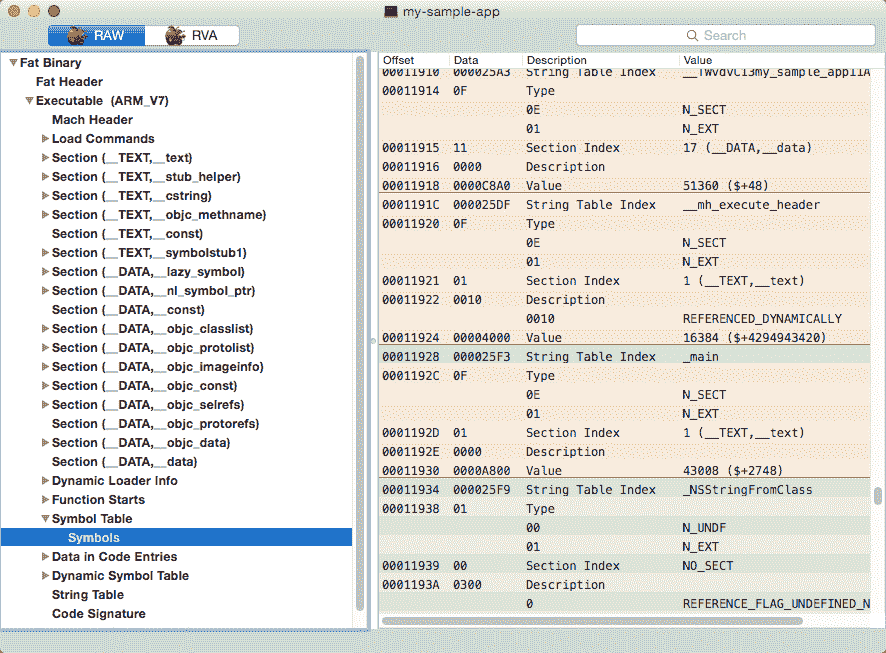
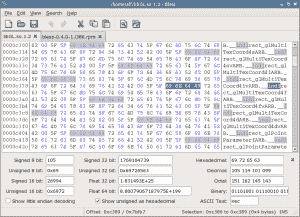

# 定制 rom 中的相机:开发者如何在没有源代码的情况下使硬件工作

> 原文：<https://www.xda-developers.com/cameras-custom-roms-developers-make-hardware-work-without-source-code/>

随着 Android Oreo 和许多设备的发布，如[小米 Redmi Note 3](https://www.xda-developers.com/xiaomi-redmi-note-3-unofficial-android-oreo/) 、[谷歌 Nexus 5](https://forum.xda-developers.com/google-nexus-5/orig-development/aosp-oreo-8-0-0-nexus-5-t3664033) 和[其他非官方接收它的设备](https://www.xda-developers.com/list-android-oreo-unofficial-ports/)，人们可能有理由怀疑，当开发者移植基于 Android 开源项目(AOSP)的 ROM 时，为什么相同的功能(主要是摄像头)往往会被破坏。你可能见过 XDA 论坛的 rom 线程，上面有一长串损坏的功能。“什么有效”后面是一个工作特性列表，下面是标志性的“什么无效？你告诉我！”在我们的论坛上有两个流行的说法，在 Reddit 和 Twitter 等网站上几乎已经成为了一个迷因。

为什么每当开发人员试图将 AOSP ROM 移植到他们的设备上时，会有如此多的功能被破坏？基本的答案是，因为不同版本的 Android 功能不同，打包成 BLOBs 的旧设备驱动程序不能与新版本的 Android 兼容，甚至不能与普通的 AOSP 兼容。为了克服这一点，开发人员使用了所谓的“垫片”，但是这个过程非常复杂、耗时，有时很难调试。

在这篇文章中，我们将概述垫片如何工作，特别是关于让相机在基于 AOSP 的 rom 上正常工作。我们将以 OnePlus 3T 为例。请注意，实现这些功能的难度与具体设备高度相关。

 * OnePlus 3T 运行 OxygenOS。* *虽然一加手机以定制开发友好著称，但开发者在幕后做了大量工作，打造稳定的 AOSP 端口。*

* * *

## 什么是垫片或斑点？

为了开始理解开发人员在做什么，我们首先需要解释一些事情。虽然 Android 操作系统是开源的(它被称为 Android 开源项目是有原因的)，但数以千计的 Android 设备上安装的软件(没有内核)却不是。开发者无法获得[三星体验](https://www.xda-developers.com/galaxy-note-8-software-spen-apps/)、 [EMUI](https://www.xda-developers.com/huawei-reveals-details-of-emui-5-1-update/) 、 [OxygenOS](https://www.xda-developers.com/opinion-oxygenos-exemplary-oem-rom/) 的源代码，或者任何其他第三方版本的 Android。

现在，将股票 AOSP 移植到非谷歌设备上的开发者可能不关心这些 Android 皮肤的源代码，因为他们不会修改和构建这些 rom。这是真的，如果不是因为一个很大很大的原因:让相机正常工作所必需的部分，主要是[相机 HAL](https://source.android.com/devices/camera/) (硬件抽象层)*也是闭源*。

不仅有相机 HAL，还有 ROM 闭源的问题是，致力于将 AOSP 移植到他们设备上的开发人员将**盲目工作**。闭源 OEM ROM 能够很好地与相机 HAL 接口，因为 OEM 可以访问相机 HAL 源。摄像头 HAL 允许 ROM 与摄像头硬件“对话”——没有它，摄像头将不起作用。把摄像机 HAL 想象成汽车的方向盘和踏板。方向盘/踏板通过为驾驶员提供外部接口(ROM)来使用内部部件，从而允许控制车辆的内部部件。

 <picture></picture> 

Graphic showing the camera architecture. Source: [Google](https://source.android.com/devices/camera/)

随着相机硬件变得越来越复杂(例如，双相机的[出现)，访问相机 HAL 源代码将使移植带有功能相机的 AOSP ROM 变得更加容易。](https://www.xda-developers.com/oneplus-5-xda-first-impressions-upgrade/)

然而，由于各种原因，OEM 不提供对相机 HAL 源的访问。首先，如果他们没有照相机 HAL 的所有所有权(例如当他们合并来自其他公司的知识产权时)，那么他们不能分发源代码。第二，发布相机 HAL 源代码可能会危及他们自己的知识产权。最后，公司没有法律义务提供这些源代码(不像内核源代码，根据 GPL ，他们[有义务发布这些源代码)，因此他们没有动机发布这些代码。因此，如果没有相机 HAL 源代码，开发者如何让相机在 AOSP rom 上工作呢？答案是一个 BLOB，shim，还有许许多多的调试。](https://www.xda-developers.com/xda-developers-and-the-gpl/)

设备 **BLOB** (二进制大对象)包含预打包的二进制文件，它们是软件的编译形式。在这种情况下，相机 HAL 源代码由 OEM 编译，并作为二进制文件安装在设备上。当开发人员谈论 BLOBs 时，他们指的是在他们能够提取的活动设备上发布的那些二进制文件。现在,“相机斑点”的话题已经困扰了[一加](https://www.xda-developers.com/oneplus-invites-user-opinion-on-camera-blob-release-on-oneplus-3/)好几个月了，但是事实的真相是开发者一直都可以访问相机斑点。虽然,**相机 HAL 源代码是开发者的黄金门票**,但由于它会给像一加这样的公司带来法律风险，所以**永远不会发布**。

因此，希望将 AOSP 带到设备上的开发人员只剩下摄像头 HAL 的斑点，他们无法访问这些斑点的源代码。开发人员很少能够将他们的 AOSP ROM 代码与相机 HAL BLOB 配对并期望它工作，因此为了弥合两者之间的差距，开发人员创建了所谓的“**垫片**

“填补”就是“楔入(某物)或填满一个空间。”这实际上是开发人员在编写填充程序时所做的事情——他们添加代码以允许 BLOB 与他们正在处理的 AOSP 源代码进行交互。匀场被用来使所有不同种类的斑点与 AOSP 一起工作，但通常，它是相机斑点需要最多的匀场。正如我们之前提到的，填隙不仅是将较新版本的 Android 移植到设备上(比如所有那些非官方的 Android Oreo ROMs)所需要的，而且是将相同 Android 版本的 AOSP 移植到该设备上所需要的。

***推荐阅读:*** [从商店到货架:深入剖析为什么 MSM8974 设备被排除在牛轧糖之外](https://www.xda-developers.com/in-depth-capitulation-of-why-msm8974-devices-are-excluded-from-nougat/)

例如，OnePlus 2 以 Android 6.0 棉花糖的形式收到了其最后一次官方主要操作系统更新。然而，这款设备实际上拥有[基于 Android 牛轧糖的完全定制的 AOSP rom](https://forum.xda-developers.com/oneplus-2/development)，这要归功于开发者和他们的垫片的辛勤工作。我们将分解一些垫片的例子，但首先，我们需要谈谈垫片到底是如何工作的。

* * *

## 匀场是如何工作的？

由于开发者没有权限访问相机 HAL 或 OEM ROM 源码(只有预编译的二进制)，所以他们无法知道相机 HAL 期望什么功能。因此，HAL 寻找的函数名和开发人员正在使用的 AOSP 代码中的实际函数名经常不匹配。

为了解决这个问题，开发人员只需创建一个新函数，该函数使用与相机 HAL BLOB 期望的函数相同的名称，但这个新函数只是执行开发人员希望它执行的内容。这个在 BLOB 和 AOSP 之间充当中间人的新函数就是 shim。斑点找不到它正在寻找的函数的这种特殊情况是需要填补的最常见的情况之一。

 <picture></picture> 

Very simple MS paint diagram showing where a shim is needed.

也许用一个关于 OnePlus 3T 的假设例子会更有意义一些。我们将使用 OxygenOS 和一加相机创建一个示例。如果我们为 OnePlus 3T 使用从 OxygenOS 牛轧糖中获取的相机斑点来构建基于 AOSP 的牛轧糖 rom，我们可能会遇到问题。这是因为 camera BLOBs(最初由 OEM 编译)将能够在 OxygenOS 中引用它需要的所有函数，但是由于编译的 AOSP ROM 可能没有这些函数或者可能以不同的名称编译了它们(从而导致函数符号之间的不匹配)，所以将会有错误。这可以通过在 AOSP ROM 中创建一个名为 BLOB 期望的新函数来解决——我们的 shim。

编程上下文中的符号用于引用代码中的特定函数。符号是必要的，因为在编辑代码时函数的位置会改变，所以为了避免硬编码对函数的引用，编译器创建了一个符号表，其他函数可以使用它来始终引用正确的函数。当你在编译前改变一个函数的名字时，它的符号也会改变，所以基本上 OEM 在编译前对相机 HAL 源代码的任何改变都需要开发者创建一个新的填充程序。

 <picture></picture> 

Viewing a Symbol Table with Hopper. Source: [Apriorit](https://www.apriorit.com/dev-blog/363-how-to-reverse-engineer-os-x-and-ios-software)

到目前为止，我们提供的解释听起来好像创建垫片很容易。在这里或那里更改几个函数名听起来并不太难，对吗？要是有那么简单就好了。shims 的现实不仅仅包括函数重命名。我们采访了 XDA 公认的开发人员 Sultanxda，他能够为我们提供一个更困难的垫片的例子。

* * *

## 匀场-不像听起来那么简单

对于那些不熟悉 OnePlus 3T 的人来说，前置摄像头最初在 AOSP 的定制 rom 上相当糟糕。首先，试图拍摄任何超过 800 万像素的照片都会导致崩溃。在试图解决这个问题的过程中，Sultanxda 制作了几个[垫片](https://github.com/sultanxda/android_device_oneplus_oneplus3/commits/cm-14.1-sultan/camera/camera_shim.cpp)来让 OnePlus 3T 前置摄像头正常工作。

### Shim #1 -更改相机包名称

为了防止每当用户拍摄超过 800 万像素的照片时前置摄像头崩溃，Sultanxda 强制摄像头 HAL 将所有摄像头识别为一加摄像头。这样做是因为一加决定为某些应用程序(`isOnePlusCamera`、`isFacebookCamera`等)提供一个助手功能。)因为某种原因。Sultanxda 通过调整相机 HAL 来解决这个问题，因此它指向一个新的函数，该函数总是返回“true ”,就好像用户正在使用一加相机一样——即使他们没有使用。

### 垫片#2 -禁用 QuadraCfa

对于他的下一个垫片，他必须禁用 QuadraCfa，这可能是与相机相关的高通专有技术。我们说大概是因为我自己和 Sultanxda 都不确定 QuadraCfa 是什么，但 Sultanxda 确实知道它在启用时会破坏前置摄像头。

他观察到 QuadraCfa 会以某种方式实现自我，但他不确定它为什么或如何做到这一点。解决这个问题需要他进行非常规的修改。在常规填补中，填补函数在被编译时提供斑点正在寻找的缺失符号。在这种情况下，BLOB 已经有了它需要的符号——这些符号可能代表了启动 QuadraCfa 的函数。

 <picture></picture> 

Bless Hex Editor. The program Sultanxda used.

因此，他需要覆盖照相机 HAL 使用的符号，本质上，使它们“丢失”,这样*他的*垫片将提供那些“丢失”的符号。唯一的方法就是通过*的十六进制编辑相机本身*。十六进制编辑基本上是通过二进制数据形式的一堆无组织的胡言乱语来寻找大海捞针——你想要编辑的函数或字符串。

十六进制编辑一个函数比十六进制编辑一个字符串要困难得多，但幸运的是，Sultanxda 能够避免十六进制编辑 QuadraCfa 后面的函数，而是通过用[十六进制编辑符号名来使那些符号](https://github.com/sultanxda/android_device_oneplus_oneplus3/blob/ffa7f74fec608419a70e1c5a9213e2d2e92ce1b0/extract-files.sh#L62)无效。

### 垫片#3 -强光崩溃修复

接下来，Sultanxda 发现，在明亮的光线条件下从前置摄像头拍照会导致摄像头崩溃。为了在自己的设备上重现这个 bug，Sultanxda 竟然 ***打开了他的 OnePlus One 的手电筒功能，将光线照射在 OnePlus 3T 的前置摄像头*** 前面，以便使其崩溃并产生可用的日志！一旦他发现是什么功能导致了崩溃，他就创建了一个垫片来强制设备对前置摄像头始终使用弱光模式。

### Shim #4 -低分辨率前置摄像头图片

在用之前的垫片修复了强光崩溃后，Sultanxda 发现了另一个错误，它实际上是由该垫片直接导致的:低分辨率的前置摄像头图片。不是以用户要求的分辨率(例如 16MP)拍摄照片，而是以 4MP 拍摄结果照片。

解决这个问题需要他填充函数`handleSuperResolution`和`isSuperResolution`以总是返回 true，但只有当前置摄像头处于活动状态时(因为否则，当从后置传感器拍照时，摄像头会崩溃)。

* * *

## **经验教训——填隙可能很难**

Sultanxda 承认，他为让 OnePlus 3T 前置摄像头工作而必须创建的垫片并不代表你典型的垫片例子。考虑到它的复杂性和对 BLOB 本身进行十六进制编辑的罕见必要性，他对自己的 shim 相当自豪。但是这个例子只是为了说明让相机硬件在某些设备上工作是多么困难。

> 愿你的相机垫片冒险没有我的痛苦。-苏丹 xda

日志、日志和更多日志。如果没有一致的方法来重现崩溃，并且没有日志，开发人员几乎没有希望找到问题的根源。即使他们找到了问题的原因，也不总是简单的解决方法。找到并消灭这些漏洞的整个过程可能需要几天或几周的时间，这也是为什么在 AOSP rom 上安装摄像头是一项比较困难的任务。

如果你的设备有一个 AOSP ROM 移植到它与功能齐全的硬件，希望，你可以开始欣赏的斗争，那些开发商可能已经经历了，以给你带来这些功能。感谢他们的工作，因为这不容易。这是大量的工作，绝大多数用户甚至不会注意到，因为我们论坛上有才华的开发人员正在处理 Android 的许多看不见的部分。

我们要特别感谢 Sultanxda 在这篇文章的写作过程中提出的许多建议。