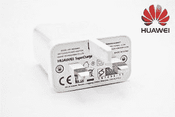

# 快速充电标准的速度、热量和性能比较

> 原文：<https://www.xda-developers.com/charging-comparison-oneplus-huawei/>

智能手机用户最常见的疑虑之一是他们的手机从来不会持续一整天。尽管近年来智能手机取得了诸多进步，例如快速充电、Dash Charge 和 SuperCharge 等快速充电解决方案，但电池的发展速度似乎不够快，无法满足我们的需求。

部分责任归咎于原始设备制造商，他们确实在努力使我们的智能手机逐年提高效率。但另一方面，我们智能手机越来越高的效率被视为将手机再薄一毫米的完美借口。为了保持手机的实用性，充电领域的进步被宣传为该设备的一个关键特征。那么手机待机 6 小时就没电了怎么办？现在半小时就能获得一天的电量，或者其他一些口号。

选择是 Android 最强的卖点之一，但在收费标准方面也让用户感到困惑。Android 旗舰产品有多种充电解决方案，它们各有优缺点、复杂性和特殊性。有些充电解决方案很快，有些很有效，有些并不像人们想象的那么好。

在本文中，我们将了解一些流行的充电标准的性能和效率，即华为的 SuperCharge，USB Power Delivery，一加的 Dash Charge，三星的自适应快充，以及高通的 Quick Charge 3.0。

### 索引

[**Conclusion**](#conclusion)

[**一加疾充**](#dash)[华为超级充电](#super) [**快充 3.0**](#quick) [**自适应快充**](#fast) [**USB 供电**](#usb)

* * *

### 当前获奖者 2017 年 9 月 16 日

# 一加冲刺充电

## 

Dash Charge 提供了速度和稳定性之间的完美平衡，它能够快速无痛地为手机充电，让我们感到惊讶。它的定制充电适配器和标志性的红色电缆允许较新的一加设备在充电时保持凉爽，而不牺牲设备的性能和充电速率。这意味着您可以在手机充满电时使用手机，继续发送信息、浏览网页甚至玩游戏。Dash Charge 无法提供广泛的兼容性或多样化的充电器选项，但最终它提供了一个出色的充电解决方案，不会妨碍用户体验。

* * *

### 方法学

我们收集的数据涉及使用一个脚本，该脚本自动测量关键充电参数(如 Android 所报告的)，并将它们转储到一个数据文件中供我们分析。所有的充电标准都经过了标准充电适配器和电缆的测试，以确保数据代表我们对每种标准的期望。所有数据收集都是从电池电量为 5%开始，到电池电量为 95%结束。为了测试屏幕使用情况下的热性能和充电速度，该脚本在手机充电时循环进行 PCMark 测试，以模拟现实世界的使用环境；温度读数是从操作系统收集的，而不是从外部测量的。为清楚起见，在制作图表时，平均数据被四舍五入。

| 

收费标准

 | 

测试的设备

 | 

蓄电池容量

 |
| --- | --- | --- |
| 短跑费用 | 一加 3 | 3000 毫安时 |
| USB-PD | 像素 XL | 3450 毫安时 |
| 自适应快速充电 | Galaxy S8+ (Exynos) | 3500 毫安时 |
| 快速充电 3.0 | LG V20 | 3200 毫安时 |
| 对…增压 | 华为 Mate 9 | 4000 毫安时 |

* * *

## 最快充电标准

当我们测量流行的充电解决方案的充电时间时，我们遇到了一个奇怪的结论:USB 供电是我们测试的所有快速充电解决方案中最慢的，至少在 Pixel XL 上实现了这一点。这只是令人惊讶，因为 USB 供电是 USB-IF 标准机构推出的“标准”,也是 Google 大力鼓励的标准——一旦我们在本文中进一步研究每个标准的工作原理，就会更有意义。

谷歌 Pixel 和谷歌 Pixel XL 已经实现了 USB 供电。较小的谷歌 Pixel 被宣传为能够进行 15W-18W 充电，而较大的谷歌 Pixel XL 能够进行 18W 充电。正如我们在[的谷歌 Pixel XL 评测](https://www.xda-developers.com/google-pixel-xl-xda-review-a-foundational-release-for-google-post-nexus-android/#11)中指出的，该设备的实际充电时间没有竞争力，与其他解决方案相比，最终排在最后一位，我们为了进行比较而对充电时间进行的广泛测试也显示了同样的结果。下面你可以看到，当测试设备的电池容量达到 3,000mAh 时，每个标准**的充电时间从 5%到 80%**-这个**并不能代表每个标准如何以完美的精度对这样的电池容量进行充电，应该使用图表来大致了解它们之间的比较。**

当我们查看哪个*设备*充电最快时，我们测试的最快充电解决方案是一加的 Dash Charge 功能，在 OnePlus 3 上最终比竞争对手快了大约 10 分钟(在调整电池容量之前)，比 USB 供电快了整整半个小时。另一方面，Dash 充电是专有技术，这增加了它自己的复杂性，我们将在本文稍后讨论。当我们考虑并调整设备的电池容量时，Dash Charge 确实落后于华为 Supercharge，因为华为 Mate 9 的电池比 OnePlus 3 大得多。虽然 Supercharge 实现了更快的峰值充电率，但华为 Mate 9 由于电池容量更大，最早也达不到 95%的充电率。因此，虽然 OnePlus 3 在达到更高的电池容量百分比方面更快，但 Mate 9 实际上在单位时间内增加了更多的电荷(这是华为更高功率输出的一个功能)。

华为 Supercharge 和高通快充 3.0 的表现类似，而三星的自适应快充虽然初始速度优势较小，但仍然成功达到了 95%的充电目标，同时与其他两家公司展开了激烈的竞争。

除了充电时间，我们还有温度数据。该图与充电百分比一致，但必须分开，以保持简单、整洁和易于理解。

我们无法精确控制测试设备的所有起始温度，因为测试设备所处的不同位置的温度各不相同，所以我们的重点应该是**一致性和稳定性**，而不是每个数据集显示的绝对最高和最低温度。电池温度是从安卓系统的低阶电池温度记录中获得的。

其中最热稳定的是三星的自适应快速充电，因为它在整个过程中保持了对设备温度的良好控制。高通的快速充电 3.0 是“最酷的”，尽管如此，我们需要更好地控制初始条件，完美的起点和最小的外部变量来加冕它。同样，我们不能称 USB 供电为“最热”，但它绝对显示了最广泛的温度范围。同样值得注意的是，一旦充电速度开始放缓，这些设备中的大多数最终都会冷却下来，USB-PD 在管理温度超过峰值方面做得很好。

当您观察这些技术在设备承受真实工作负载时的表现时，情况会发生变化。如前所述，我们循环了 PCMark 的 Work 2.0 测试，以模拟这些设备充电时的真实使用情况，从而测量充电时间和温度的差异。

一加的 Dash Charging 仍然是表现最好的，主要是因为它的实现，我们将在下面进一步详细介绍。电压和电流调节电路位于仪表板充电器中，这导致充电时温度较低。因此，Dash Charge 的空闲充电和欠载充电分数往往变化很小。

另一方面，三星的自适应快速充电在真实工作负载下充电时表现最差。如果正在使用，该设备需要大约两倍的时间来充电，并且充电还以一种特殊的线性方式增加(给定电压和电流保持恒定)，这在我们的任何其他测试中都没有看到。事实上，[根据三星 S6](https://shop-links.co/link/?exclusive=1&publisher_slug=xda&article_name=Speed%2C+Thermal%2C+and+Performance+Comparison+of+Fast+Charge+Standards&article_url=https%3A%2F%2Fwww.xda-developers.com%2Fcharging-comparison-oneplus-huawei%2F&u1=UUxdaUeUpU18617&url=https%3A%2F%2Fwww.samsung.com%2Fuk%2Fsupport%2Fmobile-devices%2Fcharging-your-smartphone-or-tablet%2F&ourl=http%3A%2F%2Fwww.samsung.com%2Fuk%2Fsupport%2Fskp%2Ffaq%2F1074414) 的支持页面，当屏幕打开时，其自适应快速充电解决方案是完全禁用的。像这样的明确提及在新的支持页面上找不到，但三星继续建议设备在使用快速充电时关闭。

其他标准继续占据这两个极端之间的位置，大部分位于天平的较好一侧。即使是 USB 供电，空闲充电的表现最差，也只需要 10 分钟左右的时间就可以在负载下达到相同的充电水平。

在温度方面，三星的自适应快速充电(如果我们可以在这个测试中称之为快速充电)保持了一致的温度范围，在 5°C 范围内流动。华为的 Supercharge 紧随其后，一加的 Dash Charge 紧随其后。高通的快速充电 3.0 和 USB 供电在温度方面表现最差，在整个周期中存在很大的不一致性和差异。

* * *

**抛开标准间的比较不谈，让我们仔细看看这些标准在空载充电和负载充电情况下各自的表现，并简要解释它们为何如此以及如何工作。**

* * *

## 华为超级充电

华为的 SuperCharge 是我们测试过的更有趣的标准之一，在大多数情况下都显示出令人印象深刻的结果。与传统的高压充电解决方案不同，Supercharge 采用了相对较低的电压和较高的电流公式，旨在最大限度地提高进入设备的电流量，同时最大限度地降低效率损失、热量和节流。再加上智能充电协议，Mate 9 还可以根据电池的要求以及所提供的充电器来调整其充电参数(例如，它可以充分利用 USB-PD 充电器)。实际的超级充电器配有 5V 2A、4.5V 5A 或 5V 4.5A(最高 25W，或在最相关的细分市场中常见的 22.5)，并使用芯片组内置充电器来调节电压——这意味着没有额外的手机内电压转换，从而降低温度和效率损失。再加上华为在其设计中所谓的“8 层热机械”，Mate 9 承诺在低温下的快速充电速度。关注电流而非电压，追求不那么不平衡的分布类似于 Dash Charge 标准的方法，在许多方面，一加(或 Oppo)的解决方案类似于华为的超级充电。

查看我们收集的数据，我们看到典型的温度模式*开始*下降超过 55%标记，在该点电流也开始下降。峰值电流接近充电器的 5A 额定值，并在最初的 20 分钟内保持 4.5 的标称电流，或直到 45%左右。最快的充电速率出现在 10%至 5%之间，线性斜率在电流下降时开始弯曲，在从 2V 快速攀升至 3.5V 以上后，电压开始保持恒定。在整个测试过程中，峰值温度达到 38 摄氏度，明显高于列表中的大多数其他标准。然而，当我们看一看我们的“欠载”测试时，温度将变得非常重要，我们在设备上模拟活动，以比较充电速度。我们可以清楚地看到温度随着电流下降，它不像本文中的其他标准那样以明确定义的步骤下降，而是有一个固定的下降轨迹

在充电速度方面，华为 SuperCharge 在大约 60 分钟内达到 90%，在速度方面排名第二，仅次于一加的 Dash Charge。然而，我们测试的华为 Mate 9 也有一个 4000 毫安时的电池，这意味着每百分比的毫安时比所有一加设备都高，实际上使标准处于更好的位置，领先于一加。然而，在充电速度方面存在差异，因为超级充电在 30 分钟时开始变得比冲刺充电更难。这些公司中的大多数都宣传一个人可以在半小时内获得多少电池寿命，我们的测试超过了华为的说法，因为该设备在这段时间内设法攀升到 60%以上。

在工作负荷下，充电速率自然低于空闲充电期间的速率。我们看到的不是急剧下降，而是一条更为缓和的曲线，在 75%左右下降。当器件接近 60%时，电流和温度下降。

* * *

## 一加冲刺冲锋

快速充电的一个新冠军是 Dash Charge，它在 2016 年随着 OnePlus 3 浮出水面。虽然 OnePlus 2 通过常规 2A 充电器充电的时间长得令人失望，但 OnePlus 3 带来了一加所说的“独家技术，为快速充电解决方案树立了新的基准”。与大多数原始设备制造商的营销声明一样，这种说法只对了一半。Dash 充电技术实际上是从 OPPO 获得许可的，一加是 OPPO 的子公司，并模仿他们的 VOOC 充电系统-电压开放多步恒流充电。虽然 Dash Charge 是一个更好的名字，但 VOOC 充电可以在 R9 和 R11 等 OPPO 设备上找到，尽管在本文中，我们将重点放在 OnePlus 3 / 3T 和 OnePlus 5 上实现的 Dash Charge 上。

那么 Dash Charge 有什么特别之处呢？与华为 SuperCharge 不同，它产生更大的 4A 电流，在 5V 时输出 20W 功率。一加没有提高电压，而是选择了电流更大、分布更均匀的方法，这意味着单位时间内输送的电荷更多。这是通过软件实现的，主要是通过硬件——特别是所用的充电器，它是非标准的(例如，与过多的 QC 充电器不同),因此您需要 VOOC 或 Dash 充电器来利用这些充电速度。

与华为的解决方案非常相似，一加在充电器本身采用了专用电路，由于充电器的许多组件，VOOC 和 Dash Charge 都可以提供更高的安培数，包括监控充电水平的微控制器；电压和电流调节电路；热量管理和散热组件(有助于 5 分安全检查)；更粗的电缆可以传输更大的电流，专门用于最小化功率波动。因为充电器将墙壁上的高电压转换成电池所需的低电压，这种转换产生的大部分热量不会离开充电器，从而使您的手机保持凉爽。流入手机的恒定电流加上实际手机上的较低温度允许减少热节流，这影响了充电速度和一致性以及直接的用户体验。

一加自豪地宣称它可以给你“半小时一天的电力”，这实际上意味着你在 30 分钟内看到大约 60%的电池容量。这不仅非常快，而且还有一些额外的好处。充电速度是最快的，*在这些较低的百分比下是最快的*之一，确保您可以在电池电量不足的情况下，在短短几分钟内获得大量的电荷。而且，热量的一致性和缺乏节流是*不开玩笑的*。从提供的数据中我们可以看出，欠载充电和常规充电之间的差异很小。这确实意味着在使用你的设备时，你不会注意到速度变慢、额外的口吃或一般的节流副作用。这是一个很好的优势，[正如我们在过去的分析](https://www.xda-developers.com/dash-charge-speed-analysis-even-with-heavy-usage-your-phone-will-charge-rapidly-and-stay-cool/)中提到的，这确实意味着你可以玩要求苛刻的 3D 游戏，如沥青 8，同时仍然获得几乎相同的充电速度，这种差异可以由游戏本身引起的消耗来解释。

Dash Charge 确实有一个很大的缺点，那就是兼容性。例如，如果你手边没有 Dash 充电线和充电器，OnePlus 3 和 3T 就无法充分利用 USB-PD。你需要充电器和电缆来让 Dash Charge 发挥它的魔力。与高通快速充电不同，你不会发现来自不同供应商的多种充电器产品和配件——你会被一加和他们的库存所困，其中包括普通充电器和汽车充电器(已知定期和经常缺货)。你可以试着买一个 VOOC 充电器，但在许多市场上这可能更难。还有一个令人失望的明显缺乏支持 Dash 充电速度的电池组，因为一加没有提供——你可以试试 OPPO 的带适配器的电池组，但这远远不理想。

如果你能忽略这些不便和不兼容性，Dash Charge 在速度和一致性方面都是明显的赢家。这是一种快速有效的充电标准，不会将用户长时间束缚在墙上，也不会妨碍他们在插电时的实际使用。热量减少甚至可以延长电池寿命。你的手机会保持凉爽，但你的充电器不会——所以确保在它工作时不要碰它！

* * *

## 高通快充 3.0

## 

高通快速充电是这个列表中最受欢迎的充电标准，理由很充分。它的模式与我们在一加和华为看到的不同，因为大部分神奇的事情都是通过高通的电源管理 ic、他们的 SoC 和他们采用的算法发生的——所有这些都使快速充电成为一种相对低成本的解决方案(对原始设备制造商来说)，他们已经在他们的智能手机中安装了骁龙芯片组，虽然它可能不像列表中的一些专用解决方案那样令人印象深刻，但高通快速充电的影响力带来了它自己的一系列好处。虽然我们专注于快速充电 3.0，但请记住快速充电 4.0 已经推出，并进行了相当大的改进。最新版本也兼容 USB-PD，这是 Android 兼容性定义文档强烈推荐的。

快速充电 3.0 已在包括 Snapdragon 820、620、618、617 和 430 在内的芯片组中提供，并提供与以前快速充电标准充电器的向后兼容性(这意味着您可以受益于大量低成本、较慢的充电器)。这主要是因为电力消耗完全是在设备上处理的，你只需要提供一个能够提供必要电流的电荷来利用它的优势——不缺乏快速充电认证的充电器，所以应该不难发现一个。但是，我们应该再次强调，快速充电 3.0 甚至允许手机在使用未经认证的充电器时，比非快速充电设备更快或更有效地充电，正是因为它的大部分功能与特定的充电器硬件无关，不像超级充电和 Dash Charge。

快速充电 3.0 利用“最佳电压智能协商”(INOV)，顾名思义，这允许智能电压控制，以便在充电时的任何给定点确定最有效的电压，实现最有效的功率传输。再加上比竞争对手更高的电压，这使得该标准能够加快充电时间，同时防止过热并确保电池安全。INOV 也是快速充电 2.0 的一个进步，快速充电 2.0 具有 5V/2A、9V/2A、12V/1.67A 和 20V 的相当离散的电源模式)；相反，这个版本允许细粒度的电压缩放，从 3.6V 到 20V，增量为 200mV。通过确定在任何时间点请求的功率水平，快速充电还可以防止破坏电池的化学成分，同时在考虑温度和可用功率输出等因素的情况下仍然提供最佳充电速度。一个潜在的不利因素是充电场景和充电器之间的充电速度更加不一致，这种改善确实表现在充电的早期阶段和 80%左右的明显下降。

不过，从提供的图表中可以看出，更精细的粒度和更宽的电压阶跃范围显然得到了利用。值得注意的是，这里显示的 Quick Charge 3.0 样品在负载下的表现不如其他替代产品有效，这些替代产品将大部分电压转换和散热转移到外部硬件；如果你想在充电时使用它，它比可维护的多，但是我们没有看到像 Dash Charge 这样的解决方案缺乏节流和热量积累。而且，与其他标准不同，你真的不会很难找到能提供额定充电速度的电源银行——超级充电站或一加就不是这样，除非你愿意花更多的钱，花更多的时间，或做出额外的让步。

正是这种多功能性和支持水平使快速充电成为一个伟大的标准，一些原始设备制造商最终将其重新命名为一个卓越的“定制”替代方案。但最终，对于大多数寻求实施高效、高度兼容且不需要特殊附件的快速充电的原始设备制造商来说，快速充电是一个极好的解决方案。这一点具有极端的意义，因为高通实际上是在向数十家较小的原始设备制造商提供更快的充电，或者通过中端芯片组向中端设备提供更快的充电。这反过来提高了快速充电产品的最低基准，反过来促进了竞争，并促使那些将快速充电作为特定卖点的品牌积极改进或营销他们的解决方案。

* * *

## USB 供电

USB 作为一种标准已经发展了多年，从一个简单的数据接口最终成为广泛使用的受限制的电源供应商，到一个成熟的主要电源供应商*和*数据接口。许多小型设备多年来一直采用 USB 充电，此时此刻，你可能有一些外围设备正在通过 USB 电缆供电。然而，最初几代 USB 的电源管理并不是为了给电池充电，而是被制造商巧妙地利用了，他们认为缓慢的电源传输对于他们产品的小电池来说已经足够了。从那以后，我们看到了一个巨大的飞跃——从 5V/500mA (2.5W)的 USB 2.0 电源，到 USB 3.0 和 3.1 的 5V/900mAh(这在 Android 上非常非常没有得到充分利用)，最后是 USB PDs 100W 最大充电功率。

当然，智能手机没有必要(也无法接纳！)这样的功耗-虽然 20V/5A 是 USB PD 的峰值，但实际充电器的规格要低得多，我们测试的 Pixel 时钟高达 15W (5V/3A)，Pixel XL 高达 18W。然而，在大多数充电情况下，电压升至 5V，电流略低于 2A，我们发现充电期间的最高功耗略低于 12.25W。如这里提供的数据所示，USB-PD 确实不是最快的充电标准，也不能提供最佳的热一致性/缺乏节流。然而，它在负载下充电非常快，总的来说，它提供了一个非常令人满意的充电曲线。

然而，这是一个非常通用的标准，相对容易实现，并且越来越多地由谷歌在 Pixel C、Pixel Chromebooks 和 Pixel 智能手机等产品中推出，以及由其他各种笔记本电脑和其他不同尺寸设备的制造商推出。此外，USB-PD 现在是 Android 兼容性定义文档的一部分。去年，下面的条目流传开来，因为它显示了谷歌对标准的承诺，以及许多人解释为对专有解决方案的阻碍。

> 强烈建议 C 类设备不要支持将 Vbus 电压修改到默认水平以上的专有充电方法，或者改变吸电流/源电流角色，因为这可能会导致支持标准 USB 供电方法的充电器或设备出现互操作性问题。虽然这被称为“强烈建议”，但在未来的 Android 版本中，我们可能会要求所有的 type-C 设备支持与标准 type-C 充电器的完全互操作性。

从那以后，我们看到高通为更新的骁龙芯片组发布了符合 USB-PD 规范的 Quick Charge 4.0，这对谷歌和高通来说都是一个巨大的胜利。USB-PD 和 Type C 端口的不断增加可以引领我们走向一个未来，在这个未来，我们将看到更多的设备互连，以及一个用于音频、视频、数据传输和充电需求的近乎通用的端口。例如，像 Pixel XL 这样的 USB Type C 设备目前允许使用电池作为电源为其他设备充电，而 USB Type C 和 USB-PD 在笔记本电脑等其他设备中的广泛采用可能会导致更方便的充电和电缆管理用例。

USB-PD 设备也不缺乏充电器选项，如果该标准可以与专有标准共存，这将为设备制造商带来更多可能性。不过，就目前的情况来看，它还没有出现在许多 Android 设备上，Pixel 和 Pixel XL 处于领先地位。对于这两款手机及其足够的电池容量，充电速率和结果时间都足够了，Pixel / Pixel XL 的所有者有多种选择——人们只需要确保充电器能够满足手机的 9V/2A 或 5V/3A 要求，并且符合规格。随着 USB Type C 和 USB-PD 的出现，我们确实看到了一些在线销售具有潜在危险的电缆的报道，例如，[因为它们不符合电缆](https://forums.oneplus.net/threads/in-response-to-the-type-c-cable-discussions.412344/)中电阻的规格。幸运的是，这样的问题正在消失，如果你确保正确地研究你的购买，你应该没问题。请记住，该标准是可扩展的，OEM 可以尝试更多的电压和电流配置。

* * *

## 自适应快速充电

多年来，自适应快速充电一直是三星首选的充电解决方案，不幸的是，自那以来，它基本上保持不变。虽然我们的结果显示它是最慢(但更稳定)的标准之一，但三星年复一年地选择它，要么是更符合一加和华为正在做的充电解决方案，要么是适当的高通快速充电(然而，三星设备可以利用快速充电充电器进行快速充电！).后者是他们分离芯片组策略的结果，因为他们的 Exynos 芯片组无法轻易利用高通的充电技术。三星的自适应快速充电因此出现在全球各地的设备中，并且仅限于三星设备。

虽然在调整电池容量时，自适应快速充电比 USB-PD 快，但仍明显慢于超级充电和 Dash Charge，比快速充电略慢。它的峰值功率为 15W (5V/3A ),符合其他标准，但三星似乎对其充电时间相当保守——这在负载充电时尤为明显，因为充电速率几乎成线性，在我们为本文测试的所有设备中充电速率最慢。也就是说，温差也是最小的，限制充电速度和降低温度可以在使用时保持一致的性能。

在两种情况下(常规充电和带负载充电*)，三星的解决方案都是最慢的(没有针对电池容量进行调整)，也是最冷的(或者说，温度范围最小)。在 Galaxy Note 7 [及其有缺陷的电池](https://www.xda-developers.com/samsung-discloses-issues-with-galaxy-note-7-batteries-phone-itself-not-to-blame/)发生之后，这种对稳定性的强调和对散热的考虑现在对三星来说比以往任何时候都更加重要。虽然这种快速充电方法和这一事件之间可能没有关联——毕竟，正如我们提到的，他们的标准在很大程度上保持不变——但仍然值得考虑的是，更安全的快速充电方法本身并不坏。

对于三星设备来说尤其如此，它们还提供了一种额外的不同的快速充电解决方案——快速无线充电。虽然传统的无线充电在几年前开始流行，但三星是少数几个坚持使用无线充电的公司之一，然后通过采用更快的无线充电来改进他们的实施，最初将充电时间从大约三个小时缩短到大约两个小时。拥有这种替代方案可以弥补自适应快速充电的一些缺点，因为无线充电是一种更被动的方法，不太麻烦，因此可以更规律地充电，有效地解决了在办公室或卧室空间给手机充电的麻烦。

**您可能会注意到，这些数据集中各点之间的间隔比其他存根和图表上的间隔要小。在从 GS8+收集数据时，我们偶然发现了一个特定于设备的问题，该问题阻止了使用 UI 自动化进行 PCMark 测试。因此，我们修改了 GS8+的数据收集和自动化工具，并改进了轮询机制。未来添加的数据将受益于这些改进，从而产生更准确或更平滑的图形。*

* * *

随着我们接触到更多的设备，并开始测试更新的标准，本文将不断更新。敬请期待更多对比！