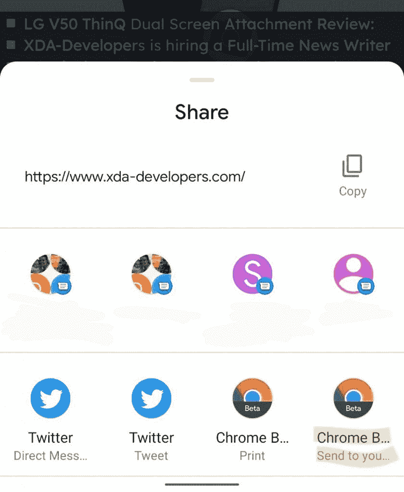

# 【更新 2:在 Chrome 77 中启用】Android 的 Chrome 的“自我分享”可能会让你将浏览器标签推送到桌面 Chrome

> 原文：<https://www.xda-developers.com/chrome-android-self-share-tabs/>

**更新 2 (9/10/19 @美国东部时间下午 3:05)**:谷歌 Chrome 在设备间发送标签页的工具在 77 版本中默认开启。

**更新 1 (3/12/19 @ 04:10 PM ET)** :该功能终于在谷歌 Chrome Canary 中发挥作用了。更多细节见下文。原文如下。

数字世界中生活的一个重要部分是设备之间的集成。当智能手机首次出现时，有大量的应用程序使设备之间的同步和共享成为可能。如果你是一个长期的 Android 用户，你可能记得一个名为“ [Chrome to Phone](https://www.xda-developers.com/supercharge-your-chrome-to-phone-with-browser-to-phone-for-android/) 的应用程序，它允许你将桌面浏览器上的东西推送到你的手机上。像这样的功能现在相当普遍，谷歌正在开发新的功能。

一个新的 Chromium commit 提到为“自我共享原型”添加一个特性标志。该承诺继续提到“将标签发送给自己”的能力，并被描述为“允许用户从 Android 设备上发布标签，以允许其他同步计算机重新打开相同的标签。”

我们不知道这到底是怎么回事，但有一些可能性。最有可能的似乎是一个类似 Pushbullet 的工具，它手动将一个选项卡发送到桌面。Chrome 已经能够同步标签页，而“[继续阅读](https://www.xda-developers.com/chromebook-continue-reading-chrome-tab-android/)”功能使得 Chrome 操作系统更加容易。然而，自我分享是一种更快、更直接的方法。您可以立即手动推送，而不是等待标签同步。

一旦这个功能被合并，它将可以在[chrome://flags # enable-self-share](chrome://flags/#enable-self-share)切换开/关。这似乎是一个方便的功能。有很多次，我想在桌面上打开手机中的标签页，但我重复刷新了标签页同步页面。像[推推](https://www.xda-developers.com/xda-external-link/pushbullet-update-improves-sms-reliability-and-lets-you-send-picture-messages-from-the-pc/)和[加入](https://www.xda-developers.com/join-2-0-ifttt-remote-actions/)这样的应用程序已经可以很好地做到这一点，但是内置方法对于更普通的用户来说是一个不错的选择。

## 更新 1:将标签发送到 Chrome Canary 中的 Self works

正如 [*ChromeStory*](https://www.chromestory.com/2019/03/send-to-my-devices/) 所指出的，“将标签发送给自己”功能现在可以在最新版本的谷歌 Chrome 中工作。如果您有 Chrome Canary 75.0.3730.5 或更高版本，请启用 Chrome://flags # enable-send-tab-to-self 中的标志。重新启动浏览器，然后导航到任何页面。从溢出菜单打开共享对话框，你应该会看到一个“发送到我的设备”选项。在启用了该标志的其他设备上，您应该会收到打开刚刚共享的页面的通知。

* * *

## 更新 2:在 Chrome 77 中启用

 <picture></picture> 

Chrome Beta in Android 10

几个月前在金丝雀频道推出后，Chrome 的标签发送功能在 77 版本中默认启用。你现在就可以在 Android 版的 Chrome Beta 中试用。打开网页并从菜单中选择“共享”。您应该会在共享选项列表中的 Chrome 图标下看到“发送到您的设备”。