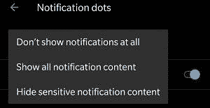

# Chromebooks 通过类似 Android 的控件和内嵌回复获得锁屏通知

> 原文：<https://www.xda-developers.com/chromebooks-lock-screen-notifications/>

# Chromebooks 通过类似 Android 的控件和内嵌回复获得锁屏通知

Chromebooks 将很快支持类似于 Android 的锁屏通知，具有类似 Android 的隐私控制、内嵌回复和滑动控制。

自宏碁 Chromebook Tab 10 和 T2 惠普 Chrome book X2 T3 发布以来，谷歌在过去几个月加快了将 Chrome OS 转变为平板电脑友好操作系统的努力。有大量新的[功能和标志](https://www.xda-developers.com/pixelbooks-launcher-more-chrome-os/)到[使 Chrome OS 更适合平板电脑](https://www.xda-developers.com/make-google-chrome-touch-friendly-tablets-laptops/)。像 [Google Duo](https://www.xda-developers.com/google-duo-chromebooks-hp-chromebook-x2/) 和 [ARCore](https://www.xda-developers.com/arcore-chromebook-google-pixel-3-xiaomi-mi-8-se/) 这样的应用程序最近开始支持 Chromebook 平板电脑/可拆卸设备，我们预计更多的应用程序、服务和功能将进入 Chrome OS，为一波 [新的可拆卸 Chrome book](https://www.xda-developers.com/detachable-chromebook-backlit-keyboard-hp-chromebook-x2/)做准备。其中一个功能是锁屏通知支持，即将发布，它将带有类似 Android 的隐私控制、内嵌回复支持和滑动控制。

我们第一次发现这个功能的存在是在三月份，但是直到最近这个功能才开始在最新的 Chrome OS Canary 版本中工作。该功能可在`chrome://flags#enable-lock-screen-notification`启用。 [*ChromeStory*](https://www.chromestory.com/2018/08/chromebook-lock-screen-notifications/) 上周发现了这个功能的工作，他们还发现了一个[后续承诺](https://www.chromestory.com/2018/08/hide-sensitive-notifications-chromebook/)来启用[类似 Android 的隐私控制](https://chromium-review.googlesource.com/c/chromium/src/+/1165723)和[滑动控制](https://chromium-review.googlesource.com/c/chromium/src/+/1118093)，这样你就可以滑动以显示类似[通知休眠](https://www.xda-developers.com/notification-snoozing-chrome-os-android-apps/)的按钮。隐私控制功能将出现在 Chrome OS 设置中，尽管当锁屏通知支持在 Chromebooks 上推出时，“隐藏敏感通知内容”功能可能不会激活。

 <picture></picture> 

Lock Screen Notification Privacy Settings. Device: OnePlus 6 running OxygenOS 5.1.9 based on Android 8.1 Oreo

目前，通知看起来并不像人们预期的那样真正集成到了锁屏中。相反，可以从系统托盘中访问通知。我在我的惠普 Chromebook X2 上测试了该功能，并拍摄了以下截图。

Chrome 操作系统上的锁屏通知目前是什么样子。

我们确实找到了更多关于该功能如何工作及其即将发布的 Chromebooks 的信息。例如，[内嵌回复支持](https://chromium-review.googlesource.com/c/chromium/src/+/1166617)即将推出，尽管它可能不会与锁屏通知同时推出。锁屏通知功能[将很快在 Chrome OS Canary 中默认启用](https://chromium-review.googlesource.com/c/chromium/src/+/1166604)，尽管该承诺没有提到何时在 stable 上推出的时间表。一旦 Chromebooks 推出该功能，我们会通知大家。