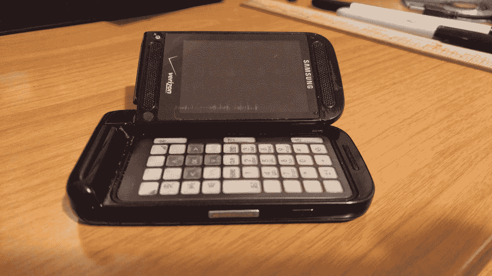

# 比较使用和不使用谷歌服务时的电池寿命:一周的最小空闲消耗

> 原文：<https://www.xda-developers.com/comparing-battery-life-with-and-without-google-services-a-week-of-minimal-idle-drain/>

众所周知，如今智能手机的电池续航时间并不是最好的。大多数人会认为这主要是硬件问题，因为公司会用电池大小来换取美观的设计。但这并不是全部原因，很大一部分原因是我们手机上使用的软件。

在 XDA 的虚拟办公室中，我们许多作家经常会发现，电池问题背后的最大元凶是某些进程的疯狂运行。即谷歌服务。

目前有许多方法来提供更长的电池寿命周期，例如:电池组、电池盒、处理器时钟等。通常的解决方案是禁用不使用的应用程序，或者占用大量系统实用程序的应用程序。我想做的是[禁用我设备](http://www.xda-developers.com/setting-up-android-marshmallow-without-google/)上的所有谷歌应用和服务，看看它是否能让我的电池寿命更长。我没有仅仅使用去模糊工具或者股票设置禁用器，而是选择了更进一步，安装了没有任何谷歌应用或者谷歌服务的安卓系统。

由于我的日常驱动程序没有可解锁的引导程序(感谢威瑞森)，我决定看看旧手机抽屉，并选择了一个我最喜欢的设备来使用。摩托罗拉 Moto X 2014 是我在这个实验中选择的设备。在四天的时间里，我使用安装了 CyanogenMod 13 的 Moto X，没有任何 Gapps 软件包。为了比较，我在四天后重置了设备，安装了相同的 CM 13 zip，这次从开放的 Gapps 库安装了股票 Gapps 包。

* * *

在连续四天将每一个 ROM 作为日常驱动的时候，我依赖它们来完成我的许多日常服务。因为我每天都依赖谷歌服务，所以进行这个实验相当困难。以下是我最常用的谷歌应用程序列表，以及我用过的所有替代产品列表。

| 

谷歌应用

 | Cortana 应用程序 | 

播放音乐

 | CM 音乐 App |
| --- | --- | --- | --- |
| 

保留/文档

 | Omni Notes | 

谷歌+/Youtube/地图

 | 浏览器盖 |
| --- | --- | --- | --- |
| 

驱动器/照片

 | Dropbox | 

聚会场所

 | 未找到替代方案 |
| --- | --- | --- | --- |

互联网上有许多可供选择的应用程序商店和存储库，包括亚马逊应用程序商店、F-Droid、XDA 实验室、APK 镜报以及许多其他应用程序商店。为了测试我的应用程序，我坚持使用我熟悉的两个商店/仓库， [XDA 实验室](http://forum.xda-developers.com/android/apps-games/labs-t3241866)和 [APK 镜像](http://www.apkmirror.com)。

在一个基于谷歌的平台上没有谷歌服务是一个不小的壮举。整个操作系统每天都明显缺乏功能。虽然有些服务有浏览器界面，但有几个只会尝试引导你去 Play Store...或者播放商店的浏览器站点。由于 Hangouts 是一个没有移动界面的网站，我无法与一些同事和朋友交流。

说到沟通错误，Hangouts 并不是我遇到麻烦的唯一服务。我可能不是这款应用的粉丝，但没有 Gapps，Snapchat 完全不行。该应用程序需要 Play 服务才能登录，不幸的是，我无法通过两个独立的服务与我的朋友交流。

幸运的是，我为我的商业同事提供的第二个通信服务部分正常。我可以在 Slack 上发送和接收消息，但通知功能无法工作，因为它们依赖于谷歌云消息。相当多的其他应用程序也有同样的问题，这意味着我只收到过电话、短信和电子邮件的通知。

试图用 Cortana 替代 google 并不是我主观喜欢的事情。微软的搜索服务是受欢迎的竞争，并在继续变得更好，但这不足以与最初的搜索引擎竞争。我在谷歌的移动页面上发现的 Cortana 应用程序唯一有用的功能是在我的主屏幕上有一个语音搜索快捷方式的选项，这更方便。

不得不依赖浏览器来获得我无法访问的服务，这有点令人沮丧。习惯了 YouTube 红，离开 YouTube 网站会停止音频。这导致我变得越来越烦躁。作为一个超级音乐迷，我喜欢在手机上听和发现各种类型的音乐。虽然 CM 的 baked in music 应用程序运行正常，但流媒体服务的缺乏让我不得不求助于替代的、更古老的方法来发现音乐。

* * *

在有和没有 Gapps 的情况下使用手机大约一周，得出了有趣的结果。正如您从下面的屏幕截图中看到的，无 Gapps 运行的平均屏幕打开时间和总电池时间没有 Gapps 运行的长。然而，请注意在(稍微短一点的)睡眠时间里更陡峭的斜坡。

### 没有间隙:

### 带 Gapps:

这些结果不是我在实验中所期望的。查看电池图表，可以看出 Gapps 运行产生了更多的设备唤醒，正如预期的那样。这一点很明显，Gapps 运行不仅在图形下方的条形上有更多的活动指示。Gapps 图都有一个更加平缓的斜率，而没有 Gapps 的图看起来更加平稳。但是屏幕上的排水几乎是相同的，主要的区别在闲置排水中可以看到。

就性能而言，差别可以忽略不计。在 Gapps 运行时，应用程序当然更容易崩溃，罪魁祸首是 Hangouts(和往常一样)。在每次运行时运行基准似乎是多余的，因为我使用的是完全相同的处理器和 CPU，这些进程对处理器的影响可以忽略不计。

* * *

总的来说，这个实验很有趣。尽管缺乏功能，挑战自己绕过如此大的限制还是很有趣的。因此，这让我们想到了我们的主要问题，为了节省一点电池，不使用谷歌应用和服务值得吗？对我来说，简短的答案是否定的。虽然电池寿命是一致的，但它并没有以任何方式特别长。如果你想限制自己在度假或其他时候使用手机，那么“无缝隙生活”可能会有用，但除此之外没什么用。如果我必须总结功能的缺乏，我会说这种体验让人想起智能手机繁荣之前的功能手机时代。

 <picture></picture> 

*Hello my old friend*

你觉得我的成绩如何？你想让我尝试什么奇怪的软件测试吗？请在下面的评论中告诉我。