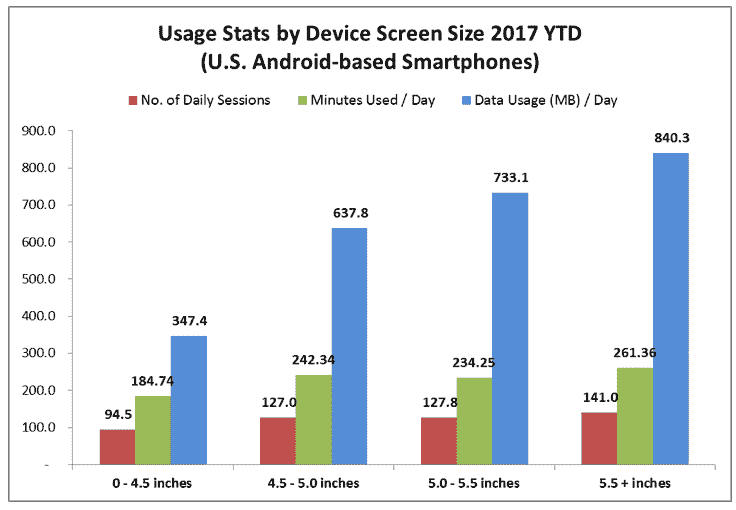

# 尺寸的确很重要:消费者在更大的设备上花费了更多的时间

> 原文：<https://www.xda-developers.com/consumers-spending-more-time-larger-devices/>

在过去的几年里，Android 手机的屏幕尺寸增加了很多。首款安卓手机 HTC Dream/T-Mobile G1 拥有 3.2 英寸的显示屏。在接下来的几年里，我们看到平均屏幕尺寸不断增加。2011 年，三星推出了 5.3 英寸 16:10 显示屏的 Galaxy Note，在当时看起来非常巨大。现在，即使是廉价的智能手机也有 5.5 英寸的显示屏。

智能手机的平均屏幕尺寸从 3.2 英寸一直增加到 5.5 英寸。2017 年，设备制造商开始采用 5.7 英寸和 6 英寸 18:9 显示器的更高的 18:9 纵横比。现在，我们开始看到 6 英寸 18:9 显示器成为旗舰产品和中端价格段的新标准，因为它们比 5.5 英寸 16:9 显示器具有更大的屏幕面积。

关于大显示器是否比小显示器更好的观点仍然存在分歧。然而，在过去几年中，大显示屏智能手机(曾被称为“平板手机”)的销量呈指数级增长。现在，很少有手机的屏幕尺寸小于 5 英寸，索尼 Xperia Compact 系列是拥有更小显示屏的著名手机系列之一。

到目前为止，更大的智能手机显示屏对移动数据使用和通话时间的影响还没有被量化。现在，AppOptix(Strategy Analytics 的一个部门)已经监测了 4000 名 Android 用户，并就他们的发现发布了两张信息图。数据显示，屏幕尺寸为 5.5 英寸以上的用户比那些屏幕尺寸较小的用户使用更多的数据和时间。

 <picture></picture> 

Source: AppOptix

AppOptix 数据显示，与 4.5-5.0 英寸智能手机屏幕相比，5.0-5.5 英寸屏幕和 5.5 英寸以上屏幕使用的移动数据要多得多。信息图显示，使用 5.5 英寸以上屏幕的用户每天有 141 次会话，他们每天使用手机的时间为 261.36 分钟。他们每天还使用 840MB 的手机数据。

另一方面，4.5-5.0 英寸屏幕的用户每天有 127 次会话，每天使用手机 242 分钟。他们使用更少的移动数据，637MB 的数据使用量。

该数据表明，大屏幕设备是推动数据、分钟和会话消耗上升的原因。有道理。更大的显示器自然有助于更高的媒体消费。事实上，毫无疑问，更大的(5.5 英寸以上)显示器对工作效率也更好。随着更小的挡板和 18:9 显示屏，更大显示屏的缺点正在逐渐减少，这很好。

 <picture></picture> 

Source: AppOptix

AppOptix 信息图的其他发现是，美国人显然每天使用手机 4 小时，消耗 743MB 数据(Wi-Fi +移动数据)，有 131 个应用程序会话。用户通常将大部分时间花在社交应用上，其次是通信、游戏和浏览。

这项研究的发现仅限于美国消费者，尽管其要点可以适用于全世界。消费者已经表态，他们想要更大的显示屏和更小的边框。正是在这里，设备制造商遇到了问题，因为他们试图不惜一切代价减少挡板，因为这导致了关于[有争议的显示屏凹槽](https://www.xda-developers.com/android-display-notch-discussion/)的讨论。