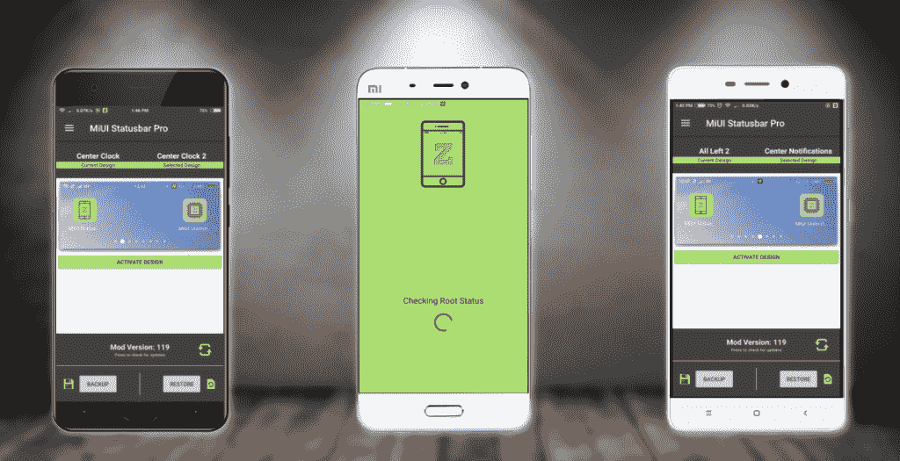

# 用 MIUI 状态栏 Pro [Root]自定义运行 MIUI 的小米手机的状态栏

> 原文：<https://www.xda-developers.com/customize-status-bar-xiaomi-miui-status-bar-pro-root/>

除了小米 A1 之外，所有小米手机都运行智能手机制造商内部的 MIUI Android 皮肤。它于 2010 年发布，不仅成为小米设备的一个与众不同的功能，也是 Android 上最受欢迎的自定义用户界面之一。

尽管 MIUI 也有它的问题，但它是一个设计良好的 ROM，具有许多自定义功能。它在用户界面元素方面与 AOSP 有所不同，比如状态栏、最近的应用列表等等，但关键的是，从整体上来看，增加的功能弥补了任何缺点。一些你在 Android 中找不到的 MIUI 功能包括在状态栏中显示网络速度图标的能力，双应用程序，导航快捷方式等等。它还针对印度等国家进行了本地化，最近[在处理通知方面获得了与普通 Android 相当的功能](https://www.xda-developers.com/miui-9-global-developer-rom-notifications-fix/)。

 <picture></picture> 

Source: zapperbyte

一些第三方应用程序甚至增加了更多的定制功能。一个这样的应用是 MIUI 状态栏专业版，一个由 XDA 初级成员 [zapperbyte](https://www.google.com/search?q=zapperbyte+xda&oq=zapperbyte+xda&aqs=chrome..69i57.947j0j9&sourceid=chrome&ie=UTF-8) *创建的应用。*它允许你改变手机状态栏的样式，有十种不同的设计，包括居中时钟、向左倾斜的状态栏图标布局、居中通知等等。它提供了很大的自由度——例如，你可以选择将通知图标移到状态栏的右边，而将时钟和系统图标移到左边。

MIUI 状态栏 Pro 还可以创建和恢复 MiuiSystemUI.apk 的备份，开发者指出，它也适用于运行 MIUI 的非小米设备。需要 root，只能安装在 MIUI 固件上。但是，它不需要[exposed](https://www.xda-developers.com/xposed-installer-v3-15-android-oreo-fixes/)框架。

MIUI 状态栏 Pro 可在源码链接下载。

* * *

[**XDA 论坛贴吧 MIUI 状态栏 Pro**](https://forum.xda-developers.com/android/apps-games/app-miui-statusbar-pro-t3712378)