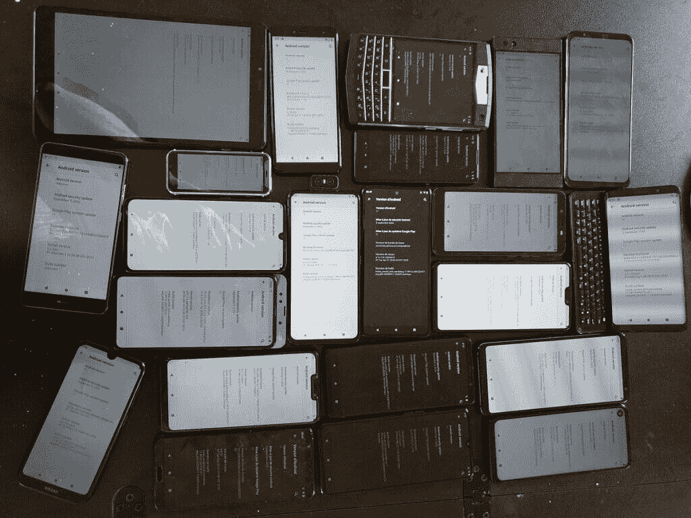

# 开发者在 22 台旧设备上启动 Android 11，这是一个三重 GSI 项目

> 原文：<https://www.xda-developers.com/developer-boots-android-11-22-older-devices-project-treble-gsi/>

在兼容的 Android 设备上启动通用的、基于 AOSP 的系统映像的能力无疑是 Project Treble 的最佳成果之一。自 Android 8.0 Oreo 发布以来，寻求谷歌认证的制造商需要通过启动这个**通用系统映像** (GSI)来测试他们的设备是否符合 Treble 标准，并验证基本的硬件功能。Treble 要求使用 Android Oreo 和更高版本启动的设备将供应商实现(如操作系统用于与底层硬件通信的软件 HALs)与 Android 操作系统框架分开，这就是为什么理论上可以在传统设备上引导最新版本的 Android ，而无需修改引导或供应商映像。

然而，现实并非如此简单。谷歌通过全面实施 **VNDK** (供应商原生开发套件)和引入 **CTS-on-GSI** (通用系统映像兼容性测试套件)测试，进一步完善了 Project Treble 对 Android 8.1 Oreo 和 Android 9 Pie 的要求。如今，Android 8.x 设备甚至没有被官方认为是兼容 Project Treble 的，因为谷歌只关注与 Android Pie 及以上版本的兼容性。当我们谈论像华为 Mate 9 或 OnePlus 5/5T 这样的设备时，它们最初与 Android Nougat 一起推出，随后[通过](https://www.xda-developers.com/stock-android-oreo-huawei-mate-9-project-treble/)[系统软件更新](https://www.xda-developers.com/oneplus-5t-project-treble-oxygenos-beta/)获得了三重支持，你不能简单地在它们身上闪现[谷歌版本的 Android 11 GSIs](https://developer.android.com/topic/generic-system-image/releases) ，并期望它启动时一切正常。

在这个阶段，从我们的论坛中找到一个特定于设备的 Android 11 定制 ROM 听起来可能是一个更好的提议，但 XDA 认可的开发者 [phhusson](https://forum.xda-developers.com/member.php?u=1915408) 正试图从不同的角度解决这种情况。代替[修改原始供应商图像](https://www.xda-developers.com/developers-project-treble-samsung-galaxy-exynos-7870/)，开发者已经通过合并设备特定的修复成功地调整了谷歌的 Android 11 GSIs。由此产生的 GSI 构建的**应该可以在任何支持 Project Treble** 的 Android 设备上启动，这意味着大多数设备都使用 Android 8.0+。

 <picture></picture> 

Unofficial Android 11 GSI running on 22 different Android devices. Thanks to phhusson for the photo!

下面你可以找到 [phhusson 成功启动](https://twitter.com/phhusson/status/1308299188153643008)他的定制 Android 11 GSI 的设备:

如果你是那种喜欢生活在风口浪尖的人，那么你会很高兴地知道，phhusson 基于 Android 11 自行编译的定制 GSI“Phh-Treble”的第一个预发布版本现已上市。在闪烁之前，您应该使用下面链接的 Treble Info 应用程序来确定您的设备型号。之后，从项目的 [GitHub 发布页面](https://github.com/phhusson/treble_experimentations/releases)获取适当的版本，并在这里学习如何刷新 GSI [。](https://www.xda-developers.com/flash-generic-system-image-project-treble-device/)

**[下载 Phh-Treble v300.a(基于 AOSP 11.0)](https://github.com/phhusson/treble_experimentations/releases/tag/v300.a)**

由于这是第一个 alpha 版本，许多硬件特性和软件组件在这个 GSI 中都被破坏了。如果您遇到任何问题，您可以在这里报告它们[。尽管如此，很高兴看到模块化的 Android 操作系统](https://forms.gle/ytvzQEF8x2x9tzSK7)[如何使制造商更容易推送软件更新](https://www.xda-developers.com/google-project-treble-improved-os-android-adoption/)，这反过来帮助第三方开发者延长旧设备的有效寿命。如果更多的原始设备制造商开始跟随[三星在操作系统更新方面的脚步](https://www.xda-developers.com/samsung-3-years-android-os-updates-galaxy-note-20/)并继续更新底层供应商界面，整个 Android 生态系统应该会在不久的将来看到良好的回报。

[app box Google play " tk . hack 5 . treble check "]