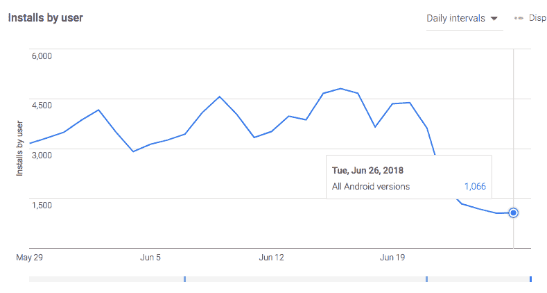

# 在 Play Store 算法改变后，开发者面临着新安装的巨大下降

> 原文：<https://www.xda-developers.com/developers-huge-drop-new-installs-play-store-algorithm-changes/>

一些 Android 应用和游戏开发商正在恐慌，因为他们的日安装率在过去一周内大幅下降。这些开发者[已经注意到](https://www.reddit.com/r/androiddev/comments/8ubsre/significant_drop_in_downloads_since_june_20_many/)新下载速度降低了 90%。受影响的开发人员很快意识到，他们并不是唯一一个日常应用安装率发生变化的人，他们在 [Reddit](https://www.reddit.com/r/androiddev/comments/8t8u7z/my_app_is_suddenly_dying_on_the_play_store/) 上发布了[多个](https://www.reddit.com/r/androiddev/comments/8tp666/sudden_decrease_in_organic_downloads/) [线程](https://www.reddit.com/r/androiddev/comments/8tgzhj/drastic_drop_in_downloads_in_all_of_my_apps/) [，在](https://www.reddit.com/r/androiddev/comments/8t935n/huge_drop_in_downloads_over_the_past_48_hours/) [Unity 论坛上发布了一篇帖子](https://forum.unity.com/threads/sudden-drop-in-number-of-daily-installs-on-google-play-store.537467/)，甚至还有一篇 [Gamasutra 社区博客帖子](https://www.gamasutra.com/blogs/VladChetrusca/20180626/320734/Thousands_of_indie_android_devs_on_the_brink_of_extinction_after_Play_store_changes_visibility_algorithm_rules.php)弹出来帮助传播出了问题。显然，这里出了问题，一些独立开发者担心他们的生计可能受到威胁。这是怎么回事？

* * *

## Play Store 的算法悄然改变，削弱了一些应用的排名

似乎在上周的某个时候，谷歌调整了 Play Store 决定应用发现的算法。当我们就此事联系谷歌时，我们被告知谷歌正在定期评估新的方法来改善 Play Store 的排名算法，以促进高质量的应用程序。我们想强调的是，没有证据表明谷歌正在改变算法，故意伤害独立开发者，以支持大牌应用(尽管有很多猜测)。这些变化旨在改善用户和开发者的体验。

我们没有关于算法是如何改变的任何细节(这是有意义的，因为披露这些信息会给某些开发者带来不公平的优势)，但很明显，这些变化对一些独立开发者产生了重大影响。

这只是许多例子中的一个:

 <picture></picture> 

PickCrafter daily installation statistics

上面显示的截图来自一款名为“PickCrafter”的游戏的开发者控制台统计数据。开发者友好地与我们分享了他们的 Play Store 安装标准来证明这个问题。如你所见，这款应用的日安装量一直徘徊在 3000-4500 次左右，直到上周才降至 1000 次。

无论如何，这位开发者并不孤单。我们已经在一个专门的 Discord group [上听到了许多来自独立开发者的轶事。他们都告诉我们同样的故事——从上周开始，他们的应用程序的日安装量大幅下降，此后一直没有恢复。虽然大多数受影响的应用程序似乎是 Android 游戏，但几个非游戏应用程序也受到了影响。我们不知道有多少游戏和非游戏受到影响。](https://discord.gg/5Hny2Xy)

以下是一些开发者被算法变化打击有多严重的简要总结:

*   开发者 peanutbutterlabs 报告称，他们的日下载量从平均每天 80000 次下降到 5000 次。
*   开发者 Butterbean21 报告称，他们的顶级应用程序下降了 80%。
*   开发商 Jenzo83 报告说他们的游戏下降了 80-90%。
*   开发商 snoutup 报告称，他们的费率“仅”下降了 **70%** 。
*   开发者 llliorrr 报告称，他们 30 款应用中的 28 款下降了 80%。
*   开发商 AxPetre 报告安装率从 **12，000/天下降到**5，000/天。
*   开发者 slothinspace 报告下载量从**1500+下降到 100+** 。
*   开发商 janikkk 报告说**下降了 80%**。
*   开发商 zenderfile 报告从 **12，000/天下降到**1，500/天。
*   开发商 livenets 报告从 **32，000/天下降到**4，000/天。

这里有一些额外的截图，显示安装数量大幅下降，感谢 Redditor [alpha724](https://www.reddit.com/user/alpha724) 。

不管怎样， *XDA 开发者*自己的[导航手势](https://play.google.com/store/apps/details?id=com.xda.nobar)应用没有受到这些变化的影响。然而，我们很幸运，因为我们将能够在影响我们排名的算法变化中幸存下来——毕竟，我们在门户网站、我们的 [YouTube 频道](https://www.youtube.com/user/xdadevelopers/videos)、我们的 [Twitter 账户](https://twitter.com/xdadevelopers)等方面拥有强大的追随者，我们可以通过它们来推广应用。依靠 Play Store 有机增长的独立开发者如果不在广告上花费大量收入，就无法接触到这样的受众，因此这些受影响的开发者担心这些变化可能会损害他们应用的成功。依靠广告浏览量获取收入的开发商尤其关注这些变化，因为他们的收入直接取决于他们获得的广告印象数量。

## 是什么导致了这些数量的急剧下降？

Unity 论坛上的开发者已经排除了这些变化背后的几种可能性，包括 Play 开发者控制台上报告的不准确安装，通过 Android vitals、搜索排名、夏季考试和 FIFA 世界杯确定的问题。已确定的问题背后的一个可能原因(我们可以确认)是应用的类别、描述和内容与“相似应用”面板上显示的应用不匹配。正如你在下面看到的，一个名为“儿童收银机杂货店免费”的游戏有一个相当奇怪的“相似”的应用程序分类。

同样，另一个问题似乎是某些国家的桌面用户无法加载某些类别。例如，我和其他几个在美国和加拿大的人在桌面谷歌浏览器上浏览谷歌 Play 商店时，无法加载“[赌场游戏](https://play.google.com/store/apps/category/GAME_CASINO)”类别。然而，该类别确实可以在移动设备上适当加载，并且可以从 Chromebook 访问 Play Store。**我们怀疑这个特殊的问题是导致开发者数量下降的主要原因**，但这肯定是一种可能性。

## 开发人员可以采取什么行动

我们不知道这些变化是否是永久性的。无论如何，这对独立开发者来说应该是一个清晰的警钟，Play Store 排名算法的任何微小变化都可能严重影响你的应用程序的成功。开发者被鼓励主动提高他们应用的质量。谷歌已经在 Android 开发者博客和 T2 质量指南文档页面上发布了如何做到这一点的建议。如果谷歌再次调整算法或就此事发表公开声明，我们一定会让你们都知道。