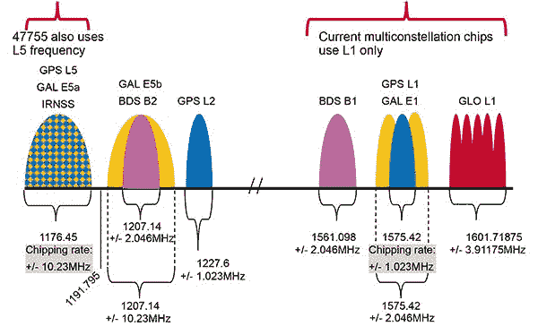

# 双频全球导航卫星系统-一个重要的定位功能，你的手机可能会失踪

> 原文：<https://www.xda-developers.com/dual-frequency-gnss-important-location-feature-your-phone-probably-missing/>

这不是你经常想到的，但定位服务可能是你智能手机上最常用的功能之一。从 Pokémon GO 到 Snapchat，许多应用程序都依赖于您的位置来个性化您的体验，并为您提供更多功能。当然，这不仅仅是偶然的应用使用。当你在大城市里开车寻找停车位时，准确的位置就是一切。不幸的是，对于绝大多数现代设备来说，精确的位置并不是你能 100%确定的。

## 单频与双频 GNSS

您的手机通过收听来自外层空间卫星或全球卫星导航系统(GNSS)的无线电信号来确定其位置。当今智能手机市场的标准是单频 GNSS。从本质上说，这意味着你的智能手机跟踪来自每颗卫星的单一无线电信号。然而，单频 GNSS 容易产生多径误差。当信号被大型物体(如建筑物)反射时，会产生多径误差，导致多个“回波”信号到达设备。这可能导致大约 5 米的误差。在现实世界中，这意味着在大城市，你的地图应用程序可能无法准确地告诉你在哪条街上。虽然质量更好的天线可能更准确，但由于多径误差，您的手机在建筑物密集区报告不正确的位置是很常见的。

那么双频 GNSS 如何纠正这个问题呢？简短的回答是两个比一个好。设备不再仅仅依靠一个信号来确定你的位置，而是跟踪来自每个卫星的多个信号，每个信号都在不同的无线电频率上。对于拥有 GPS 系统的美国人来说，这些频率被称为 L1 和 L5。对于拥有伽利略卫星的欧洲人来说，这些频率被称为 E1 和 E5a。虽然大多数当前设备仅使用 L1/E1 频率，但双频使能设备同时使用两者。L5/E5a 信号更先进，因此不容易出现多径误差。它们可以用来将位置精度精确到 30 厘米(之前提到的 5 米)。

 <picture></picture> 

Broadcom BCM47755 via [GPSWorld](https://www.gpsworld.com/broadcom-launches-dual-frequency-gnss-receiver-for-mass-market/)

双频全球导航卫星系统并不是什么新技术。早在 2017 年 8 月，Android 8.0 Oreo 就添加了对它的支持。博通紧随其后于 2017 年 9 月推出了一款双频芯片 BCM47755。博通表示，其 BCM47755 将出现在 2018 年的智能手机中，但从未详细说明具体是哪些智能手机。2018 年底[透露，小米终于兑现了博通的承诺，推出了小米 8。然而，其他供应商却迟迟没有加入这一行列。三星的最新产品](https://www.xda-developers.com/xiaomi-mi-8-mi-8-explorer-edition-mi-8-se-china-launch/) [Galaxy S10 系列](https://www.xda-developers.com/samsung-galaxy-s10-s10-and-s10e-launch-with-the-snapdragon-855-ultrasonic-in-display-fingerprint-scanners-reverse-wireless-charging-and-a-whole-lot-more/)没有双频 GNSS——至少 Exynos 版本没有。目前，[华为](https://www.xda-developers.com/hisilicon-kirin-980-honor-magic-2-huawei-mate-20-pro/)和小米是仅有的两家官方宣称智能手机支持双频的知名厂商。但是，小米是唯一一家在第三方应用中使用双频 GNSS 的供应商。

那么，为什么双频 GNSS 是如此小众的功能呢？最有可能的答案是成本。双频芯片目前还不常见，所以制造商可能很难得到它们。另一个可能的解释是，供应商根本不认为它是一个重要的功能。总的来说，5 米以内的精度足以满足日常使用。也就是说，仍有许多群体将从更高的准确性中受益。例如，首先映入脑海的是慢跑者和徒步旅行者。在一段时间内，5 米的误差会累积起来，形成明显的距离差异，这可能会导致慢跑者认为他们比实际跑得更远。

## 我的手机支持双频 GNSS 吗？

目前很少有手机支持双频，所以最有可能的答案是否定的。有大量的应用程序可以帮助你确定你的设备是否支持双频 GNSS。我们推荐的是 barbeauDev 的 GPSTest，在 [GitHub](https://github.com/barbeau/gpstest) 上有，还有 Google Play。你所要做的就是加载应用程序(最好是在外面)，让它锁定你的位置，然后检查 CF 栏，看看是否有 L5 或 E5a 读数。

GPSTest 应用程序的开发人员 Sean Barbeau 在 [Medium](https://medium.com/@sjbarbeau/dual-frequency-gnss-on-android-devices-152b8826e1c) 上维护了一份最新的受支持设备列表。那里有许多设备的详细分析。

## 目前有哪些手机支持双频 GNSS？

目前，小米 8 和小米 9 是唯一官方声称支持双频的设备。双频的使用已通过第三方应用程序确认。对于华为 Mate 20 X、华为 Mate 20 RS、华为 Mate 20 Pro 和华为 Mate 20，这些设备被列为支持双频 GNSS，但由于不支持第三方应用程序使用的一些 GNSS Android APIs，双频 GNSS 的使用无法通过第三方应用程序确认。三星 Galaxy S10 的香港骁龙 855 版本似乎也支持它，基于第三方应用程序，但这是非正式的，因为三星没有在该设备的官方规格中列出支持。我们向三星寻求澄清，但截至发稿时尚未收到回复。

下面是一个流行手机的列表，详细说明了它们是否支持双频 GNSS，以及它们支持哪些全球系统。Google [维护着一个支持原始 GNSS 测量的设备列表](https://developer.android.com/guide/topics/sensors/gnss#supported-devices)，这是下表的基础。

| 模型 | 双频支持 | 全球系统 |
| 基本电话 | 不 | gpsg 1371 |
| 谷歌 Nexus 6P | 不 | 全球（卫星）定位系统 |
| 谷歌 Nexus 5X | 不 | 全球（卫星）定位系统 |
| 谷歌 Nexus 9(无线网络) | 不 | gpsg 1371 |
| 谷歌像素 XL | 不 | 全球（卫星）定位系统 |
| 谷歌像素 | 不 | 全球（卫星）定位系统 |
| 谷歌像素 2 XL | 不 | gpsglonassgalileobeidouqzss |
| 谷歌像素 2 | 不 | gpsglonassgalileobeidouqzss |
| 谷歌 Pixel 3 XL | 不 | gpsglonassgalileobeidou |
| 谷歌像素 3 | 不 | gpsglonassgalileobeidou |
| HTC U11 | 不 | gpsg 1371 |
| HTC U11+ | 不 | gpsg 1371 |
| HTC U11 生活 | 不 | gpsg 1371 |
| 华为荣耀 8 | 不 | GPSGLONASSBeiDou 北斗 |
| 华为 Honor 9 | 不 | gpsg 1371 |
| 华为 Mate 9 | 不 | GPSGLONASSBeiDou 北斗 |
| 华为 Mate 10 | 不 | gpsg 1371 |
| 华为 Mate 10 Pro | 不 | gpsglonassqzss |
| 华为 Mate 20 X | 是 | gpsglonassgalileoqzss |
| 华为 Mate 20 RS(保时捷设计) | 是 | gpsglonassgalileobeidou |
| 华为 Mate 20 Pro | 是 | gpsglonassgalileobeidou |
| 华为 Mate 20 | 是 | gpsglonassgalileobeidou |
| 华为 Mate RS(保时捷设计) | 不 | gpsg 1371 |
| 华为 P9 公司 | 不 | GPSGLONASSBeiDou 北斗 |
| 华为 P10 | 不 | gpsglonassgalileobeidouqzss |
| 华为 P10 Lite | 不 | 全球（卫星）定位系统 |
| 华为 P20 | 不 | gpsglonassqzss |
| LG V30 | 不 | gpsg 1371 |
| LG G7 薄 q | 不 | gpsg 1371 |
| LG V40 智思 | 不 | gpsglonassqzss |
| 摩托罗拉摩托 X4 2017 款 | 不 | gpsg 1371 |
| 摩托罗拉摩托 Z2 | 不 | gpsg 1371 |
| 一加 6T | 不 | gpsglonassqzss |
| OPPO R1 | 不 | gpsglonassgalileobeidou |
| OPPO R1 | 不 | gpsglonassgalileobeidou |
| OPPO R15 Pro | 不 | gpsglonassgalileobeidou |
| 三星 Galaxy S8 (Exynos) | 不 | gpsglonassgalileobeidouqzss |
| 三星 Galaxy S8(高通) | 不 | 全球（卫星）定位系统 |
| 三星 Galaxy Note 8 (Exynos) | 不 | gpsglonassgalileobeidou |
| 三星 Galaxy Note 8(高通) | 不 | gpsglonassgalileobeidou |
| 三星 Galaxy S9 (Exynos) | 不 | gpsglonassqzss |
| 三星 Galaxy S9+ | 不 | gpsg 1371 |
| 三星 Galaxy Note 9 | 不 | gpsglonassqzsssbas |
| 索尼 Xperia XZ1 | 不 | gpsglonassgalileobeidou |
| 索尼 Xperia XZ2 | 不 | gpsglonassqzss |
| 维生 X21 | 不 | GPSGLONASSBeiDou 北斗 |
| 小米 Mi 8 | 是 | gpsglonassgalileobeidouqzss |
| 小米 Mi Mix 2S | 不 | gpsg 基地 |

然而，小米显然将双频 GNSS 视为一项有价值的投资。在它最初被包含在 Mi 8 中之后，小米还将其带到了 [Mi 9](https://www.xda-developers.com/xiaomi-mi-9-specifications-launch/) 中，所以看起来它现在不会去任何地方。

## 结论

双频 GNSS 对每个供应商来说都是现成的，但是他们采用它的速度非常慢。虽然原因还不清楚，但很可能我们可以指出成本是一个影响因素。小米目前处于领先地位，但其他主要供应商是否会加入这一行列还有待观察。

双频全球导航卫星系统在多路径误差是一个常见问题的大城市被证明是绝对重要的。随着欧洲伽利略卫星星座接近完成，现在是各公司开始认真研究双频 GNSS 的最佳时机。