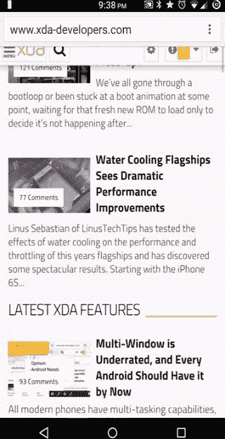

# 使用脚本启用单手模式

> 原文：<https://www.xda-developers.com/enable-one-handed-mode-using-a-script/>

**越大并不总是越好**

随着更大的手机屏幕的出现，对于大多数人来说，只用一只手接触手机的每个角落几乎是不可能的(除非你是勒布朗·詹姆斯)。然而，像 Note 系列这样的大手机仍然非常受欢迎，因为它们在观看视频和网络内容时非常舒适。一些制造商认识到，他们的客户经常会面临只用一只手使用手机的情况，因此他们内置了“单手模式”选项，可以随时调整显示屏的内容。例如，Galaxy Note 手机有一个将屏幕缩小到一个角落的设置，苹果最近推出了他们自己的解决方案，名为“可达性”，可以将屏幕内容缩小到显示屏的一半。但对于 Nexus 6 这样的手机，你没有任何股票期权来启用单手模式。

**过扫描补偿**

幸运的是，我们可以利用一个通常根本不应该用于手机显示屏的功能。这就是所谓的“过扫描”校正。为了始终为电视观众呈现全屏体验，许多电视可能会剪切输入显示的边缘，从而导致过扫描。因此，为了在 Android 中纠正这一点，谷歌允许 API 级别为 18 的开发者(Android 4.3 Jelly Bean)开始使用过扫描边距来补偿显示不匹配。谷歌还改变了一些显示选项，如分辨率/DPI，从“am”shell 命令(ActivityManager)改为“WM”shell 命令(WindowManager)，并引入了“overscan”命令，使开发人员能够轻松地在他们的设备上测试他们的应用程序。

 <picture></picture> 

One-Handed Mode Demonstration

**要求**

*   ****你必须扎根。****
*   **必须是安卓 4.3+**
*   **请注意，这种情况会在重启时持续存在。不要将以下任何值** **设置得太高，否则您无法充分操作您的设备。如果搞砸了，可以用 adb 执行 reset 命令。**
*   你可以选择使用自动化应用程序，比如 Tasker，将 shell 命令绑定到一个动作上，比如在 home 键上向上滑动或者左右摇动，但这是强烈推荐的。

以下是您需要的命令。

`    wm overscan LEFT,TOP,RIGHT,BOTTOM`

其中每个方向是像素计数，表示显示器应该从该方向移动多远。例如，如果将 TOP 设置为 600，屏幕内容将向下移动 600 像素。您可以尝试每种方法的组合，以找到一组最适合您的缩小屏幕的值。你可以模仿苹果的可达性，例如将顶部设置为垂直分辨率的一半。要重置过扫描，只需使用:

`    wm overscan reset`

相当简单！它可以很好地将屏幕缩小到一个按钮，但我个人对它有一些谷歌键盘问题。试试看，如果你发现任何问题，请在评论中告诉我们！