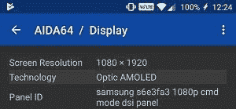

# 在 OnePlus 3T 上启用 OnePlus 5 的 DCI-P3 宽色域模式

> 原文：<https://www.xda-developers.com/enable-oneplus5-dci-p3-color-mode-oneplus3t/>

距离一加正式发布其最新旗舰智能手机 OnePlus 5 已经过去了一周多一点的时间。该设备目前是市场上[最强大的安卓智能手机](https://www.xda-developers.com/oneplus-5-xda-first-impressions-upgrade/)，配备升级的 Snapdragon 835 SoC、8gb 内存和带双通道 ROM 的 UFS 2.1。但与它的前辈 OnePlus 3T 相比，OnePlus 5 的显示屏在表面上似乎没有明显的改善。这两款设备都采用了 5.5 英寸 1080p AMOLED 显示屏，分辨率约为 401ppi，但在默认情况下，OnePlus 5 采用了 DCI-P3 宽色域，这与 4K 超高清电视和数字影院中的色域相同。

除了 OnePlus 5，还有其他支持 DCI-P3 的智能手机，如 LG 旗舰设备(虽然很明显，[不是很准确](http://www.anandtech.com/show/10286/the-97-ipad-pro-review/4))、现已停产的三星 Galaxy Note 7、三星 Galaxy S8/S8+和 iPhone 7。然而，似乎有另一款智能手机可能支持 DCI-P3 宽色域-**OnePlus 3T**。在 OnePlus 5 正式公布后不久，人们发现 OnePlus 5 中发现的显示器型号实际上与 OnePlus 3T 中发现的显示器相同。特别是，Roland Quandt (@rquandt)使用 [AIDA64](https://play.google.com/store/apps/details?id=com.finalwire.aida64&hl=en) 发现 [OnePlus 5 使用三星 S6E3FA5](https://twitter.com/rquandt/status/877335126463492098) 显示屏(作为参考，OnePlus 3T 设备采用前述三星 S6E3FA5 或 S6E3FA3 显示屏)。

这一发现让事情有了转机，几名中国一加用户开始挖掘位于/sys 目录中的内核相关文件，看看他们是否能找到一种方法在 OnePlus 3T 上启用 DCI-P3。果然，`/sys/devices/virtual/graphics/fb0`目录中有 3 个文件，可以通过修改来改变屏幕模式。这些文件如下:

*   `/sys/devices/virtual/graphics/fb0/SRGB`
*   `/sys/devices/virtual/graphics/fb0/Adobe_RBG`
*   `/sys/devices/virtual/graphics/fb0/DCI_P3`

通过将值“1”写入 DCI_P3 文件(该文件**需要 root 访问权限**)，可以在 OnePlus 3T 上启用**色彩模式。经过[在](http://oneplusbbs.com/forum.php?mod=viewthread&tid=3517298&extra=page%3D1&mobile=2)[一加论坛](http://www.oneplusbbs.com/thread-3514596-1-3.html)上多[讨论](http://www.oneplusbbs.com/thread-3514252-1-1.html)后，发现这一招**只在配有三星 S6E3FA5** 显示屏的 OnePlus 3T 设备上有效。如果你的 OnePlus 3T 是 rooted 的，并且有正确的显示模式，那么你现在就可以启用 OnePlus 5 的出色显示模式。**

* * *

### 为 OnePlus 3T 启用 DCI-P3

*感谢 XDA 会员 [soccerwuedo5](https://forum.xda-developers.com/member.php?u=4232718) 记录了在中国一加论坛上的发现，并[为我们的论坛](https://forum.xda-developers.com/oneplus-3t/how-to/enable-dci-p3-op3t-s6e3fa5-display-panel-t3628783)写了一篇教程！*

下面是启用这种色域模式的一系列分步说明。请注意，这只适用于**根电话**:

1.  请验证您的显示面板是否兼容。安装 [AIDA64](https://play.google.com/store/apps/details?id=com.finalwire.aida64&hl=en) 并检查显示- >面板 ID。如果它显示“三星 s6e3fa **5** 1080p cmd 模式 dsi 面板”，那么您的设备的显示器与该模式兼容。<picture></picture>

    AIDA 64 面板 ID 值为 OnePlus 3T。注意:这是不正确的型号。(演职员表: [soccerwuedo5](https://forum.xda-developers.com/member.php?u=4232718) )。

    *   或者，你可以下载一个文件浏览器，比如 [MiXplorer](https://forum.xda-developers.com/showthread.php?t=1523691) ，然后浏览到`/sys/devices/virtual/graphics/fb0`目录。如果您看到一个“DCI-P3”文件，那么您的型号是兼容的。
2.  在你的手机上安装[终端模拟器](https://play.google.com/store/apps/details?id=jackpal.androidterm)，输入以下两条命令:

```
 su
echo 1 > /sys/devices/virtual/graphics/fb0/DCI_P3 
```

更改将立即生效，但设置中的屏幕模式不会更新以反映此更改。此外，如果重新启动设备，校准将恢复到“默认”状态。如果您想立即恢复这些更改，可以输入以下命令:

```
 su
echo 0 > /sys/devices/virtual/graphics/fb0/DCI_P3 
```

如果你正在寻找一种方式让这种改变在重启后持续，你可以使用自动化软件，如 Tasker，创建一个 init.d 脚本，或者使用这个由 XDA 资深成员 [doubleaykay](https://forum.xda-developers.com/member.php?u=5535848) 创建的 [Magisk 模块](https://forum.xda-developers.com/showpost.php?p=72842349&postcount=11)。

* * *

### 效果如何？

启用后，屏幕质量会立即出现明显的变化。当将校准模式更改为 DCI-P3 时，会有明显的饱和度损失，无论您启用了什么屏幕模式，这种变化都是显而易见的，这表明配置文件不同于默认或 sRGB 模式。尽管在我们自己的主观比较中，Mario Serrafero 指出，与 OnePlus 5 的 DCI-P3 相比，在 OnePlus 3T 上启用 DCI-P3 不会产生相同的显示效果。值得注意的是，OnePlus 3T 上的黄色和蓝色似乎更加饱和，而且它们在温度上也略有不同。虽然非官方的显示校准模式变化*并不完全符合*OnePlus 5 上的任何可用模式，但它似乎是最接近 DCI-P3 的*。更深入的显示分析可以准确地确定差异是什么，以及这个新的颜色配置文件有多准确。*

总的来说，我们肯定觉得修改绝对值得做，如果只是尝试一下，看看你是否喜欢不同的显示配置文件。

* * *

### P3 总督察是被故意禁用的吗？

据 OnePlusBBS 论坛上的用户称，在 OnePlus 3T 上启用 DCI-P3 的首选项在设置应用程序中是隐藏的。显然，有一个“OPScreenColorMode.java”文件包含一行从设置中删除首选项的内容。

通过编辑这一行，重新编译 APK，并将更新的系统文件推送到设备，偏好设置确实在设置应用程序中可用。

有趣的是，XDA 成员 [soccerwuedo5](https://forum.xda-developers.com/member.php?u=4232718) 自己做了一些调查，发现[引用了 display_settings.xml 中一个名为“OPReadingMode”](https://forum.xda-developers.com/showpost.php?p=72841732&postcount=9)的禁用设置片段，该片段可能控制了 OnePlus 5 上的新阅读模式功能。

```
 <PreferenceScreen android:title="@string/oneplus_night_mode_enabled_op" android:key="oneplus_night_mode" android:fragment="com.oneplus.settings.better.OPNightMode" />
<PreferenceScreen android:title="@string/oneplus_reading_mode" android:key="oneplus_reading_mode" android:fragment="com.oneplus.settings.better.OPReadingMode" />
<PreferenceScreen android:title="@string/oneplus_screen_color_mode_title" android:key="screen_color_mode" android:fragment="com.oneplus.settings.better.OPScreenColorMode" /> 
```

这并不意外，尽管一加一再声称，阅读模式利用不同的环境传感器，不仅可以读取环境光强度，还可以读取色调，因此该功能只在 OnePlus 5 上提供是有意义的。这个字符串的存在确实表明，该功能可能会在未来的 OxygenOS 版本中添加到 OnePlus 3T 中，如果不是因为我们论坛上的修改者而更早，但如果有硬件在发挥作用，它的性能可能会与 OnePlus 5 不同。

* * *

### 结论

我们不能代表一加解释为什么在 OnePlus 3T 上可以进行这种显示校准修改，但我们已经联系了该公司，当我们收到回复时会更新我们的读者。与此同时，对于任何根深蒂固的 OnePlus 3T 用户来说，如果你的显示器兼容，一定要尝试一下这种修改。