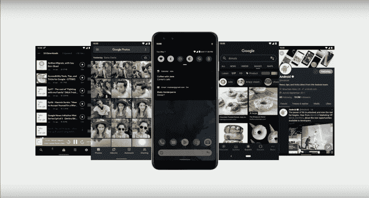
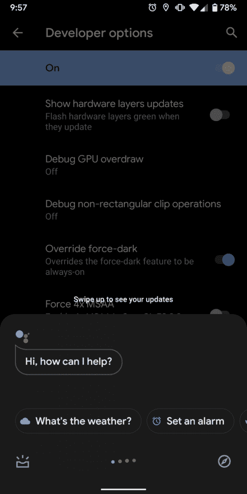
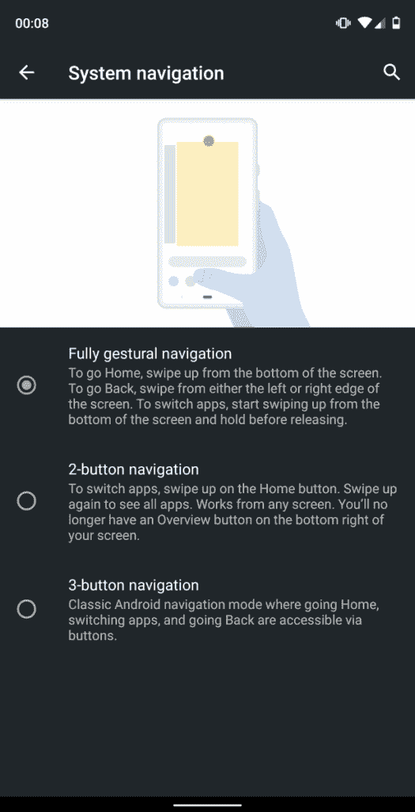

# 谷歌 Pixel 在 Android Q Beta 3 中的所有新功能

> 原文：<https://www.xda-developers.com/everything-new-android-q-beta-3/>

Google I/O 已经正式启动，正如我们所期待的，Android Q 的新测试版已经发布。按照他们通常的每月日程，也正好赶上谷歌在主题演讲中向公众宣布其一些主要功能。Android Q 在很大程度上是对 Android Pie 的改进，但随着它在过去几个测试版中逐渐成形。我们已经看到了新的功能，一些已知的功能已经开始形成，使它有别于 Android Pie。

Android Q 的第三个测试版大约在第二个测试版发布后一个月发布，看起来更像是我们将在今年晚些时候看到的成品，但很明显，在它能够到达最终用户手中之前，还需要做一些工作。它带来了一大堆的变化，其中很多是受我们之前所见的启发，今天，我们来回顾其中的一些。

我们还[制作了一个视频](https://www.youtube.com/watch?v=AfiYQgJ5r_c)涵盖了大部分这些变化，如果你喜欢视频格式的话。

* * *

### 黑暗模式(正式)在这里

当我们在年初第一次接触到一个泄露的 Android Q alpha 版本时，我们注意到谷歌已经在工作了一段时间:[一个覆盖每个 UI 元素的全系统黑暗模式](https://www.xda-developers.com/android-q-dark-theme-desktop-mode-permission-revamp/)。这让我们许多人感到高兴，因为自从我们在 2015 年发布的第一批 Android 棉花糖测试版中瞥见这样的功能以来，用户一直期待这样的系统级黑暗模式能够出现在 Android 中。从那以后，谷歌一直在玩弄我们的心，包括在 Android Nougat betas 上的一个黑暗模式(并再次删除它)，在 Android Oreo 上引入一个(部分)黑暗模式，以及在几个谷歌应用程序上包括一个黑暗模式，包括 YouTube、Messages 等等。

 <picture></picture> 

Google's official slide for Android Q's dark mode.

这似乎只是为 Android Q 的新的全暗模式做准备，该模式包括通知、通知阴影、设置应用程序，甚至还有一些谷歌应用程序。这项功能在之前的 Android Q betas 中就有了，我们也非常全面地介绍了它，但它被隐藏起来，需要用户摆弄才能启用。不过，在 Beta 3 中，该功能已被正式宣布，用户不再需要经历奇怪的变通办法:只需从设置或快速设置切换中切换即可。

既然它被吹捧为 Android Q 的头条功能之一，这意味着我们终于可以看到一个官方全系统黑暗模式的 Android 版本，这已经是很多话要说了，因为这是我们很多人在过去几年一直期待的功能。

### 在第三方应用上强制使用黑暗模式

 <picture></picture> 

Google Assistant with forced dark mode

作为一个额外的奖励，你现在可以在没有黑暗模式的应用上强制使用黑暗主题。你可以进入**设置>系统>开发者选项>覆盖强制黑暗。这个开关出现在第一个 Android Q 泄露的 alpha 中，到目前为止，仍然不清楚它为什么被移除。但是，嘿，现在它回来了。**

### 导航(再次)改变

 <picture></picture> 

The new "fully gestural" navigation option on Android Q (Essential Phone).

谷歌希望在屏幕手势上全力以赴，以取代我们多年来一直使用的常见导航按钮。这是我们最初在 Android Pie 上通过引入基本的屏幕手势实现的，但在 Android Q 中，谷歌再次修改了这些屏幕手势，使它们更类似于你在 iPhone 上找到的那些手势。在上一个测试版中，我们看到谷歌正致力于推出一个类似 iPhone 的手柄/手势栏来代替他们目前的药丸，同时还取消了后退按钮。

在 beta 3 中，这看起来更完整了。手势手柄不再占用与常规导航栏相同的空间，用户能够享受从这些手势获得的额外屏幕空间。它仍然占用空间，但要少得多。

然而，它似乎仍然不能很好地工作，一些手势被...嗯，退一步说，有点问题。例如，后退需要从屏幕的左边缘或右边缘滑动，但目前它在侧边栏菜单等方面存在问题，嗯，它通常到处都有问题。还有一个手势可以调出 Google Assistant(从右下方滑动)，但是效果不是很好。

不过，你现在不一定要用这个。你仍然可以选择返回到旧的 Android 饼状图手势，或者如果你喜欢导航按钮，这个选项仍然存在。

总的来说，这是一个很好的改进，但在交付给消费者之前，它还需要一些时间来完善。不过，我们相当有信心，这些怪癖中的大部分将在最近的测试版中被消除。

### Pixel 3/Pixel 3 XL 的导航按钮

此外，最新的测试版带回了 Pixel 3 和 Pixel 3 XL 的导航按钮，这些按钮以前必须应对以前 Android Pie/Q 版本上的谷歌手势系统，因为手势导航是这些设备上唯一可用的导航选项。我们不知道这是谷歌的疏忽还是他们真的把它们带回来，但是，嘿，这是一个测试版，所以尽情享受吧。

### 打盹通知不见了

对某些人来说，这个可能有点难以下咽。回到 Android Oreo，谷歌为通知引入了一个“打盹”功能，这被证明是非常有用的:你可以将某些通知隐藏一段特定的时间，在这段时间(最多 2 小时)结束后，它们会立即弹出。您甚至可以使用这个休眠功能隐藏持续通知。随着第三个 Android Q 测试版的推出，这种情况不复存在。

取而代之的是通知的“打断”和“温和”模式。“Interruptive”就像你想的那样:通知显示在状态栏中，作为一个提醒通知，还会在你的铃声打开时发出噪音。“温和”模式几乎只是无声的通知:你会在拉下通知遮光板时看到这些通知，但你不会在状态栏或锁屏中看到它，它也不会发出声音/振动。

我个人认为，虽然这些都是很好的功能，但它们不足以保证删除一个完美工作的功能，在我看来，这甚至可能没有必要，因为它们并没有真正取代或实现打盹的目的。

### 振动强度选项

在**设置>可访问性**中找到的振动设置有新的环振动强度选项。如果你不想让你的手机在收到每一个通知时都嗡嗡作响，但是你想在电话响的时候有所感觉，这是很方便的。Android Pie 将铃声和通知结合在一起，但将它们分开更有意义。

### 改善数字福利(和新的家长控制)

数字福利是 Android Pie 最引人注目的功能之一。但这并不是因为它是操作系统的核心功能或类似的功能，而是因为它有点像一个支持性的附加功能，通过跟踪应用程序的使用时间和阻止大量使用你的手机来帮助用户克服智能手机成瘾。对于 Android Q，它获得了一种“专注模式”，允许你暂时禁用某些令人分心的应用程序。

例如，你可能想在工作或上课时禁用社交媒体应用程序，或者即使你正在看手机上的东西，也不想被打扰。你可以用它做很多事情，这是一个我迟早会用到的特性。

 <picture></picture> 

The new parental controls feature in Android Q.

此外，Android Q 正在获得一个新的“家长控制”功能，这正是我们想要的。父母可以控制孩子的手机，并设置就寝时间、每日限制等事项。它还具有“额外时间”等功能，孩子们可以向父母要求额外的时间来玩手机。考虑到越来越多的孩子每天都在使用智能手机，这可能会成为那些不希望自己的孩子对手机上瘾的父母的一个有用功能。

### 共享 WiFi 变得更好

现在，分享您的 WiFi 网络连接详细信息更加方便。在二维码下面，明文列出了您的 WiFi 密码。这使得向他人展示您的密码更加容易，即使他们没有二维码扫描仪。

### 决定何时关闭节电模式

电池节电器有一个新的选项，当它关闭时切换。我们以前可以选择它什么时候开启，但是现在你也可以决定它什么时候关闭。当电池电量达到 90%时，切换开关将允许电池节电模式自动关闭。

### 更多应用的智能回复

智能回复现在已经集成到 Android Q 的通知系统中。他们现在可以使用更多的应用程序。这一切都是由设备上的机器学习推动的。

### 通知渠道建议

Android Q Beta 2 增加了 WiFi 和蓝牙切换的建议。这些显示在设置的顶部。Beta 3 对此进行了扩展，提供了关于通知渠道的信息。将出现管理应用通知的建议，类似于您将看到的“继续查看这些通知”警告。

### 杂项变更

和往常一样，也有一些小的或轻微的变化，可能不值得一提。这些是:

*   对 AV1 视频编解码器的本机支持，允许在不损失质量的情况下降低文件大小。
*   导航栏中的旋转建议按钮已被移除，该按钮允许您在手机处于横向模式时快速点击它来旋转屏幕，而不自动旋转。
*   一个新的热量 API 将允许应用程序监控你的设备的温度，并相应地进行调节。
*   “关于手机”中的“Android 版本”部分现在说的是 10 而不是 Q，这证实了，正如所料，Android Q 将是 Android 10。不过，还没有确定任何代号或甜点名称。
*   每当一个应用程序在后台使用位置服务时，谷歌会推出位置使用提醒，通知会提醒你。
*   AOSP 官方也支持 5G，但考虑到 5G 网络将于今年开始推出，这是一个既定的事实。
*   内部版本号现在显示在展开的快速设置的左下角。
*   当一个应用程序已经在后台访问你的位置一段时间时，系统现在可以提醒你。
*   开发人员选项中有一个快速设置开关，可以启用它来禁用所有传感器。这包括摄像头、陀螺仪、气压计，甚至指纹扫描仪。

我们错过了什么吗？请在评论中告诉我们。