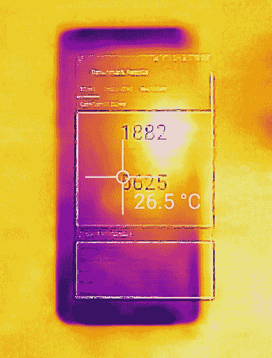
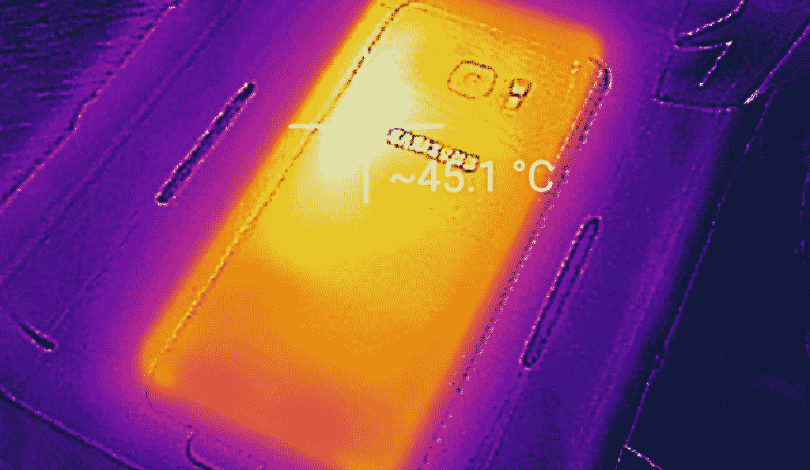

# Note 7 骁龙 820 对比 Exynos 8890 性能分析

> 原文：<https://www.xda-developers.com/exynos-8890-vs-snapdragon-820-note-7-performance-analysis-peaks-throttling-thermals/>

在典型的三星时尚中， [Note 7](http://forum.xda-developers.com/note-7) 带有两种不同的处理包，这意味着用户再次怀疑他们是否从两者中获得了“最好”的旗舰产品。我们也想知道这两种变体是如何叠加在一起的。

[Exynos](http://www.xda-developers.com/tag/exynos) 和骁龙芯片组已经在三星旗舰机内部争夺了几年，在这段时间里，我们看到他们来回交易，当考虑到 *整个* 时，骁龙的战士通常会挤过三星自己的。2015 年，我们看到三星的 Exynos 旗舰产品取得了成功，7420 [的表现超过了](http://www.xda-developers.com/failed-potential-the-note5-xda-review/#performance)通常令人悲伤的 Snapdragon 810。今年，三星选择推出自己的核心设计——M1，而不是去年的 ARM 系统。与此同时，在 810 实验了 ARM 内核之后，高通又回到了 *【真人使用定制内核】* 的方式用上了新的 Kryo 设计。最重要的是，Adreno 530 不断推动移动图形性能的极限，现在正面临 Exynos 的 Mali-T880 MP12 (12 核变体)。

我们对这两款处理器进行了测试，SM-N930FD 的 Exynos 8890 和 N930T 的 Snapdragon 820，以便找出它们的相对地位。经过各种基准和耐用性测试的 300 多个数据点，我们相信我们已经对这些设备有了一些坚实的了解。在本文中，我们将更多地关注 Exynos 变体，因为我们还没有机会对 Exynos 8890 进行这种测试，但我们已经对 Snapdragon 820 设备上的功能、 [(包括 Galaxy S7 Edge](http://www.xda-developers.com/s7-edge-throttling-thermals-benchmark-stress-tests-of-sd820-810-808-exynos-7420/) )进行了大量性能分析。

我们还想强调以下几点: **这些测试并不代表真实世界的使用情况，而是处理器在压力下的能力和行为。** 为了最大限度地减少软件差异，我们禁用了几乎所有不重要的包和进程，以便在工厂重置后，这两种变体的结果不会受到第三方服务或膨胀软件的影响。我们试图控制的其他变量是温度(相同的起始温度)、室温和表面吸热，方法是在几乎相同的起始条件下进行所有测试。我们使用由红外温度计支持的 SEEK 和 FLIR 热感相机测量设备表面温度，因此考虑温度可能会有 1°C 的误差。最后，请记住，SKU 组之间和内部存在差异，我们在一组特定的条件下运行这些测试，这意味着您可能会在您的特定设备上获得与我们略有不同的结果。这不是一个终极测试，而是一个协作评估的开始。

* * *

### CPU - Kryo 对 M1

我们首先研究的是 CPU 性能。考虑到两个版本之间相同的存储和 RAM 配置，更全面的测试和更清晰的故障可以完成这项任务。然而，我们选择了新发布的 [Geekbench 4](https://play.google.com/store/apps/details?id=com.primatelabs.geekbench&hl=en) ，因为它的 [表现出色，这是因为与 SPEC 相比，它的准确性](http://www.xda-developers.com/geekbench-4-how-the-processor-ranking-changed-under-the-new-more-accurate-benchmark/) ，还因为它更好地代表了真实世界的 CPU 行为 [，这是我们在采访灵长类动物实验室首席执行官约翰·普尔](http://www.xda-developers.com/geekbench-ceo-fireside-chat-pt-1-64-bit-mobile-throttling-scores-design-a-benchmark-and-more/) 时了解到的。下面我们列出了在相同的启动条件下，在两种设备上运行五次 Geekbench 4 后的平均分数和中值分数，并禁用了软件奇偶校验包。正如您所看到的，它们在单核和多核分数上更接近，在多核分数上，核心的绝对数量(两倍的强大和高能效核心)开始显现。

| 

Note 7 芯片组

 | 

GB4 单核均值

 | 

GB4 单芯中值

 | 

GB4 多核意味着

 | 

GB4 多核中值

 |
| --- | --- | --- | --- | --- |
| 骁龙 820 | 1666 | 1686 | 3757 | 3756 |
| Exynos 8890 | 1880 | 1874 | 5326 | 5325 |

同样值得注意的是，Geekbench 4 大幅重新定义了两款设备的峰值分数(相比 Geekbench 3)，但基准测试对骁龙 820 最为不利。这并不意味着它是不准确的——相反，Snapdragon 820 的性能在 Geekbench 3 下的排名高于它应有的排名(尽管它仍然不足以在多核性能上超过 Exynos 8890)。这是由于 Geekbench 4 带来的修改，例如更精确和相关的算法，以及(明显)更长的运行时间，暂停以应对节流冲击；在 Geekbench 4 下，测试之间的喘息空间意味着那些在队列末尾的人不会仅仅因为是最后一名而受到惩罚。尽管如此，我们仍然在 Geekbench 3 中发现了价值，因为它短暂、突发的运行时间，我们发现它更好地判断了性能随时间的变化，并推动了芯片的散热和节流行为。

如上所述，Exynos 在多核测试中的最终分数下降幅度最大，但与初始分数相比，这一下降幅度并不算大。在我们的几次测试中，多核的 Exynos 最终得分降幅最高，为 5.92%，而单核仅为 3%。在 Snapdragon 820 上，情况正好相反:最高的最终单核分数下降百分比为 6.1%，而最高的最终多核分数下降百分比为 3.47%。然而，平均而言，这两款设备的性能都非常好，CPU 密集型的 Geekbench 3 上的节流几乎是最小的，没有明显的向下线性回归。总而言之，我们在 Geekbench 3 上推动 CPU 时没有发现明显的节流，[当然不像我们在像](http://www.xda-developers.com/oneplus-3-performance-throttling-and-thermals-analysis-redeeming-the-oneplus-2/) [Nexus 6P](http://forum.xda-developers.com/nexus-6p) 、 [OnePlus 2](http://forum.xda-developers.com/oneplus-2) 和其他有明显节流问题的设备上发现的。我们在独立试验中运行基准测试时发现了类似的变化，因此分数随时间的轻微跳跃可能是测试固有变化的原因，不管连续测试次数或温度如何。

然而，我们确实发现这两种变异在温度上有很大的差异。Snapdragon 820 变体在 Geekbench 3 期间升温更快，达到了 37.4°C | 99.3°F，而我们在多次 10 次运行样本后发现的 Exynos 变体的最高温度为 35°C | 95°F。平均而言，Exynos 在第二次测试中达到了 30.8°C | 87.4°F(标准差为 0.058)，而骁龙将在 32.8°C | 91°F 和 35.2°C | 95.4°F 之间浮动(高于我们在上看到的最大温度有趣的是，在 Geekbench 3 期间，Exynos 的最终温度检查总是在第 10 次运行时最高，而 Snapdragon 820 并不总是如此。即使考虑到这些散热差异，这两款设备都没有出现可怕的性能下降，但值得注意的是，Exynos Note 7 是我们在这种方法下测试的较冷设备之一，而 Snapdragon 820 Note 7 是最热的设备之一(但考虑到它的节流小于较冷设备，其最终得分百分比下降与 HTC 10 类似 [)。](http://www.xda-developers.com/oneplus-3-performance-throttling-and-thermals-analysis-redeeming-the-oneplus-2/)

 关于 Exynos 变体值得注意的最后一点是，即使在冰箱内运行并在人工低温下运行，我们也无法在 Geekbench 4 上获得比 29°C | 82.2°F 下的常规平均分数高得多的单核分数(~1880)。然而，多核分数高达 5625，我们发现在 29°C | 82.2°F 下最接近的多核分数是 5535(对于该设备来说，这是一个非常大的异常值。 但不一定是你的:我也看到过用户做随机 Geekbench 4 测试，在没有任何特殊控制的情况下得分高达 5500 的报道)。

最后，我对所有库存应用程序和进程运行了相同的测试(在 29°C | 82.2°F 下运行了 5 个实例),发现平均值与所有禁用进程的平均值之间的差异只有 26(可以忽略不计),这表明膨胀软件对 Geekbench 没有太大的影响(但这并不意味着膨胀软件不会影响真实世界的性能)。此外，我们的骁龙 S7 Edge 在 Geekbench 4 上的平均分数[比我们的骁龙 Note 7 的平均分数](http://imgur.com/a/PAloN)高得多。

* * *

### GPU - Mali-T880 MP12 与 Adreno 530

谈到图形性能，我们看到了截然不同的 GPU 方法。虽然 Exynos 8890 可能有三星定制的 M1 核心，但这里发现的 GPU 是 ARM 的 Mali-T880 MP12，这是高端芯片组中常见的 12 核变体。Snapdragon 820 拥有声誉良好的 Adreno 530，我们在多个实例中研究了它，发现它是一个可靠的表现者，尽管根据它在哪个手机上实现有很多变化。我们看到的最好的是 OnePlus 3、 [，它比 S7 Edge 和 HTC 10](http://www.xda-developers.com/oneplus-3-xda-review/#GPU) 表现得更好，即使当这两个调整到 1080p 的分辨率时。我们知道 Adreno GPU 王朝在旗舰显卡性能上称王有一段时间了，在 Note 7 上，峰值性能也和我们预期的一样好。

Adreno 530 在 3DMark 的 Slingshot ES 3.1 测试中经常超过 2500 大关，我们也用它来感受这两款设备的节流情况。在这次测试中，我们的 Exynos 变体的峰值分数比我们在 Snapdragon 820 Note 7 上获得的分数低约 15%，鉴于高通在这方面的出色记录，这是意料之中的，而且传统上 Adreno 可以轻松击败 Exynos 设备的 Mali GPUs。然而，回顾过去的峰值和持续的性能，我们会发现两种 GPU 在高压力下的表现大相径庭。

3DMark 包括物理和图形密集型测试，但它仍然是一个面向图形的测试，可以让我们很好地了解在重度图形游戏下的性能。在我们的测试中，我们发现 Adreno 530 即使在高温下也能更好地保持性能，在 5 次测试后，其最低的最终得分比初始得分低 18%左右。另一方面，Exynos 在第五次测试中失去了高达 27%的首次得分，这是一个可怕的糟糕前景。也就是说，Adreno 530 经常在 2000 和 2500 之间跳跃，这是我们在多次测试中发现的模式。

还有一个更令人惊讶的模式，也是 Exynos 变体出现 6 次测试而不是 5 次测试的原因，即最大的分数下降总是出现在第 4 次和第 5 次测试之间，但当运行第 6 次测试时，温度不会更低，分数也会恢复。急剧下降和恢复也将发生在相似的范围内，我们在下面将记录的不同测试中也发现了这种情况。然而，这些测试之间的温度变化不大，我们在 Snapdragon 820 变体上运行的第五次测试的最高温度为 43.2°C | 109.8°F，在 Exynos 变体上的最高温度为 42.5°C | 108.5°F(与上次测试的温度变化也较小)。

GFXBench 的曼哈顿耐力测试对曼哈顿 3.1 的测试进行了 30 次连续迭代，曼哈顿 3.1 是一种常见而有效的图形基准测试，分数以帧或每秒帧数衡量。我们在两台设备上多次运行该测试，同样是在相同的初始条件下，令人惊讶的是，我们发现这一次的峰值分数 delta 要低得多，几乎可以忽略不计，如下图所示。不过，我们再次看到两款设备都显示出非常明显的节流模式，Exynos Note 7 通常在迭代 17 左右出现最大幅度的下降，到迭代 20 时下降了初始帧率的 60%以上，但不久后又反弹。奇怪的是，不管分辨率如何，这种情况每次都会发生，因为在 1080p 下运行测试会产生相同的结果。骁龙版本也好不到哪里去，因为它在相同的时间点，迭代 20(大约 20 分钟内)丢失了一半以上的帧速率。它的恢复也比 Exynos 变体更差，与 620 帧相比，攀升至 550 帧左右。

 <picture></picture> 

Peak temperature on Exynos variant at iteration 17 of GFXBench, before it throttles.

虽然 Snapdragon 820 Note 7 在 3DMark 上的峰值性能和持续性能都可能明显超过 Exynos 8890 one，但在 GFXBench 上，情况并不完全如此。最高帧速率中的差值可以忽略不计，但是尽管 Exynos 变体具有较低的最小值，但它会恢复/稳定在较高的帧速率。我仍然认为 Snapdragon 820 在 3DMark 中的峰值更高，在其他基准测试中的 GPU 相关分数也略高。然而，非常重要的是要注意，在旗舰芯片组上轻微的 GPU 提升在今天的 Android 游戏场景中并不十分有利。

像 OnePlus 3 这样的 Snapdragon 820 设备在最大限度地提高当今大多数图形密集型游戏的帧速率方面没有任何问题，如上所示，Exynos 8890 变种及其 Mali-T880 MP12 GPU 在维持《GTA: San Andreas》的帧速率上限方面做得相当不错，最大设置超过 20 分钟( **Exynos 示例见上文**)。只有在极度拥挤的区域，像上面显示的四星级通缉级别的 SWAT 横冲直撞，帧率才会下降，即使如此，口吃也会在短短几秒钟内消失。像《死亡触发 2》这种画面和效果更花哨的游戏，在任何给定的时间都会出现大量闪电和光晕，帧速率更不稳定。但是，请记住，这个游戏的帧率被解锁到 60 而不是 30，非常清楚的是，每当相机指向复杂的灯光场景时，帧率都会下降(当然，当加载新的关卡时，再次显示在上面最陡的下降中)。

* * *

## 结论

两款设备都表现出色。Snapdragon 820 的最大弱点是在 Geekbench 4 下测量的 CPU 峰值性能较低，这也是比 Geekbench 3 和其他 CPU 密集型基准测试更准确的测试。我们知道 Snapdragon 820 的 CPU 在两者之间较弱，这个相对较新的基准测试更好地反映了这种差异。另一件值得考虑的事情是，Exynos 芯片组通常被认为更节能，我们发现到目前为止也是如此。我们将在我们的全面评估中对此进行更多的讨论，这也将纳入更多的性能测试，但从我们所看到的情况来看，我们可以说 Exynos Note 7 在我们(有限的)个人真实世界使用和电池基准方面优于 Snapdragon 820 变体。

在 GPU 方面，Adreno 530 仍然是 Android 非常强大的象征。图形性能更高，但在这些测试中，性能随时间变化的情况参差不齐。一旦我们完成了完整的游戏测试套件，我们应该能够评估理论上的领先优势是否会转化为移动游戏等真实用例的显著优势。无论如何，我们可以向你保证，Mali-T880 MP12 在游戏方面也不逊色，就像我们发现麒麟 950 中的 Mali 的 4 核变体在 1080p 游戏时也表现出色。更糟糕的情况是，三星的原生分辨率改变设置加上其游戏启动器工具套件意味着你可以简单地以 1080p 运行最新的 3D 游戏(现在或未来几年)，然后看到出色的帧速率。

总而言之，我坦率地认为最大的权衡在于 CPU，Exynos 在这方面的表现无疑更好。有点遗憾的是，高通的 Kryo 核心 [没有产生相当有竞争力的结果](http://www.xda-developers.com/a-widening-gap-the-a10-fusion-puts-a-chokehold-on-qualcomms-prospects/) 。即便如此，我们已经看到 Snapdragon 820 设备在现实世界中表现非常好(这再次超出了这些测试的范围，但不是我们的全面审查)。我必须再次提出 [“硬件阅读障碍”](http://www.xda-developers.com/hardware-dyslexia-or-how-specifications-sheets-are-not-straight-forward/) 的主题，并声明**基准测试并不包含所有的答案，也不能作为真实世界性能的有效预测指标**。首先，RAM 解决方案和存储速度也在性能中发挥着关键作用，特别是应用程序的热启动和冷启动速度，最终我会说软件是最重要的。这里最好的例子是 Snapdragon 810 [Nexus 6P](http://forum.xda-developers.com/nexus-6p) ，当谈到现实世界的速度和流动性时，它仍然让大多数 2016 年的设备汗颜。

说到这里，我们来到了三星软件的话题，正如我们前面讨论的， [仍然有很多需要改进的地方](http://www.xda-developers.com/with-the-note-7-samsung-still-delivers-embarrassing-real-world-performance/) 。在一个完美的世界中，我们在这些芯片组中发现的令人印象深刻的结果将在现实生活中立即被察觉。唉，事实并非如此，我们现在都知道为什么了。我必须说，在禁用所有非重要的软件包并按照我的方式设置我的手机后，Exynos 8890 的表现相当好，尽管不如我预期的价格流畅。但我还不想做出任何结论性的声明，因为我已经花了大部分时间对这款设备进行测试，我现在刚刚开始享受它是什么。

芯片组之间的这些差异是否重要，我无法为每个人做出回答。最终，我们相信您不会把我们的结论视为最后通牒，而是更有帮助的数据，根据您的意见和您的用例来帮助您决定哪种变体最适合您。一个可能变得更热，一个可能有更好的 CPU 或 GPU，但最终两者都能够提供出色的性能。但这种潜力需要通过硬件和软件来实现，后者是三星不擅长的地方。有鉴于此，我希望您能根据这些信息做出明智的决定，前提是您确实关心处理能力和未来的检验。如果你只是出于好奇而阅读这篇文章，而不是研究你的下一次购买，我们希望你喜欢这篇文章。

特别感谢 Eric 和 Aamir 为本文贡献了宝贵的工作时间。顺便提一下，我们确实在这些设备上使用了几十个小时，幸运的是，它们都没有爆炸...还没吗？