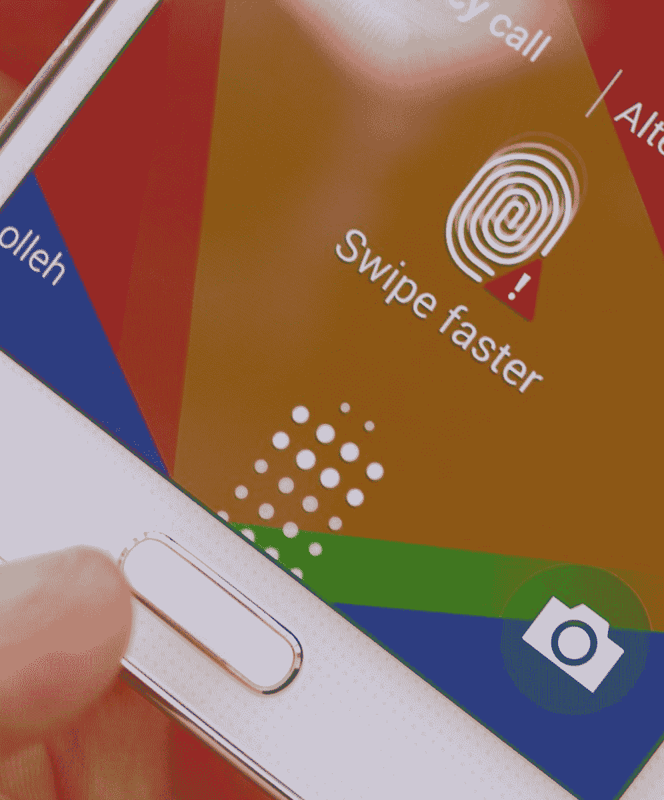

# 指纹传感器的历史和用途:我们真的需要它们吗？

> 原文：<https://www.xda-developers.com/fingerprint-sensors-history-uses-do-we-really-need-them/>

指纹传感器已经改变了智能手机的安全性，尽管变化不大。用户解锁他们的设备或获得授权并进行支付的能力对这个领域来说是相对较新的东西。到目前为止，已经有超过 180 种带有指纹传感器的设备。

在本专题中，我们回顾了指纹传感器的历史，并问了一个问题:如今它还有存在的必要吗？

## 感人的回忆

第一批具有指纹传感器的设备是东芝的 G500 和 G900，它们可以追溯到 2007 年 2 月。它们是 Windows 操作系统的智能手机，在向 Android 和 iOS 大转型之前的那些日子里，吸引了许多人(甚至是我们)的注意。下一个实现指纹传感器的大型设备是 HTC P6500，它在 G500 几个月后发布。

因此，虽然指纹传感器在过去两年风靡一时，现在正被集成到棉花糖中，但在那之前和苹果之前，它们都有自己的试验场。泛泰 Vega LTE 和 iPhone 5S 可以说是实现指纹传感器的相关现代设备，两者都在 2013 年发布，带来了解决方案，但使用了现代化的术语。

从那以后，几乎所有的 OEM 厂商都考虑过在自己的旗舰上增加一个指纹传感器(例如:Galaxy S5/S6，iPhone 5S/6/6S，华为 Mate S/Ascend，HTC M9+，Xperia Z5，一加 2，LG V10)。更不用说谷歌最新的旗舰产品 Nexus 6P 和 5X 了，因为它们都包含一个传感器——谷歌还向开发者开放了他们的解决方案，以便在他们的应用程序中以其他平台和以前的安卓手机不允许的方式使用它。

自从 iPhone 5S 及其指纹传感器问世以来，OEM 厂商一直在努力为他们的旗舰产品制造更快、更可靠的阅读器。令人惊讶的是，自 iPhone 5S 推出以来，超过 70 款现代智能手机都配备了指纹传感器。

最初，它仅用于解锁你的设备，后来，支付等功能的实现让人们的生活变得更加轻松。我们 XDA 的大多数人相信[这伴随着权衡](http://www.xda-developers.com/fingerprint-authentication-just-a-plain-bad-idea/)，但是使用指纹扫描仪作为面向大众消费者的营销点是有意义的，并且出于各种原因，它最终是一个非常实用的功能。

## 现代传感器

 我们生活在一个快节奏的世界里，我们每个人都试图将不便最小化，这使我们被帮助我们节省时间的技术所吸引(无论如何，这是任何技术发展的一个巨大部分)。尽管指纹传感器有各种各样的功能，但最重要的似乎是解锁设备本身。[例如，一些旗舰产品](http://www.xda-developers.com/oneplus-2-xda-review)不支持移动支付，但为了加快锁屏速度，仍然选择了这项技术。

据研究，一个人平均每天要解锁110 次。这可能是原始设备制造商生产具有更快和更可靠传感器的设备的一个重要原因，因为它们最终保证了额外的安全层(至少在大多数情况下)，而不牺牲速度。传感器应该能够在第一次尝试时识别指纹，而不是多次尝试解锁。

制造商通过将传感器放置在不同的位置进行实验，如 Home 键、电源键、设备背面，他们还尝试了不同的方法，如滑动、按压和轻拍。一些报道称，一些公司正在努力将电源按钮传感器提升到一个新的水平，直接在设备的显示屏中安装扫描仪。

# 有必要吗？

Android Marshmallow (6.0)增加了对指纹传感器的支持，这清楚地表明所有未来的旗舰产品甚至廉价设备都可以(并且可能！)包括这些中的一个。谷歌的“Android Pay”和其他在线支付服务引领了一种更有用的指纹传感器。

现在，由于大多数主要的 OEM 厂商都已涉足指纹传感器领域，**我们可以期待他们推出哪些新功能？你想在你的设备上安装指纹传感器吗？为什么呢？**