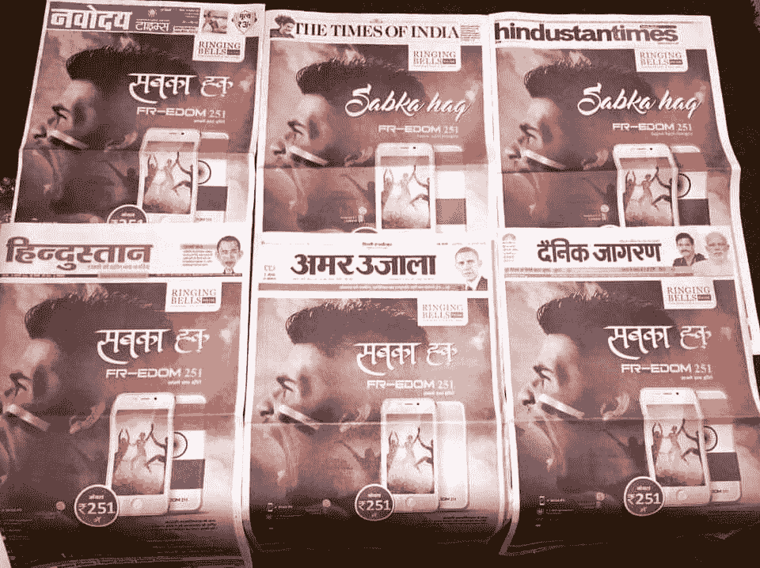

# 关于自由 251:3.7 美元的安卓智能手机

> 原文：<https://www.xda-developers.com/freedom-251-why-it-is-a-3-7-android-smartphone-and-why-it-shouldnt-exist/>

当每个人都在为 2016 年世界移动通信大会做准备，垂涎于手中握着某个三星或 LG 的想法时，一家印度小公司正在推出其超级实惠的智能手机 Freedom 251。

Freedom 251 由总部位于诺伊达(印度)的 Ringing Bells Pvt. Ltd .开发。谈到功能，该设备配备了分辨率为 960 x 540 的 4 英寸 qHD IPS 显示屏。内部是一颗联发科 1.3 GHz 四核 MT6582 处理器。还有值得称赞的 1GB 内存和 8GB 内部存储，microSD 可扩展性高达 32GB。还有一个带自动对焦的 3.2 MP 后置摄像头，一个 VGA 前置摄像头，一个 1450mAh 电池和双 SIM 3G 支持，所以你也不会得到一个哑手机。这款手机运行 Android 5.1 Lollipop，并且会预装一堆应用。

那么，这款设备的卖点是什么？为什么*确切地说*我们在陈述一款听起来最多像是 2010 年旗舰产品的设备规格？这款设备的主要卖点是其超级便宜的价格。该设备的价格为 251 印度卢比，按照目前的汇率换算为 3.67 美元 T2。

不，你没有看错，我们也没有犯任何错误。这种设备的最终消费者花费甚至不到 4 美元。仅仅四美元！

只需 4 美元，你就可以忽略该设备的所有规格，直接购买。你甚至不需要对这个设备有需求——先把它买下来，然后再想办法使用它。花 4 美元，如果你把设备掉在地上摔坏了，你会很容易地再买一个，而不是花钱花汽油去服务中心，更不用说去修理了。4 美元...嗯，你懂了。

那么，你或任何人真的应该购买这款设备吗？在我们回答这个问题之前，让我们更深入地了解一下这款设备及其疯狂的价格。

* * *

母公司 Ringing Bells Pvt. Ltd .即使在印度智能手机领域也是一家默默无闻的公司。作为一个在与他人互动时经常遇到不知名智能手机(俗称“中国”手机，这是一个你永远不会找到第二部手机的品牌的总称)的印度消费者，敲钟公司没有敲响任何钟声*(对不起)*。[Livemint.com 发现](http://www.livemint.com/Consumer/uJqMXBEJ4gtCI0XUTTg4SJ/The-man-behind-Freedom-251-the-cheapest-smartphone-in-the-w.html)人们对该公司知之甚少，而且在公开记录中，该公司的 it 主管是 Sushma Devi、Rajesh Kumar 和 Mohit Kumar Goel。Mohit Kumar Goel 拥有几个学位，来自一个主要从事农产品交易的家庭，2015 年 9 月才进入电信行业。正如 Livemint 引用的那样，这种从农业到技术的转变是由*“莫迪政府的大量工作和对“Sabka Saath，Sabka Vikas”*(大致翻译为*“全民发展”*)的明显承诺推动的。

嘉宾议员 Murli Manohar Joshi 先生启动了 Freedom 251。这款手机打着印度制造的旗号推出，被吹捧为印度总理 T2 的 T4 印度制造计划的成功故事。该公司还声称，Freedom 251 智能手机是在政府的“大力支持”下开发的，这一点在发布会上得到了澄清和阐述，我们将在本文后面提到。

那么，如何制造一款价格低于消费者最终会购买的 microSD 卡的智能手机呢？一个人如何创造出如此复杂的产品，而其售价却低于消费者每月支付的 3G 互联网费用？

### 关于自由侠 251 的价格，有几种可能的理论

一种说法是，这部手机可能会得到印度政府的大量补贴。考虑到政治重量级人物出现在一家无名公司的手机发布会上，这似乎是最合理的理论之一。政府补贴这种设备肯定有很多动机:一部价格如此疯狂的手机能让印度众多人口买得起(因此，印度的 T2 投票银行也买得起)。除了穷人中最穷的人和没有基本设施的人，大多数低收入群体在家里都有一部“哑手机”。这种设备的成本甚至比“哑手机”更具竞争力，因此，对于那些寻找手机的人来说，以更低的价格做更多事情的手机是合乎逻辑的升级。看看印度政府正在采取的其他举措，如[与谷歌合作在火车站安装高速 WiFi](https://googleblog.blogspot.in/2015/09/bringing-the-internet-to-more-indians.html)，以及[数字印度运动](https://en.wikipedia.org/wiki/Digital_India)，一部面向普通大众的补贴手机就像一个非常复杂的拼图游戏中缺少的一块。这种情况太完美了，不能排除！

另一个理论是，手机可以由运营商补贴，很像一个合同系统。毕竟，在美国和其他地方，这是一种非常普遍的做法，手机以低于解锁价格的一小部分出售，条件是客户必须在一段固定的时间内连同电话费一起付清。但就个人而言，印度目前的运营商只有很小一部分合同。大多数消费者，尤其是在廉价设备的特定目标人群中，更喜欢预付费连接。在这个价格段，合同几乎是闻所未闻的，因此运营商肯定需要有远见，以如此低的每位客户利润率承担如此大的风险。请记住，购买这种设备的人仍然是挣日工资的人，所以当他们的其他更基本的需求没有得到满足时，他们不太可能为获得无限的 3G 数据付费。

另一个理论，来自美国戴锡纸帽的怀疑论者，是当你免费得到产品时，你就是产品。自由 251 实际上可能并不代表自由，而是一种挖掘印度绝对庞大人口数据的方式。就定向广告而言，农村地区是一个巨大的未开发市场，因此收集用户的偏好、位置和其他个人习惯(当然都是“自愿的”)是一个非常有利可图的提议。

也许最后一个理论，也是看起来太令人难以置信的一个理论，是该公司确实设法大幅降低了设备的成本，甚至比中国人还便宜。他们已经成功地扩大了生产规模，可以以 USB 线的售价生产整个智能手机。廉价的 Android 设备是存在的，而且它们肯定会一年比一年便宜。但即使是目前最便宜的硬件，单从制造成本来看，一部智能手机也必定会达到 20 美元。还有设计和开发费用、销售和营销管理费用、广告(毕竟，主要日报的头版广告确实要花很多钱)甚至售后服务的问题[Ringing Bells 将在印度的 650 多个服务中心提供标准的 1 年保修]。考虑到所有这些因素，以低于 4 美元的价格推出一款真正的智能手机几乎是不可能的。因此，这个理论是最不可信的。

 <picture></picture> 

Advertising Done Right: Full Front Page Ads in various leading dailies for the $3.7 Smartphone

## 那么到底发生了什么？

到目前为止，还没有电信运营商站出来宣布他们与 Ringing Bells 的合作关系，因此基于运营商的补贴是不可能的。

在发布会上，该公司排除了政府补贴的可能性。据出席发布会的 NDTV Gadgets 报道，Ringing Bells 总裁 Ashok Chadha 证实，除了与为该项目提供“愿景和指导”的议员 Murli Manohar Joshi 的长期友谊外，Freedom 251 没有“政府补贴”。由于没有证据表明存在适当的补贴，我们不得不相信该公司的说法，除非有相反的证据...但是，政府指导/赞助本身就是一种补贴。

那还剩下什么？该公司声称，它通过*【规模经济】*以及利用产品生态系统实现了这一价格。Ringing Bells 总裁 Ashok Chadha 确实提到，制造一部智能手机的成本约为 2000 印度卢比( **$30** )，考虑到我们能找到的最接近原始产品的手机之一 Adcom Ikon 4 售价为 3599 印度卢比( **$52.5** )，这是可信的。自由 251 几乎是一个更名的 Adcom Ikon 4，尽管有一些规格变化，如降级的相机设置和不同的屏幕分辨率。引用 Ashok Chadha 的话:

通过在印度制造，这个价格下降了 400 卢比。那么我们将只在网上销售。因此，这进一步拉低了 400 卢比的价格。我们确信这款智能手机会有很大的需求。我们假设从这种规模经济中节省大约 500 卢比。最后，我们等待我们的平台成长，这样我们就可以从其他服务中赚钱

计算一下公司总裁给我们的数字(感觉有些夸张，但让我们顺其自然)，该设备的成本下降到 300 印度卢比(4.4 美元)，仍然高于售价。该公司对交付收取 40 印度卢比(0.6 美元)的名义价格，假设该公司销售其生产的所有智能手机，该项目似乎仍处于亏损状态，随着设备的每一次销售而增加，并且不考虑售后服务。该公司真的指望自由 251 变得受欢迎，以便从该项目中真正赚钱。像许多大公司一样，Ringing Bells 的目标是最大馅饼中最薄的一块。

请注意，Ashok Chadha 引用的数字仍然有争议，因为他开始时的基础价格通常考虑了所有的规模经济-这就是为什么它开始时如此便宜。规模经济并不完全基于固定成本除以生产的单位数量(可变成本)；超过一定的生产阈值，您需要额外的机器和基础设施(增加固定成本)来生产更多的单位(从而将它们降低到相同的水平)。公司确实达到了这些极限，如果要进一步降低这些价格，需要更多的捷径。这样做只是一厢情愿的想法，如果实现，将是一个了不起的壮举。尽管如此，该公司有信心做到这一点。

为了实现收支平衡和盈利，该公司将向第三方开放其平台以换取收入。这种模式也并非完全没有听说过。像亚马逊和谷歌这样的大公司就是这样做的，他们提供各种免费或廉价的服务，甚至是硬件，以创造一个对外界有利可图的生态系统。没有提到 Ringing Bells 到底计划如何“从其他服务中赚钱”，所以我们只能希望他们采取道德的方式。

那么，现在我们已经解释了自由 251 的所有内容，一切都好了，对吗？我们是不是都应该跳上自由 251，知道从现在开始一切都清楚了？

### 不完全是。这种设备仍然存在很多争议。

一开始，网站上列出的 Freedom 251 产品直到最近才成为真正的产品。2016 年 2 月 17 日凌晨[官网](http://freedom251.com/)的一份存档显示了一款带有三个电容按钮的产品，这在发布会上和发布后造成了很多混乱，因为该设备与图片不符。这款设备的外观更像 iPhone，所以这种混淆是有正当理由的。

媒体在活动中收到的产品不仅看起来与许多人预期的不同，实际上它似乎是一个重新命名的设备，而不是由 Ringing Bells 自己生产的。虽然品牌重塑并不是一个新策略，但在这种情况下，它非常令人困惑和可疑，因为该产品已经被吹捧为印度制造*活动的成功。如果钟声没有敲响，那是谁呢？*

 *Adcom 有。至少该公司在“发布会”上展示的“测试原型”是一款 Adcom 产品。Adcom 是一家总部位于新德里的 IT 产品进口商。最接近的匹配产品是 [Adcom Ikon 4](https://gadgets360.com/shop/adcom-ikon-4-gold-8-gb-3738342d31323631) ，在印度市场售价 3599 印度卢比(53 美元)。当[《印度斯坦时报》的团队与 Adcom](http://www.hindustantimes.com/tech/copyright-infringement-india-s-rs-251-smartphone-is-riddled-with-issues/story-3DrgODgrvjhnGcO07uIB4M.html) 取得联系时，这位营销负责人否认知道 Adcom 设备正在被使用！

当然，敲钟人可以否认它是 Adcom 的产品。但是，唉，他们忽略了一个主要因素...向媒体展示的设备**正面有 Adcom 商标，被白色墨水覆盖**。不，这不是我们编的。*这真的发生了！*一家公司声称其“印度制造”的产品已经实现了足够的规模经济，可以以 4 美元的价格出售，而一款进口(很有可能)产品却被巧妙地用白色墨水重新包装。以下是装置的[揭开图:](https://twitter.com/vishalmathur85/status/700175191842750464)

在几个媒体视频中可以看到白色墨水的正面[。某处有人认为用可剥离的白色墨水覆盖商标是个好主意，即使从远处也能看到。背面的三色贴纸也是为了隐藏 Adcom 品牌。我们希望这背后有一些真正无懈可击的逻辑和推理，只是我们不能理解，因为我们真的没有什么可以解释这种胡说八道。](https://youtu.be/ET9jc9GeGNk)

Freedom 251 也处于版权诉讼的边缘，因为它显然抄袭了 iPhone 的很多图标。甚至连浏览器图标都是 Safari 的。

硬件的正面布局也类似于 iPhone，带有圆形的 home 键。印度关于版权的法律和随后的实施没有发达国家那么强。但是，如果 Freedom 251 在农村地区占据了很大的市场份额，我们可以肯定苹果也会想分一杯羹。

哦，如果你能忍受这一切， [NDTV 发现](http://gadgets.ndtv.com/mobiles/features/freedom-251-more-questions-than-answers-803592)自由 251 也没有被[印度标准局(BIS)](https://en.wikipedia.org/wiki/Bureau_of_Indian_Standards) 认证为在印度使用是安全的。这意味着这款手机不具备质量和安全方面的最低保障，不会出现过热和火灾等问题。获得 BIS 认证是一件既费钱又费时的事情，所以 Freedom 251 跳过这些对产品的安全性来说不是好兆头，但与偷工减料的商业模式是一致的。请注意，Ringing Bells Pvt. Ltd .甚至 Adcom 的其他手机都没有出现在 [BIS 页面](http://164.100.105.199:8071/cmd3/index.php?search=&submit=Search!)上，但其他知名和受欢迎的制造商出现了。如果该设备要进入该国成千上万人的手中，这肯定是一个严重的问题。

自由 251 是*人民的电话*。这对农村普通人来说是一线希望，让他有机会通过互联网获取大量的知识和资源。但是自由 251 还有最后一个限制:*穷人不能买穷人的手机。*

自由 251 于 2016 年 2 月 18 日凌晨在其[官网](http://freedom251.com/)开始发售。要购买这款手机，用户必须在早上 6 点上网，将它添加到购物车中，然后通过支付网关进行支付，该支付网关出现故障，导致许多用户出现 404 错误。据称，支付网关的支付选项仅限于信用卡和借记卡，但我们无法证实这一点。由于不可预见的需求，该网站最终关闭了一段时间，该网站自称每秒钟有 60 万次点击。结果，该公司的[主管在一次采访](http://gadgets.ndtv.com/mobiles/news/freedom-251-mobile-day-one-online-bookings-at-just-30000-units-804072)中提到，尽管需求巨大，但这款设备实际上只卖出了 3 万台。该设备的销售预计将在一天之内在网站上恢复。该公司还承诺在 4 个月内，即 6 月 30 日之前，交付首批售出的所有手机。

等等，那这个穷人是怎么买手机的？他没有到达。正如在发布会上提到的，这款手机将在网上销售，只是为了削减营销和分销成本。加上从 2 月 18 日到 2 月 22 日的小购买时间窗口，网站经历的停机时间和最重要的事实是，你首先需要有互联网接入才能购买手机，这使得穷人无法购买。首先，一个人如何通过在互联网上销售来推销访问互联网的手段？这肯定是没有意义的，因为在目前的状态下，唯一会麻烦购买这款手机的人将是那些已经拥有好设备的中产阶级，他们打算购买一款作为备用，或者仅仅是因为。该公司尚未提到其线下销售的计划，考虑到该设备的售价，如果没有也不会令人惊讶。毕竟，通过广泛的网络进行线下销售确保每个人都有购买的手段将意味着更多的中间商和现有的利润空间来养活他们。概括一下，这款手机售价 3.7 美元。

如果不提到手机的性能，谈论 XDA 手机就不完整。但是，自由 251 的性能是一个有待讨论的问题。花 4 美元，你就可以把它当闹钟用，并且仍然对它的性能感到满意。但它仍然是一部手机，还是一部安卓手机。因此，它可以完成低端手机的所有功能。你显然不能在它上面行驶最新的沥青，也不能从它的相机上拍摄出色的弱光图像。但从最终消费者的角度来看，这无疑是目前市场上你能买到的最好的设备(就价值而言)。

敲钟私人有限公司的自由 251 肯定有很多我们谈论。无论你是否嗅到了一个正在制造的骗局，或者你是否预见到了该设备制造过程中导致的腐败行为，或者你是否看到了一个有远见的创业团队试图扰乱市场，我们都可以同意，自由 251 给我们的头脑带来了大量的问题。我们希望该公司信守承诺，为穷人提供手机，用机会打开他的世界。

你觉得自由 251 怎么样？如果这款设备真的到货了，你期待在你的国家购买它吗？这款手机会刺激其他制造商竞相杀价吗？请在下面的评论中告诉我们你的想法！

专题图片致谢:[bigblliondayapp . in](http://www.bigbilliondayapp.in/booking-now-freedom-251-buy-online-at-rs-251-only.html)*