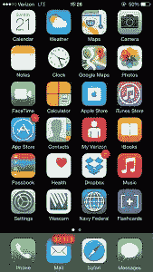
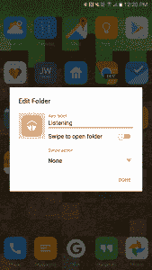

# 离开应用抽屉:15 天主屏幕实验

> 原文：<https://www.xda-developers.com/freedom-from-app-drawer-oppression-is-it-possible/>

应用程序抽屉，如此简单的东西，如此 Android 自带的东西，但最近却如此有争议。如果有人问 iOS 和 Android 之间的区别，这通常是一个早期的提及，所以当 LG(和三星，在较小程度上)发布其新的旗舰手机无应用程序抽屉的早期模型时，Android 社区对这样一个有争议的举动感到愤怒。

事实上，LG 特意发布了一个新视频，视频显示你可以从他们的商店安装一个[LG 辅助发射器](http://us.lgworld.com/store/webview/products/share/retrieveProductDetail.dev?c=US&l=EN&id=000001176671142&pid=PID16020414719)来添加抽屉，三星从大多数美国版本中删除了“Galaxy Labs”功能，隐藏了他们企图叛国的任何痕迹*。*

但是有那么糟糕吗？我在这里告诉你，我已经有*个月*没有使用 app drawerless 了。我活着来讲述我的故事——到目前为止，杜阿尔特皇帝饶了我一命——这就是为什么我们也许应该把我们的干草叉放在一边，看看也许，只是*也许*它毕竟不是那么糟糕...稍加调整。

 <picture></picture> 

Apples home screen can get a little crazy with its lack of customization

首先，一些背景。跳板——苹果对其启动器的命名——与安卓主屏幕没有太大区别。两者都把新安装的应用程序转储到一个预先分类的位置，苹果的做法是在你的主屏幕上用各种各样的应用程序图标按照安装日期分类，而安卓则把它们转储到按字母顺序分类的、似乎永无止境的应用程序抽屉里。由于各自的原因，当您 eclipse 100 个应用程序(初始设置后不久我就超过了这个级别)时，这两种解决方案都会出现问题。当使用苹果的方法时，你刚刚安装的应用程序可能会在 5 页的末尾，而使用安卓系统时，你必须向下滚动，同时试图背诵 A-B-C，以记住后面的字母“R”。

在默认状态下，这两种解决方案都有很多不尽如人意的地方，特别是如果你是强迫症患者(我)，喜欢尽可能少思考或唱歌，并且相信我，没有人想听我唱 A-B C。

但是我找到了一个解决方案，我认为它非常棒。在 iOS 上，我把应用程序放入文件夹、游戏、苹果垃圾和其他所有东西中。这最终演变成一个分类的文件夹布局，游戏和财务、摄影、购物等等都有自己的文件夹。随着时间的推移，这些文件夹开始增多，我发现了一些完全没有科学依据的东西。我更经常地使用各种各样的应用程序，我更经常地使用应用程序而不是移动网站，我发现自己可以更快地找到我需要的东西，并且思考得更少。

我最近把我的日常驱动程序从 iPhone 6S 换成了[Galaxy S7 Edge](http://forum.xda-developers.com/galaxy-s7-edge)——我很喜欢，谢谢你的询问——我想把这种感觉带到 Android 上。我最终得到了比我在 iOS 上做的更强大的东西，我认为它甚至可以让最顽固的应用程序爱好者着迷(这些存在吗？)有点好奇。

 <picture></picture> 

Use your launcher's power options to your advantage

我的布局依赖于三样东西:自定义启动器、图标包和隐藏文件夹。我最常用的应用程序放在主屏幕上，但有些是巧妙隐藏的文件夹。像“听”、“家”和“商店”这样的东西实际上也是文件夹。只需点击 Store 即可打开 Play Store，但向上滑动即可展开一个包含 Galaxy Apps store 的文件夹。Home 实际上是一个文件夹，点击它，文件夹就会打开，滑动它，第一个列出的应用程序就会打开。我还隐藏了谷歌搜索栏，因为它不太适合我的布局。在它的位置，我有一个 Google Now 图标，这是应用程序抽屉按钮通常所在的位置，现在点击会打开，滑动会扩展一个浮动的搜索栏。我的第二个页面充满了分类的文件夹，设置了一个图标来表示文件夹中的内容，给它一个统一的外观和感觉。我在我的主屏幕上利用这些技巧和 Nova 的超级用户选项来嵌套和组合东西，使之符合逻辑顺序。

在我看来，跳板的布局优于单一的“垃圾”抽屉，因为它更容易呈现应用程序并增加参与度，而苹果却阻碍了它，并因其缺乏定制而给了它一个糟糕的名字。但是将这种布局与 Android 的强大功能和可定制性结合起来，你可以拥有一个真正令人敬畏的、逻辑上更优越的布局。

下面是基于我的主屏幕的一些提示，我要求每个人试用 15 天。备份你当前的布局，留出 30 分钟来像我一样设置你的屏幕，看看你是否不喜欢它，哪怕只是一点点。**请在下面的评论区留下您的评论、想法、提示和喜爱的图标包！**

*   要创建隐藏文件夹，只需创建一个文件夹，然后长按它。选择“编辑”，然后更改图标。您也可以通过设置该选项并选择其操作，将其设置为可切换文件夹。
*   如果你有镇天威，你可以下载特斯拉未读启用徽章图标
*   将 Nova 设置为自动将已安装的应用程序添加到主屏幕。
*   你还有一个应用抽屉，我的抽屉设置为双击屏幕上的任何地方。有时自动添加不能正常工作。
*   长按主屏幕，转到 Widgets，然后添加一个 Nova 文件夹，一次将多个应用程序添加到一个文件夹中。
*   最好的图标包包括那些文件夹图标，否则你可以使用任何图标作为文件夹的正面。