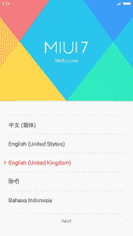

# 走向黑暗:全面的 MIUI 回顾和细节

> 原文：<https://www.xda-developers.com/going-over-to-the-dark-side-the-comprehensive-miui-review/>

我们很多人来到 XDA 是为了逃离 OEM 软件的魔爪:逃离束缚我们硬件的枷锁，实现我们花钱买的东西的真正潜力。当然，制造商声称提供软件解决方案，旨在发挥他们所创造的硬件的最佳性能。

他们有时会对其进行优化，使其更光滑、更简洁，但更多的时候，他们的解决方案会给习惯于更清洁生活的用户带来一些麻烦。对一些人来说，没有谷歌的 AOSP 股票过于简单，但制造商的皮肤却走了极端，最终走到了光谱的另一端。

那么，当一个习惯了基于股票 AOSP ROM 的功能设置的人，不得不使用一个与他迄今为止的整个 Android 体验形成鲜明对比的 ROM 时，会发生什么呢？

# MIUI:我，你和我

我的 MIUI“体验”要追溯到 2012 年，当时我的第一部手机[收到了 MIUI v3](http://forum.xda-developers.com/showthread.php?t=1722729) 的一个“端口”。三星 Galaxy Fit S5670 本应在 Gingerbread 2.3.6 上运行 TouchWiz，但相反，我的新用户很高兴地发现了一个完全改变了我手机方式的 rom。作为一个 8 个月大的 Android 用户，这对于我来说是一次革命性的体验，因为我在新的地方发现了旧的设置和从未存在过的新设置。TouchWiz 突然觉得不完整——我的手机可以做这么多！

这种体验在使用 ROM 的几个小时后就消失了。首先，rom 本身是建立在 CyanogenMod 7 基础之上的，这意味着它是一种仿真的 MIUI 体验，而不是小米从小米的源 ROM 中移植的真正端口。独立开发者已经对项目进行了主题化和重新定位，以匹配 MIUI 中的项目:考虑到 MIUI 与 CM7 相比有多么巨大的差异，这本身就是一项艰巨的任务。但这意味着 ROM 只是:一个 MIUI 主题。我经历中的下一个问题部分是由于我当时的愚蠢:CM7 基础 ROM 本身在那些阶段在手机上运行得并不好。有虫子，而且有更多的虫子。再加上添加到 ROM 中的额外后台应用程序和服务，以模拟在低端设备上运行的 MIUI，所以毫不奇怪，梦想体验很快变成了噩梦。不用说，股票 TouchWiz 是匆忙闪回的。

这个特殊的经历给我的 Android 定制 ROM 场景留下了很大的创伤。MIUI 这个词和与之相关的 ROM 很快就被归入了“漂亮但不起作用”的垃圾箱。在我的逻辑和论点中有各种各样的谬误，比如我如何将基于 CyanogenMod 的 ROM 上的体验与 MIUI ROM 的代表联系起来，比如我如何将缺点与一个特定的体验联系起来，以代表任何小米设备上的整个用户体验。关键是，负面影响持续的时间比我承认的要长得多，也延伸到了我的下一款设备上。

这不是 MIUI 的错。

所以当我收到小米的红米 Note 3 骁龙 650 变种作为审查单位时，我决定抱着开放的心态走进去。我过去犯过错误，根据基于不正确论点的先入为主的观念来判断当前的设备会破坏我作为一个无偏见评论家的合法性。毕竟，距离我们上次“接触”已经过去 4 年多了。很多事情都会发生变化，公平的做法是从头开始，在一台本该提供 MIUI 体验的设备上体验 MIUI。

与我预料的相反，我最终感到惊讶远远多于痛苦。

以下评测是在 MIUI 全球稳定 7.2.3.0 (LHOMIDA) ROM 上完成的，基于 Android 5.1.1 LMY47V。审查设备是小米红米 Note 3 骁龙 650 变种，内存为 2GB。该审查是我们整个设备审查的一部分。

文章中表达的所有观点都是作者自己的自由观点和意愿。这不是付费评论或认可。

提示:右击/长按 GIF 图像，在新标签中打开它们，获得最佳 GIF 体验

## 第一次开机

MIUI 体验以一种令人惊讶的熟悉方式开始。你得到的是一个色彩明亮、白底黑字的平面用户界面。还有一种强调色，用于突出可操作的区域。如果你觉得这很眼熟，那我们俩就是一条船上的。

MIUI 的配色方案从一开始就一直在变化，但在大多数情况下，MIUI 都选择亮色作为主色调。如果你是在材料设计革命之前从 AOSP 的任何一家股票交易所过来的，这将会完全不同。Android 4.4 Kitkat 为我们带来了过渡拨号器应用程序，它给出了离开 Holo-yolo 时代的迹象，Android 5.0 以其材料设计走向成熟。从更新的角度来比较，MIUI 似乎并没有像以前那样格格不入，从一开始就是一个古怪的用户界面。

随着设置过程的继续，MIUI 开始展示它已经超越了 AOSP 功能的领域。称之为膨胀，或者称之为功能，MIUI 的设置过程只是触及了其软件实力丰富的冰山一角。例如，在 WiFi 选择屏幕上，您会看到文本提示，让您共享您所连接的路由器的 WiFi 详细信息！人们可能会对类似这样的东西的实际使用进行争论，因为你只是在一部手机上输入了 WiFi 细节，需要抓住另一部手机并扫描二维码来传递细节——在这个阶段，简单地输入密码本身会更容易。但是，如果你需要的话，它就在那里。你也可以稍后在 WiFi 设置中访问相同的“点击共享密码”，这更有意义。

在上面的图库中，你可以注意到与小米的账户提示相比，谷歌的账户提示感觉有多柔和(尽管谷歌账户提示只是冰淇淋三明治中赫萝黑暗提示的一个较轻版本)。

MIUI 设置向导还引入了所谓的 Mi 消息。Mi Message 让您可以向其他 MIUI 用户发送短信，而不会产生短信费用。除了这一个屏幕之外，它不需要任何额外的设置，非常方便。在这个意义上，它可以和 iMessage 相媲美，尽管我在发送给普通用户的消息和发送给 MIUI 用户的消息中找不到视觉差异。如果你经常发短信，并且有 MIUI 用户的联系人，那么这将会非常方便，因为 MIUI 用户可能会默认启用它。

设置向导也可以让你一瞥主题的世界！MIUI 主题大部分是由其社区制作的，类似于 CyanogenMod 和 Layers 主题引擎周围有社区。但是，与 CyanogenMod 和 Layers 不同，这些并没有完全改变 SystemUI。主题影响启动器、图标、锁屏、时钟部件、声音和一些系统颜色，但 MIUI 的其他方面保留了相同的属性。你可以根据自己的主观选择，在主题商店上买到一些真正有创意的主题。因此，每个人都有适合自己的东西。主题可以是非常简单和基本的，除了你的图标模式什么都不改变，也可以是非常分裂的，以至于你可以得到一个替代的启动器设置，通过两个手指的滑动可以很容易地与默认设置进行切换。

## 启动器:主屏幕和应用抽屉

MIUI 经常被比作 iOS，而启动器是其主要原因之一。你的主屏幕和应用抽屉共享同一个空间，成为这两种功能的结合体。你可以在应用抽屉上放置小工具和快捷方式，你可以重新排列图标以更适合你的使用场景。从表面上看，你最常用的应用程序与手机上其余的上百个应用程序争夺空间。甚至没有自动排序应用程序的选项！但是，如果你努力通过充分利用无限的窗格和文件夹来组织你的工作空间，你可以让事情变得更容易忍受，而不是一片混乱。或者你可以安装一个自定义的启动器——MIUI 毕竟还是 Android。

MIUI 确实有一些小技巧可以让组织变得简单一点。一旦你进入编辑模式，你就可以移除页面上的图标，并把它们放到 dock 中的一个等待区。这将有助于当你有一吨的图标重新排列，你希望从一个干净的石板开始。如果你在等待区有太多的图标，你可以把图标捏成一组，然后把它们一起放在一个文件夹里或者一个空的面板上。

MIUI 的 launcher dock 可以容纳多达 5 个图标，甚至文件夹，所以你确实有选择，尽管范围有限。你也可以直接从启动器中卸载应用程序，这是我们对启动器的标准操作。卸载动画有一种令人满意的感觉，“摧毁”不想要的应用程序图标。

启动器也给你一个未读消息覆盖在图标上，在通知面板上有一个通知。这与应用程序可能没有未读消息的事实无关。可以把它看作是一种将你的注意力吸引到未决通知上的方式，就像文件转换器中成功的文件转换或者与驱动器同步时的错误。你可以通过打开和关闭应用程序来清除未读计数器，而不用清除通知阴影本身中的通知。如果文件夹中的应用程序有通知，该文件夹会获得一个未读计数器。

## 洛克斯利干员

如果你启用了指纹锁，MIUI 7 上的股票锁屏不支持通知。你会在屏幕上看到一个不可配置的时钟小部件，在右滑动时会出现一个相机快捷方式。向上滑动会显示 pin/图案/密码锁，但如果使用指纹扫描仪，你可以绕过锁屏的任何方面(或完全绕过锁屏)。指纹扫描仪会一直开着，所以如果你拿着手机使用的话，很有可能你不会看到太多锁屏。

小米增加了一个锁屏功能，称为“日常锁屏”或壁纸转盘，可以通过点击锁屏右上角的图标来激活。每日锁屏将大量高质量的图片，特别授权给小米用作壁纸，轮流作为你的锁屏。有几个类别可供选择，图像数以千计，因此您可以从一个很好的图像集合中进行循环。锁屏壁纸在 Android 上并不是一个新东西，但小米的实现没有麻烦，只需要非常简单的设置，我可以看到很多普通用户都在参与其中。

锁屏有一个我在使用过程中无法绕过的限制。没有办法将每日锁屏功能与修改锁屏的主题一起使用。所以你必须最终决定使用一个适合你口味的主题，并坚持使用它附带的静态锁屏壁纸(或者从你的图库中选择一个)，或者使用默认主题的日常锁屏。对此，我最好的猜测是小米没有向主题开发者提供对其日常锁屏功能的 API 访问，从而将该功能仅限于官方主题。

日常锁屏也没有延伸到主屏幕兼应用抽屉。你可以在 MIUI 主题商店上找到几个背景，但如果不使用外部应用程序，你就无法获得骑行壁纸。由于应用程序抽屉肯定会比锁屏更受关注，这是一个感觉没有必要缺乏的领域。同样，对应用抽屉的省略的猜测可能是因为当涉及到应用抽屉窗格时给用户的自由——有了锁屏，你知道总会有一个纵向面板，因此，更容易管理专门为一个面板定制的内容。有一些方法可以解决这个问题，比如滚动壁纸设置，我们希望这种方法能在未来的更新中出现。

## 通知阴影

MIUI 上的通知阴影，就像 MIUI 上的其他东西一样，是一种与 AOSP 截然不同的体验。您可以通过启动器上的向下滑动手势来访问通知阴影。如果你有一个活动的通知，向下滑动会直接将你带到通知面板。如果您没有通知，向下滑动会带来快速设置面板。我想不出具体的手势来下拉通知面板或快速设置面板。

您只能使用从左向右的推送手势来推送通知。从右向左滑动总是会将页面滚动到快速设置面板，这需要一点时间来适应，因为你可以双向滑动 AOSP 上的通知。通知窗格还允许您控制哪些通知可见。

快速设置切换排序实际上需要用户进入设置应用>通知>切换位置。这里没有太多的可定制性，因为你最多只能根据自己的选择对图标进行排序。在这里，你也可以设置快速设置面板切换后关闭，或保持不变。

### 最近面板

最近面板遵循一个非常奇怪的设计。按下最近按钮会模糊背景，并显示您最近使用的四个应用程序的图标和名称。屏幕的其余部分是空白的。向左滑动会滚动一页，给你另外四个图标，以此类推。你可能会发现这很浪费，但这与 MIUI 积极的内存处理密切相关。MIUI 本身就是一个重度 OS，然后默认以攻击性任务查杀为特色。很有可能你的第五个和第六个应用已经在队列中关闭了，所以把它“藏”在一个额外的卷轴后面是有意义的。我们将在硬件评测的性能部分更多地讨论 MIUI 和 Redmi Note 3 的内存处理。

向上滑动单个图标会将应用程序从最近列表中移除(即降低其 RAM 优先级)，而向下滑动会将应用程序“锁定”在清除所有操作中。下面的十字图标会清除除锁定应用程序之外的所有应用程序。你仍然可以向上滑动并移除锁定的应用程序，这对我来说很奇怪，因为解锁应该是一个额外的步骤。

快速编辑:感谢 dutchgio 在评论中指出，最近的菜单图标可以用两个手指的手势“放大”。最近的屏幕现在有更少的空间浪费。

## 设置

如果你在这篇 MIUI 评论中已经走了这么远，并且认为 MIUI 功能强大，那么你肯定没有见过设置应用程序。设置应用程序充满了各种功能，因为它将 ROM 中的所有内容都放在了一个中心位置。甚至个别系统应用程序设置也能在设置应用程序中找到自己的方式，这让人想起了 iOS 如何组织这些设置。

为了简洁起见，这些必须以一个简短的列表格式呈现，而不是在有大量解释和想法的单个段落上。

*   通知:允许你在微观层面上管理应用程序的通知(状态栏图标又名“徽章”，浮动通知和锁屏)。还允许您在“快速设置”窗格中重新定位切换。还包含附加设置(显示连接速度、运营商信息等)。
*   壁纸:壁纸选择的中心枢纽。给出当前锁屏壁纸和主屏幕设置的预览。还连接到 MIUI 主题商店，以获得更多壁纸。
*   主题:主题的中心枢纽。提供所有已下载和预装主题的预览，并允许您连接到 MIUI 主题商店获取更多内容。
*   文本大小:提供文本大小设置，从 XS 到 XXL，以及如何出现在主屏幕上的预览。

*   显示:除了 AOSP 上的正常设置，MIUI 还引入了一个阅读模式(夜间模式过滤器)。您可以调整过滤器的强度，以及将阅读模式限制为仅用户选择的应用程序。此外，你可以控制屏幕温度以及对比度。
*   声音和振动:除了正常的 AOSP 设置，还有一些设置可以将耳机上的按钮分配给特定的操作。均衡器设置也存在，甚至为 Mi 耳机(单独出售的配件)进行了更多的定制。
*   Lite 模式:这种模式为基本用户提供了一个非常简化的“主屏幕”版本。主屏幕代表一个 Windows Phone 风格的启动程序，尽管有巨大的文本。
*   儿童模式:能够创建白名单/黑名单的应用程序可以访问。
*   客人模式:隐藏私人数据，如信息，笔记，照片等。
*   应用程序锁:使用密码(不是指纹)打开某些用户定义的应用程序。

*   单手模式:允许您缩小显示以适应指定的尺寸。右边缘上的从主页滑动到后退按钮激活，左边缘上的从主页滑动到最近按钮激活。向相反的方向滑动，或者点击空白区域来取消激活。
*   电池配置文件:允许您设置各种配置文件，指定各种条件。
*   电池节省:自动切换到用户定义的配置文件在用户定义的电池水平，并切换回插入或充电。
*   计划模式切换:在预定义的时间在电池模式之间切换。
*   计划电源开/关

*   管理单个应用程序的电池使用情况:允许您在应用程序级别控制电池消耗。给你三个级别的控制:关闭，标准，高级；有不同程度的限制。
*   通知 LED 控制:控制 LED 颜色的选项很少。实际的 LED 颜色仅限于几种选择，而不是扩展的色谱。
*   按钮配置:允许 yo 使用有限的功能集重新映射电容按钮。允许您选择背光照明。
*   本地备份:在本地备份系统设置、应用程序数据、帐户信息和联系人。还提供了自动备份和加密选项。

我们还没有完成。MIUI 里还剩下这么多。你会明白并看到为什么 ROM 更新岩石在一个良好的 1GB 的数据。

一旦你通过了所有这些选项，你会发现系统应用程序的所有选项的中心枢纽。

*   米云:把米云想成 Google Drive。MIUI 会把你的很多数据备份到 Mi Cloud 上，包括联系人、消息、照片、通话记录、笔记、WiFi 设置等等。需要时，您可以恢复这些设置。根据你的观点，除了谷歌之外的额外备份可能是好的，也可能是臃肿的。除了谷歌的设备管理器，还有一个“查找我的设备”功能。

*   通话记录，联系位置，未知号码识别，自动应答等。
*   公司和个人的短信过滤器，检查手机短信

所有这些特性不一定被所有用户使用，但是对某些人来说是有用的。然而，MIUI 有一些不利于手机 Android 体验的功能。用户认为他们可能需要它们，但是这些在无知的人手中往往弊大于利。以前版本的 MIUI 因杀毒功能而受到批评，其中几个和更多的功能仍然存在于 MIUI 7 中。事实上，在“系统应用”子标题下的“设置”菜单中，有一个完整的“安全”菜单。

首先，有一个预装的安全应用程序。你不能卸载这个应用(没有 root 用户)，也不能禁用它。最多，你可以强制停止它，这通常是没有意义的，因为应用程序通常会自动启动。在启动屏幕上，你会看到一个检查按钮，点击它会分析你的手机的各种“风险”和其他因素，并向你展示你可以进行的“优化”。例如，系统部分建议我启用安装监控并自动更新我的防病毒定义，这两件事我真的不需要做，因为病毒定义提供商是 AVL 和腾讯。值得称赞的是，安全应用提到开发人员选项和 USB 调试设置是安全风险，我部分同意这些。在 XDA，我们通常让它们处于启用状态，但这打开了一些最容易被利用的网关。

接下来，内存部分建议清除 4 个进程来释放 RAM。这里的问题是，建议的应用程序/进程包括我的两个 IM 应用程序(WhatsApp 和 Telegram)和小米的一个内置应用程序(Wallpaper Carousel)。剩下的另一个应用程序是 SyncMe，我正在积极地与安全应用程序一起使用(我用它来同步截图到我的桌面)。因此，按照应用程序的指示清空内存对我没有任何好处，但实际上更进一步，我干扰了我的即时消息。

安全应用程序建议修复的下一件事是清理我的缓存文件。在大多数情况下，缓存文件是您不应该为之烦恼的事情。它们的存在是为了避免在互联网上重新提取数据，并帮助应用程序预加载重复的元素。缓存是好的，“定期清理”缓存只会增加你的网络数据开销，因为应用程序将不得不再次请求这些元素。我只建议清理缓存不要超过一个月一次，理想的是每 3 个月一次，只是为了获得一个干净的状态并清理文件中不再需要的元素——再多的话，你就不能达到目的了。

安全应用程序还提供了一些更多的“优化”，在截图中可以看到。还有一个“病毒扫描程序”，由 AVL 或腾讯驱动(哦，真虚伪)。我不知道这些应该做什么，但我的手机没有标记病毒或风险。由 Clean Master 支持的安全应用程序上的 Cleaner 选项卡也提供了一些更多的功能。但是因为它是由 Clean Master 驱动的，所以我们不需要指出明显的问题。您可以单独禁用 Clean Master 后端，这将使应用程序的这一区域处于休眠状态并且不可用。

安全应用程序还有一些更可取的方面。它可以充当防火墙，允许您单独控制哪些应用程序可以通过移动数据和 Wifi 访问互联网，或者根本不能访问互联网。只能为移动数据切换系统应用。还有一个短信和电话拦截器。还有广泛的权限管理和自动启动管理器。

## 股票应用

我们还没完成。

红米 Note 3 上的 MIUI 预装了 3 个第三方应用程序:脸书、弗莱克斯和 WPS Office。这三个都可以完全卸载。

MIUI 7 上的 Dialler 应用程序具有白色背景，有最近通话和联系人选项卡可供选择。一旦您有了最近通话记录/联系人，列表就会被填充。正如我们现在在 AOSP 所期待的那样，智能 T9 输入在这里也能工作。InCall UI 的特点是全屏显示照片，并带有记录对话的快捷方式。当你接到一个电话时，InCall 用户界面有一个接听图标，滑动该图标即可接听电话。

你可以在任何地方找到新的用户界面，从联系人应用程序到消息应用程序，日历甚至电源按钮菜单。

### 指南针

这是一个应用程序，这是没有看到股票 AOSP 光盘。当你把手机放在手机上和拿在手里时，指南针的表现略有不同。在一个平面上，你会得到一个告诉你方向的用户界面。在第二个窗格上滑动会给你一个水平仪应用程序。当你把手机拿在手里时，手机会利用摄像头，让你知道摄像头指向的方向。精神层面也是如此。

### 记录员

录音机是一种以自动呼叫录音功能和独立音频录音机形式出现的应用程序，允许您录制音频。如果您愿意，录制的音频也可以同步到 Mi Cloud。这里提到这个的原因是因为它漂亮的动画，因为它的功能仅限于你在记录器应用中所期望的标准功能集。

### 调频广播

MIUI 还具有调频广播功能。这是一个很好的备份选择，在你无法访问在线或离线音乐的情况下。

### Mi 遥控器

如果您的手机带有红外增强器，您还可以找到预装在设备上的 Mi Remote 遥控器。添加设备非常简单。选择设备类别，选择制造商，然后按照屏幕上的提示进行操作。如果您的设备响应正常，您可以选择“是”,这将缩小您的应用范围。再重复一两个动作，你就可以设置好你的设备了。

Mi Remote 是那些一开始觉得很噱头的功能之一，但由于它的方便，我现在非常频繁地使用它。当我进屋的时候，再也不用找遥控器了。

### 扫描仪

MIUI 还内置了二维码扫描仪，显然也可以从照片中扫描代码。

### 时钟

就功能而言，它非常接近你在其他 ROM 中找到的时钟应用程序。动画是它与众不同的地方。

### 探险家

浏览器应用程序，又名文件管理器，是一个已经收到了很多想法。在应用程序的主屏幕上，你可以获得文件的类型类别，这可以快速筛选出你的文件。传统的探索者类别在此之下。你还可以对单个应用进行分类，比如 Telegram 的分类向你展示 Telegram 保存的媒体文件。在这些类别下，您会看到最近的文件屏幕。该应用程序还内置了 FTP 功能。不幸的是，我找不到一个选项来浏览外部 sd 卡，这是一个文件管理器的严重疏忽。

### 浏览器

MIUI 上的浏览器不仅仅是 AOSP 股票浏览器的更新。相反，它是一个功能明显不同的应用程序，这让我相信它是由小米从头开始构建的。除了完整浏览器应该提供的所有功能外，你还可以选择数据保存选项，扫描二维码和夜间模式的网址。

### 走廊

MIUI gallery 应用程序有四个选项卡:照片、离线、云和人物，其中照片是默认选项卡，用作聚合所有相机照片的地方。“脱机”选项卡类似于您可能已经习惯的普通图片库，各个文件夹中的排序选项是日期、名称和大小。云指的是米云上的照片。“人物”选项卡允许您根据图像中出现的人物对图像进行排序，但需要先将照片上传到 Mi Cloud。

### 音乐

音乐应用对我来说有点困惑。一开始，你会看到一个信息页面，而不是你的音乐收藏。有离线、收藏夹和播放列表的类别；这表明可能有在线流媒体选项，但我找不到任何一个。

进入离线模式后，你可以通过四个分组标签找到你的音乐收藏:歌曲、艺术家、专辑、文件夹。在这些分组类别中，有基于名称、日期和语言的排序选项。底部有一个音乐播放器，点击它可以打开正在播放的歌曲。在“正在播放”标签上有三个窗格:向左滑动可以快速访问音乐收藏，向右滑动可以查看歌词(对我来说，即使是流行歌曲也不起作用)。“正在播放”选项卡还会根据专辑封面更改背景颜色

### 天气

天气应用是 MIUI 上另一个漂亮的应用。这里没有太多要解释的，因为图像本身就说明了一切。

### 米店

红米 Note 3 上的 MIUI ROM 还附带了一个 Mi Store 应用程序。这与主题商店不同——小米在这个应用上销售实际产品(智能手机和配件)。你可以完全卸载该应用程序，谢天谢地。该应用程序也有客户服务的联系方式，这是一个可取的方面。

### Mi Mover

这是一个真正帮助我的应用程序。Mi Mover 所做的是，它允许你从旧手机切换到小米设备上。要安装在您的原始设备上的配套应用程序可以在 Play Store 上找到[。](https://play.google.com/store/apps/details?id=com.miui.backup.transfer&hl=en)

配套应用程序允许您选择要在新设备上共享的应用程序。配套应用程序然后通过 WiFi-WiFi 热点将这些 apk 发送到小米设备。然后，接收设备上的主应用程序接收这些应用程序，并继续安装它们。发送和安装是并行的过程，所以当你收到应用程序 B，你将安装应用程序 A，这节省了你的手机将无法使用的时间。Mi Mover 不仅传输应用程序，还共享短信和通话记录，因此您不必考虑第三方解决方案进行迁移。但是，由于这不是根应用程序，也不使用 ADB 连接，它也不能共享 apk 数据和设置。尽管如此，对于那些安装了很多应用程序，却懒得通过 Play Store 逐个/批量重新安装的人来说，这是一件幸事。

### 结尾注释

很明显，MIUI 不仅仅是一个皮肤。并不是简单的在安卓的脸上做整容修改。相反，它重新思考了 Android 的整个设计，并引入了 AOSP 没有的功能。在早期，MIUI 曾因其鲜艳的颜色而脱颖而出。但随着材料设计的出现，用户界面与应用程序最近采用的新外观非常契合。

五千字之后，我仍然发现自己跳过了几个细节。有很多小的调整表面上看起来可能不重要，但肯定有助于 MIUI 体验。更小的调整，如截图附加应用程序的包名，MIUI 提示允许一次性外部 apk 安装而不完全切换设置，在设备擦除前要求 Mi 帐户密码-这些都足够小，即使是 MIUI 的资深用户也会错过当被要求列出什么使 MIUI 成为他们的 ROM 选择。

MIUI *是否有 buggy】？是 laggy 吗？它会降低我的设备的性能吗？这些问题的答案并不完全依赖于软件。对于 bug，我发现我无法关闭拼写检查。可能会有更多，但我只有几天时间来使用 MIUI，到目前为止，我对 bug 与功能的比例印象深刻。至于性能，MIUI 一直在我的日常日程中飞驰。然而，红米 Note 3 中的骁龙 650 在这方面有很多作用。MIUI 肯定很重，在功能较弱的硬件上可能会滞后和断断续续。因此，它落后于甚至不被支持的设备并不是一个令人难以置信的说法。*

MIUI(冒泛化的风险，所有源自中国的封闭源代码)也因产生隐私问题而闻名。当谈到 MIUI 拥有多少用户信息以及它采取什么措施来保护他们时，它是不透明的。早在 2014 年，就有人担心 MIUI 将数据传回其在中国的服务器，但后来被证实是用户体验反馈的一部分，甚至谷歌也在收集。即使是现在，在我弄清楚上传的是什么之前，我已经有 1gb 以上的数据上传到了 Mi Cloud。有一些设置可以关闭这些同步，但我们希望小米在隐私方面更加主动、积极和透明。他们曾经在[贴出过他们的隐私政策](http://en.miui.com/thread-31252-1-1.html)，考虑到他们是全球化世界中的一家国际公司，任何严重的隐私问题肯定会损害公司的声誉。

总之，我非常享受和 MIUI 在一起的时光。对于一个在过去几年里一直坚持使用 CyanogenMod 的人来说，这是一个非常愉快的转变，他试图使用最黑暗的 UI 来满足自己的主观选择。红米 Note 3 改变了我对 MIUI 的看法。对于赫萝的世界来说，MIUI 不再是一个充满错误和陌生的实体；它是物质时代 AOSP 的近亲。就像其他流行的 OEM 皮肤，甚至定制的第三方 rom 一样，有一个有利的主观意见是没问题的。

请继续关注我们对红米 Note 3 骁龙 650 变体的全面评论。