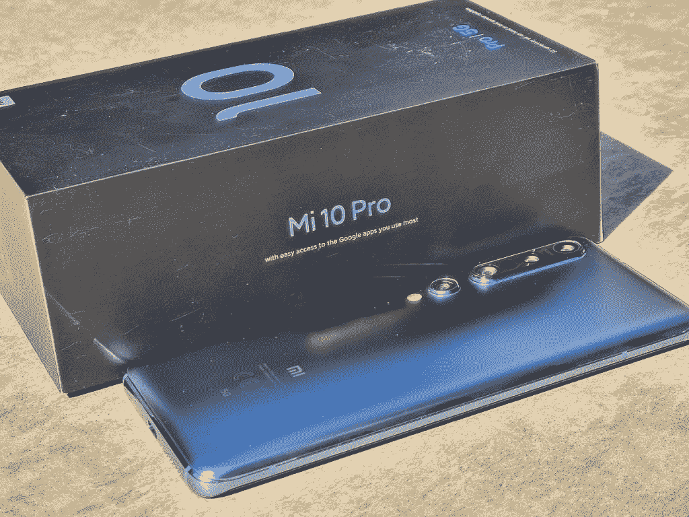

# 据称，谷歌强迫原始设备制造商在零售包装盒上提及 GMS 支持

> 原文：<https://www.xda-developers.com/google-allegedly-force-oems-mention-google-apps-retail-boxes/>

**更新 2(美国东部时间 4/7/2020 @下午 2:10):**我们对此事进行了更多的调查，并对所发生的事情做出了部分解释。阅读下面的更新。

**更新 1 (4/7/2020 @美国东部时间上午 10:50):**小米已就此事发表声明。向下滚动到底部查看更新。

上周，中国消费电子品牌[小米在欧洲部分地区推出了 Mi 10 和 Mi 10 Pro](https://www.xda-developers.com/xiaomi-mi-10-pro-launched-globally-snapdragon-865-108mp-camera-90hz-display/) 。像欧洲销售的大多数 Android 智能手机一样，Mi 10 和 Mi 10 Pro 预装了谷歌应用程序。产品营销中通常不会提到谷歌应用程序支持，因为几乎每部在中国以外销售的安卓智能手机都有这一功能。不过，奇怪的是，欧洲 Mi 10 系列的零售包装盒上有一份声明，宣传谷歌应用套件支持，如上面嵌入的专题图片所示。许多[的中国网民](https://m.hupu.com/bbs/33428654.html)和[的博主](https://xw.qq.com/partner/vivoscreen/20200404A0156700)认为，小米发表这份声明是为了抨击华为无法发布谷歌应用，但小米澄清说，谷歌要求他们发表这份声明。此外，小米表示，谷歌实际上要求所有搭载谷歌应用程序的原始设备制造商都包含这一声明。

 <picture></picture> 

The retail boxes of the Xiaomi Mi 10 and Mi 10 Pro have a statement on the side that reads "with easy access to the Google apps you use most."

要理解这一决定为何在中国引发争议，你需要了解华为的情况。2019 年年中，美国商务部以国家安全为由，将华为及其许多子公司列入“实体名单”。因此，谷歌一直无法与华为签署新的许可协议，阻止后者运送带有谷歌移动服务(GMS)的新智能手机和平板电脑。由于这一限制尚未取消，华为被迫[在欧洲](https://www.xda-developers.com/huawei-p40-pro-specifications-features-pricing-availability/)推出了没有 GMS 的旗舰 P40 系列。这种情况激怒了中国的许多人，他们认为美国不公平地将华为作为目标，以在贸易谈判中获得优势。在贸易禁令后的几个月里，华为智能手机在中国的销量激增，这是由于许多因素，包括[对替代服务的大力投资](https://www.xda-developers.com/huawei-reveals-smartphone-tablet-business-fared-2019/)(华为 [AppGallery](https://www.xda-developers.com/appgallery-huawei-alternative-google-play-store-android/) 、[华为移动服务](https://www.xda-developers.com/huawei-hms-core-android-alternative-google-play-services-gms/)等。)甚至“[爱国消费者购买](https://www.reuters.com/article/us-china-smartphone/huawei-snatched-market-share-from-apple-local-rivals-in-china-in-2019-idUSKBN1ZR2CH)”正是由于华为受到不公平惩罚的情绪，一些中国媒体和消费者将米 10 零售包装盒上的声明视为对华为的攻击。

小米不想失去中国粉丝的支持，很快[在其一个微博账户上发布了一份声明](https://www.weibo.com/5136788508/IBFtKkzde)来解决这个问题。该声明可以大致翻译如下:

> #### 我们注意到小米手机海外市场的包装最新文案有讨论。为了避免误解，解释如下:
> 
> 1.  #### 此文案来自合作方在最新合作协议中的推广要求，类似于安卓手机上显示的“power by android”和电脑上的“intel inside”。
>     
>     
> 2.  #### 由于小米与合作伙伴的上一版本协议已经到期，小米成为新版合作协议的第一批签约厂商，也是生效后第一个发布新品的厂商。
>     
>     
> 3.  #### 我们希望全球手机厂商能与所有合作伙伴顺利合作，打造更丰富的生态系统。

当小米在最新的“合作协议”中谈到对合作伙伴的“推广要求”时，他们可能指的是移动应用分发协议(MADA)中的一项新条款，他们必须签署该协议才能分发谷歌移动服务。这一新规定可能是小米在 Mi 10 零售包装盒上贴上“*轻松访问您最常用的谷歌应用程序*”声明的原因。小米没有说明这一要求是针对他们在国际上销售的所有设备，还是只针对他们在欧洲销售的设备，但他们将这一要求比作谷歌现在要求设备使用的“由 Android 驱动”启动联合品牌。据一位能够接触到欧洲经济区(EEA)最新 GMS 要求文件的消息人士称，没有与小米暗示的新要求相关的措辞。

 <picture></picture> 

Section 1.3 of Google's "GMS Requirements v7.0" document outlines the "Powered by Android" Boot up screen requirements. OEMs that distribute GMS must abide by this requirement.

因此，当小米声明其“协议”的“先前版本”已经过期时，他们很可能意味着他们的 MADA 已经过期，迫使他们与谷歌签署新的协议，以便能够继续在新设备上分发 GMS。这个新的 MADA 可能包含新的营销条款，迫使原始设备制造商在包装盒上提到谷歌应用程序支持。小米表示，他们的协议最近才到期，他们是第一家在新条款生效后发布新产品的 OEM 厂商，这就是为什么新的 Mi 10 似乎是零售包装盒上包含这一声明的第一款设备。小米“新媒体”高级工程师[在他的个人微博账户上声明](https://www.weibo.com/1737735295/IBVBqpfF4)来自摩托罗拉和其他公司的新“海外”旗舰也将包含这一声明。其他小米员工也附和了这一新要求，[一些人](https://www.weibo.com/1569990961/IBFyM8MuT)认为这是谷歌嘲弄华为的虚伪尝试，同时[向美国政府兜售与华为做生意的许可证](https://www.xda-developers.com/huawei-trade-ban-relief/)。

一些中国媒体报道了 Vivo 产品经理的所谓评论，似乎证实了新的要求，但我们无法在微博上找到 T2 的评论。无论如何，小米的声明清楚地表明，谷歌增加了某种条款，要求其 OEM 合作伙伴在新智能手机的零售盒上营销 GMS 支持。我们不知道这一规定何时生效，也不知道这一要求是否会影响所有在中国以外销售的设备。我们联系了谷歌和小米就此事发表声明，如果有回音，我们会更新这篇文章。

*特色图片致谢: [TK Bay](https://twitter.com/tkdsl8655) 为 XDA 开发商*

## 更新一:小米的回应

小米的一位发言人联系了我们，分享了以下声明:

> #### “我们的 Mi 10 系列包装盒上的这条线符合谷歌长期以来的品牌指导方针，旨在帮助确保消费者正确了解设备上的软件。”

小米没有证实米 10 零售包装盒上的线条来自谷歌的新许可要求，但他们证实了他们最初在微博上发布的声明是合法的。

## 更新 2:可能发生了什么

我们了解到，米 10 系列零售包装盒上的这条线与谷歌为 Android 制定的品牌指南是一致的。我们还了解到,《品牌指南》中的这一特定条款已经存在了一段时间，而且其措辞最近没有任何变化。这条线背后的意图是告诉消费者，特定设备提供的谷歌应用比通常预装的更多。谷歌要求所有原始设备制造商安装其应用程序的某个子集；这套应用程序被称为“GMS 核心”，包括谷歌应用程序、谷歌浏览器、谷歌 Play 商店、Gmail、谷歌地图和 YouTube 等应用程序。原始设备制造商可以选择安装其他谷歌应用程序，但并不要求他们这样做。如果他们选择这样做，那么建议他们在包装上加上“方便使用你最常用的谷歌应用程序”。据 TK Bay 报道，小米 Mi 10 预装了 Google Pay、Google Podcasts、Google One、Google Contacts、Google Calendar、Google Lens、Google Assistant 和 Google News。这些应用程序不是 GMS 核心的一部分，也没有预装在大多数其他 GMS 设备上，如三星 Galaxy S20。

这一新发现与小米的最新声明相符。但与上周小米在微博上公开写的内容相矛盾。我们不知道为什么小米告诉中国观众，谷歌要求他们将这一品牌作为新许可协议的一部分。我们向小米寻求进一步的细节。