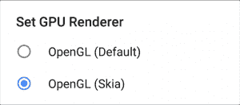

# Android Q+可能会使用 Vulkan 图形 API 来呈现 UI

> 原文：<https://www.xda-developers.com/google-android-q-vulkan-graphics-render-ui/>

Android 的下一个主要版本 Android 9 将于下个月面向多种设备发布。与 Android Oreo 不同，Android P 提供了更多面向用户的功能，如改进的用户界面、导航手势和数字福利，同时还继续致力于 Project Treble。但在幕后，谷歌已经改进了 Android 上图形渲染的工作方式。在 Android Oreo 中，谷歌开始测试 Skia 图形引擎的 OpenGL 硬件加速后端，该后端在 Android P 中完成。然而，谷歌并没有就此止步，因为该公司计划实施 Skia 图形引擎的 [Vulkan 后端](https://skia.org/user/special/vulkan)，该后端将在 Android Q 或更高版本中登陆。

证据来自于一位谷歌工程师提交的关于开源 Chromium Gerrit 的评论。该评论是指一份关于即将为 Android 上的谷歌 Chrome 浏览器实现 Vulkan 图形 API 的错误报告。该评论指出，在未来的某个时候，当“[Android]框架将开始为 HWUI 使用 Vulkan”时，“将需要”为 Android WebView 提供 Vulkan API 支持。

* * *

## Android 中的图形渲染

作为背景知识，Skia 是一个开源的 2D 图形引擎，用于 Google Chrome、Chrome OS、Android、Flutter 和其他主要项目。Skia 是 Android 早期版本中使用的图形渲染引擎，用于渲染[视图](https://developer.android.com/reference/android/view/View)和[画布](https://developer.android.com/reference/android/graphics/Canvas)(这些类用于在大多数应用程序中构建和绘制 UI。)Android 3.0 Honeycomb 用 HWUI 部分取代了 Skia，HWUI 是一个将 Canvas 命令转换为硬件加速的 OpenGL 命令的库，尽管 2D Skia 图形库仍被用于路径光栅化等一些领域。与此同时，谷歌也为 Skia 创建了 OpenGL 后端。结果是，一些图形调用将被调用到 Skia 库，而其他的调用将被调用到 OpenGL 后端。为了清理图形架构，谷歌决定 HWUI 现在将与 Skia 对话，Skia 本身与硬件加速的 OpenGL 后端对话，以进行 UI 渲染。结果是对 UI 框架的图形调用将遵循一条路径，而不是两条。

你们中的一些人可能记得在 Android 8.0 Oreo 的早期开发者预览版中有一个名为“设置 GPU 渲染器”的开发者选项。这个开发人员选项允许您强制 HWUI 使用 Skia 及其硬件加速的 OpenGL 后端作为 UI 框架的 GPU 渲染器。开发人员选项已被删除，因为此行为现在是默认行为。

 <picture></picture> 

"Set GPU Renderer" developer option in Android O Developer Previews

谷歌改善图形渲染的下一步是从 OpenGL 硬件加速后端切换到 Vulkan 硬件加速后端。这一举动一点也不出人意料，也是一个合乎逻辑的进展，但很高兴看到在 Android 上改进图形渲染的工作正在进行。虽然这一举措不会修复 Android 上的所有延迟来源，但它应该会通过减少 CPU 的处理来减少帧渲染时间。鉴于这是一项正在进行的工作(在 Android P 中尚未完成)，我们预计它将与 Android Q 或另一个未来的 Android 版本一起推出。

* * *

## 使用 Vulkan 图形 API 呈现用户界面的预览

现在已经可以在 Android P 上测试 Skia 的 Vulkan 后端了。您可以设置一个调试参数来强制 Android 使用 Skia Vulkan 管道。将下面一行添加到/system/build.prop 后，只需重新启动即可:

```
 debug.hwui.renderer=skiavk 
```

在运行 Android Oreo 的设备上添加这行代码会导致崩溃，所以我们不建议这样做。虽然你的设备在 Android P 上启动时会有这个标志，但目前它还存在很多问题。谷歌 Pixel Launcher 大多无法呈现任何背景，设置中的动画视频无法加载，状态栏和通知也有一些图形故障。除此之外，大多数应用程序，甚至 YouTube 视频和像 Doodle Jump 这样的游戏，似乎都可以正常加载。

非常感谢 XDA 知名开发者 [luca020400](https://forum.xda-developers.com/member.php?u=5778309) 帮助撰写本文，提供显示反汇编 libhwui.so 代码的截图，并提供调试标志来测试 Vulkan 后端。

* * *

来源 1:talking ' Treble:Android 工程师如何赢得碎片化战争[ [ArsTechnica](https://arstechnica.com/gadgets/2018/06/talkin-treble-how-android-engineers-are-winning-the-war-on-fragmentation/3/) ]

*来源 2: Android 图形管道:从按钮到帧缓冲[ [inovex 博客](https://www.inovex.de/blog/android-graphics-pipeline-from-button-to-framebuffer-part-1/) ]*

*来源 3: Skia 网页[ [谷歌](https://opensource.google.com/projects/skia) ]*

*来源 4:罗曼·盖伊的评论，Android Graphics &科特林@谷歌[ [Reddit](https://www.reddit.com/r/androiddev/comments/4kn8sa/vulkan_support_in_android_n/d3gjfyo/) ]*