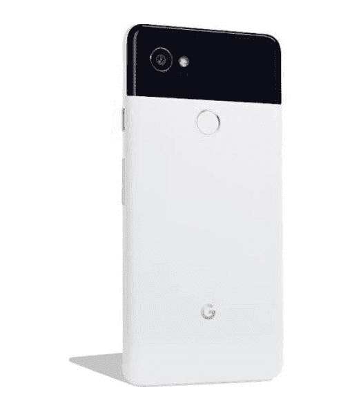

# 谷歌是时候解决其 Android 安全更新问题了

> 原文：<https://www.xda-developers.com/google-android-security-update-issue/>

#### 如果最大、最富有的原始设备制造商做得很糟糕，却没有受到惩罚，我们怎么能指望他们做得更好呢？

三星制造非常好的手机，甚至是很棒的手机。他们也是少数几家真正从设备销售中获利的 OEM 厂商之一，也是仅有的两家获得可观利润的厂商之一。人们喜欢他们的手机，部分原因是因为它们可靠，有用户喜欢的功能，最近他们大大改进了他们的软件。令我们惊讶的是，他们甚至已经取消了一些烦人的重复服务和臃肿软件...还有人记得牛奶音乐吗？在我看来，他们已经走了很长一段路，这对所有 Android 用户来说都是令人兴奋的，因为他们是该平台的标准承担者之一。但尽管如此，三星仍然无法在安全更新方面采取一致行动，这凸显了一个全行业的问题。如果三星做不到这一点，尽管他们在企业和软件安全方面进行了巨大的投资，不难想象其他公司会更加艰难。这就是为什么现在是谷歌最终介入的时候了。

* * *

## 安卓安全，一个永无止境的争议

当我买了我的 Galaxy S9+时，我兴奋不已，原因有很多。在测试了 Note8 Oreo 更新几个月后，我可以毫无疑问地说，三星已经大大改进了他们的软件产品。它感觉比之前基于牛轧糖的构建更快、更平滑、更有性能(不仅仅是在闪烁之后)，这非常令人耳目一新。他们的安全更新也很快。三星会定期让他们的奥利奥测试版运行最新的安全补丁，通常在谷歌宣布公告的一周内推出。原始设备制造商通常会在发布前一个月[得到通知并准备好行动，给他们时间准备第一天的更新，这是大多数人做不到的。三星也刚刚将旗舰机换成了更统一的型号和 SKU 方案。三星没有为每个运营商生产 G965T、G965A、G965V 等型号，而是为骁龙型号和 Exynos 型号分别生产了一款基础型号 G965U 和 G965F。还有其他型号，如 N 和 FD 变体，每个运营商都有自己特定的软件版本，但重要的是，一般来说，我可以将解锁运营商变体软件安装到我的 T-Mobile 手机上，没有任何问题(Knox 失败或其他)。回到过去，你的选择更加有限(T-mobile Note 4 用户可能记得必须刷新加拿大变体图像才能获得更快的更新)。简化模型实际上是许多原始设备制造商在过去几年中所做的事情，因为为单一运营商或市场提供特定硬件的设备并不常见。](https://www.androidcentral.com/android-security-bulletin)

**就软件更新而言，这应该是朝着正确方向迈出的坚实一步**因为他们不再需要支持单个 SKU，而是在软件上为每个运营商区分手机，并且该软件实际上可以与更新的系统文件分开保存。理论上是可靠的系统，但在现实世界的应用中却失败了。**虽然拥有最新最好的安卓版本是好事，但这并不是我认为真正重要的**。我觉得真正重要的是[在安全更新方面保持最新](https://www.xda-developers.com/new-phones-with-old-android-versions-why-security-patches-feature-updates-lessen-the-downsides/)——许多需要 BOYD 更新的 IT 部门也有同样的感觉，而三星还没有提供。LG 也没有，摩托罗拉也没有，HTC 也没有，大多数其他公司也没有。我主要关注三星，因为他们是最大的玩家，拥有最多的资源来为市场其他人树立坚实的榜样，但几乎每个 OEM 合作伙伴都无法在其设备的生命周期内保持持续的安全更新。此外，从懒惰的软件支持到彻底的欺骗，就在几周前，一项大型调查显示**即使 Android OEM 更新了他们的设备，[他们有时实际上并不包含他们声称提供的更新](https://www.xda-developers.com/android-oem-lying-security-patches/)** 。然而可悲的是，Android 安全漏洞几乎每周都会发生，导致大量设备无法修补，即使谷歌已经得到通知，向合作伙伴推送更新，更新他们的 Pixel 设备，并通知公众。同样重要的是回忆一下为什么我们会有安全补丁。

Stagefright 漏洞是迄今为止发现的最大漏洞之一，几乎覆盖了当时所有的 Android 设备。这在 2015 年 7 月底公开，不到一个月，谷歌宣布了他们的 [Android 安全公告计划](https://source.android.com/security/bulletin/2015-08-01)，从那时起每个月都这样做。通过近三年的公告，安全漏洞已经提前得到处理，在它们成为突出数百万暴露的 Android 设备的大量令人尴尬的新闻之前，因此谷歌及其合作伙伴应该为维护这一系统获得一些信任。**但是，当合作伙伴花费数月时间推出补丁**时，仅仅有系统是不够的，这给了恶意个人时间来开发、实施和攻击这些安全漏洞，甚至是全新的设备。我的 Galaxy S9+缺少几十个安全补丁，虽然其中大多数可能不适用于我的设备，并且可能适用于旧的 SOC 或硬件，但没有一个月没有一个补丁可以让我的手机受益。很多时候，我们喜欢指责运营商，特别是在美国，更新缓慢或缺乏更新，但三星也没有让运营商解锁版本的手机保持最新。这是一个*重大*问题，三星……这是一个*可以解决的*问题，谷歌。

这是故事的一部分，我们把责任归咎于它应该承担的地方，尽管三星很糟糕，**谷歌在这里拥有最终的责任，**因为坦率地说，他们没有对他们如何让其他公司管理他们的品牌负责。有像 Essential 这样的好合作伙伴，甚至 Razer 也做了扎实的工作来支持他们的几千名用户和单一型号结构……现在，在你把 *Pixel Pixel Pixel* 扔到我面前之前，听听这个:*谷歌有义务确保他们的 Android 品牌得到很好的代表，而落后近三个月更新的全新旗舰设备没有做好*。谁也不知道谷歌为什么没有站出来迫使合作伙伴就范，尤其是考虑到 Android 已经接连遭遇一个又一个灾难性的安全问题。这可能是因为他们害怕三星和华为走向他们自己的分支，拥有他们自己的应用程序商店，但我认为这不是一个有效的担忧。虽然这些合作伙伴可以做自己的交易，但谷歌 Play 商店有更多的认可和应用，最终用户群的分裂会对最终用户和这些合作伙伴造成损害。然而，还有一个更险恶的动机在起作用，谷歌根本不在乎，他们让 Android OEMs 厂商按照薄弱或不强制的标准做自己的事情的行为确实有助于这种论点。他们的最终目标可能只是拥有更多的用户，开发和利用更多的数据，让几乎不存在的准入门槛得到合作伙伴的支持，特别是那些没有计划支持他们出售的垃圾的合作伙伴。最终，它让谷歌得到了他们想要的数据。不管原因是什么，谷歌必须让他们的合作伙伴达到可接受的标准水平，其中之一应该是每月为所有当前维护的设备及时发布安全更新。**所有 OEM 合作伙伴都应该有一个标准来维护当前的安全补丁，否则将面临失去未来设备的 CTS 验证的风险。**

 <picture></picture> 

The Pixel 2 XL is a solid device, but its hardware under-delivers compared to other flagships

Pixel 品牌很好，是谷歌为合作伙伴建立及时更新基准的方式，但 Pixel 品牌仍然非常小众，三星不太可能在短期内放弃对 Android 市场份额的控制。然而，暂且把软件放在一边，Pixel 手机相对来说不如市场上价格类似的设备。无论是去年晚些时候采用 18:9 还是防水，或者是 LG 今年成为一个糟糕的硬件合作伙伴，至少在某些方面，Pixel 手机与其他可以购买的旗舰产品相比，在硬件价格方面有所下降。三星在第一个月销售的旗舰手机比谷歌希望销售的总和还要多——品牌认知度、营销和硬件或软件功能都发挥了作用，但结果才是最终的价值。Pixel 品牌对市场和思想份额的影响很小，最终，**当人们想到 Android 时，他们会想到世界上的三星、LG 和华为设备** : *所有这些设备甚至都无法正确维护他们的旗舰设备*。

* * *

Android 品牌因其安全缺陷和缓慢的更新而一次又一次地受到抨击，这在很大程度上要归功于这些 OEM 合作伙伴。谷歌终于到了控制这些合作伙伴并让他们为自己的行为负责的时候了，并建立了要求和规则，以确保所有 Android 设备都像应有的那样安全。**多年来，谷歌一直让制造商自己管理软件支持的水平。不，w，谷歌留下的只是对其品牌和形象的严重损害，这种损害可能永远无法挽回。**