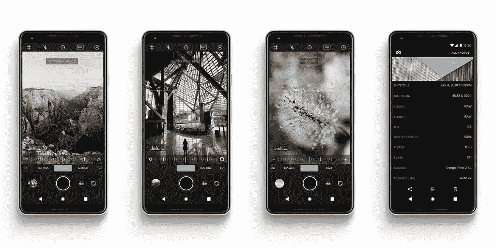

# 谷歌的 CameraX API 允许应用程序使用最好的库存相机功能

> 原文：<https://www.xda-developers.com/google-camerax-android-api-third-party-apps-best-features-stock-camera/>

互联网上流传已久的一个笑话是，你可以通过某人自拍的质量来判断他是否在使用安卓手机。虽然迷因确实有点夸张，但不幸的是，它们背后也有一些真相。Android 手机通常在相机性能方面领先于 iPhones，至少在理论上是如此。LG 和三星等 OEM 厂商倾向于使用比竞争对手 iPhones 像素更多、光圈更大的相机。不过，规格并不代表一切。苹果能够在相机游戏中竞争的部分原因是因为 iOS 的软件。所有的 OEM 厂商，从苹果到中兴，都使用一些软件魔法来使照片和视频看起来更好。这些公司使用算法来减少噪音，调整颜色饱和度和对比度，甚至照亮黑暗的场景，所有这些都是为了使最终结果更加令人满意。从历史上看，这是安卓原始设备制造商落后于苹果的地方。

## 软件开发

然而，最近情况开始发生变化。这种变化最大的例子大概就是谷歌和 Pixel 阵容。硬件方面，像素摄像头真的比不上其他旗舰。不过，软件是谷歌弥补差距的地方。凭借人像模式、夜视、HDR+和超分辨率变焦等功能，Pixels 赢得了市场上一些最好的智能手机相机的声誉。

其他安卓原始设备制造商正在效仿谷歌。三星、OPPO、小米、Vivo、一加等都推出了自己版本的 Pixel 更受欢迎的相机功能，甚至还有一些自己独有的功能。借助“人工智能”和“机器学习”等流行词汇，Android OEMs 厂商正在试图说服你，他们的软件就是你想要增强照片和视频的软件。我们已经到了一个地步，Android 手机可以在相机性能的所有方面真正与 iPhones 竞争。

## 问题是

不幸的是，仍然有一个主要的例外:第三方应用程序。你的超级 50 摄像头旗舰产品可能会通过内置的相机应用程序拍摄出惊人的照片，但切换到 Instagram、Snapchat 甚至第三方相机应用程序，基本上可以保证你拍摄的照片看起来不会那么好。好像这还不够，你还失去了所有很酷的相机功能和模式。这是因为与 iOS 不同，Android 并没有真正统一的摄像头框架。当然，基本特征是有的。第三方应用程序仍然可以拍摄照片和视频，并使用闪光灯。但是如果你的手机有一个广角或长焦的辅助传感器会怎么样呢？开发人员有可能访问第二个传感器，但他们使用的方法必须针对您的设备。

假设你有一台 LG V40(我知道，我知道，想象一下你有)。V40 有三个传感器:标准，长焦和超宽。内置的相机应用程序在所有这些不同的传感器之间切换没有问题。但是忘记在 Instagram 上使用超宽传感器吧。现在，Instagram 可以看看 LG 的相机应用程序如何使用不同的传感器，并为用户开发一种广角或变焦拍摄的方法。但这可能只适用于 LG V40。尽管 Galaxy S10 有相同的三种传感器模式(标准、远摄和超宽)，Instagram 团队还必须为三星开发另一种方法。

现在加入华为、Vivo、一加、小米、OPPO、诺基亚、中兴、HTC，以及任何你能想到的品牌。你可以想象，试图开发一种方法来访问每个品牌的每部手机的潜在额外传感器会非常乏味。然后，你必须保持与所有现有和新手机的兼容性。

这些限制也适用于相机功能。人像模式、夜视和 HDR+等功能要么需要特定的设备方法才能使用，要么第三方应用程序完全无法访问。

显然，对于 Instagram 这样的应用程序来说，这不是什么大问题。这不是他们的重点，你可以先用手机的拍照应用来拍照。但是专用的相机应用程序呢？

## 效果

打开谷歌 Play 商店，搜索“相机”你会找到上百个结果。即使第一方相机软件有所改进，第三方相机应用仍然非常受欢迎。有些旨在提供更多的技术功能，如手动曝光和对焦(这些功能可能是你手机的相机应用程序所没有的)。其他的目标是在你的设备上提供一致的 UX。

尤其是后一个原因，Android 的相机碎片化会使开发和维护一个广泛兼容的相机应用程序变得异常困难。如果你希望提供额外的功能，你将如何包含所有潜在的第一方应用的所有潜在功能？如果您正在寻求一致的体验，您如何切实保证在每台拥有广角传感器的设备上访问该传感器都可以正常工作？

答案是:不能。你可以尝试在尽可能多的设备上支持尽可能多的功能，但最终，这将是一项相对较少回报的大量工作。不难想象，至少有一些开发者已经放弃了为 Android 开发全功能相机应用。事实上，有几个已经。

## 伤亡人数

去 Play Store 上搜索相机应用程序。你会注意到一些事情。第一，有很多选择。第二，他们中的大多数做着非常相似的事情(事后应用过滤器等等)。第三，更高级的选项可能不会经常更新。你甚至可以在谷歌上找到商店里没有的结果。

最近，我们得到了一个相当重要的例子，有人呼吁退出。Moment 决定停止为 Android 开发 Pro 相机应用程序。

Moment 的专业相机应用旨在为 Android 带来先进的照片和视频功能。这些只是其中的几个特征:

*   RGB 直方图
*   分割焦点
*   手动控制曝光、ISO、快门速度和白平衡
*   聚焦峰化
*   原始捕获
*   动态帧速率和分辨率变化

 <picture></picture> 

Moment Pro Camera screenshots. Via: [9to5Google](https://9to5google.com/2020/02/29/moment-pro-camera-app-android-exclusive/)

问题是，这些功能中有很多根本无法在很多设备上运行。看 Moment 的特性兼容列表就像看一张舞池的图片。即使在同一个产品线中，功能支持也非常分散。经过两年的发展，Moment 不再有能力继续开发其应用程序。

*绿色=由 Moment Pro 相机支持。黄色=设备支持，但我的 Moment Pro 相机不支持。红色=设备不支持。图片来源:时刻。通过 [9to5Google](https://9to5google.com/2020/02/29/moment-pro-camera-app-android-exclusive/) 检索。*

## 解决办法？

距离 Android 首次发布已经过去了将近 12 年，但我们可能最终会有一个解决相机碎片的方案。

这个解决方案直接来自谷歌，尽管它没有直接内置到 Android 中。相反，它是一个 [Jetpack 支持库](https://www.xda-developers.com/android-jetpack-camerax-biometrics/)。如果您熟悉开发 Android 应用程序，您可能已经遇到过 AppCompat 和 AndroidX 支持库套件。谷歌的这些库旨在让开发者更容易保持与旧版本 Android 的向后兼容性，同时仍然能够引入新的功能和风格。

Jetpack(某种程度上)的新成员是 CameraX 库。与其他 Jetpack 库类似，CameraX 的目标是让相机开发更容易。在其最基本的形式中，CameraX 包装了 Android 的 [Camera2](https://medium.com/google-developers/detecting-camera-features-with-camera2-61675bb7d1bf) ，这是一个 API，允许应用程序探测设备上的相机功能，前提是 OEM 将这些相机功能暴露给 API。用户可以使用 Camera2 API Probe 应用程序检查向 Camera2 API 公开了哪些相机功能，然后将其与库存相机应用程序中可用的功能进行比较。

使用 CameraX 作为 Camera2 API 的包装器的好处是，在内部，它解决了可能出现的任何特定于设备的兼容性问题。这本身对相机应用程序开发人员就很有用，因为它可以减少样板代码和研究相机问题所花费的时间。然而，这并不是 CameraX 能做的全部。

虽然第一部分只对开发人员感兴趣，但还有一部分对开发人员和最终用户都适用:[供应商扩展](https://developer.android.com/training/camerax/vendor-extensions)。这是谷歌对 Android 上相机功能碎片化的回答。设备制造商可以选择在手机中附带扩展库，允许 CameraX(以及开发者和用户)利用原生相机功能。比如说你很喜欢三星的人像模式效果，但是你不喜欢相机 app 本身。如果三星决定在其手机中实现 CameraX 人像模式扩展，任何使用 CameraX 的第三方应用程序都将能够使用三星的人像模式。显然，这不仅仅局限于那一个特性。制造商理论上可以向使用 CameraX 的应用程序开放他们的任何相机功能。

不幸的是，有一个警告，我之前提到过:这不是制造商的要求。谷歌表示，从 Pixel 4 开始，他们将支持所有新的和即将推出的 Pixel 设备的扩展。 [OPPO 表示](https://www.xda-developers.com/oppo-google-camerax-api-third-party-camera-apps-beauty-hdr/)他们已经开启了美颜和 HDR 模式。其他原始设备制造商可以选择只让 CameraX 使用他们的夜间模式，或者他们可以选择根本不实现任何扩展。哪种设备支持哪种 CameraX 扩展(如果有的话)，完全取决于制造商。谷歌[过去维护一个支持厂商扩展的设备](https://android.googlesource.com/platform/frameworks/support/+/refs/heads/androidx-master-release/camera/camera-extensions/ExtensionsSupportedDevices.md)列表，以及他们开放了哪些相机功能，但他们在过去的几个月里没有更新列表。几周前，我们联系了谷歌，询问他们是否可以提供一份更新的名单，但该公司尚未回复名单。值得一提的是，谷歌最近的一篇博客文章称，三星、LG、OPPO、小米和摩托罗拉(在 Android 10 上)的设备提供了一些扩展功能，但这篇博客文章没有具体说明支持哪些设备或它们提供什么功能。

如果有足够多的制造商决定实现扩展，Android 的第三方相机场景将会更加明亮。开发人员不必浪费时间尽可能地为每台设备重新实现相机功能，因为 CameraX 的框架会负责这项工作。将会有更少的功能碎片，因为跨设备的相似功能将可以通过公共接口来访问。还有更多的可能性。

* * *

当然，这一切都取决于谷歌说服制造商实现 CameraX 供应商扩展库的能力。除非 CameraX 被广泛实现，否则它只会增加当前的碎片化。不过，就我个人而言，我充满希望。如果谷歌愿意的话，它可以非常令人信服，而且似乎有很多工作正在进入 CameraX。看到 Android 摄像头问题的可能解决方案即将出现令人兴奋，我期待看到 CameraX 如何随着时间的推移而改进和扩展。

你对 CameraX 有什么看法？谷歌为安卓做统一的拍照体验会成功吗？