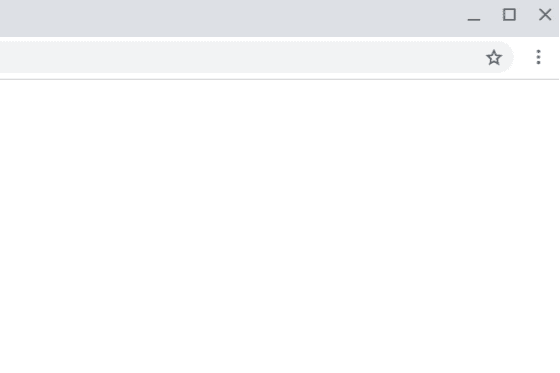
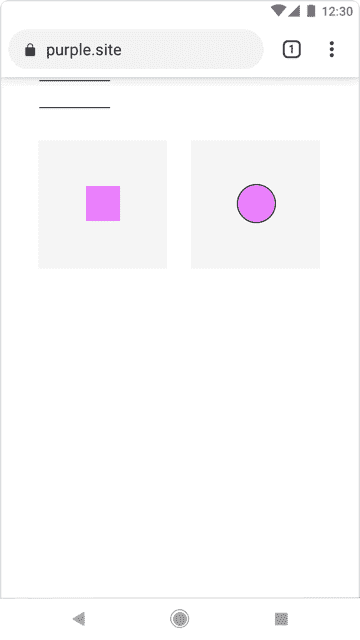

# 谷歌 Chrome 84 将自动最小化滥用许可/通知请求

> 原文：<https://www.xda-developers.com/google-chome-84-abusive-notifications-permissions-requests/>

# 谷歌 Chrome 84 将自动最小化滥用许可/通知请求

谷歌 Chrome 正在采取下一步措施，打击滥用通知请求和许可请求的网站。

今年早些时候，谷歌 Chrome 80 开始让网站通知提示[变得不那么侵扰](https://www.xda-developers.com/google-chrome-annoying-notification-prompts/)。默认情况下，这些“更安静”的通知是为通常阻止通知请求的人和选择加入率低的网站启用的。谷歌正在采取下一步措施打击滥用通知和权限请求的网站。

网站可以通过多种方式滥用权限和通知请求。大多数时候，通知请求只是很烦人，但它们也可能是欺骗性的。网站可能要求用户启用通知来访问内容。虚假的聊天消息和警告是另一种常见的误导策略，目的是让用户允许权限。从 Chrome 84 开始，浏览器将自动最小化这些滥用请求。

 <picture></picture> 

desktop UI

具有滥用权限请求和通知的网站将自动注册到谷歌 Chrome 的前述[更安静的通知 UI](https://www.xda-developers.com/google-chrome-annoying-notification-prompts/) 中。此外，通知提示将告知用户该网站可能试图欺骗他们。如果网站需要通知才能查看内容，您会在访问菜单时看到一条信息，上面写着“此站点可能试图欺骗您允许侵入式通知”。

 <picture></picture> 

mobile UI

警告信息会出现在 Chrome 的桌面和手机上，如上图。网站所有者可以查看搜索控制台，看看他们是否收到了任何[滥用通知报告](https://www.google.com/webmasters/tools/abusive-notifications-unverified?pli=1)。对于用户来说，这些变化将只适用于新的通知请求，但在未来，谷歌可能会为滥用网站已经授予的权限添加保护。

谷歌 Chrome 84 定于 2020 年 7 月 14 日发布至 stable。

* * *

**来源:[谷歌](https://blog.chromium.org/2020/05/protecting-chrome-users-from-abusive.html)**