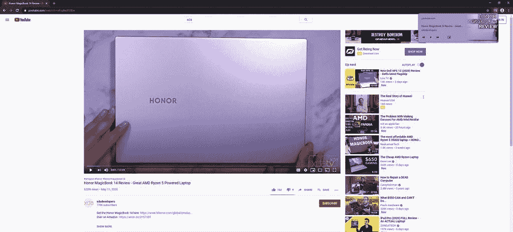

# 谷歌浏览器的“媒体订阅”允许网站向你推荐视频

> 原文：<https://www.xda-developers.com/google-chrome-media-feeds-recommendations/>

# 谷歌 Chrome 获得了“媒体订阅”功能，因此网站可以向你推荐视频

Chrome 最近为音频和视频提供了新的媒体控制。现在，谷歌正在努力扩展这一功能，以包括视频推荐。

浏览器被用于很多方面，但是互联网的很大一部分是媒体消费。谷歌一直在慢慢地为 Chrome 添加功能，让用户获得最佳的流媒体体验。这就是为什么今年早些时候 Chrome 获得了一个新的媒体控制工具来控制当前正在播放的音频和视频。现在，谷歌希望通过引入“媒体馈送”功能来进一步增强 Chrome 上的媒体播放，以便网站可以进行视频推荐。

 <picture></picture> 

Google Chrome's media control tool.

Chromium Gerrit 刚刚合并了一个提交，增加了一个名为“启用媒体订阅”的特性标志。标志的描述为“启用媒体馈送功能，该功能允许我们从支持该功能的网站获取媒体项目的馈送。那么这个“媒体馈送”到底是什么？"

本质上，媒体源是提供视频内容的网站创建推荐视频源的一种方式。想想看，像网飞和 YouTube 这样的流媒体网站总是有推荐视频让你接下来观看。媒体提要将基于网站希望它是什么，它将显示在浏览器中，类似于前面提到的媒体控件。

谷歌正在为网站提供一个 API，允许他们使用这个功能。如果一个网站支持媒体源，它可以告诉 Chrome 用户它有一个源，推荐相关内容，推荐内容“继续观看”，并推荐内容“下一个播放”。所有这三个建议都有不同的使用案例。相关内容可以让用户开始观看某些内容，“继续观看”是针对用户已经开始观看的内容，“播放下一个”是针对视频结束后要观看的内容。

媒体目前仅限于视频内容，所以没有音乐或播客。该标志可以在除 Android 之外的所有 chrome 平台上的*Chrome://flags # enable-media-feeds*启用。该功能目前在最新的金丝雀版本中，所以它需要一段时间才能发布到最新的稳定版本中。即便如此，在网站支持它之前，它不会超级有用，但这可能是未来一个方便的媒体功能。