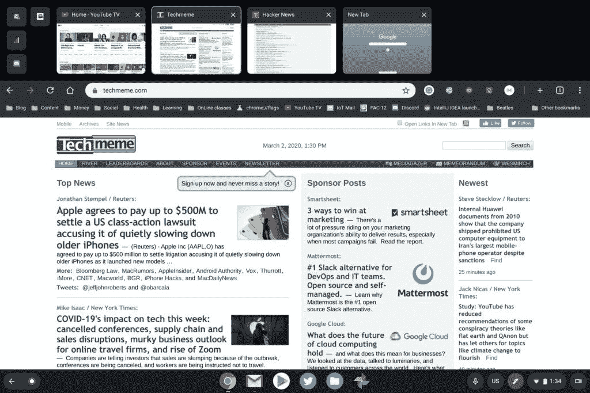

# 谷歌为 Chromebooks 推出 Chrome OS 80 稳定版

> 原文：<https://www.xda-developers.com/google-chrome-os-80-chromebook-changes/>

# Chrome OS 80 推出了 Debian Buster for Linux 安装，Android 应用程序侧加载支持，以及更好的平板电脑模式准备

谷歌正在向 Chromebooks 的稳定渠道推出 Chrome OS 80，带来了无需开发模式即可下载 Android 应用的能力，以及更多变化。

昨天，谷歌[在 Chrome Releases 博客上宣布](https://chromereleases.googleblog.com/2020/03/stable-channel-update-for-chrome-os.html)Chrome OS 版本 80.0.3987.128 正在稳定发布渠道上为 Chromebooks 推出。在今天早上因为一个未公开的原因短暂暂停推出之后，Chrome OS 80 稳定更新[再次向大多数支持的 Chromebook 设备推出](https://cros-updates-serving.appspot.com/)。以下是你应该知道的最新更新中最重要的变化，由 [*关于 Chromebooks*](https://www.aboutchromebooks.com/news/chrome-os-80-stable-channel-arrives-heres-what-you-need-to-know/) 提供。

*   **新的 Linux 容器安装使用 Debian Buster 而不是 Stretch:** 去年 11 月，[我们注意到](https://www.xda-developers.com/chrome-os-80-debian-10-buster-linux-installations/)新安装的 Crostini 将基于 Debian 10“Buster”，Crostini 是谷歌允许在 Chrome OS 上运行 Linux 应用程序的项目的代号自从 Chrome OS 上 Linux 应用程序支持的最初发布以来，Crostini 的安装都是基于 Debian 9“Stretch”的。高级用户可能已经将他们的 Linux 容器升级到 Buster，或者甚至切换到完全不同的发行版。
*   **平板模式下的 Chrome OS 标签条界面:**谷歌正在测试新的标志，这些标志将使 Chrome 浏览器在平板模式下的多任务处理更加用户友好。如果你在 chrome://flags 中启用了“webui-tab-strip”、“new-tabstrip-animation”和“scrollable-tabstrip”标志，你应该会在顶部看到 chrome 的 tabstrip 的新 ui。与标准的标签行不同，新的 UI 显示了一个水平滚动的卡片列表，并带有每个标签的预览。锁定的选项卡排列在左侧的列中。打开的标签数量显示为菜单按钮左侧的图标，旁边还有一个“+”图标，可以打开一个新标签。<picture></picture>

    Chrome OS 80 中新标签页脚本界面 in-development。来源:[关于 chrome books](https://www.xda-developers.com/chrome-os-80-debian-10-buster-linux-installations/)

*   **无开发者模式侧装 Android 应用:**在 Chrome OS 80 中，你不再需要在 Chromebook 上启用开发者模式才能侧装 Android 应用。不幸的是，这种方法只适用于开发者，所以[你必须使用一些 ADB 命令](https://www.xda-developers.com/chrome-os-80-sideload-android-apps/)来下载你选择的 Android 应用。
*   **自动旋转的错误修复:**据谷歌称，当你试图在平板模式下将鼠标与设备配对时，会禁用自动旋转的错误已经得到修复。这意味着您现在无需手动旋转屏幕即可配对鼠标。

稳定版本现已推广到大多数受支持的 Chromebooks。下一个稳定的 Chrome OS 版本将是 81 版。该更新计划于 2020 年 3 月 24 日发布。