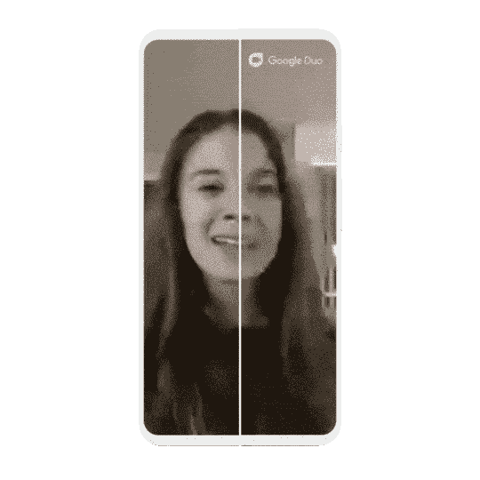

# Google Duo 增加了 AV1 编解码器、时刻和保存消息

> 原文：<https://www.xda-developers.com/google-duo-av1-moment-screenshots-saving-messages/>

数百万人由于就地避难或待在家里的命令而被困在家里，使许多人无法面对面地见到他们的朋友和家人。幸运的是，我们生活在一个可以通过视频通话应用虚拟见面的时代。Google Duo 是一个流行的视频和音频通话应用程序，因为它是谷歌核心移动服务的一部分，是一个伟大的，易于使用的应用程序。现在，随着新特性的加入，它变得更好了，包括面向用户和后端。

**用于视频通话的 AV1 视频编解码器**

本月早些时候，谷歌详细介绍了他们的 [WaveNetEQ 机器学习模型](https://www.xda-developers.com/google-duo-ai-waveneteq-machine-learning-model-audio-call-quality/)如何提高 Duo 的音频质量。今天，谷歌宣布他们将启用 AV1 (AOMedia Video 1)视频编解码器进行视频通话。这将提高视频通话的质量和可靠性，尤其是如果您的连接带宽较低。AV1 是一种[免版税视频编解码器](https://www.xda-developers.com/av1-future-video-codecs-google-hevc/)，旨在取代 H.264 成为在线流媒体和媒体消费的首选编解码器。与 H.264 编码的视频相比，AV1 编码的视频在压缩过程中丢失的细节较少。AV1 视频编解码器的一个缺点是，除了[联发科天玑 1000](https://www.xda-developers.com/mediatek-dimensity-1000-7nm-soc-integrated-5g/) 之外，没有移动处理器支持硬件解码。这意味着以 AV1 编码的 Google Duo 视频通话可能对播放性能要求更高，因此会消耗更多电池。

 <picture></picture> 

Side by side comparison of an incoming video call at 30kbps with Google's new AV1 (AOMedia Video 1) video codec technology on the left.

目前还不清楚 AV1 将用于所有视频通话还是仅用于低带宽情况。

**《二重奏时刻》**

早在 12 月，我们[发现了证据](https://www.xda-developers.com/google-duo-69-tests-sharing-current-image-moment-during-video-calls/)表明谷歌将允许用户捕捉视频通话的并排截图作为“时刻”这项功能在最新的 Google Duo 版本中已经在[上线](https://support.google.com/duo/answer/9759710)。当一个人捕捉到阿朵时刻时，视频通话中的每个参与者都会收到通知，并且图像会保存到每个参与者的图像库中。要启用 Moments，请进入设置>通话设置并打开 Duo moments。所有视频通话参与者都必须启用该功能来捕捉阿朵时刻，尽管用户仍然可以在没有启用 Duo moments 的情况下拍摄视频通话的截图。

**保存信息**

Google Duo 允许用户在收件人无法接听电话时向联系人发送个性化的语音和视频消息。自最初发布以来，谷歌已经通过添加[表情反应](https://www.xda-developers.com/google-duo-emoji-reactions-video-messages/)、增强现实效果、[笔记和涂鸦](https://www.xda-developers.com/google-duo-update-adds-notes-doodles/)等方式扩展了消息功能。很快，用户将能够保存发送给他们的信息。以前，邮件会在 24 小时后自动过期。

我们最近了解到，该公司正计划为消息推出隐藏字幕，但他们尚未就这一功能发布公告。

* * *

3 月下旬，[谷歌将群组通话的人数限制增加到了 12 人。在未来几周，谷歌将进一步提高这一限制。当我们发现新功能或谷歌发布任何公告时，我们会更新您的信息。您可以从下面的 Play Store 链接下载最新版本的 Google Duo 应用程序。](https://www.xda-developers.com/google-duo-group-video-calling-live/)