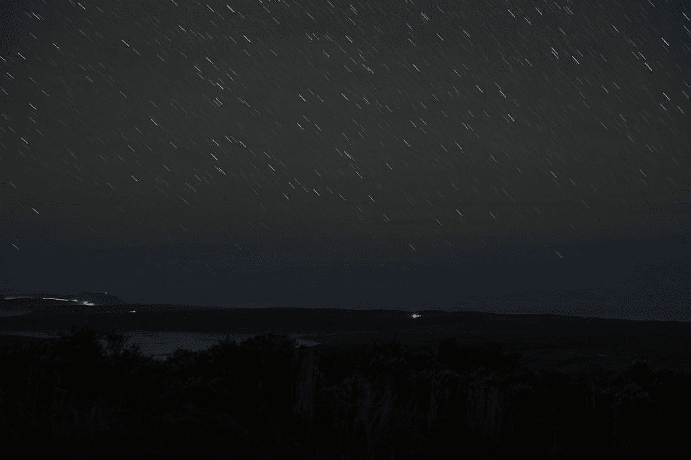
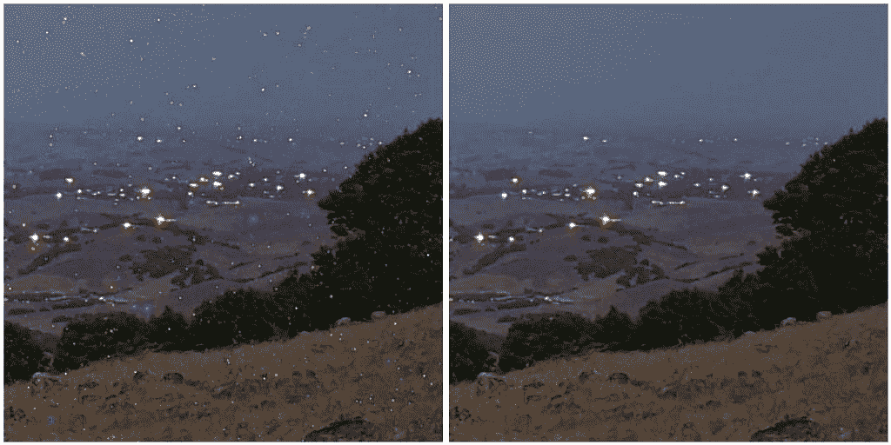
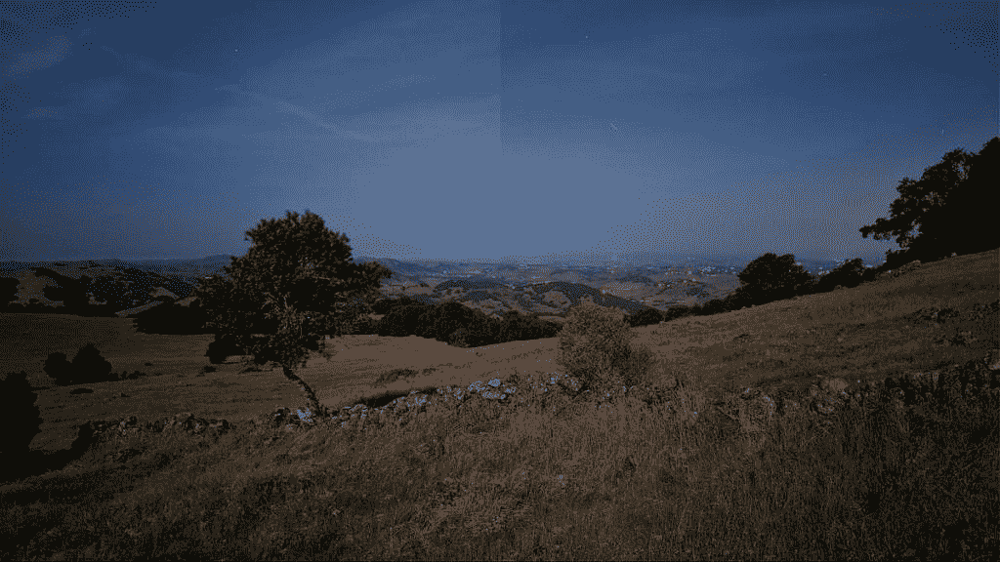

# 谷歌解释 Pixel 4 的天文摄影，分享技巧和窍门

> 原文：<https://www.xda-developers.com/google-explains-pixel-4s-astrophotography-works-shares-tips/>

甚至在谷歌[推出 Pixel 4 系列](https://www.xda-developers.com/google-pixel-4-specs-features-pricing-availability/)之前，它的天体摄影模式就引起了全球用户的关注。谷歌相机应用程序中新的增强夜间模式设置允许用户拍摄星空的惊人照片。然而，捕捉你可能在社交媒体上看到的照片并不像看起来那么容易。你需要记住几个参数来捕捉一个像样的镜头，这就是为什么谷歌现在发布了一些关于新功能的急需的见解。

**[像素 4 论坛](https://forum.xda-developers.com/pixel-4)**| |**|[像素 4 论坛](https://forum.xda-developers.com/pixel-4-xl)**

在最近一篇题为“像素手机上的夜视天文摄影”的博客文章中，谷歌的弗洛里安·凯因斯和基兰·默西解释了这种新模式是如何产生的。这篇文章谈到了该公司的内部工作方式，并透露了工程师如何确定每一帧的曝光时间和捕捉帧数的关键细节，以实现最佳效果，同时避免任何运动模糊。

 <picture></picture> 

Motion-blurred stars in a single-frame two-minute exposure.

然后，它揭示了该公司如何解决暗电流问题，暗电流导致 CMOS 图像传感器记录不正确的信号，导致单个像素点亮，即使它们没有暴露在同样多的光线下。为了解决这个问题，该公司比较了同一帧内和帧序列中相邻像素的值，以寻找异常值。然后，它通过将其与邻居的平均值隐藏来消除这些异常值。

 <picture></picture> 

Left: A small region of a long-exposure image with hot pixels, and warm pixels caused by dark current nonuniformity. Right: The same image after outliers have been removed. Fine details in the landscape, including small points of light, are preserved.

谷歌然后谈到场景构成，以及他们如何在夜视中显示“快门后取景器”，以帮助用户看到他们拍摄的内容。如果没有这个实现，你会看到一个灰色的屏幕，这使得合成镜头非常困难。由于类似的原因，自动对焦是该公司面临的另一个问题，为了解决这个问题，它实施了“快门后自动对焦”。这项新功能捕捉了两个自动对焦帧，曝光时间长达一秒，即使在光线较暗的情况下也能帮助检测图像细节。这些帧有助于 Pixel 4 的相机正确地聚焦在主体上，但不会直接影响最终的图像。

 <picture></picture> 

Left: The live Night Sight viewfinder in a very dark outdoor environment. Except for a few points of light from distant buildings, the landscape and the sky are largely invisible. Right: The post-shutter viewfinder during a long exposure shot. The image is much clearer; it updates after every long-exposure frame.

最后，谷歌必须改变其处理夜视照片中天空的方式，以提供可信的结果。这种处理不仅有助于让天空看起来更暗，就像你在晚上看到的那样，而且还增加了天空特定的降噪功能，并选择性地增加对比度，以使某些特征更加突出。

 <picture></picture> 

A landscape picture taken on a bright full-moon night, without sky processing (left half), and with sky darkening (right half). Note that the landscape is not darkened.

在开发和测试夜视天文摄影的过程中，谷歌的工程师们也获得了一些拍摄户外夜间照片的经验。为了帮助你用 Pixel 设备(或任何带 [GCam mod](https://www.xda-developers.com/google-camera-px-mod-manual-forced-astrophotography-light-painting-mode-pixel/) 的手机)拍摄更好的夜景照片，该公司分享了一系列技巧和诀窍。你可以通过点击[这个链接](https://drive.google.com/file/d/18tdBq1ROkQ9FGHtWd1RFtRC_7byOg-ji/view)找到一些技巧和窍门，显著提高你的夜视天文摄影图像的质量。你可以点击下面的链接，了解更多关于 Pixel 4 天文摄影功能的详细信息。

* * *

**来源:[谷歌博客](https://ai.googleblog.com/2019/11/astrophotography-with-night-sight-on.html)**