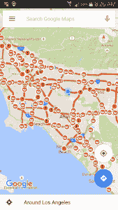

# 谷歌地图将很快允许你分享你的预计到达时间，添加一个到常规目的地的快捷方式，并创建一个你的位置历史的地图

> 原文：<https://www.xda-developers.com/google-maps-will-soon-allow-you-to-share-your-eta-add-a-shortcut-to-routine-destinations-and-create-a-map-of-your-travels/>

虽然谷歌的许多第一方应用程序在谷歌 I/O 过程中得到了很好的更新，但谷歌地图不在其中。新的 Android N 开发者预览版有一个小的更新，允许你在地图上看到你的联系人并分享你的贡献，但除此之外，没有什么真正重要的东西被带到桌面上。

在昨天发布到 Play Store 的最新谷歌地图更新版本 9.26.1 中发现的新证据表明，谷歌即将推出一系列令人兴奋的全新生活质量和无障碍功能。我们发现的最突出的功能之一是能够**与其他人分享你的 ETA** ，**创建快捷方式**开始导航到你最常见的目的地，以及能够创建你的位置历史的**私人地图**。

*免责声明:我们从一个应用程序的 APK 文件中挖掘出的证据并不是决定性的。谷歌可能会选择在未来的版本中不加任何提示地推出这些功能。*

* * *

**分享你的预计到达时间**

 <picture></picture> 

The Day Los Angeles Rained (Credits: Imgur user redoakpoison)

我们都经历过。你正和你的朋友和家人去参加一个聚会，但是由于一些不可预见的交通事故，你被困在一个没有移动车辆的网格锁中。你焦虑地坐在方向盘后面，(*希望不是，但可能是*)给你的联系人发短信更新你需要多长时间到达那里。我们都知道统计数据——[开车时发短信](http://www.cdc.gov/motorvehiclesafety/distracted_driving/)是道路上机动车事故的主要促成因素。但是你*真的*必须让你的朋友和家人知道你在哪里，什么时候去。这就是为什么谷歌似乎要增加一个按钮，让你可以快速分享你的预计到达时间，并快速介绍当前的交通状况。你也可以选择**自动发送关于你旅行进度的更新**，以防你的爱人焦急地多次发短信问你还需要多长时间。

`<string name="SHARE_ETA_BUTTON">Share ETA</string>`

<string name="SHARE_ETA_MESSAGE_HEAVY_TRAFFIC_FORMAT">在去%1$s 的路上。交通拥挤。应该在% 2＄s 到达那里</string>

<string name="SHARE_ETA_MESSAGE_LIGHT_TRAFFIC_FORMAT">在去%1$s 的路上。交通不畅。应该在% 2＄s 到达那里</string>

<string name="SHARE_ETA_MESSAGE_NORMAL_TRAFFIC_FORMAT">在去%1$s 的路上。正常交通。应该在% 2＄s 到达那里</string>

<string name="SHARE_ETA_MESSAGE_NO_TRAFFIC_FORMAT">在去% 1＄s 的路上，应该在% 2＄s 到达那里</string>

<string name="SHARE_ETA_PROMO_DISMISS_TEXT">明白了</string>

<string name="SHARE_ETA_PROMO_TEXT">“点击告知他人你已经离开&发送你的进度更新”</string>

<string name="SHARE_ETA_PROMO_TITLE">分享你的旅程</string>

<string name="SHARE_SUBTITLE">共享</string>

* * *

**常用目的地快捷方式**

如果你经常使用谷歌地图去某个地方旅行，那么你可能会对每次想去那里都必须在导航菜单中输入目的地感到恼火。为什么不创建一个到目的地的主屏幕快捷方式呢？(*说真的，为什么不呢？许多人可能没有意识到他们甚至可以做这样的事情，所以谷歌现在将向经常旅行某条路线的用户宣传这项功能。*

`<string name="CREATE_DIRECTIONS_SHORTCUT_DISMISS_TOAST">Add it later from the overflow menu.</string>`

<string name="CREATE_DIRECTIONS_SHORTCUT_MENU_ITEM">将路线添加到主屏幕</string>

<string name="CREATE_DIRECTIONS_SHORTCUT_NUDGEBAR_DESCRIPTION">点击此处以将主屏幕快捷方式添加到此路线</string>

经常来这里吗？添加这条路线

<string name="CREATE_DIRECTIONS_SHORTCUT_POPUP_ACCEPT">添加快捷方式</string>

<string name="CREATE_DIRECTIONS_SHORTCUT_POPUP_DISMISS">不，谢谢</string>

<string name="CREATE_DIRECTIONS_SHORTCUT_POPUP_TITLE">下一次，通过在设备的主屏幕上添加快捷方式来更快地获取到这个地方的路线</string>

<string name="CREATE_DIRECTIONS_SHORTCUT_TOAST">该路线的快捷方式被添加到设备的主屏幕</string>

* * *

**您的位置历史地图**

使用桌面版谷歌地图的人可能知道[谷歌的位置历史页面](https://maps.google.com/locationhistory)，它将你过去几个月的位置叠加到地图上。现在，这一功能似乎也将转向 Android。以前，用户只能在谷歌地图应用程序中每天循环浏览他们所在位置的时间线。

`<string name="MULTI_ILLUSTRATION_LOCATION_HISTORY_PROMO_TEXT">Creates a private map of where you go with your signed-in devices. %s</string>`

<string name="MULTI_ILLUSTRATION_PROMO_TITLE">从谷歌地图中获得更多魔力</string>

* * *

**无障碍增强功能**

与任何其他谷歌应用程序更新一样，还有一些更小的增强功能隐藏起来，以提高更特殊用例的易用性。然而，考虑到有多少人使用谷歌的服务，这些功能肯定会受到很多很多人的欢迎，即使它们不会影响到我们其他人。

首先，对于坐轮椅的谷歌地图用户来说，该应用程序现在会告诉你哪些地方可以坐轮椅，这样你就可以很快知道这个地方是否可以容纳你。

`<string name="ACCESSIBILITY_WHEELCHAIR_ACCESSIBLE">Wheelchair accessible</string>`

接下来，如果你经常使用谷歌地图寻找驾驶以外的旅行方式，那么当你无法通过你选择的方法到达目的地时，一项新功能将会提示你。例如，如果没有到达目的地的公共交通路线，谷歌地图会显示一条提示信息，告诉你不能乘坐公共交通到达目的地。一个小的，但俏皮的信息，让你可以迅速完善你的旅程。

`<string name="DESTINATION_REFINEMENT_NON_NAVIGABLE_BICYCLE_TOAST_TEXT">"Can't get there by cycling, using original destination."</string>`

<string name="DESTINATION_REFINEMENT_NON_NAVIGABLE_TAXI_TOAST_TEXT">“无法乘坐出租车到达，使用原目的地。”</string>

<string name="DESTINATION_REFINEMENT_NON_NAVIGABLE_TRANSIT_TOAST_TEXT">“乘坐公共交通工具无法到达，使用原始目的地。”</string>

<string name="DESTINATION_REFINEMENT_NON_NAVIGABLE_WALK_TOAST_TEXT">“走着去不了，用原来的目的地。”</string>

最后，如果你要去一个很可能会失去数据连接的偏远地区旅行，那么你应该下载一个离线的目的地路线图，以防你不小心退出导航，需要重新开始。如果你忘了这么做，谷歌地图现在会自动要求你下载该地区的离线路线，如果它检测到该地区将有不稳定的数据连接。

`<string name="DIRECTIONS_OFFLINE_PROMO_AREA">Tap to download offline directions for this area</string>`

<string name="DIRECTIONS_OFFLINE_PROMO_ROUTE">点击下载离线路线指示，了解您路线上不稳定的连接</string>

* * *

**杂项更新**

在我们之前对谷歌应用的拆除中，我们发现了一个即将推出的功能，它将显示你所在地区的热门搜索。看起来谷歌正在将这一功能引入其目录中的其他应用程序，因为现在谷歌地图应用程序将显示你周围地区新的和受欢迎的地方。这对于那些已经在一个地区生活了很长时间，但希望尝试一些新的和令人兴奋的东西的人，或者那些正在参观一个地方并想看看那个地区有什么有趣的东西的人来说可能是有用的。

`<string name="ROVER_NOTIFICATIONS_OPT_IN_ACTIONABLE_TOAST">New &amp; popular places notifications turned on.</string>`

<string name="ROVER_NOTIFICATIONS_OPT_IN_TOAST">新&热门地点通知开启。若要关闭，请访问您的通知设置。</string>

<string name="ROVER_NOTIFICATION_SETTINGS_SUMMARY">获取您附近新的热门地点的更新信息</string>

<string name="ROVER_NOTIFICATION_SETTINGS_TITLE">新的和受欢迎的地方</string>

最后，对于那些喜欢跟踪你的驾驶情况的人([尤其是那些出于税收目的需要这样做的人](http://www.xda-developers.com/tasker-pro-create-an-irs-compliant-mileage-tracker-and-get-money-back/))，你会喜欢新的地图功能，它将跟踪你驾驶了多少英里，甚至祝贺你驾驶了英里数的新里程碑。万岁！

`<string name="SWIPE_MILESTONE_SHARE_TITLE">Share milestone to...</string>`

<string name="SWIPE_ODOMETER_CONGRATULATIONS">恭喜</string>

* * *

这就是我们在最新的谷歌地图更新中找到的全部内容。当我们调查谷歌应用程序的新功能和未来功能时，请继续关注我们系列的后续文章。