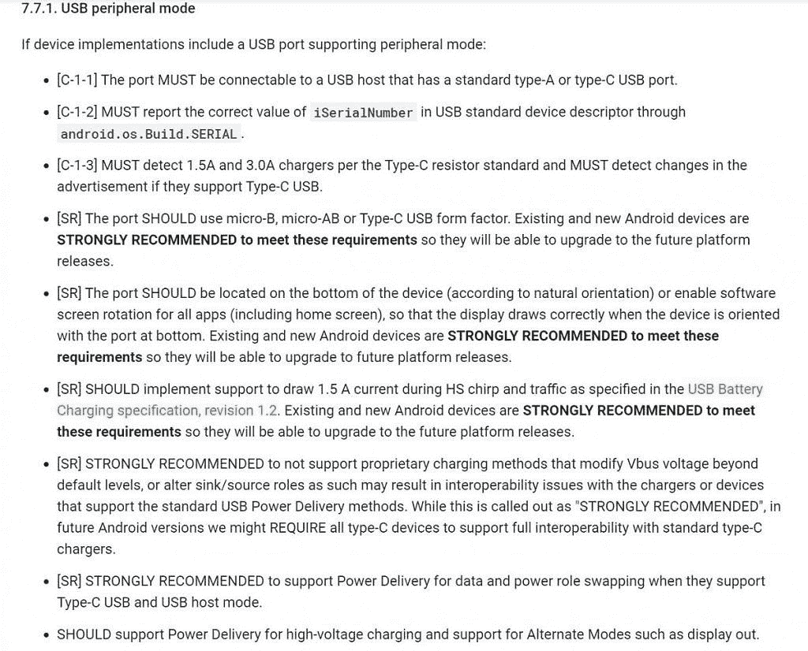

# 谷歌要求使用 Type-C 的新 Android 设备不能破坏 USB-PD

> 原文：<https://www.xda-developers.com/google-new-android-devices-type-c-support-usb-pd/>

智能手机的充电技术已经有了很大的进步，至少在安卓方面有了很大的进步。各公司正在推动充电解决方案，提供 [50W](https://www.xda-developers.com/realme-x2-pro-coming-snapdragon-855-plus-90hz-display-64mp-camera/) 、 [65W](https://www.xda-developers.com/oppos-65w-supervooc-4000mah-battery-30-minutes/) ，甚至 [100W](https://www.xda-developers.com/xiaomi-demos-100w-super-charge-turbo/) 的电力。这些快速充电技术减少了对大电池的需求，尽管我认为它们仍然不能成为公司在新智能手机上包装小电池的借口。所有这些竞争技术的最大问题是，它们通常是专有的，所以它们要求你拥有制造商的充电电缆和砖块。对于带有 USB Type-C 端口的设备，有一个开放的快速充电标准，称为 USB Power Delivery (USB-PD)，但很多时候采用专有充电技术的设备与 USB-PD 充电器不兼容。谷歌正在推动原始设备制造商改变这种状况。

USB 功率传输理论上可以提供高达 100W 的功率，但很少有智能手机制造商完全依赖 USB-PD 进行快速充电，没有一家接近 100W 的功率。我见过最快的是[三星为 Galaxy Note 10 设计的 45W 充电器](https://www.xda-developers.com/samsung-galaxy-note-10-superfast-charge-confirmed/)，它使用 PD 3.0 可编程电源，即 PPS。我无法解释为什么除了谷歌和三星之外的原始设备制造商没有采用 USB-PD，但谷歌已经在幕后工作了几年，以确保至少具有专有充电解决方案的设备不会破坏与标准 Type-C 充电器的兼容性。事实上，2016 年末发布的 Android 7.0 牛轧糖的[兼容性定义文件包含“强烈建议”原始设备制造商“不支持...可能会导致支持标准 USB 供电方式的充电器或设备出现互操作性问题。”尽管谷歌当时没有实施任何改变，但谷歌警告说，“在未来的 Android 版本中，我们可能会要求所有的 type-C 设备支持与标准 type-C 充电器的完全互操作性。”](https://www.xda-developers.com/android-7-0-compatibility-document-released-plenty-of-changes-in-tow/)

 <picture></picture> 

Section 7.7.1 "USB Peripheral Mode" from the Compatibility Definition Document for Android 10\. The wording introduced with the CDD for Android 7.1 Nougat is still present.

在过去一年的某个时候，谷歌决定将这一“强烈建议”变成一项要求，至少是针对搭载谷歌应用和服务的设备。我们获得了 2019 年 9 月 3 日发布的 GMS 要求 7.0 版本的副本。该文件概述了智能手机设备制造商必须满足的技术要求，以便预装谷歌移动服务(GMS)，这是一套谷歌应用和服务，包括 Play Store 和 Play Services。几乎每一部在国际上销售的安卓智能手机或平板电脑都满足了这些要求，因为访问谷歌应用程序对中国以外的销售至关重要。第 13.6 小节的标题为“USB 类兼容性”，包含以下措辞:

> #### 从 2019 年开始推出的具有 USB Type-C 端口的新设备必须确保与符合 USB 规范并具有 USB Type-C 插头的充电器完全互操作。

这个声明中的措辞有点含糊，因为“完全互操作性”在这里没有说清楚。从一加 7 Pro 和一加 7T 等已经在 2019 年推出的手机来看，很明显谷歌实际上并没有强制要求设备通过 USB-PD 支持大于 27W 或大于 45W 的更高功率规则。事实证明，[一加 7 Pro](https://www.xda-developers.com/oneplus-7-pro-usb-pd-hdmi-variable-refresh-rate/) 和[一加 7T](https://www.xda-developers.com/oneplus-7t-verizon-support-hdmi-out-usb-pd-charging/) 在连接到 PD 兼容充电器时支持“5V3A 功率传输标准”。为了更好地理解 USB-PD 的工作原理，我推荐阅读这篇来自 [*Android 权威*](https://www.androidauthority.com/usb-power-delivery-806266/) 的优秀文章。