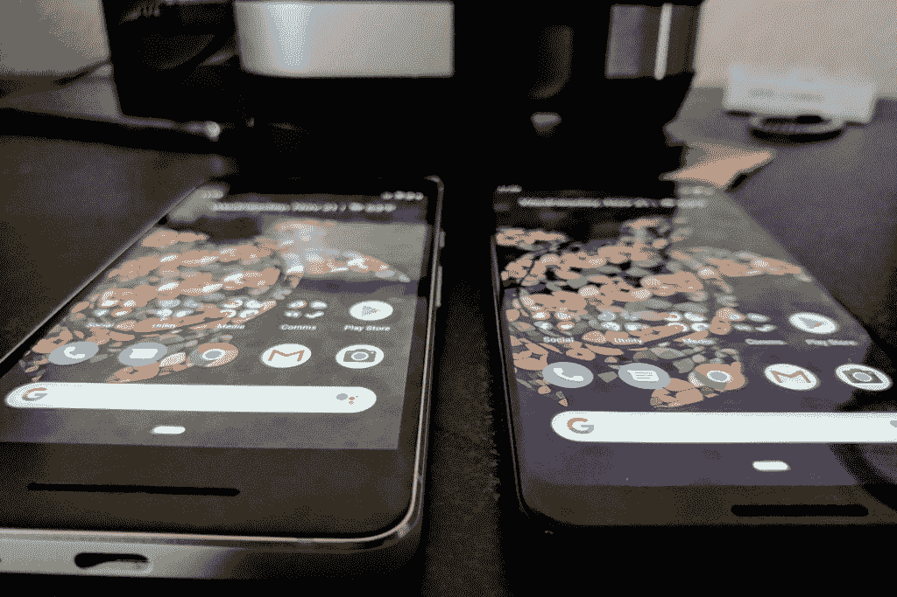
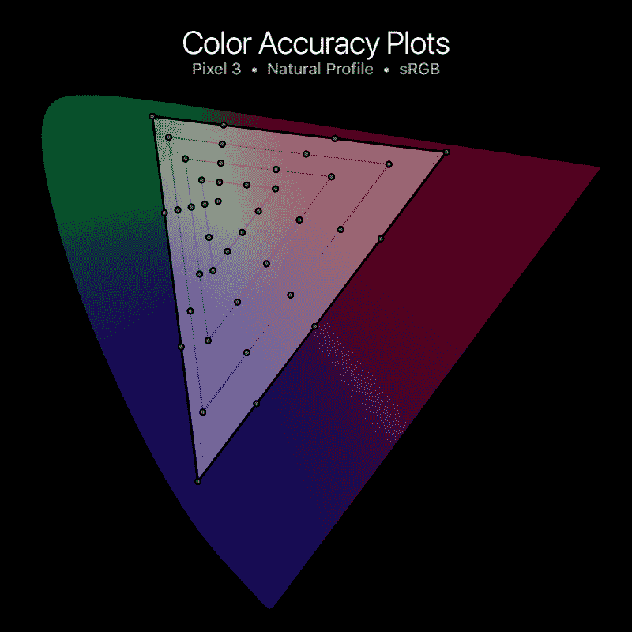

# 谷歌 Pixel 3 显示器评论:改进，但仍然落后于曲线

> 原文：<https://www.xda-developers.com/google-pixel-3-display-analysis-a-real-tangible-improvement-yet-still-behind-the-curve/>

好的

在智能手机技术的当前状态下，2014 年的旧“平板手机”被定义为大多数 Android 手机的新基准尺寸，Pixel 3 仍然是 2018 年现代紧凑型旗舰智能手机的最后几个选择之一，也是最后一个没有凹槽的选择之一。去年的 Pixel 2 也是如此。然而，这款手机经常因其过时的外观而不受欢迎，与 2017 年的大多数智能手机相比，它的边框更厚，特别是与 iPhone X，Galaxy S8/Galaxy Note 8，甚至其老大哥 Pixel 2 XL 相比。今年，Pixel 3 采用了更漂亮的外形，因为谷歌推动他们的 Pixel 系列作为顶级旗舰竞争对手赢得了尊重，这在很大程度上始于我们如何与它互动的门户——显示器。

那么，谷歌这次表现如何呢？

| 

### 坏

*   典型室内照明的完美色彩准确度
*   低均匀角位移
*   非常宽的原生色域
*   更紧密的屏幕层压和更低的屏幕反射率和眩光
*   UHDA HDR 认证

 | 

### 坏

*   平淡无奇的峰值亮度和控制
*   黑色削波的高阈值
*   在较低亮度下，纯色颗粒略微可见
*   低能效显示器

 |
|  |

## 绩效总结

这一次，谷歌从 LG Display 采购较小的 Pixel 3 的面板，而三星显示为 XL 变种生产面板——这是去年的一款翻盖手机。乍一看，正面设计看起来很像 Pixel 2 XL 的缩小版，但没有 3D 弯曲边缘，我很高兴这些边缘都消失了。正面现在变得平整光滑，采用了现代的 18:9 屏幕纵横比，显著减少了顶部、底部和侧挡板，甚至还有一些时髦的新圆角。Pixel 3 的机身大小与 Pixel 2 差不多，但适合更长的 5.5 英寸显示屏，屏幕宽度与 Pixel 2 大致相同，但屏幕长度增加了半英寸。然而，这种额外的屏幕长度可能会使 Pixel 3 比 Pixel 2 更难以单手使用，尤其是在触及状态栏时。

Pixel 3 的屏幕具有与 Pixel 2 几乎相同的像素密度，每英寸 443 个像素，而 Pixel 2 的每英寸 441 个像素。在这种像素密度下，对于视力为 20/20 的用户来说，显示器在超过 11.0 英寸(27.9 厘米)时看起来非常清晰，这是一个好消息，因为典型的智能手机观看距离略超过 12 英寸(30.5 厘米)。对于视力为 20/20 的用户来说，图像的结构，或消色差图像，将在低至约 7.8 英寸(20 厘米)时保持完美的清晰度。然而，当使用小于 11 英寸的手机时，彩色边缘可能会很明显，这是因为屏幕利用了 [PenTile 钻石像素阵列](https://www.oled-info.com/pentile)。那些具有较高视敏度的人，这是很常见的，可能对彩色边缘更敏感。总的来说，Pixel 3 显示屏的屏幕密度可以接受，清晰度非常好。

在典型的亮度水平下，我们的 Pixel 3 单元上的显示器的制造质量是极好的。在第一次检查时，我还注意到屏幕的反射率和眩光明显减少，显示器现在比 Pixel 2 和 Pixel 2 XL 更靠近顶部玻璃，后者的显示玻璃有一种异常的中空感。更紧密的层压有助于屏幕看起来更“墨色”，就好像屏幕内容被贴上了石膏或贴纸被放在前面的玻璃板上。困扰 Pixel 2 XL 上 LGD 面板的纯色颗粒问题已大幅改善，但在较低亮度下寻找它时，它仍然稍微可见。从某个角度看，显示器的色彩变化也有了很大的改善。颜色的变化更加微妙和均匀，特别是与去年的大多数 Pixel 2 XL 单元相比——我花了五次更换才收到一个出色的 Pixel 2 XL 单元，颜色变化很小。这种显示器不像三星面板那样在不同角度呈现彩虹色，只是均匀地向青色移动，没有任何突兀的绿色或 magentas。当测量色移时，像素 3 的测试色移比像素 2 低，但亮度偏移略高。当对我们的 unicorn Pixel 2 XL 进行测试时，情况正好相反:亮度偏移较低，但 Pixel 3 的颜色偏移略高。请注意，我们的 Pixel 2 XL 单元可能是一个异常——我测试过的大多数 Pixel 2 XL 单元都有明显更高的色彩偏移。我们设备的显示均匀性也很好，但是在非常暗的亮度下，微小的瑕疵开始变得明显。然而，我注意到用户声称显示均匀性异常差，颜色颗粒和/或视角差，所以似乎仍然有一种理想显示器的“屏幕彩票”。

对于 Pixel 3 的颜色配置文件，谷歌屈服了，现在默认为 Pixel 3 使用宽颜色拉伸配置文件，而不是像 Pixel 2 那样使用精确的默认配置文件。像素 3 上的自适应轮廓将颜色扩展到面板的固有色域，这是一个非常宽的色域。色彩强烈饱和，屏幕上的图像对比度显著增加。自然色彩配置文件是准确的色彩配置文件，我们已经测量了它的校准，以输出在典型办公室照明中与完美色彩**无法区分的色彩。然而，像素 3 上的显示灰度系数略高，但没有像素 2 XL 上的高。这意味着虽然颜色是准确的，但屏幕图像将比标准图像具有更高的对比度。增强的颜色配置文件类似于自然颜色配置文件，但颜色饱和度略有增强。它仍然相当准确，而且它可能会成为室外照明中更准确的轮廓，因为显示器的颜色会随着强光而褪色。**

然而，在户外照明方面，Pixel 3 完全没有竞争力。即使按照 2017 年的标准，谷歌 Pixel 3 也不会变得很亮。我们测量了显示器在平均情况下(50% APL)的峰值亮度为 476 尼特，而在白色背景的应用程序中，大多数情况下在 435 尼特左右。虽然这款手机在阳光直射下仍可使用，但使用起来远不如更亮的显示屏方便，如较新的 iPhone 或 Galaxy 设备，这些设备可以轻松发出约 700 尼特的白色背景内容，比 Pixel 3 亮约 25%。

## 显示分析方法

为了从显示器中获得定量的颜色数据，我们将特定设备的输入测试模式放入手机，并使用 i1Pro 2 分光光度计测量显示器产生的发射。我们使用的测试模式和设备设置针对各种显示特性和可能改变我们所需测量的潜在软件实现进行了修正。许多其他站点的显示分析没有正确考虑它们，因此它们的数据可能不准确。

我们测量显示器的全灰度，并报告白色的感知色彩误差及其相关色温。从读数中，我们还通过对每一步的理论伽马值进行最小二乘法拟合，得出显示伽马值。这个 gamma 值比那些从 CalMan 等显示校准软件报告 gamma 读数的值更有意义，也更真实，CalMan 等显示校准软件是对每一步的理论 gamma 进行平均。

我们测试图案的目标颜色受 [DisplayMate 的绝对颜色准确度图](http://www.displaymate.com/Colors_43s.html)的影响。在整个 CIE 1976 色度标度中，颜色目标的间隔大致均匀，这使得它们成为评估显示器的完整颜色再现能力的极好目标。

在显示器的*感知*(非线性)亮度范围内，以 20%的增量读取灰度和色彩准确度读数，并进行平均，以获得准确反映显示器整体外观的单一读数。另一个单独的读数是在我们的参考 200 cd/m，这是典型的办公室条件和室内照明的良好白色水平。

我们主要使用色差测量 *CIEDE2000* (简称为*δE*)作为色度准确度的度量。*δE*是由[国际照明委员会(CIE)](http://www.cie.co.at/) 提出的行业标准色差度量，它最能描述颜色之间的均匀差异。也存在其他色差度量，例如 CIE 1976 色度标度上的色差*δu′v′*,但是当评估视觉显著性时，已经发现这样的度量在感知均匀性方面较差，因为在色差度量之间，测量的颜色和目标颜色之间的视觉显著性的阈值可能变化很大。例如，0.010 的色差*δu’v’*对于蓝色来说在视觉上是不明显的，但是对于黄色来说相同的测量色差一眼就可以看出。请注意，*δE*本身并不完美，但它已经成为目前存在的最具经验准确性的色差度量。

*δE*通常在其计算中考虑亮度误差，因为亮度是完整描述颜色的必要成分。然而，由于人类视觉系统分别解释色度和亮度，我们将测试模式保持在恒定亮度，并补偿我们的*δE*值的亮度误差。此外，在评估显示器的性能时，将这两种错误分开是有帮助的，因为就像我们的视觉系统一样，它与显示器的不同问题有关。这样我们可以更透彻地分析和理解它的性能。

当测得的色差*δE*在 3.0 以上时，色差一眼就能在视觉上察觉出来。当测得的色差*δE*在 1.0 和 2.3 之间时，色差只能在诊断条件下被注意到(例如，当测得的颜色和目标颜色在被测显示器上紧挨着出现时)，否则，色差在视觉上不会被注意到，并且看起来是准确的。1.0 或更小的测量色差*δE*被认为是完全察觉不到的，并且即使当测量颜色与目标颜色相邻时，测量颜色看起来也无法与目标颜色区分。

显示器功耗通过手机电池消耗和显示器亮度之间的线性回归的斜率来测量。以 20%的亮度步长观察并平均三分钟的电池消耗，并在尽量减少外部电池消耗源的同时进行多次试验。

## 显示亮度

我们的显示器亮度对比表比较了 Pixel 3 相对于我们测量的其他显示器的最大显示器亮度。图表底部水平轴上的标签代表相对于像素 3 显示器的感知亮度差异的乘数，固定为“1×”根据[史蒂文幂定律](https://en.wikipedia.org/wiki/Stevens%27s_power_law)，使用点光源感知亮度的模态指数，以每平方米坎德拉或尼特为单位测量的显示器亮度的大小进行对数缩放，与 Pixel 3 显示器的亮度成比例缩放。这是因为人眼对感知亮度有对数反应。在线性标度上呈现亮度值的其他图表不能恰当地表示显示器的感知亮度的差异。

像素 3 的性能与其大多数前身相似。对于大多数应用程序的内容来说，显示器在 450 尼特左右徘徊，在 1%的低 APL 下，可以发射高达 572 尼特的光。屏幕亮度似乎不是谷歌的优先考虑事项，因为他们每年都在旗舰显示器的亮度上排名最后。然而，LGD 在 LG V40 上的最新有机发光二极管支持高亮度模式，如果 Pixel 3 显示器使用相同的显示技术，理论上应该也能支持高亮度模式。

对于 Android Pie，谷歌实现了一个新的[对数亮度滑块](https://android-developers.googleblog.com/2018/11/getting-screen-brightness-right-for.html)。这是对 pre-Pie 的改进，在 pre-Pie 中，Android 的亮度滑块以线性方式调整显示器的亮度。人类感知亮度的主观强度是对数标度，而不是线性标度，因此旧的亮度滑块不能以感知平滑的方式调节显示器亮度。试图在夜间调节亮度滑块可能会产生太暗的设置，但将滑块向右移动一英寸，显示器就会灼伤你的眼睛。理想情况下，亮度滑块应该感觉直观。亮度滑块中的中间点看起来应该是最大亮度设置的一半。然而，我发现情况并非完全如此，所以我测试了谷歌新的亮度映射。

我的第一个发现是，谷歌只改变了亮度滑块选择控制显示亮度的字节值的方式，[几个月前我在 Reddit 上发表了一篇关于它的评论](https://www.reddit.com/r/Android/comments/8p27iw/android_dp3_is_out_now/e084lyu)。字节值映射实际上保持线性，而新的亮度滑块以对数方式选择字节值。

这很糟糕。

虽然谷歌表现出对人类感觉的理解，但他们同时也表现出不理解。人类对较低亮度的变化更加敏感，他们已经在博客文章中承认了这一点。这意味着应该有更多的字节值映射到更暗的亮度。然而，亮度字节值到亮度的映射仍然是线性的。这样做的问题是，因为谷歌决定只有 256 个可能的值可以映射到某个显示器亮度，**暗亮度的低字节值在每一步**之间有明显的亮度“断续”或“跳跃”，所以当在这些值之间调整显示器亮度时，它看起来不平滑。当自动更改为这些亮度时，这也适用于新的自适应亮度。

对于具体的分析，我们发现在亮度设置 1 下的输出亮度是 2.4 尼特，而在下一个亮度设置 2 下，显示器输出 3.0 尼特。这在数量上增加了 25%。作为参考，对于突然从一个补丁切换到另一个补丁，大约需要 10%的亮度变化才能注意到图像亮度的差异(对于暗视觉，甚至更少，低于 3.0 尼特)。因此，调整显示器亮度时，幅度变化不应超过 10%，以便从一个设置到另一个设置的过渡看起来平滑而不“抖动”这些明显的亮度跳跃持续到大约 40 尼特的亮度，这涵盖了面板感知亮度范围的大约 30%!这解释了为什么在低端调节亮度滑块时会断断续续。

此外，谷歌在亮度滑块中使用的对数函数似乎不正确。滑块上的中点看起来比最大亮度的一半还暗。当测试映射时，我发现中点的亮度值映射到峰值亮度的十六分之一。使用史蒂文的幂律和他的指数作为点光源，这看起来只有峰值发射的四分之一亮。在进一步的测试中，显示器显示一半亮度所需的幅度实际上映射到亮度滑块上大约 75%的点。相对于史蒂文的幂定律，我们通过拟合发现，谷歌实际上使用的是 0.25 的模态指数，而不是亮度滑块的 0.5。因此，当调整亮度滑块时，亮度上升太慢，显示器会整体感觉较暗。

## 颜色配置文件

手机可以配备各种不同的显示配置文件，这些配置文件可以改变屏幕上的颜色特征。谷歌 Pixel 3 保持了其前身的自然和增强模式，并用类似的自适应模式取代了旧的饱和模式。

像素 3 现在默认为其新的自适应轮廓。颜色配置文件不遵循任何标准，但最接近的目标是具有 P3 红色色度、介于 Adobe RGB 和 P3 之间的绿色色度以及 Rec 的颜色空间。2020 蓝色色度。该配置文件似乎与 Pixel 2 XL 上的饱和色配置文件完全相同，因为它也来自 LGD 面板。然而，我注意到的一个问题是，像素 3 和像素 3 XL 之间的颜色配置文件是不同的。Pixel 3 比 Pixel 3 XL 具有更大的原生色域，由于自适应颜色配置文件将屏幕上的颜色扩展到原生色域，因此它们看起来有所不同。因此，这两款手机的显示屏在默认颜色配置上缺乏一致性，这在商店显示屏的主屏幕上是可见的。

自然配置文件是精确的颜色配置文件，它将 sRGB 颜色空间作为所有未标记媒体的默认工作颜色空间。该配置文件支持 Android 8.0 的自动颜色管理，因此该配置文件可以显示广泛的颜色内容，然而，几乎没有应用程序支持它。

增强剖面是饱和度略微线性增加的自然剖面。该配置文件还支持自动色彩管理。

## 微克

显示器的灰度系数决定了屏幕上的整体图像对比度和颜色亮度。大多数显示器上使用的行业标准伽马遵循 2.20 的幂函数。更高的显示器伽马功率将导致更高的图像对比度和更暗的颜色混合，这是电影业正在朝着的方向发展，但智能手机在许多不同的照明条件下观看，更高的伽马功率是不合适的。下面的伽玛曲线是一种颜色亮度的对数-对数表示，如在 Pixel 3 显示器上看到的与其相关的输入颜色:高于标准 2.20 线意味着色调显得更亮，低于标准 2.20 线意味着色调显得更暗。由于人眼对感知的亮度有对数反应，所以轴是对数标度的。

与 Pixel 2 XL 的 LG 制造的显示器类似，Pixel 3 的图像对比度明显较高，颜色混合较暗，但没有 Pixel 2 XL 上的强烈(γ = 2.46)。默认的自适应颜色配置文件具有非常高的灰度系数 2.43，这对于许多消费者使用的移动显示器来说是很高的灰度系数。对于自然和增强的配置文件，较高的灰度系数对于 sRGB 色彩空间来说更加明显，因为这些颜色原本打算用 1.8 和 2.2 之间的显示灰度系数来显示。随着宽色彩的出现，许多以更宽色彩空间为目标的内容开始以 2.4 的灰度系数进行母版制作，HDR 以外的电影院现在以大约 2.6 的灰度系数进行母版制作。

虽然 2.2 的显示器伽马仍然是必要的色调准确度的目标，但是由于亮度随内容 APL 变化的有机发光二极管特性，有机发光二极管面板的校准器在历史上很难达到这个目标。通常，较高的图像 APL 会降低面板上颜色的相对亮度。为了适当地实现一致的显示伽马，DDIC 和显示技术必须能够控制 TFT 背板上的电压被归一化，而不管发射如何。三星显示实际上已经通过 Galaxy S9、Galaxy Note9 和谷歌 Pixel 3 XL 上的更新显示技术实现了这一点，由于这一突破，这些技术在完整的颜色和色调准确性方面都得到了出色的校准。这只是 LG Display 目前落后的另一个方面。

去年，Pixel 2 和 Pixel 2 XL 都因其异常的黑色剪裁受到了严厉的批评，其中 LGD Pixel 2 XL 是最严重的冒犯者。我们发现，Pixel 2 XL 在 10 尼特时的黑色限幅阈值为 8.6%，而三星配备的 Pixel 2 的黑色限幅阈值为 4.3%。今年，Pixel 3 显示器的黑色限幅阈值为 6.0%，比去年的 LGD 面板有了小的改善，但仍然非常高。到目前为止，只有 iPhone X 和 iPhone Xs 经过测试，在 10 尼特的 8 位强度范围内绝对没有黑色削波，OnePlus 6 的阈值接近完美的 0.4%。三星设备因削波而臭名昭著，我们测试的最后一款削波设备是 Galaxy Note 8，它将色彩强度削波到 2.7%以下。

一个有趣的发现是，当使用全场测试模式时，无论显示器亮度如何，所得的显示器伽马总是非常接近 2.20，而当使用恒定 APL 测量时，所得的显示器伽马是变化的。这让我相信，也许谷歌的 Pixel 3 校准器没有在恒定的 APL 下校准，这是有缺陷的。

## 色温

白光源的色温描述了光的“暖”或“冷”程度。sRGB 色彩空间以一个具有 D65 (6504K)色温的白点为目标，据说它表现为欧洲的平均日光。以 D65 色温的白点为目标对于色彩准确度至关重要。然而，注意，接近 6504K 的白点不一定看起来准确；有数不清的颜色组合，可以有 6504K 的相关色温，甚至不出现白色。因此，色温不应被用作白点色彩准确度的衡量标准。相反，它是一种评估显示器白点如何出现以及它如何在其亮度和灰度范围内移动的工具。不管显示器的目标色温如何，理想情况下，白色在任何强度下都应该保持一致，这在我们下面的图表中显示为一条直线。通过观察最低亮度下的色温图表，我们可以了解面板在可能剪裁黑色之前如何处理低驱动电平。

所有颜色配置文件的相关色温大部分是直的，只有一些小的扭曲。所有轮廓都变得稍冷，颜色越来越深。然而，当显示非常暗的颜色时，面板校准开始中断。在最低亮度下约 50%的强度，这与大约 0.50 尼特相关，在我们的测光表无法测量低于 25%强度的发射之前，颜色开始显著升温。

## 颜色准确度

我们的色彩准确度图为读者提供了显示器色彩性能和校准趋势的粗略评估。下面显示的是颜色准确度目标的基础，绘制在 CIE 1976 色度标度上，圆圈代表目标颜色。

 <picture></picture> 

Reference sRGB color accuracy plots

目标色环的半径为 0.004，这是图表上两种颜色之间可察觉的色差的距离。刚刚可察觉的色差单位用目标颜色和测量颜色之间的红点表示，一个或多个点通常表示明显的色差。如果在测量的颜色和它的目标颜色之间没有红点，那么可以有把握地认为测量的颜色看起来是准确的。如果测得的颜色和其目标颜色之间有一个或多个红点，测得的颜色仍然可以根据其色差*δE*看起来准确，这是比图表上的欧几里得距离更好的视觉可察觉性指标。

在其精确颜色模式下，自然配置文件中的颜色校准在所有场景下都非常精确，其**非常精确的整体平均值*δE*为 1.2** 。在某些情况下，特别是在典型的办公室和室内照明中，颜色与完美的颜色完全无法区分(即使在诊断条件下)，其*δE*为 0.8。干得好，谷歌。

在增强模式下，屏幕颜色仍然基本准确，红色、中蓝色和高绿色有明显差异。它有一个精确的整体平均值*δE*为 1.9。奇怪的是，高蓝调在这个轮廓中更准确，因为它们在自然轮廓中稍微低于它们的饱和度。然而，在这个剖面中，高红色比任何其他颜色都过饱和，令人头疼的*δE*为 6.4。

Android 实现色彩管理整整一年了，依然没有被它动一下。正因为如此，我们将忽略 P3 颜色准确性，因为它目前在 Android 中没有一席之地，直到谷歌做出一些改变。

## 功率消耗

从像素 2 到像素 3，显示面积增加了大约 13%。在其他条件相同的情况下，更大的屏幕需要更多的能量来发出相同的光强度。然而，Pixel 3 现在使用 LGD 显示器，而 Pixel 2 使用三星显示器，除了迭代的技术进步，他们的底层专有技术很可能有许多差异，这些差异会影响功耗。

我们测量了 Pixel 3 显示器在其完全发射时的最大功耗为 1.46 瓦，而具有类似峰值亮度的 Pixel 2 的功耗为 1.14 瓦。对亮度和屏幕面积进行标准化后，在 100% APL 时，像素 3 可以输出每瓦 2.14 坎德拉，而像素 2 可以输出每瓦 2.44 坎德拉，这使得像素 3 的显示效率**比像素 2 在 100% APL 时低 14%。**

屏幕内容 APL 越低，有机发光二极管显示器变得越省电。在 50% APL 下，Pixel 3 输出 4.60 坎德拉/瓦，比 100% APL 输出的功效提高了 115%。然而，50% APL 的像素 2 输出 5.67 坎德拉每瓦，效率提高了 132%。这使得在 50% APL 下，Pixel 3 显示屏的效率比 Pixel 2 显示屏低 23 %。

## 显示概述

| 规格 | 谷歌像素 3 | 注意事项 |
| --- | --- | --- |
| 显示方式 | AMOLED，PenTile 钻石像素 |  |
| 制造商 | LG 显示器 | 这里没有 bootloop 笑话 |
| 显示尺寸 | 4.9 英寸乘 2.5 英寸 5.5 英寸对角线 12.1 平方英寸 | 与像素 2 的宽度相似 |
| 显示分辨率 | 2160×1080 像素 | 由于圆角的原因，实际像素数会略少 |
| 显示纵横比 | 18:9 | 对，那也是 2:1。不，不应该这么写 |
| 像素密度 | 每英寸 443 像素 | 由于五边形菱形像素，子像素密度较低 |
| 子像素密度 | 每英寸 313 个红色子像素每英寸 443 个绿色子像素 每英寸 313 个蓝色子像素 | 与绿色子像素相比，五边形菱形像素显示器具有较少的红色和蓝色子像素 |
| 像素灵敏度的距离 | < 11.0 英寸为全彩色图像 < 7.8 英寸为非彩色图像 | 视力为 20/20 的可分辨像素的距离。典型的智能手机观看距离约为 12 英寸 |
| **峰值亮度** | 100%杀伤人员地雷每平方米 420 坎德拉50%杀伤人员地雷每平方米 476 坎德拉 1%杀伤人员地雷每平方米 572 坎德拉 | 坎德拉每平方米=尼特 |
| **最大显示功率** | 1.46 瓦 | 100% APL 峰值亮度下的发射显示功率 |
| **显示电源功效** | 100% APL 时每瓦特 2.14 坎德拉50% APL 时每瓦特 4.60 坎德拉 | 标准化亮度和屏幕区域。 |
| **角度偏移** | -30%为亮度偏移*δE*= 6.6 为色彩偏移*δE*= 10.3 总偏移 | 在倾斜 30 度时测量 |
| **黑色阈值** | 6.0% | 要剪裁黑色的最小色彩强度，在 10 *cd/m* 处测量 |

| 规格 | 自适应 | 自然 | 助推 | 注意事项 |
| --- | --- | --- | --- | --- |
| 微克 | 2.43明显偏高 | 2.30 略高 | 2.33略高 | 理想情况下在 2.20-2.30 之间 |
| **平均色差** | *δE*= 5.0对于 sRGB 不进行颜色管理；因设计而过饱和 | *δE*= 1.2对于 sRGB 来说 显得非常准确 | *δE*= 1.9对于 sRGB 来说 显得大多准确 | *δE*数值低于 2.3 出现准确*δE*数值低于 1.0 出现完美 |
| **白点色差** | 6847k*δE*= 5.0冷通过设计 | 6596kδET5= 2.9 | 6610kT2【δE= 3.0 | 标准是 6504K |
| **最大色差** | *δE*= 8.5100%蓝绿色 为 sRGB | *δE*= 2.0在 50%黄色 为 sRGB 最大误差出现准确 | *δE*= 6.5100%红黄 为 sRGB | 最大误差*δE*低于 5.0 为好 |

## 新 XDA 显示字母分级

为了帮助我们的读者在阅读完所有这些技术术语后更好地了解显示器的质量，我们根据显示器在数量和主观上的表现增加了一个最终字母等级，因为显示器的某些方面很难衡量和/或具有偏好性。

字母等级将部分与其他现代显示器的表现相关。为了有一个参考框架，在我们早期的 OnePlus 6 [显示器评测](https://www.xda-developers.com/oneplus-6-display-analysis-compared-oneplus-5t/)中，我们会给显示器一个 B+字母等级:显示器更亮，处理黑色剪辑非常好；它在其校准的显示配置文件中保持良好的色彩准确性，但仍具有较高的显示灰度系数。与 Pixel 3 相比，它有两个优势，但仍有一些其他方面使 Pixel 3 有好有坏，这是它领先并给予它 B+评级而不是 Pixel 3 的 B。总的来说，我们发现 OnePlus 6 的显示质量总体上略好，没有评判一些优先方面(显示尺寸，凹口)。

我们会给 Galaxy Note 9 一个 A 级:高亮度模式下非常好的亮度，出色的伽马控制，照片应用程序有一些颜色管理。但是，它仍然有黑色剪辑，我们发现在校准配置文件的颜色精度不是太令人印象深刻。iPhone X 和 iPhone Xs 都获得了 A+评级:它在不使用高亮度模式的情况下拥有出色的手动亮度范围，在其 8 位亮度范围内实现了零黑色限幅，智能 PWM 控制，我们测量的最佳色彩精度，良好的伽马控制，以及利用宽色彩的操作系统的出色色彩管理。这些非常明显和影响体验的差异使它能够基于显示屏的质量和软件处理它的方式领先于 Note 9，即使还有其他方面可能会让人们更喜欢 Note 9 的显示屏，如其默认的饱和轮廓或无缺口显示屏。

## 关于谷歌的适应性轮廓决策的一句话

就我个人而言，我强烈反对谷歌决定默认一个广泛的颜色拉伸配置文件。我认为这是一个毫无品味的纯粹由市场驱动的决定，伤害了 Android 生态系统，以及它的设计者和开发者。

火上浇油的是，Android 8.0 中实现的 Android 自己的自动颜色管理在这个颜色配置文件中不受支持，这已经严重缺乏支持。**甚至谷歌自己的照片应用程序也不支持在任何其他色彩空间查看嵌入了色彩配置文件的图像**。毫无疑问，谷歌最引以为傲的是他们的成像能力，像素系列将通过捕捉宽彩色图像(他们的相机传感器支持)和能够正确查看宽彩色图像而受益匪浅，苹果自 iPhone 7 以来已经在他们的硬件和操作系统[中简化了这两者。](https://appleinsider.com/articles/16/09/09/apples-wide-color-screen-on-the-iphone-7-will-lead-to-more-faithful-color-reproduction)

由于 Android 在色彩管理方面的无能，有数百万张由 iOS 用户发布的照片由于缺乏软件支持而无法在 Android 显示器上如实再现，这主要归咎于谷歌没有大力推广。**这导致 Android 社区将准确的颜色与“暗淡”和“柔和”联系在一起，而问题是他们的设计师只能使用最小的调色板**。iPhone 显示器很少被描述为“暗淡”或“柔和”，而是“生动”和“有力”，然而它们提供了市场上最准确和专业的工作显示器——它们不需要人为地使屏幕上的所有颜色过饱和来实现这一点。

iOS 应用设计者被鼓励使用宽颜色，而大多数 Android 设计者甚至没有意识到这一点。所有 iOS 应用程序设计人员都使用相同的精确颜色配置文件进行设计，而 Android 设计人员则选择和测试各种不同的颜色配置文件，导致用户之间的颜色一致性很小。应用程序设计师可能会在他或她的彩色拉伸显示器上选择他或她认为有品位的颜色，但这些颜色可能会比他们在精确显示器上想要的饱和度低。反之亦然:当在精确的显示器上选择饱和的颜色时，颜色在彩色拉伸显示器上可能看起来太饱和了。这仅仅是为什么色彩管理对于一个有凝聚力和统一的设计语言是必不可少的一个原因。这是如此重要的一点，以至于谷歌目前在试图创造自己的设计语言时忽略了这一点——没有广泛的色彩，局限于二十多年前建立的调色板。