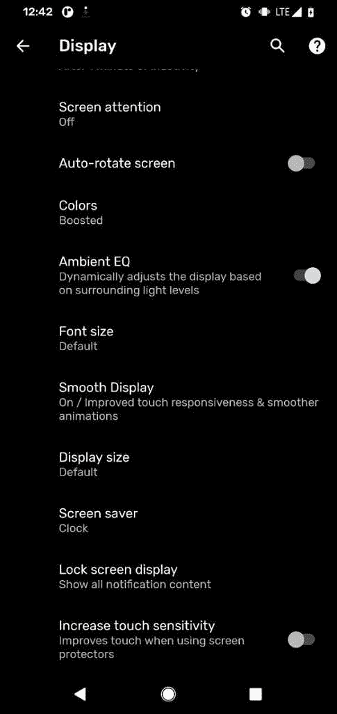

# 谷歌 Pixel 4 在 Android 11 中获得了一个新的增加触摸灵敏度的选项

> 原文：<https://www.xda-developers.com/google-pixel-4-new-increased-touch-sensitivity-option-android-11/>

# 谷歌 Pixel 4 在 Android 11 中获得了一个新的增加触摸灵敏度的选项

Android 11 开发者预览版 1 在谷歌 Pixel 4 的显示设置上为屏幕保护器增加了一个新的触摸灵敏度选项。

Android 11 开发者预览版 1 [于今天](https://www.xda-developers.com/android-11-developer-preview-1-google-pixel/)发布，正如预期的那样，我们正在进行一系列活动。[谷歌 Pixel 设备和其他 Android 手机的 GSI 都有下载链接](https://www.xda-developers.com/how-to-download-android-11-developer-preview-for-google-pixel-and-other-android-devices/)，我们已经向[解释了安装程序](https://www.xda-developers.com/how-to-download-android-11-developer-preview-for-google-pixel-and-other-android-devices/)。我们已经详细介绍了[新的关注隐私的特性](https://www.xda-developers.com/android-11-developer-preview-privacy-security-features-changes/)以及[新的开发者特性](https://www.xda-developers.com/android-11-developer-preview-new-development-features/)。我们也致力于在第一个开发者预览版中展示所有面向用户的变化。一个面向用户的基本变化是，谷歌 Pixel 4 手机在 Android 11 中增加了一个新的触摸灵敏度选项。

 <picture></picture> 

Increased touch sensitivity option on the Google Pixel 4 in Display Settings

新选项存在于显示设置中。其目的是为使用屏幕保护器的用户增加显示器的触摸灵敏度。这是整个智能手机行业相当普遍的选择。一些屏幕保护器，尤其是钢化玻璃种类的，如果没有精确地应用在显示器上，会带来触摸屏灵敏度的问题。2.5D 玻璃和后来的曲面 3D 玻璃的出现，只是让钢化玻璃屏幕保护器的用户日子更难过了，这就是为什么许多定制用户界面中都有这个选项。现在，谷歌又将其带到了 Android 11 开发者预览版 1 上的 Pixel 4 中。

应当注意，触摸灵敏度不同于显示器的刷新率。例如，华硕 ROG 手机 II 的刷新率为 120 赫兹，而触摸数据的采样频率为 240 赫兹。苹果 iPhone 11 Pro 拥有 60Hz 的屏幕刷新率，同时拥有 120Hz 的触摸采样率。Android 手机的触摸灵敏度在过去是有问题的，但在过去几年里，它已经普遍改善到不是问题的地步。然而，具有高刷新率(HFR)显示器的手机仍然会对触摸(UI 流畅性)有更好的响应，因为在分别为 90Hz 和 120Hz 显示器的情况下，它们每秒钟刷新显示图像 30 或 60 次。

对于使用钢化玻璃屏幕保护器的谷歌 Pixel 4 用户来说，新的增加触摸灵敏度选项应该会有所帮助。这几乎肯定会被带到第一个 Android 11 测试版，所以不想用 fastboot 安装开发者预览版的用户必须再等一会儿。

*感谢 XDA 资深会员 [cstark27](https://forum.xda-developers.com/member.php?u=2712580) 的提示和截图！*