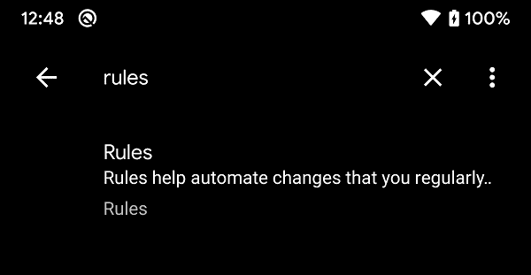

# Android Q 上的谷歌 Pixel 手机可能会获得一个新的设置例程功能

> 原文：<https://www.xda-developers.com/google-pixel-android-q-settings-routines/>

谷歌在 Android 早期给予开发者的自由允许了应用的繁荣，而这在 iOS 上是不可能的。像 Tasker、MacroDroid、Automate 和 Llama 这样的自动化应用程序让用户可以完全控制他们手机上的应用程序和设置，尽管最近的 Android 版本已经缩减了这些应用程序的功能。虽然第三方自动化应用程序已经失去了一些光彩，但谷歌助手和三星 Bixby 等第一方服务已经增加了有限的自动化功能，分别具有像[助手例程](https://www.xda-developers.com/google-home-routines-india-canada-uk-germany-australia/)和 [Bixby 例程](https://www.xda-developers.com/samsung-galaxy-s10-s10-and-s10e-launch-with-the-snapdragon-855-ultrasonic-in-display-fingerprint-scanners-reverse-wireless-charging-and-a-whole-lot-more/)这样的功能。现在，我们发现有证据表明，运行 Android Q 的谷歌 Pixel 智能手机正在开发一种新的自动化功能。

APK 拆卸通常可以预测应用程序未来更新中可能出现的功能，但我们在这里提到的任何功能都可能不会出现在未来的版本中。这是因为这些功能目前还没有在 live build 中实现，可能会在未来的版本中随时被 Google 拉出来。

## Android Q 中谷歌像素的设置例程

新功能的字符串和代码首次出现在与 Android Q betas 一起发布的设置智能系统 APK 中。运行 2019 年 5 月安全补丁的谷歌 Pixel 3 XL 的 Android Pie 版本的最新设置智能 APK 是版本 1.0.0.197685250。另一方面，谷歌 Pixel 3 XL 的 [Android Q beta 2](https://www.xda-developers.com/android-q-beta-2-everything-new/) 包含版本 1.1.0.235052489.fishfood，而 [Android Q beta 3](https://www.xda-developers.com/everything-new-android-q-beta-3/) 包含版本 1 . 1 . 0 . 241603058 . dogfood。“fish food”和“dog food”指的是谷歌员工正在进行测试的内部版本，因此在公开测试版中看到它们很奇怪。无论如何，这项新功能不会在任何谷歌 Pixel 智能手机的 Android Pie 或 Android Q 中激活。

该特性在内部被称为“例程”，但将作为“规则”呈现给用户以下字符串描述了该功能背后的基本思想:

```
 <string name="routines_settings_summary">Rules help automate changes that you regularly make in Settings, such as switching your phone to silent whenever you get to work.</string>
<string name="routines_settings_title">Rules</string> 
```

该功能的描述听起来好像你在自动化设备设置方面有很大的自由，但在该功能的开发过程中，实际上似乎并不是这样。

 <picture></picture> 

Although I was able to surface the "Rules" feature via search in the Settings app, I was unable to launch the relevant activities.

### 创建规则

目前，该功能可以让你根据你连接的 Wi-Fi 网络或你所在的位置来设置谷歌像素的规则。

```
 <string name="add_network">Add network</string>
<string name="add_routine">Add rule</string>
<string name="add_location_routine">Add Location rule</string>
<string name="add_routine_this_location">Turn on the following at this location:</string>
<string name="add_wifi_routine">Add Wi-Fi rule</string>
<string name="add_routine_this_network">Turn on the following when connected to this network:</string> 
```

位置规则为您输入的地址的纬度和经度创建地理围栏。Wi-Fi 规则可让您根据设备上存储的 Wi-Fi ssid 来设置条件。

### 规则操作

一旦 Wi-Fi 或位置规则被触发，您可以选择打开勿扰模式，将手机设置为响铃，将手机静音，或将 Google Pixel 设置为仅振动。

```
 <string name="routine_action_dnd">Turn on Do Not Disturb</string>
<string name="routine_action_normal">Set phone to ring</string>
<string name="routine_action_silent">Silence phone</string>
<string name="routine_action_vibrate">Vibrate phone</string> 
```

### 编辑规则

这些字符串为您使用规则所能做的事情添加了更多的上下文。例如，字符串确认只能为保存的网络添加 Wi-Fi 规则。

```
 <string name="choose_routine_source">Choose rule type</string>
<string name="choose_wifi_network_title">Choose Wi-Fi</string>
<string name="choose_wifi_no_available_networks">"You've added rules for all saved networks. To add a new rule, connect to another network."</string>
<string name="choose_wifi_no_saved_networks">To add a rule, first connect to a Wi-Fi network</string>
<string name="choose_wifi_title">Choose saved network</string>
<string name="chosen_location">Location:</string>
<string name="chosen_network">Network:</string>
<string name="edit_rule_action_header">Do the following</string>
<string name="edit_rule_activity_add">Add Wi-Fi network or location</string>
<string name="edit_rule_activity_header_location">When at location</string>
<string name="edit_rule_activity_header_wifi">When connected to</string>
<string name="edit_rule_summary_dnd">"When Do Not Disturb is on you'll see this icon at the top of your screen"</string>
<string name="edit_rule_summary_ringer">"You'll be notified whenever a change occurs"</string>
<string name="edit_rule_title">Edit rule</string> 
```

### 规则通知

一旦规则被激活，Android Q 中的 SettingsIntelligence 将显示一个通知，通知用户什么操作已经被执行。当用户进入或退出规则的触发区域时，还会显示通知来通知用户。

```
 <string name="notification_action_wifi_rule_detected_positive">Tap to setup a rule</string>
<string name="notification_text_rule_applied_location_enter_prefix">Arrived at</string>
<string name="notification_text_rule_applied_location_exit_prefix">Left</string>
<string name="notification_text_rule_applied_wifi_enter_prefix">Connected to</string>
<string name="notification_text_rule_applied_wifi_exit_prefix">Disconnected from</string>
<string name="notification_text_wifi_rule_detected_prefix">Set up a rule for</string>
<string name="notification_title_dnd_wifi_rule_detected">Turn on Do Not Disturb each time?</string>
<string name="notification_title_normal_wifi_rule_detected">Always ring when connected?</string>
<string name="notification_title_rule_applied_dnd">Do Not Disturb is on</string>
<string name="notification_title_rule_applied_dnd_off">Do Not Disturb is off</string>
<string name="notification_title_rule_applied_normal">Phone set to ring</string>
<string name="notification_title_rule_applied_silent">Phone set to silent</string>
<string name="notification_title_rule_applied_vibrate">Phone set to vibrate</string>
<string name="notification_title_silent_wifi_rule_detected">Always silence when connected?</string>
<string name="notification_title_vibrate_wifi_rule_detected">Always vibrate when connected?</string> 
```

### 规则建议

最后，用户可以选择授权 SettingsIntelligence 访问他们的位置和日历，这样应用程序就可以建议创建新的规则。

```
 <string name="permission_dialog_description">"%s uses your location and calendar to provide personalized suggestions based on your routines.
If you don't allow location and calendar permissions, you may still receive other suggestions."</string> 
```

### 奖励:斜坡振铃器

作为奖励，SettingsIntelligence 应用程序中的字符串和代码表明，谷歌可能会在 Android Q 中为 Pixel 设备添加“斜坡铃声”功能。在来电时，谷歌 Pixel 会先振动几秒钟，然后随着时间的推移慢慢提高铃声音量。这一功能在定制 rom 和 OEM 软件中很常见，但尚未应用到谷歌 Pixel 上。

```
 <string name="ramping_ringer">Vibrate first then ring gradually</string> 
```

## 结论

虽然新功能看起来远不如 Tasker 等自动化应用强大，但在功能集冻结发布之前，未来几个月可能会添加更多功能。此外，大多数自动化应用程序都有很高的准入门槛，因此谷歌必须制定足够简单的规则，以便普通像素所有者或潜在像素所有者使用。

由于该功能是像素专属的 SettingsIntelligence 应用程序的一部分(清单中的功能声明`com.google.android.feature.PIXEL_EXPERIENCE`证实了这一点)，我们认为只有运行 Android Q 的谷歌 Pixel 智能手机才会获得新功能。我还认为这项功能很可能会在谷歌 Pixel 4 和 Pixel 4 XL 上首次亮相，因为它仍在开发中，感觉像是要等到新产品发布时才会推出的东西，但我不能确认推出日期。我们[早在去年的](https://www.xda-developers.com/android-p-predictive-settings-automate-frequent-settings/) [Android P 开发者预览版 2](https://www.xda-developers.com/everything-new-android-p-developer-preview-2/) 中就已经发现了这个功能的提示，但似乎从那以后更多的工作已经进入了这个功能。如果该功能在下一款 2019 Pixel 智能手机发布之前上线，我们将随时向您更新。

* * *

*感谢 PNF 软件为我们提供了使用许可 [JEB Decompiler](https://www.pnfsoftware.com/?aid=xdadev) ，这是一款针对 Android 应用的专业级逆向工程工具。*