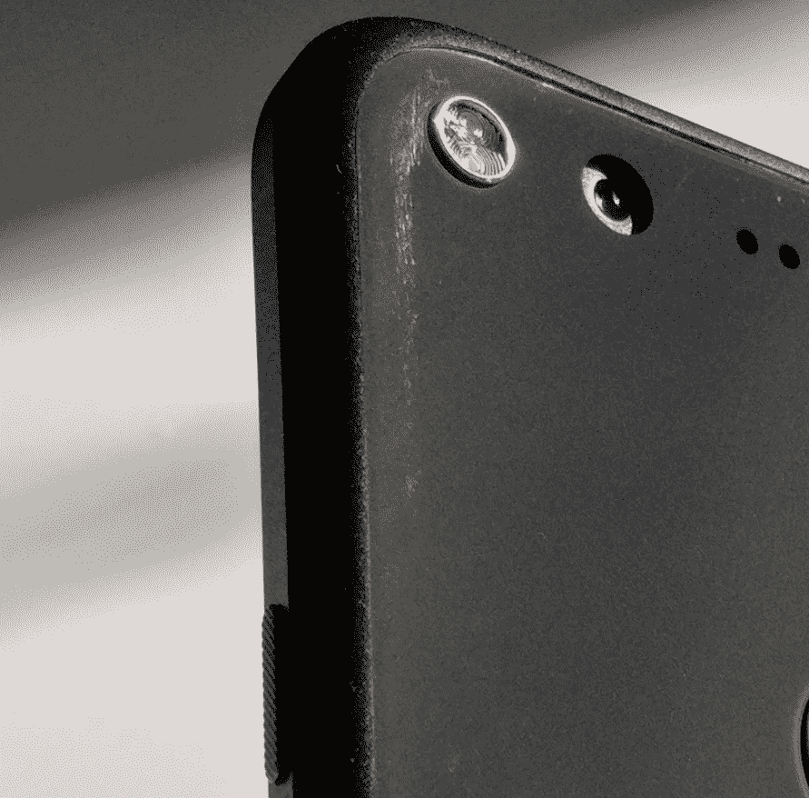
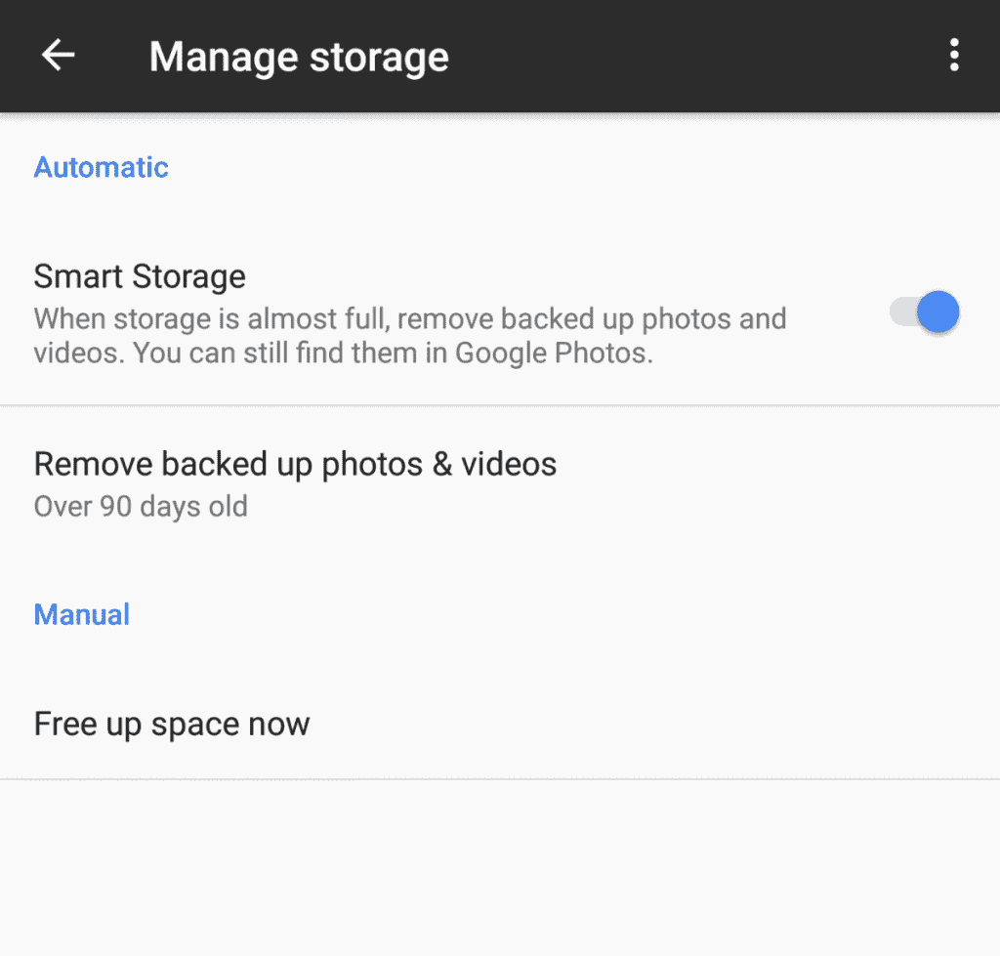
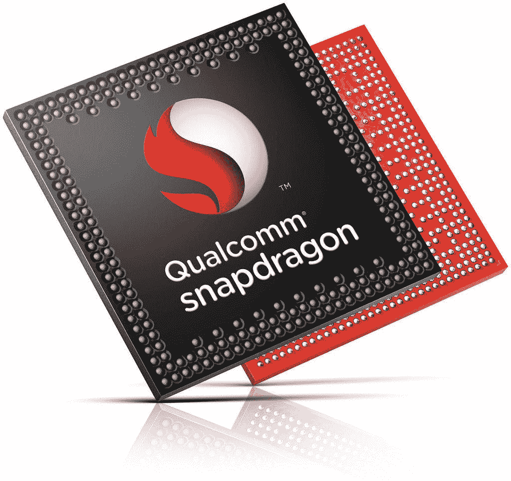
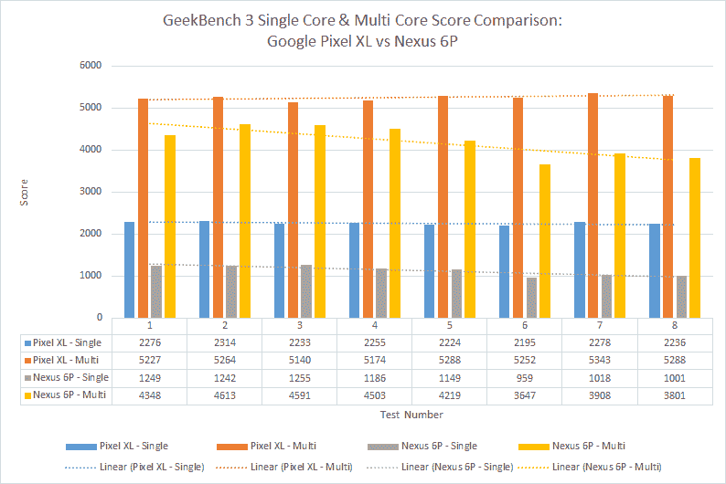
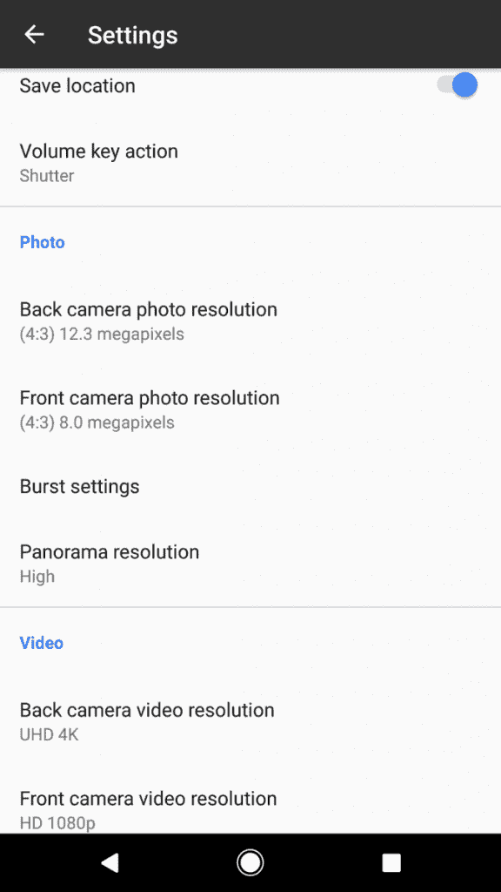

# 谷歌像素 XL XDA 评论:谷歌和后 Nexus Android 的基础版本

> 原文：<https://www.xda-developers.com/google-pixel-xl-xda-review-a-foundational-release-for-google-post-nexus-android/>

谷歌对智能手机市场的最新入侵即将到来，Pixel 和 Pixel XL 旨在提供顶级硬件，完美实现谷歌对 Android 的新愿景。或许最重要的是，这是重新定义谷歌生态系统的更大努力的关键部分。

> 周围有这么多很棒的 Android 手机，像素能有多清晰突出？

在这篇评论中，我们将深入探讨 Pixel XL。该功能试图提供与我们的读者群相关的内容，而不是列出规格和谈论体验感受。在 XDA，我们的评论不是为了告诉用户一部手机是否值得购买——相反，我们试图通过我们的话语把手机借给你，并帮助你自己做出决定。开始之前，让我们先看看规格表:

| 

设备名称:

 | 

像素 XL

 | 

发布日期/价格

 | 

现已上市，起价 769 美元

 |
| --- | --- | --- | --- |
| 安卓版本 | 7.1 牛轧糖 | 显示 | 5.5 英寸 AMOLED - 1440 x 2560 - 534 PPI |
| 芯片集 | 高通 MSM8996 骁龙 821“Pro-AB”&#124;四核 CPU(2x 2.15 GHz Kryo & 2x 1.6 GHz Kryo)&#124; adre no 530 GPU | 电池 | 3450 毫安时 |
| 随机存取存储 | 4GB LPDDR4 | 传感器 | 指纹、加速度计、陀螺仪、接近度、指南针、气压计 |
| 储存；储备 | 32GB &#124; 128GB | 连通性 | USB 3.0 型 3.5 毫米音频插孔 |
| 规模 | 154.7 x 75.7 x 8.5 毫米(屏幕与机身的比例约为 71.2%) | 后置摄像头 | f/2.0，EIS，激光自动对焦，视频:4K 视频，最高 240FPS |
| 重量 | 168 克 | 前置摄像头 | 800 万像素 f/2.4 |

## 索引

[**设计**](#1) [**软件- UI**](#2) [**软件- UX**](#3) [**性能**](#4) [**现实世界 UX**](#4.5) [**相机**](#4.5) [**显示**](#10) [**续航**](#11) [**音频**](#12)

## 硬件设计和制造质量

Pixel XL 的设计可能是发烧友、用户和潜在买家中争议最大的因素之一:在许多方面，它偏离了 Nexus 系列的设计语言，正如在 [Nexus 6P](http://forum.xda-developers.com/nexus-6p) 和 [5X](http://forum.xda-developers.com/nexus-5x) 上看到的那样，但新的外壳让谷歌独立产品的想法变得可信。HTC 制造的机身融合了传统和古怪，最终实现了独特的外观，即使是非传统的。虽然谷歌可能试图通过其第一款新手机做出一些不同的东西，但鉴于最近披露的一些信息，还不清楚他们是否真的有足够的时间来敲定 Pixel 和 Pixel XL 的机身，一些人认为它[甚至可能不是真正由谷歌设计的设备](http://www.xda-developers.com/google-silently-removed-mentions-of-an-htc-cerberus-from-pixel-xl-source-code/)。然而，这些都没有改变已经生产的实际设备的优点和缺点，所以我们将把这些争论留给它们所属的社论。我们来详细看看 Pixel XL 的各个部分。

在描述这款手机的设计构成时，Pixel XL 的正面是我所说的“常规”。“非常黑”的颜色选项实际上淡化了以前 Nexus 的“黑色平板”主题，因为它更像是一种深灰色，这一点值得指出，因为该设备采用了 AMOLED 屏幕。Nexus 6P 的用户会坦率地回忆起边框与黑色背景和图像上的屏幕融合的方式——虽然不完美，但很好——足以在大多数照明条件下产生错觉。除非你在黑暗的环境中，**无论你选择哪种型号，你都会发现 Pixel XL** 的屏幕和边框之间有明显的区别。不过，我认为有一点在很大程度上被忽略了，那就是 Pixel XL 的实际显示屏周围有一条绝对最薄的黑色边框，这使得该设备的白色和蓝色版本看起来比其他白色手机更令人愉悦

鉴于这款手机的屏幕与机身之比低于平均水平，侧面挡板一般，顶部和底部挡板也相当大，你会注意到边框的事实是相关的。虽然这款设备很高，但其表面尺寸与 Nexus 6P 的比例基本相同，屏幕与机身的比例为 71.4%对 71.2%。由于 Pixel Xl 的屏幕略小，它最终使它成为一款更紧凑的设备，比普通的 5.5 英寸手机略大。然而，许多人会对正面设计产生疑问，那就是顶部和底部挡板的不对称分布。我们发现更大的底部边框在白色前置像素变体上也稍微更明显，因为漆黑的导航栏与边框形成了明显的对比。鉴于去年的 Nexus 手机有底部发射扬声器，以及 HTC(最终制造了这款手机)也因其扬声器而闻名，看到这一空间未被利用有点令人失望。然而，**我发现 Pixel XL 的人机工程学和导航条可达性非常好**，正是因为底部沉重的边框，它最终将导航条推得更高，使拇指更容易接触到它。在顶部，你会发现常见的摄像头，传感器和扬声器。

在手机的两侧也发现了类似的整洁位置:8.5 毫米厚的框架在右侧安装了音量摇杆和电源按钮，这样它们就可以用任意一只手**轻松够到**。右手使用的结果是拇指完美地落在电源按钮上，仅略高于音量摇杆，而左手使用的结果是食指到达电源按钮，中指落在音量键上。我立即适应了新的设置，有纹理的电源按钮感觉很好，有助于在两个控制部件之间形成触觉对比。由于其几何形状，当受到光线照射时，它在各个角度发出不同的光，最终感觉非常坚固和响亮。另一方面，音量摇杆在我们测试的所有设备上都不稳定，我们也看到许多报告称其他用户发现他们的**音量键比电源按钮**更不稳定([它们听起来也可能不同](https://drive.google.com/file/d/0B0GoXVu0a3OhNmtsTVlLOFBaNjg/view))。也就是说，它们仍然非常有**clicky 和**，并且我们在按下任何一个键时都没有不对称反馈的问题。

除此之外，除了手机另一侧的 SIM 卡插槽与框架的其余部分齐平之外，其他部分都很光秃秃。手机底部包含 USB Type-C 端口以及两个格栅，其中只有一个是扬声器，因为右边的格栅是麦克风。在手机顶部，你会发现 3.5 毫米耳机插孔。在边缘周围，你会发现手机的玻璃正面和背面以不同的曲率融合在一起:屏幕的 **2.5D 玻璃过渡非常微妙**，而边框与背面融合的曲率非常明显和突然，天线带围绕着它。

在手机的背面，我们会发现手机设计中一些更有趣的方面。Pixel XL 有一个双色背面，铝制底盘顶部有一层玻璃覆盖层，据报道这也有助于信号(不过我没有发现信号比其他设备好，我知道国外的朋友有信号问题)。它给了设计一个非传统的外观，使它从人群中脱颖而出，它最终是一个比底部中间的谷歌标志更突出的“谷歌手机”标志。双色背面当然是一个奇怪的附加功能，它带来了非常规的副作用，例如**不均匀的热量分布，不均匀耐用性的不同刮擦和粉碎属性，以及光反射的有趣差异**。玻璃面板是光滑的，由于其下的背景，它最终看起来不太透明，这意味着它可能看起来像光滑的黑色玻璃或更哑光的灰色纹理，这取决于照明和角度。我个人认为这是一个有趣的选择，我也越来越喜欢它，但也有一些值得一提的挑剔:

 首先，玻璃稍微高出金属，**使得玻璃窗铺设在某些表面时容易产生划痕**。结果，我们的产品都被刮伤了，特别是边缘出现了许多微划痕。其次，我们在多个单元中发现了一个定位错误，其中窗户的麦克风孔实际上**没有与玻璃下的麦克风**对齐。我们也听到了关于玻璃和金属在四个边缘稍微不均匀熔合的报告，但是我们的设备一直很好。最终，外壳和皮肤可以帮助减轻一些潜在的耐用性副作用。

新的重新设计肯定借鉴了其他制造商的一些结构相似之处，但执行本身非常扎实。**手机感觉非常坚固**(部分原因是厚度)，材料感觉优质，对于一个又大又厚的设备来说，人体工程学非常好，按钮位置和可达性都很好。最后一个吹毛求疵的地方是，尽管重心仅略高于中部，但该设备在重量方面感觉不太平衡。我个人认为这种设计谦逊而不引人注目，但我也觉得这是一种一年后不会厌倦的设计，或者更确切地说，是一种可以享受一年以上的功能性智能手机设计。

## 软件设计和用户界面

随着 Pixel 手机成为谷歌品牌，我们实际上看到谷歌以“独家”主题定制其设备的系统 UI，但鉴于 Pixel 也运行 Android 7.1，我们也看到一些最终将应用于所有 Android 设备的 UI 变化。**谷歌对系统用户界面的改变最终比原始设备制造商皮肤**的改变温和而轻巧，但它们值得记录下来，因为它们要么代表了我们对未来 Pixel 手机的预期，要么代表了 Android 的未来，因为这些变化渗透到所有设备。也许最重要的是，这些修改给 Pixel 带来了一些额外的特性和独特性，这与其他原始设备制造商修改 Android 的意图没有什么不同。

从你将在几乎每个屏幕上看到的一个变化开始，我们发现导航栏现在已经填满了它的图标，并偏离了两年前 Android 5.0 Lollipop 现在强加的标准。新按钮的行为在很大程度上与标准的 AOSP 导航条相同，除了 home 按钮，它在按下和长按时会有一个短暂的动画。谷歌的颜色构成了一个很好的视觉提示，表明谷歌助手的存在，它们对触摸的反应方式起到了视觉辅助的作用，使长按快捷键更加直观。

继续看 Pixel Launcher，你可以为你的设备下载，我们看到 Pixel 的 UI 设计语言有两个重要的变化。首先，我们发现[圆形图标现在是一个全系统的标准](http://www.xda-developers.com/psa-android-7-1-circular-icon-support-is-determined-by-the-oem/)和**不仅被归入启动器**，而且由谷歌启用，也可以由任何希望在未来牛轧糖发布中采用该标准的 OEM 启用。这肯定是一个奇怪的偏差，但我们将把主观解释留给你。**第二个大的变化是在整个启动器上使用透明胶片**，也许最引人注目的是在底部的主屏幕 dock 上，它呈现了一个白色的透明矩形，也与导航栏融为一体。这个矩形是有目的的，因为向上滑动会将其转换为应用程序抽屉。如图所示，另一个透明度是在清除所有最近的应用程序时发现的消息。

这种透明性似乎模仿了其他原始设备制造商的[过渡，变成了具有更多透明性和“玻璃般”行为的用户界面](https://www.xda-developers.com/a-song-of-glass-and-paper-why-oems-obsession-with-blur-and-glass-breaks-the-transition-between-app-and-system/)，这在谷歌选择默认壁纸时也很明显，因为动态的“极光延时”背景具有我们从其他原始设备制造商那里预期的那种模糊美感。该启动器还提供了一个天气小工具，可以扩展成一个带有有趣颜色和过渡的应用程序，以及一个“谷歌”药丸，当按下时可以扩展成一个谷歌搜索栏。向左滑动可以显示 Google Now 提要，这就完成了 Pixel 的启动。不过，Pixel 主屏体验最好的一个方面是在启动器后面，因为**内置的壁纸选择器提供了美丽的照片，而且大部分是动态的**，不仅对你的滑动和动作做出反应，还对时间和天气做出反应。

UI 的其他部分呢？“最近”菜单没有根本性的变化，但在第一次滑动后，通知面板会在快速切换中看到一个额外的槽。在这里，你还会在亮度滑块中发现一丝蓝色，现在取代了 Android 绿色，这种颜色是谷歌为像素选择的新颜色。**事实上，这种强调色出现在用户界面的各个地方**，包括相机、下载和设置图标、设置菜单本身(切换和修剪)，新的拨号器还包括一个充满活力和吸引力的蓝色主题。

移至设置，蓝色主题出现在材料图标上；然而，伴随传统设置有一个突出的新标签，将用户带入**客户支持**。在此选项卡下，用户可以启动电话或聊天客户支持，以及快速访问帮助资源、提示&技巧和发送反馈的选项。我个人不认为这样一个功能值得在设置菜单中有一个完整的标签，而不是一个子菜单或一个你可以隐藏的应用程序，我也没有看到人们经常使用这个功能来保证这样一个重要的快捷键。但至少不可能错过，这对于这种功能来说并不是一件坏事。

就审美而言，没有其他值得注意的变化，我也没有发现股票体验有任何问题。然而，系统 UI 调谐器下的功能还没有得到适当的更新:音量菜单的“请勿打扰”开关不能与 DPI 一起缩放，这使它看起来奇怪地大而且不对齐，多窗口的滑动手势不起作用。这些都是对安卓用户体验的小小挑剔，这种体验为**提供了一个接近库存的用户界面，有足够的特征将其与 Nexus 体验**区分开来。转向圆形特征、透明和模糊可能不会像我们在其他原始设备制造商的修改中看到的那样突出，我相信他们做得相当有品味。新的启动器和壁纸抢尽了风头，后者非常容易被主流消费者接受，因为它们是默认主屏幕体验的一部分。总的来说，Pixel 手机的用户界面令人愉快，尽管我希望有更多的方式来定制它——早期的报告建议强调主题，黑暗主题也没有在这里实现，但希望未来的版本将继续改善体验，因为目前，主题引擎和可用的主题与系统用户界面没有很好的兼容性。

## 软件功能和用户体验

谷歌 Pixel 和 Pixel XL 是第一批开箱即用的 Android 7.1 手机，这意味着它们带来了最新的 Android 功能。然而，与此同时，谷歌对 Pixel 软件所做的改变(上文提到的美学方面的改变)也意味着独有的功能和不仅仅是装饰性的改变。由于开发者社区的天赋，这些“独家”功能中的一些[并没有保持很长时间](http://www.xda-developers.com/xda-external-link/google-assistant-has-been-ported-to-the-nexus-6p/)。但尽管如此，很明显谷歌试图给 Pixel 的软件带来额外的魅力，超过了运行牛轧糖的普通安卓设备所能提供的。看一下 Pixel 的最终软件 UX 是很重要的，因为它标志着谷歌为 Android 规划的潜在意图和方向。那么，Android 7.1 牛轧糖，以及谷歌 Pixel 和 Pixel XL 有什么新功能呢？

 谷歌利用其服务吸引 Pixel 所有者使用云存储，因为 **Pixel 所有者可以无限制地将照片和视频备份到 Google Photos** ，与常规的“无限制”服务不同，这项服务可以保持内容的质量，否则谷歌会压缩超过特定阈值的图片。该功能由**智能存储补充，智能存储会自动从您的设备中删除已经备份的图片和视频**,如果它们足够旧并且空间不足。 考虑到 Pixel 和 Pixel XL 之间没有存储选项，这个选项可能对那些选择 32GB 版本的人有用。

另一个与照片和视频传输相关的快速功能是快速切换适配器，它可以让您从另一台 Android 或 iPhone 设备恢复文件。

像素也带来了“移动”，它在设置中有自己的菜单。在该菜单下，你会发现一些可以切换的快捷方式，包括在任何屏幕上双击电源按钮(如 Nexus 6P 和 5X)的“跳转到相机”，然后是“翻转相机”，允许你通过快速双击手机来切换进入和退出自拍模式，类似于 Moto X 的 lines 的相机跳转快捷方式。Pixel XL 的指纹传感器也支持手势，手机将手势实现为**“滑动通知”快捷方式**，非常像我们今年年初在 [5X](http://forum.xda-developers.com/honor-5x) 等荣誉设备上发现的。这是一个非常受欢迎的功能，它工作得非常好，但我们希望一些额外的功能和/或定制；其他具有这一功能的设备已经包括了更多的选项，谷歌可以通过允许列表滚动或其他漂亮的功能来更进一步。

没有黑暗模式/主题，系统 UI 调谐器几乎一如既往的受限。有用于设置应用程序通知重要性的电源通知控制(管理窥视、声音、振动、中断等)，设置菜单的“请勿打扰”快捷方式，以及状态栏控制。还有一个多窗口上滑-最近的手势切换，但它目前不工作。夜晚模式出现了，它和以往一样令人愉快，尽管不是很聪明，而且在没有逐渐调整的情况下改变后会导致眩目的闪光(特别是如果它是在你没有预料到的情况下自动完成的)。

然而，多窗口本身是对 Android 的一个很好的补充，也是我个人期待已久的东西。鉴于该功能是在 Nougat 上首次亮相，并且 Pixel 是少数几个开箱即可运行官方 Nougat 的设备之一，我将给出一个简短的描述和想法。您可以通过长按“最近通话”菜单，或将“最近通话”菜单卡拖到屏幕顶部来进入多窗口。屏幕的顶部将为该应用程序保留，没有办法像三星设备一样快速切换到底部面板，但在浏览最近的内容时，屏幕会持续存在，虽然它在启动器上消失，但它会在你随后启动的任何应用程序上弹出备份。如果您通过应用程序快捷方式(如通知面板中的设置)启动应用程序，无论您关注哪个屏幕，它都会显示在底部。分隔栏有一个铰链分隔两个窗口，但它只能被拖动来选择高度，3 个级别可以方便地让你在顶部显示完整的视频，同时在底部浏览应用程序。向上或向下拖动铰链将退出多窗口，并将焦点放在剩下的应用程序上

Pixel 有一个未隐藏的状态栏和导航键，这意味着**用户无法在多窗口**上使用大块可用屏幕空间——虽然这是我们大多数时间都习惯的事情，但当以这种方式进行多任务处理时，额外的空间变得更有价值。三星的实现(根据 [Android 兼容性文件](https://www.xda-developers.com/android-7-0-compatibility-document-released-plenty-of-changes-in-tow/)，这将在 Android 牛轧糖下发生巨大变化)隐藏了状态栏，电容键有助于最大化可用空间。粗分隔栏、状态栏和导航栏的组合意味着像素上的空间没有最大化，实际上所有使用的空间都来自一个应用程序的界面。幸运的是，**Android Nougat 的内置 DPI 调谐器通过缩小状态/导航栏与可用内容的比例，以及增加每个应用程序中的内容密度，使这一问题变得不那么严重**。stock 实现最终非常流畅和有用，虽然没有顶部和底部之间的快速切换等功能，但有很多我喜欢的功能，例如打开 Chrome 或设置菜单等某些应用程序的两个实例的能力。

那么，谷歌的旗舰 Pixel 功能 Assistant 怎么样呢？我在整个评估期间都在使用 Assistant，这在很大程度上是因为我在日常使用中经常使用搜索(甚至 Google Now)。很明显，Google Assistant 还处于早期阶段，我们已经在一篇社论中提到了同样多的[，我们记录了在测试该服务时发现的许多奇怪和不一致之处。不仅与谷歌目前的搜索服务有明显的功能差异，而且与谷歌主页上的其他助手版本也有明显的功能差异。也就是说，Assistant 专门解决了一个可能让谷歌头疼的问题，那就是当服务分散在用户界面的各个部分时，营销服务的难度。](http://www.xda-developers.com/exploring-assistant-a-new-voice-interface-with-familiar-problems-and-a-bright-future/)

Assistant 最终试图结合三个核心服务——Google Now、Google Search 和 Now on Tap——它们目前(在 Pixel 之外)位于用户界面的三个不同区域(最左侧的主屏幕、手机上的搜索栏和 home 键长按)。通过让 Assistant 可以通过 home 键访问，并具备谷歌服务的所有功能，谷歌有用服务的简化将在理论上实现。

现实是，在目前的形式下，Assistant 缺乏同等的功能，这使得它不太适合替代真正的搜索栏——甚至 Google Now，你可以通过简单的 build . prop edit——和其他谷歌服务来恢复。例如，Pixel 目前无法识别歌曲，其信息显示与搜索分离。我在使用中发现的一个例子是，向 Assistant 询问或询问数学相关的公式或概念，并不返回相关的公式或描述来重燃我的记忆，而是发起搜索。我们还发现，在助理、家庭和 Allo 的绝育助理之间制作购物清单时存在不一致之处。上面你可以找到一个例子，Google Home 好像也是这样。然后是命令识别不一致的问题，以及我们已经习惯了一段时间的其他问题。

> 由于 Assistant 和 Search 之间的功能差异，我的体验最终没有达到可以单独使用 Assistant 的程度

**话虽如此，但当它起作用时，它很好地起作用**。我相信，谷歌助手只是未来的一瞥，就像 Google Now on Tap 随着时间的推移变得越来越好一样，这项雄心勃勃的功能也将变得越来越好。更好的方面设法闪耀，并暗示语音助手真正有趣的未来。例如，让 Assistant 默认而不是显式地识别下一个查询的主题的能力有助于使服务更具对话性。对上下文感知的进一步扩展可以进一步推动这一点，目前它仍然有助于获取信息，搜索更具体的对象(和特定颜色)的图像，甚至在你不记得具体歌曲名称的情况下启动音乐。Assistant 肯定有很多令人印象深刻的技术，但我也知道我的许多同事已经完全禁用了该功能，因为他们没有看到额外的好处(另外，你也可以通过从 build.prop 中删除 Pixel 标识符来返回 Google Now on Tap)。我个人用了很多次，因为我已经习惯了这些类型的服务，但 Assistant 还不够稳定，我无法单独使用它。部分原因是功能差异，但无法输入文本会损害更具技术性的搜索查询。提示:虽然助手对于在游戏维基中寻找物品很有用。

[最后一个你一年只需要 12 次的功能是**后台更新系统**。Pixel](http://static1.xdaimages.com/wordpress/wp-content/uploads/2016/11/Screenshot_20161107-224435.png) [上的 Android 7.1 牛轧糖镜像了设备的每个分区，形成了一个 A/B 系统](https://www.xda-developers.com/exclusive-dual-boot-may-be-possible-on-pixel-phones/)，类似于 Chromebooks 上的系统。这意味着更新可以在后台下载和安装，允许您直接重启到更新后的状态。这使得更新更快更安全(更新时更不容易出现问题)，并且当你使用手机时，你可以实际看到安装更新的活动(注意，它会变得有点热)。我只在 11 月的补丁中体验过一次这个系统，但那是一次非常短暂和令人满意的体验。

## 表演

谷歌 Pixel XL 让谷歌再次展示了它的性能:虽然 Nexus 6P 配备了仍然有缺陷的 Snapdragon 810，但值得记住的是 [Nexus 5](http://forum.xda-developers.com/nexus-5) 出色的 Snapdragon 800 体验，以及随后的 [Nexus 6](http://forum.xda-developers.com/nexus-6) 的无名杰作骁龙 805。高通在 810 上的失误与其过去的珠宝形成了鲜明对比，但在 820 上，该公司成功推出了一款真正引人注目的芯片组，一些制造商已经实施得非常好，[如一加的 OnePlus 3](https://www.xda-developers.com/oneplus-3-performance-throttling-and-thermals-analysis-redeeming-the-oneplus-2/) 。

然而，正如我们在测试和[评测](https://www.xda-developers.com/the-htc-10-xda-review/#Performance)中看到的，其他人在处理器方面没有那么成功，但鉴于这是谷歌更好地控制硬件和软件的机会，我们预计这款骁龙 821 将会得到很好的实现。

在我们深入了解细节之前，[我们必须提醒我们的读者](https://www.xda-developers.com/a-look-at-what-has-changed-from-the-snapdragon-820-to-the-snapdragon-821-in-the-google-pixel-phones/)谷歌的骁龙 821 是一个变种，在性能集群上主频为 2.15GHz，在效率集群上主频为 1.6 GHz——本质上，这意味着**在大多数基准测试中，Pixel XL 可以像运行常规 Snapdragon 820** 的设备一样运行。GPU 也是如此，我们可以确认，就理论性能而言，我们的结果显示 Pixel XL 与 2016 年的其他设备非常相似。然而，在热量和节流方面有一些不同，我们将详细介绍，尽管没有我们在[单独的 Pixel XL 节流和热量分析](https://www.xda-developers.com/google-pixel-xl-performance-over-time-throttling-and-thermals-analysis-a-remarkable-consistent-performer/)中所做的那样广泛(因此，如果您想要了解细节，请前往那里)。我们还将骁龙 821 与华为 Mate 9 中最近发布的麒麟 960 进行比较，以便人们了解该处理器在 2016 年底的相对地位。最后一点，Pixel XL 中的骁龙 821 可能与今年早些时候发布的其他设备中的 820 具有相同的性能水平，但高通告诉我们，在相同的时钟速度下，电池节省约 5%的优势较小，因此最终包含该处理器不是没有道理的。

**CPU &系统**

在大多数方面，Pixel XL 的行为就像我们习惯的 Snapdragon 820 设备一样。幸运的是，这不是一件坏事，因为 Snapdragon 820 是最强大的芯片组*，也是广泛可用的*，而那些在特定方面更强大的 SOC 也是三星和华为独有的，它们提供的用户体验与普通 Android 截然相反。然而，也许最重要的是，Pixel XL 不仅比你的平均 Snapdragon 820 设备得分高(如果只是稍微高一点)，而且在给 CPU 施加压力时，它还显示出较低的得分差异和非常好的热一致性。

虽然我们已经看到一些 Snapdragon 820 设备，如 [HTC 10](http://forum.xda-developers.com/htc-10) [在 10 次 Geekbench 3 连续测试中开始节流](https://www.xda-developers.com/the-htc-10-xda-review/#CPU)，但 Pixel XL 加入了 [OnePlus 3](http://forum.xda-developers.com/oneplus-3) 和其他热一致性设备的行列，其在前 10 次测试中的分数没有明显下降趋势。随着 [A73 内核在](https://www.xda-developers.com/huawei-mate-9kirin-960-early-testing-comparison-with-pixel-xlsnapdragon-821/)更新的芯片组中实现，以及[高通的 10 纳米未来](https://www.xda-developers.com/snapdragon-835-announced-samsung-10nm-finfet-early-2017/)，我们很可能要么延长我们的 CPU 压力测试的运行时间，要么完全重新设计它；在 810 时代和 2016 年初，它在揭示节流方面已经足够好了，但最近芯片组值得称赞的性能意味着我们需要找到更有压力的 CPU 耐用性测试，更类似于我们的 GPU 耐用性套件。

 <picture></picture> 

As you can see, one year makes a tremendous difference for sustained performance.

Pixel XL 最终在具有更抽象测试的合成基准测试以及那些试图使用系统资源模拟真实世界性能的测试中表现出色。PCMark 和 Basemark OS II 的分数非常令人尊敬，这款手机在各种子测试中甚至在与华为 Mate 9 中最新的基于 A73 的麒麟 960 的竞争中也能保持领先。值得注意的是，Pixel XL 在内存测试中受到的影响最大，这降低了整体得分，但不是以 CPU 为中心的负担。

虽然高通的 CPU 在这些测试中的表现确实不如基于 A72 和 A73 的处理器，如麒麟 950 至麒麟 960 以及三星的 M1 核心 Exynos 8890，但 Kryo 最终表明它可以在保持良好的散热状况和最大限度地减少节流的同时实现令人满意的性能。可悲的是，原始设备制造商的应用程序似乎对结果有很大的影响，但谷歌在 Pixel XL 上做得很好。

**GPU &游戏**

骁龙 821 带来了著名的 Adreno 530 GPU，它在高通尚未被击败的领域提供了出色的性能。Pixel XL 也是 Adreno 530 所能做的一个光辉的例子，也有很好的理由——这是一款谷歌需要为他们的 Daydream VR 平台提供强大和高效的手机，这将最大限度地强调 GPU，但它也将充分利用 Snapdragon 820 的外设，如 Hexagon DSP。这使得骁龙 821 成为图形性能的最佳选择，因此也是游戏和 VR 的最佳选择。我们通常的图形密集型基准测试如我们所料强调了这一点。

在 GFXBench 屏幕外测试和 3DMark 的 Slingshot ES3.1 上，Pixel XL 设法略微击败 Snapdragon 820 设备，后者以 1440p 渲染，然后将图像缩放到设备的分辨率(有效地使其与分辨率无关)。当考虑分辨率时，1080p Snapdragon 820 设备，如 OnePlus 3，在除 3DMark 之外的屏幕测试中，在峰值分数和长期性能方面表现更好，但屏幕外的结果非常相似，符合我们对高效 821 设备的预期。

在测试 3DMark 和 GFXBench (30 次迭代)时，Pixel XL 在持续性能方面也非常出色，正如我们在之前的功能中分析的那样，它比其他 Snapdragon 820 设备显示出更低的差异和更少的节流，以及比我们在 Exynos 上发现的更少的节流[注 7](http://forum.xda-developers.com/note-7) 。虽然 Pixel XL 在 3DMark 上的温度明显低于 Galaxy 设备，但其最终温度大致相同，范围从 43.1°C | 109.6°F 到 43.6°C | 110.5°F。对于这种测试来说，这并不是非常热，但我们必须强调的事实是，这是指纹扫描仪上的温度，身体的其他部分摸起来更凉。随着时间的推移，持续的分数与去年的 Nexus 6P 的 3DMark 性能相比没有太大的改善，尽管其中有 Snapdragon 810，但实际上表现得令人惊讶。也就是说，并非所有 Snapdragon 810 设备都是平等的，OnePlus 2 的得分下降了约 21%。

然而，当以 1440p 运行 GFXBench 时，我没有发现一致的节流模式；那些阅读我们的 [Snapdragon 820 与 Exynos 8890 Note 7 对比](http://www.xda-developers.com/exynos-8890-vs-snapdragon-820-note-7-performance-analysis-peaks-throttling-thermals/)的人可能会记得，这些设备的节流模式在各种测试中非常容易复制，但即使在控制启动条件时，Pixel XL 也显示出截然不同的结果——我确保多次运行这个 30 分钟的测试*。*即使我无法获得清晰和令人满意的模式，我的所有成绩都高于平均水平。事实上，Pixel XL 实际上击败了 Snapdragon 820 Note 7 和 HTC 10，前者的[得分下降了一半](http://www.xda-developers.com/exynos-8890-vs-snapdragon-820-note-7-performance-analysis-peaks-throttling-thermals/)，后者的[得分下降了近三分之一](http://www.xda-developers.com/the-htc-10-xda-review/#GPU)。相比之下，Pixel XL 的性能下降了 5%到 20%，大多数结果最多下降 10%左右。温度从未超过 44 摄氏度| 111.2 华氏度，与 3DMark 非常相似。虽然与其他 CPU 速度更快的芯片组相比，游戏模拟基准测试中的一些子测试降低了分数，但图形和渲染相关的分数最终会使像素领先。

继续游戏，这款手机是目前最好的选择之一。像沥青极限这样的游戏的帧率可以接近保持 30FPS 的标志，只是在某些场景中有轻微的变化(以及重新加载关卡时的强制下降，这应该被忽略)。Dead Trigger 2 和 GTA San Andreas 也表现出优异的性能，可以持续 15 到 20 分钟而没有明显的节流，并且指纹扫描仪中的最大温度保持在 43°C | 109.4°F。*(特别感谢 Gamebench 为我们提供了 Gamebench 无法在 Pixel XL 上运行的解决方案，从而使我们能够进行测试！)*

总体而言，Pixel XL 提供了出色的游戏性能，即使该设备确实超过了 40°C | 104°F(我认为热量明显的温度)，指纹扫描仪上的最热点也意味着你不太可能接触到最热点。然而，这款手机的热量分布不均匀，头重脚轻，因此长时间的游戏可能会变得不舒服。

## 真实世界的性能

Nexus 设备保持着传统，即使不是最快的设备，也是实现各自芯片组的设备，即使是 Nexus 6P 也能够提供出色的性能，尽管它采用了 Snapdragon 810 处理器([和所有暗示](http://www.xda-developers.com/opinion-the-810-held-back-a-generation-with-deliberate-apologism-damage-control/)的问题)。有了谷歌 Pixel 和 Pixel XL，你会认为创造 Android 的公司控制着硬件，能够提供出色的体验，值得苹果多年来一直给予的“垂直整合”级别的赞美。我很高兴地报告，在很大程度上，事实确实如此:Pixel XL 在操作上是一款快速流畅的设备，但令人惊讶的是，它在一些领域有所欠缺，最终使它无法在我眼中获得性能冠军。

从应用程序打开速度开始，Pixel XL 是一款极其敏捷的手机**。虽然 Android Nougat 和 7.1 的变化扼杀了我们通过 [Discomark](https://play.google.com/store/apps/details?id=ch.ethz.disco.gino.androidbenchmarkaccessibilityrecorder&hl=en) 查看客观测量结果的机会，但我们系统地测试了应用程序的打开速度，并与其他高端旗舰产品进行了比较，发现 Pixel XL 与其他 820 设备一样好。我们已经证实它比我们的 LG V20 略快，与运行 Oxygen 3.2.6 的 OnePlus 3 一样快，整体应用程序打开速度足够快，肉眼可以看到它的提升，尽管 Exynos Note 7 等设备可能仍然更快(但要有所保留，因为我们是从我们的 Discomark [数据和打开应用程序的体验](https://www.xda-developers.com/opinion-experiencing-both-note-7-variants-convinced-me-the-next-galaxy-should-be-exynos-only/)中推断出来的)。Pixel XL 性能的另一个重要部分是热门应用程序的打开速度，因为手机能够以很高的响应速度从内存中快速获取应用程序。操作 back 和 home 的导航键也不会出现延迟，它可以让应用程序和主屏幕进行一些令人印象深刻的流畅变换。请记住，上面的剪辑也承担了屏幕录制软件的负担。**

 **现在，虽然上面描述的结果体验非常好，但有两个警告影响了我们的观察。首先，Pixel XL 的 RAM 管理低于我们认为的 4GB RAM 设备的平均水平。正如我们所料，该设备可以容纳超过 14 个小应用程序，但将游戏加入其中会很快将旧应用程序赶出内存(例如，在上面的剪辑中，它可以同时容纳 5 个游戏中的 3 个)。由此产生的最令人沮丧的后果之一是**偶尔的启动器重绘**，这是我们不会从谷歌手中的这样的硬件中期待出来的。至于应用程序的打开速度，值得注意的是，由于输入延迟的改善，Android 7.1 放大了有效的响应速度。谷歌实现这一点的方式(正如[切特·哈斯](https://plus.google.com/+ChetHaase)在 BABBQ 2016 上向我们描述的)是通过改变注册和渲染输入和帧的顺序和优先级，这导致延迟减少了 40%(尽管这取决于渲染周期和在排队显示之前渲染特定帧所需的时间)。这种改进是实实在在的，它影响了从打开应用程序到启动应用程序内活动和滚动列表的所有事情。我们无法测量精确的输入延迟或迂回延迟，因为我们的 WALT 不会获得一致的结果，但不用说，改进是存在的，而且是切实可见的。

当谈到流畅性和帧率时，Pixel XL 非常平滑，除了一些离散的例外。虽然我们注意到 Pixel Launcher 中的丢帧，我们设法在发布前将[安装到非 Pixel 设备](https://www.xda-developers.com/googles-upcoming-pixel-launcher-available-for-download-unofficially/)上，但我们真的没有想到这些丢帧会出现在最终产品中。唉，他们做到了，滑动到最左边的屏幕明显经常口吃——不像 TouchWiz 的 flipboard 集成那么糟糕，但它没有我们预期的那么流畅，甚至没有 Google Now 启动器那么流畅。除此之外，在界面和列表中滚动非常流畅，活动中的跳转很少出现不连贯的转换，即使在资源密集型应用程序中也是如此。这并不是说应用内的性能完全一致:我们确实注意到 YouTube、Hangouts 和 Chrome 上出现了一些奇怪的变慢现象，但这些错误可能是由这些特定的谷歌应用本身造成的。

在我们三个评估周中的一周，我们在 YouTube 上看到了特别不稳定的表现，我们经常遇到 app force 关闭的情况。这几乎不是我们对谷歌手机的预期，但在 Pixel 的辩护中，错误在于应用程序——尽管如此，谷歌应用程序。

不过，归根结底，就性能而言，Pixel XL 是一款出色的手机，我要说的是，就的响应能力而言，它不仅是安卓系统表现最好的手机，也是今年我们将会遇到的最接近 iPhone 的竞争对手。虽然响应速度是触摸延迟(通过 Pixel 的软件得到了彻底改善)和实际速度的结合，但后者在 Pixel XL 上也很出色，应用程序打开时间比大多数 Snapdragon 820 设备都要好。也就是说，将体验降低几个等级的方面已经足够糟糕，在现实世界的使用中很明显，并且可以毫无困难地复制:UI 的选定区域中偶尔出现的丢帧已经足够糟糕了，但是在最左边的面板上出现持续的停顿尤其令人困惑。同样，在软件和硬件都在谷歌控制下的 4GB 设备上偶尔重绘启动器也有点令人不安。不过，我强烈认为，这里的好处超过了负面影响，而且值得注意的是，Pixel XL 正在推出 1440p 显示器，这意味着普通 Pixel 用户将会看到与图形渲染相关的操作有小幅性能提升。总的来说，操作这款设备是一种乐趣。

## 照相机

丹尼尔·马尔凯纳撰写

之前的谷歌手机在相机领域一直表现平平，尤其是在 Nexus 6P 之前，而且通常落后于其他旗舰机设定的曲线。然而，当考虑到谷歌 Nexus 手机与竞争对手相比成本较低的因素时，许多问题都可以一笔勾销。随着谷歌的目标价格比去年高得多，并与业内一些最好的硬件短兵相接，他们需要大幅提升他们的游戏。

因此，当谷歌宣布新的 Pixel 手机是 DXOMark 有史以来最高评级的智能手机相机[时，这既是一个令人兴奋的点，也是一个谨慎的原因。那么，谷歌最终推出了一款拥有一流相机的手机，还是被归入了“这是一款很棒的手机，但如果相机很重要，那就去别处看看”的老套模式？简而言之，就是 *差不多* 谷歌所说的一切都被加上了一些，但也不是没有缺点。一定要考虑到 Pixel 装有一个令人印象深刻的索尼 IMX378 传感器，我们在之前的一篇深入文章](https://www.dxomark.com/Mobiles/Pixel-smartphone-camera-review-At-the-top) 中详细介绍了该传感器，尽管它没有 OIS，但它的视频 EIS 是一个奇迹，我们将在下面看到。然而，任何相机的第一步都是体验。

带有 Nexus 手机和 AOSP 的“双击电源”功能，Pixel 相机是最容易访问的相机之一，尽管延迟有点短，你可能会发现自己在打开和关闭屏幕，而不是访问相机。转到实际应用体验，谷歌近年来对相机应用进行了几次调整，但一些核心元素保持不变。它是一个稀疏的接口，是一个优点也是一个缺点。在屏幕的顶部有一系列不同相机选项的开关。传统的定时器和闪光灯选项仍然存在，但还有一些超级用户会喜欢的开关。我个人最喜欢的一个是可调节的 3 向网格系统，包括 3x3，4x4 和黄金比例，确保你可以随心所欲地拍摄。

另外还有一个白平衡选择器，遗憾的是它没有手动设置的功能。还有 HDR 开关，我们将在后面讨论。Pixel 的摄像头比例为 4:3，最高可达 1230 万像素，这为您的快门控制、摄像头切换器和查看之前照片的能力留下了空白。在左屏幕上滑动会带来慢动作、全景、照片球体、镜头模糊和设置菜单的选项。最后，向侧面滑动可以进入视频模式。虽然在主屏幕上有录制按钮很好，但用原生的 4:3 传感器很难做到，因为点击录制会将图像裁剪为 16x9，可能会导致您丢失原始取景。我发现，在没有任何提示的情况下滑动屏幕会让用户感到困惑，包括我的妻子。

设置菜单中的 是一些基本功能，如调节视频和照片的前后摄像头分辨率、连拍设置全景控制和视频稳定。这就是我对谷歌有意见的地方。像 FPS 控件这样的东西， * 应该 * 在这个菜单中 * 以及*OSD 却没有，因为应该进一步控制像高帧率选项这样的东西等等。据了解，谷歌正在寻求一种更简单的方法，但大多数独立相机都有通过选项菜单 * 和 * 找到的设置，这些选项可通过 OSD 快速切换。这是一件小事，但它可以影响日常使用。一般来说，你会发现自己在菜单中切换的次数比试图找到某个特定选项的位置要多。

谷歌相机的第二个问题是缺乏对 ISO、快门速度、对焦和原始图像拍摄的完全手动控制。相机 API2 已经有几年的时间了，它允许许多这些事情在本地发生，所以看到谷歌仍然没有实现它们是令人讨厌的。很明显，谷歌的目标是 iPhone，而不是像三星提供的那样更强大的应用程序，三星在形式和功能上都明显领先。

缺乏设置和调整清楚地表明，谷歌希望你对你的摄影进行全自动，并将设置留给手机。 **令人震惊的是这实际上是如何工作的** 。简单的事实是，像素始终超出我的预期。没有什么比用像素瞄准和拍摄更容易的了。由于 HDR+自动增强功能，您甚至可以将相机直接对准太阳，仍然可以捕捉草和树叶的颜色和细节，并且您在取景器中看到的内容最终会产生误导，因为它可以很好地处理不同光线场景的细节。

 <picture></picture> 

The exposure difference between the viewfinder and an HDR+ photo.

在明亮的光线、昏暗的光线以及两者之间的任何地方，Pixel 都提供了高于平均水平的照片质量，尽管它在纸面上有缺点，如缺乏 OIS 和 F2.0 光圈，但谷歌已经取得了巨大的进步；他们很好地利用了骁龙 821，特别是 Hexagon DSP，与 Nexus 6P 不同，在实际的 UX 中，你可以将许多图片排队处理，没有延迟。这在一定程度上是因为像素不断地记录数据，按下捕捉按钮会拉出手机已经记录的最后几帧以进行采样-请记住，在处理图像时，不能共享或以其他方式处理图像，图像处理本身需要几秒钟的时间，因此拍摄照片并立即共享它们比在其他手机上慢。

视频也令人惊讶地出色，尽管它似乎没有像我们在今年的 Galaxy 手机上看到的那样受益于 HDR 视频支持，尽管传感器增强了 4k 60 Hz HDR 视频的能力(但在理想世界之外还有一些瓶颈需要考虑)。这可能会导致视频中的一些亮点被洗掉，并使其或多或少地与竞争对手保持一致。对我个人来说，今年的一个症结是放弃光学图像稳定，改用电子图像稳定。虽然**谷歌在这一领域的成就令人印象深刻，至少可以说**，即使是最好的电子稳定也比不上光学稳定的视频。谷歌的算法提供了一种浮动的“反应”方法来稳定视频，而不是 OIS 带来的“主动”稳定。在极端情况下，当摇摄相机时，你可能会有“抖动”的动作，这可能会令人不愉快..谷歌确实提供了关闭这种设置的选项，但这样一来你就没有任何稳定性可言，这对于一部带有这种价格标签的手机来说简直是不可接受的。

好处是 Pixel 是**今年推出的唯一一款没有摄像头凸起的手机**，如果 OIS 的遗漏是导致这一点的原因我们不知道，但这是一个“挑你的毒”的例子。就我个人而言，如果这意味着我的照片和视频会从中受益，我会处理每种情况下的凸起。尽管如此，电子稳定令人印象深刻，大多数用户不会注意到它带来的任何副作用，并且通常对它的性能非常满意。这足以让大多数人相信有一些强大的硬件影响在起作用，并且基于陀螺仪的解决方案最终非常有用，即使有点不自然。

正如我之前提到的，如果你正在寻找一种可以直接指向并拍摄的相机体验，Pixel 可能是当今市场上最好的手机。但这并不意味着相机本身高于竞争对手，甚至在特定领域与相机领导者针锋相对。Pixel 使用的摄像头传感器与 6P 传感器非常接近，仅比它的兄弟姐妹(理论上)拥有 PDAF。虽然相位检测自动对焦比激光或对比度好得多，但它不是三星今年使用的双像素技术，也不像 OPPO R9 使用的索尼 IMX398 传感器那样具有这一优势。更进一步，Pixel 是今年唯一一款搭载 *而没有* 光学防抖的旗舰。在增强的 EIS 和改进的 HDR+ Auto 之间，谷歌认为不需要 OIS...我认为*为了钱*它应该在那里进一步改善已经一流的体验。简而言之，撇开价格不谈，对于那些只想及时捕捉精彩瞬间而又不想坐立不安的人来说，**谷歌的相机现在是最好的相机之一，他们在过去两年里在这方面的改进值得称赞。**

## 显示

Pixel XL 带来了分辨率为 1440p 的 5.5 英寸 AMOLED 显示屏，这是目前 VR 和大屏幕手机的完美像素密度。鉴于谷歌已经完全控制了 Pixel XL 的设计，我们将他们对显示技术的选择视为一种认可，鉴于 AMOLED 在过去几年中取得的巨大进步及其屏幕属性(如低持久性、出色的对比度)也使 VR 更令人愉快，这是有意义的。屏幕两侧的边缘有非常微妙的弯曲，以及厚厚的边框。最后一个值得一提的物理特性是**实际显示屏周围绝对最小的黑色边框**，这使得白色和蓝色的变体更吸引眼球。现在我们已经讨论了表面问题，它实际上是如何执行的呢？

从亮度开始，Pixel XL 的上限约为 400 尼特，最终表现与 OnePlus 3 和其他常规使用的 AMOLED 设备非常相似。像素 XL 在这方面并不高于平均水平，我发现它的亮度输出在阳光直射下实际上非常**不足。与其他 AMOLED 设备不同，Pixel XL **不具备阳光增强模式或内置自适应亮度的功能**，这一事实进一步放大了这个问题。没有额外提升到最大亮度(这是以一些颜色失真为代价的)，在阳光明媚的日子里很难看媒体或图像，我特别怀念外出拍照时的亮度提升；也就是说，AMOLED 出色的对比度使得**阅读不是太大的问题**无论如何文本都应该清晰可见。**

值得一提的是，并非所有的 AMOLED 设备都具有相同的功能，但同样明亮的 OnePlus 3 有一个双偏振层，最终使阳光清晰度略好。幸运的是，如果你对你的设备感兴趣，定制内核、曝光模块甚至[根应用](https://play.google.com/store/apps/details?id=flar2.hbmwidget&hl=en)肯定会让你从 Pixel XL 中获得一些额外的流明。至于自适应亮度，我发现它非常实用，当设置切换时，显示屏实际上可以达到进一步的最小值——例如，这允许 Pixel XL 实际上比 OnePlus 3 更暗，但其他情况下不会。

在常规显示模式下，像素 XL 的白点位于较冷的一侧，在切换 sRGB 时略呈绿色。当谈到灰度时，Pixel XL 实际上看起来不如其他 AMOLED 设备(如谷歌自己的 Nexus 6P)准确(T2)，当切换到 sRGB 颜色配置文件时，这只会变得更糟。不过，我还没有发现这些问题会对我的媒体消费体验产生负面影响，我只是在比较特殊模板和更精确的设备时注意到了差异。也没有奇数带或其他意想不到的问题。在我看来，AMOLED 显示器完美的黑色也带来了更愉快的媒体体验，即使灰度不准确，AMOLED 也已经远离了无法观看恐怖电影和紫色重影的日子(在一些 AMOLED 显示器上，如 OnePlus 3，这个问题仍然显而易见)。此外(正如所料)，Pixel XL 还显示出**出色的视角，没有色彩失真**。

转到色彩上， **Pixel XL 的目标是 NTSC 色彩空间**，这对于 Android 设备来说是一个糟糕的选择。[正如我们在](https://www.xda-developers.com/color-rendering-android-why-all-oems-must-offer-an-srgb-mode/)的一篇深度文章中解释的，Android 没有系统级色彩管理，这意味着信息发送到显示器时没有考虑源的色彩空间和 OEM 选择的色彩空间。您将消费的大多数内容是 sRGB，NTSC 是一个更大的色域，因此系统将相对无标记的颜色数据发送到显示器，最终使它们符合其标准，并不准确地显示它们。幸运的是，与之前的 Nexus 6P 不同，Pixel XL 提供了 sRGB 模式，可以更准确地呈现您的内容和媒体。最后，请记住，谷歌的目标是 NTSC 的设计，他们并没有以像素 XL 在默认状态下的颜色准确性为目标；虽然谷歌知道如何提供像 Nexus 5 这样颜色准确的设备，但它肯定知道人们不一定喜欢公认的驯服的 sRGB 模式和准确的校准。

考虑到这一点，我们可以看看颜色:红色明亮有力，绿色非常有活力(也是最不准确的颜色)，蓝色很深。屏幕最终突出了很多，但它也非常不准确的颜色(再次，由设计)。不过，我确实很喜欢默认屏幕模式下的多媒体体验，我想大多数用户也会觉得它非常好。对于那些想要精确的颜色渲染，sRGB 模式在这方面做得很好。也就是说，白色变得奇怪地更绿，灰度精确度变得稍微不太准确。

这涵盖了我的大部分发现，但我还想重申几点:色彩准确度的崩溃**并不意味着你将无法享受这个展示**；恰恰相反，我相信谷歌的研究表明，这是一个更适合主流公众的配置，我们经常看到采用领先屏幕技术的流行智能手机采用不准确的校准和奇怪的色彩空间目标作为默认设置(如 LG 和 DCI-P3)。这种屏幕不吝啬像素密度的事实有利于谷歌的 Daydream VR 推送，也有利于媒体消费，因为 Pentile AMOLED 显示器的色度分辨率因其子像素数量不均匀而较低，在某些情况下可以有效地减半。最后，我想说的是，这种体验非常好，在我的使用过程中，我多次意识到的唯一缺点是阳光清晰度，因为我希望谷歌能够实现亮度增强功能，或者以其他方式减少屏幕的反光。

## 电池寿命和充电

Pixel XL 没有牺牲耐用性来换取轻薄，因为这款 8.5 毫米厚的设备装有 3450 毫安时的电池。鉴于这款手机有 1440p 的屏幕，这种容量(比 3,000mAh 的“标准”高 15%)是他们的选择是有道理的——这与他们用 Nexus 6P 达到的目标相同，Nexus 6P 也有更耗电的处理器。因此，有了一个相当大的电池，一个骁龙 821 和一个改进的 Nougat Doze，人们会认为该设备在合成测试和现实世界中都会表现很好。幸运的是，Pixel XL 满足了现实的期望，但并没有粉碎它们。Pixel XL 充分利用其电池容量，并利用其规避硬件，最终输出相当有效的寿命。我们的第一个迹象可以用 PCMark 观察到:

| 

像素 xl

 | 

PCMark 2.0 工作电池寿命

 |
| --- | --- |
| 量滴聪明 | 9 小时 54 分钟 |
| 医学。聪明 | 7 小时 12 分钟 |
| 最大亮度 | 5 小时 37 分钟 |

Pixel XL 上的 PCMark 显示出高于平均水平的效率，在中等亮度下运行超过 7 小时，在每毫安时分钟数方面与 Mate 9 相对接近，因为后者装有最先进的 CPU 和更大的电池。性能始终一致，这是为了模拟真实世界的使用情况而进行的相对较轻的基准测试所预期的，内部温度不会超过 30°C | 86°f。消耗率看起来也很健康，呈线性，亮度之间的差值在大约 2 小时 30 分钟时几乎相同，最大亮度下的测试比最小亮度运行的运行时间减少了一半。虽然 PCMark 很好地代表了真实世界的性能，但请记住，它不会像真实世界的使用那样消耗电池，因为数字化仪和无线电不会以相同的方式消耗电池。因此，真实世界的结果通常低于我们在这些周期性基准测试中观察到的结果，Pixel XL 也是如此。

我们团队的实际使用给我们带来了从略高于平均水平到优秀的结果。我个人平均有 4.5 到 5 个小时的屏幕打开时间，我混合使用了大量的 Hangouts 和 Gmail，大量的 Chrome 用于工作和娱乐，Google Docs 和 Sheets，一两个小时的 YouTube(有些关闭了屏幕)，几分钟的 GPS 和通话，以及大约一个小时的屏幕关闭播客。这高于我亲自测试的手机的平均水平，但与此同时，考虑到它的电池容量，与我获得接近结果的设备(OnePlus 3)或[明显更好(Exynos Note 7)](http://www.xda-developers.com/opinion-experiencing-both-note-7-variants-convinced-me-the-next-galaxy-should-be-exynos-only/) 的电池容量相比，这有点令人失望。不过，其他团队成员的电池续航时间比我长得多，丹尼尔·马尔凯纳(Daniel Marchena)的续航时间超过了平均水平，埃里克·赫尔斯(Eric Hulse)被他称为“他(在安卓手机上)获得的最好的电池续航时间”。 以上你可以找到一些我经历的例子。

谈到空闲消耗，Pixel XL 对我们所有人来说都非常好，白天在 WiFi 上空闲时每小时消耗不到 1 %,晚上打瞌睡时甚至更少——每小时不到 0 . 5%。LTE 消耗加倍，最高可达 2%的空闲消耗，在外出、四处走动和接收通知时甚至更多。最后，在没有 SIM 卡的情况下在 WiFi 上打瞌睡，即使有通知，超过 6 个小时的空闲也不会耗尽电量。必须指出的是，我们都在我们的设备上使用 Hangouts 和全套谷歌服务，所以看到这种闲置流失并不奇怪。知道你可以放弃整夜给你的设备充电，电池还剩下相当多的电量，醒来时还剩下几个百分点，这是一种令人满意的感觉，很少有手机像 Pixel 和 Pixel XL 那样为我们做的。

Pixel 和 Pixel XL 上的充电没有使用专有解决方案，也没有使用高通的 Quick Charge 3.0，尽管该设备具有必要的组件。谷歌选择了符合 USB Type C 规范的 USB 供电，Pixel XL 充电器本身列出了 5V/3A 和 9V/2A(18W，尽管常规 Pixel 只支持 16W，但两者都装有相同的充电器)。我们测试了实际充电时间以及动态电流和电池温度，实际上发现 Pixel XL 中的 USB-PD 解决方案在各个方面都表现平平(我们将很快对此进行广泛的比较)——设备变热了，最终充电速度比 Quick Charge 3.0、华为的 SuperCharge 和一加的 Dash Charge 慢。在运行 PCMark 循环(我们用来在某种程度上模拟真实世界使用的轻型基准测试)的同时为设备充电，使差异变得更加灾难性，平均电流只有 2.1A，而 Dash Charge 的平均电流为 2.9A，像素还显示出一些轻微的热节流，在整个充电过程中平均加热到 40°C | 104°F，而 OnePlus 3 的平均温度为 35°C | 95°F。

幸运的是，Pixel XL 的电池续航时间足够长，充电缓慢不会成为太大的问题，但我们真的希望谷歌能提供更好的省电选项或电源配置文件，这已经非常受欢迎，甚至在当今的 OEM 皮肤上也很有效。Android 的电池保护功能是可用的，尽管我们仍然不明白为什么谷歌坚持在切换时将导航和状态栏变成橙色——如果有的话，它应该迫使它们保持黑色，因为节省了电池。不过，这是一个微不足道的挑剔。最终，Pixel XL 提供了强劲的电池续航时间和清晰的容量，这不仅是因为它的电池尺寸，也是因为它的高端硬件。即使 Doze 对我们来说非常好，它也不是一款非常节能的手机，但我相信，通过 root access 的功能进行更新和定制，大多数专注的客户将从 Pixel XL 中获得相当不错的一天和一半(或更多)的强烈使用。

## 声音的

不可否认，音频是 Pixel XL 的一个弱点:USB Type C 只剩下一个扬声器，与 Nexus 6P 的立体声扬声器设置相比明显倒退了一步。Pixel XL 的单扬声器也位于一个位置，当在风景模式下拿着设备时，它非常容易覆盖，不像一些设备那样难以消音，即使意外地覆盖了它们的一部分。对于单扬声器来说，扬声器声音本身实际上相当响亮，即使在较高的音量下，清晰度也能保持。虽然你可以很容易地驾驶它来观看偶尔的 YouTube 视频，但很难对此感到兴奋，特别是当想起 Nexus 6P 提供了最好的扬声器设置之一，以及考虑到这款设备的价格时。如果有的话，我会说它是 700 多美元范围内最差的扬声器之一。

Pixel XL 上的耳机音频并不平庸，因为它支持高通的 Aqstic 音频编解码器。对于 32 位质量，耳机输出在普通耳塞和更便宜的耳机上听起来很好。如果你是一个音频发烧友，并拥有高品质的耳机，Pixel XL 可能会让你失望——它似乎不在 HTC 10 或 [LG V20](http://forum.xda-developers.com/lg-v20) 的联盟中，前者也使用 Aqstic 音频编解码器，后者为这些超高级耳机配备了四 DAC。Pixel XL 也没有任何你可以选择或定制的声音配置文件，这使得更难调整或补偿耳机偏差以更好地控制你的听觉体验(但公平地说，以高保真为目标的 LG V20 也没有)。虽然这不是一款适合那些寻求丰富耳机音频的设备，但那些更关心使用简陋耳塞获得体面体验的消费者会发现 Pixel XL 没有任何问题。

至于这款设备的麦克风，我在打电话、网络电话或视频聊天时没有遇到任何问题。对话者可以很容易地听到我的声音，我也可以很容易地通过顶部的耳机听到他们的声音，这可以变得很大声(如果你问我的话，虽然对于不可避免的立体声 mod 来说不够大声或清晰)。我在 Nexus 设备上有过轻微反馈的经历(即 6，以及小得多的 6P)，但在 Pixel XL 上没有这样的问题——这是一款非常清晰和令人满意的音频和视频手机(Duo？)来电。

## 未来验证和开发

很长一段时间，我们认为 Pixel 手机实际上会是 Nexus 设备——从鱼的代号到 HTC 参与的早期传言，所有信息都指向 HTC Nexus 设备。当 Pixel 被披露是一款“由谷歌制造”的手机，旨在展示谷歌的生态系统和服务时，一些人仍然认为 Pixel 是一款对开发者友好的手机。我们在发布前不久报道说，由于谷歌将选择启用 Android 7.1 的变化， [Pixel 将在 root](https://www.xda-developers.com/pixel-phones-not-yet-rootable-with-current-methods/) 上遇到困难，我们是正确的。无论如何，Chainfire [设法取得了胜利](https://www.xda-developers.com/root-is-now-available-for-the-google-pixel-and-pixel-xl/)，但 Pixel 手机上的 root 带来了新的限制，值得注意的是，直到本周我们才收到了 kickstart 开发的 [TWRP 和定制 rom 的激增，以及 Pixel 和 Pixel XL 的](https://www.xda-developers.com/twrp-has-been-released-for-the-google-pixel-and-pixel-xl/) [TWRP 兼容 root 方法](https://www.xda-developers.com/supersu-updated-to-work-with-twrp-on-pixel-and-pixelxl/)。

我们目前可以评估的一件事是，Pixel 和 Pixel XL 没有继承 Nexus 系列的衣钵，因为它们看起来不像 Nexus 手机那样对开发者友好。随着 SafetyNet 越来越严厉地打击修改，现在将开放引导装载设备锁定在许多关键服务之外，我们可以推断谷歌并不热衷于他们的服务在我们定制的平台上共存。随着 Pixel 手机成为谷歌服务所能提供的最大指数，我们预计这一理念将延续到这款设备上。

虽然这些设备的发展还不确定，但已经有许多聪明的模块可以通过启用旧功能、禁用不必要的麻烦或通过自定义内核简单地改善日常操作和寿命来增强用户体验。我们在 Pixel 和 Pixel XL 论坛上看到了适度的活动，但不要期望像 Nexus 设备那样的开放和定制水平，也不要期望 mod 和 ROM 种类的水平，这可能是明智的。我们还联系了我们社区中的一些知名人士，听取他们对 Pixel 和 Pixel XL 的看法，我们将引用如下:

**【Pulser G2】**:值得记住的是谷歌试图在像素范围上做什么。这是谷歌试图成为安卓手机的“iPhone”。这意味着一个紧密设计的产品的优点，包括定制的硬件和软件设计和集成，以及缺点——对许多人来说，这将是谷歌在更可控的体验方面的尝试。值得记住的是，谷歌希望制造一款能够吸引普通智能手机用户的手机 Pixel 的目标不一定是对开发者友好，甚至也不一定是让开发者感兴趣的价位。这是 Nexus 系列的目标。Pixel 首先是为了展示完整的谷歌体验。如果这不适合你，那么 Pixel 可能不适合你。如果你生活和呼吸一切谷歌，那么像素可能会值得考虑。请记住，直到最近，许多人还说 iOS 是使用谷歌服务的最佳平台。如果谷歌想要改变这一点，这是让他们的平台和 Android 应用程序加速发展的漫长道路上的第一步

**大黄蜂:**如果价格更低，他们会卖给开发商更多。根据询问的开发者类型，您可能会看到两个主要评估:

1)应用程序开发:谷歌过去使用“Nexus”系列手机在一些标准硬件上为应用程序开发提供最新版本的 android，这是应用程序开发在 API 版本上向前发展的主要测试平台。pixel(定价)让一些独立开发者望而却步(不像 N5X，大多数开发者都拥有它们)，再加上 7.1 是 pixel 的专属时间(你不能假设 5X / 6P 上的开发预览是很好的开发目标)，将会疏远一些独立开发者

黑客/ ROM 开发者:pixel 没有发布“纯谷歌”Nexus 手机，而是采用了一些 pixel 独有的功能，这是谷歌从 AOSP 移除功能的又一步(从放弃音乐/浏览器等应用程序并将其转移到谷歌应用程序开始)。从 rom 开发者的角度来看，pixel 只是另一个(昂贵的)OEM 手机，7.1 可以为其他设备构建(见索尼 Xperia AOSP)。pixel 设备的另一个症结是新的更新程序进程删除了单独的引导/恢复映像(而不是从/system 链接加载一个映像)。这将为 rom 构建/根社区带来一些初期的痛苦，包括无系统根和恢复项目。

**尼古拉斯·查姆:**发展的发生基于可及率。你如何迎合“开发者”吸引真正的开发者就大不一样了。例如，没有太多经过验证的工作的“开发人员”或自称的“开发人员”会喜欢 Pixel，因为它看起来很好，但真正开发的真正开发人员会质疑它如何有利于他们的开发——他们在 Pixel 上开发的东西会与从另一台运行其专有软件的设备上开发的东西不同吗？

除此之外，普通用户也买不起这个价格，那么我们为什么要在一台没有多少人拥有的设备上开发 Pixel 独有的功能呢？

至于面向未来，这款设备本身配备了功能极其强大的硬件，当直接从谷歌获得软件更新时，它将获得同样甚至更好的待遇。如果有什么不同的话，Pixel 手机优先于 Nexus 系列，这一点可以从以下事实中看出:Pixel 手机搭载了 7.1 版本，而 Nexus 设备在撰写本文时仅获得了预览版。你可以期待谷歌 Pixel 和 Pixel XL 至少两年的 Android 更新，以及一年的额外安全补丁。鉴于我们在过去两年中看到的许多过渡(64 位，USB Type C)已经建立，并且 Pixel 和 Pixel XL 已经配备了利用谷歌助手和 Daydream VR 的能力，这两者在未来几年中我们可能会看到更多，硬件本身很好地补充了这款设备的未来保护。

## 结论

谷歌的 Pixel XL 代表着 Android 智能手机新时代的边缘——我们距离谷歌雄心勃勃的“仙女座”项目还有不到一年的时间，距离上一次 Nexus 发布也已经过去了一年多。在这篇评论中，我忍不住将 Pixel XL 与 Nexus 6P 进行了比较，部分原因是间接继承，部分原因是 Nexus 6P 是我最喜欢的手机之一。最后，虽然这款手机自豪地宣传为“由谷歌制造”，但有充分的理由相信这款[可能是谷歌的过度夸张](http://arstechnica.com/gadgets/2016/10/the-google-pixel-a-nine-month-dash-to-mold-an-htc-phone-into-a-google-product/)。这对最终消费者来说并没有太大的区别，但它也与 Pixel XL 在大约九个月内制造的可能性有关。我认为，在分析作为一种产品的 Pixel 和作为旗舰智能手机系列的 Pixel 品牌时，应该考虑最后一点。最后，还有最后一件事，我试图在整个评论中减少提及，那就是价格。

32GB Pixel XL 的起价为 770 美元，这款设备位于高端市场。选择存储升级进一步增加了价格，总共 870 美元……税后，你会看到超过 900 美元，我个人最终支付的费用比我支付的 [Galaxy Note 7](http://forum.xda-developers.com/note-7) 还要多，这是一款因其价格而受到媒体彻底批评和挑剔的设备。虽然 Pixel 品牌的 32GB 常规尺寸 Pixel 起价为 650 美元，但谷歌没有为 Pixel 提供“中间”存储选项；例如，我碰巧认为 32GB 的存储空间太小，但我也从未使用过接近 128GB 的存储空间。没有越来越普遍的 64GB 配置意味着用户不得不在两个极端之间选择，我怀疑这两个极端中的任何一个都不会给普通消费者带来最大的效益。

然而，Pixel 手机并没有与廉价手机竞争。我不认为平价旗舰产品会在发烧友圈子之外与 Pixel 争夺客户，谷歌对广告和建立合作伙伴关系的承诺(从威瑞森开始)可能会使 Pixel 品牌比很大一部分 Android 智能手机更成功。问题是，这种成功和认可是否是实至名归，Pixel 手机是否能够提供足够的产品，不仅满足消费者，还为未来的谷歌手机奠定基础。这一点和谷歌对 Assistant 的推动——本质上是对不同谷歌服务的统一和简化，所有这些都通过一个直观的界面进行处理——将在谷歌产品的生态系统中定义第一代 Pixel 的未来和谷歌即将推出的硬件的轨迹。Pixel XL 在这方面的表现如何，它取得了什么成就？

在使用 Pixel XL 超过三周后，在使用各种工具衡量和量化谷歌努力的许多结果后，我可以有把握地说，Pixel XL 是一款出色的智能手机，我会毫不犹豫地向任何需要新手机的朋友或亲戚推荐。这种体验最终是对一些小的不一致之处进行了打磨，虽然我预计谷歌对智能手机市场的个人入侵会引起更多的关注，但我认为，作为一个整体，Pixel XL 是一款能够抓住主流的优秀产品。但尽管我认为 Pixel XL 是一款出色的智能手机，没有真正的妥协，但我也不认为它是一款超过其部件总和的手机。在我看来，设计毫无新意，独家功能集目前也不是特别强，硬件最终感觉极其安全。如果有什么不同的话，那就是像素太贵了。尽管它有几个独特的特点，但我从未觉得我在使用一部**Pixel”手机，而只是一部更加精致的 Android 智能手机，我随时都欢迎它。**

 **Pixel XL 在智能手机的核心功能方面非常出色，为此我推荐它:它是我测试过的反应最灵敏的设备之一，几乎在任何情况下都感觉很快。在大多数情况下，流畅性足够一致，尽管由于设备的其他方面的出色流畅性，偶尔的口吃很突出。这部手机的相机也是我用过的最令人满意的相机之一，即使它不能提供最好的效果。例如，视频稳定完全重新定义了我对 EIS 能力的期望，我还必须赞扬谷歌为在设备上存储 Android 所做的深思熟虑和最终令人愉快的修改。这些都没有打破智能手机的范式，但 Pixel XL 是一款日常使用的智能手机，它非常适合那些关心 Android 应用程序多于 Android 本身的人——那些想使用手机而不考虑定制或担心故障排除的人。这是一款简洁的智能手机，适合想要简洁体验的人。

这让我们想到了 Pixel 在 XDA 和我们社区的未来；从一开始，我们就知道 Pixel 在根和可能的自定义恢复方面会有问题；我们现在有了这些工具。到目前为止，Pixel 的未来看起来相当不确定，这对于那些期待 Nexus 系列继续发展的人来说是一件令人担忧的事情。事实是，像素是没有联系的，我相信人们会在下一个发布周期非常清楚。我们已经联系了开发人员，引用价格和谷歌对 Android 的新方法作为 Pixel 不如之前的 fish-codename 设备有吸引力的原因。我会密切关注 Pixel 的发展前景以及任何可用的 mod 和 rom，我会不时地向读者汇报，让他们知道我们的想法。

总而言之，Pixel XL 是一款出色的手机，我在整个评测期间都很喜欢使用它；这也是一款我喜欢密切关注的手机，以便了解其潜在用户体验的发展方向。我不相信它超过了它各部分的总和，但它不需要这样——拥有一个伟大的摄像头，一个漂亮的屏幕，流畅的性能和高于平均水平的电池寿命，这是一款我可以推荐给任何人的手机，他们正在寻找一款不会让他们想拔头发的新手机。在这方面，我认为谷歌的 Pixels 也是最主流的智能手机之一。但有许多决定让我质疑谷歌在这第一个基础版本上的努力……玻璃口音是一个污点和 *划痕* 磁铁，我们设备的结构没有像我们预期的那样精确，独家产品既不是真正的独家，也没有发挥它们的真正潜力。

不过，我认为 Pixel XL 是对谷歌新生态系统的完美投资，因此也是一款令科技爱好者兴奋的设备。它可能不是定制和优化的最佳手机，但知道谷歌将在几年内支持它的更新是令人欣慰的。我希望谷歌在第二版中有所不同，据报道他们已经开始了即将到来的 Pixel 的工作——这很好，因为这意味着他们将拥有第一款设备的体验和更多 Pixel 的生产时间，如果报道可信的话。**Pixel XL 是一款很棒的消费智能手机，但不是我期待的谷歌旗舰。然而，它为更大的东西奠定了基础，随着谷歌生态系统的成熟，Pixel 和它的助手将会变得更聪明。**

* * *

如果你已经走了这么远，我们感谢你！特别感谢 Mishaal、Aamir、Daniel、Eric 和许多开发人员对本文的贡献！****