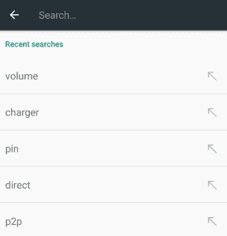
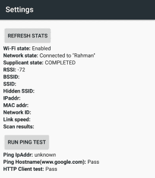

# 以下是如何访问手机上的隐藏设置

> 原文：<https://www.xda-developers.com/heres-how-to-access-hidden-settings-on-your-phone/>

根据你的手机基于什么样的安卓系统，你可能会被一个...至少可以说有点乱。

出于这个原因，谷歌从 Android 5.0 Lollipop 开始在设置应用程序中引入了搜索功能。

 <picture></picture> 

Settings App Search Menu

但是，有几个设置屏幕无法从该搜索栏访问。这些活动可以在设置应用程序中调用，但是，它们需要您直接调用它们，因为制造商没有提供用户可访问的链接。启动这些设置最简单的方法是使用类似于 [Activity Launcher](https://play.google.com/store/apps/details?id=de.szalkowski.activitylauncher&hl=en) 的应用程序，但是 Nova Launcher/Tasker 和其他应用程序也能够访问这些活动。不同的设备可以访问不同的隐藏菜单，但这里有几个例子是我在 Nexus 6P 上找到的(应该可以在大多数 Android 手机上访问)，还有几个是专门针对华为 P9 的。

* * *

**通知日志**

你知道 Android 会记录你所有的通知吗？自 Android 4.3 以来，谷歌隐藏了一个名为**通知日志**的隐藏设置页面，其中列出了收到的每一个通知，以及通知的标题、状态栏图标、发起应用程序和通知发布的时间。不幸的是，日志并没有记录通知的详细信息，因此您无法看到 Hangouts 消息的确切内容。这个设置页面可以在**com . Android . settings . settings $ notification station activity 找到。**

* * *

**详细的手机/网络信息和应用使用统计数据**

有一个隐藏的“测试”设置页面(**com . android . settings . Testing settings)**，许多 Android 手机都可以轻松访问。在此处的设置屏幕中，您可以查看有关您当前手机网络和 WiFi 收集的详细信息，以及应用使用统计数据。例如，在*手机信息*页面(可通过**com . Android . settings . radio info**直接访问)，你可以看到附近手机信号塔的列表(因为列表太大，我在截图中编辑了这一部分)、你的信号强度以及一些网络测试信息，如成功发送/接收的数据包。此外，您可以设置您的首选网络类型，禁用蜂窝无线电(实际上与启用飞行模式相同，无需切换 WiFi/蓝牙)，并更改其他一些网络设置。请注意，这些网络设置被隐藏是有原因的，所以**不要改变任何设置，除非你完全确定你知道你在做什么。**

接下来是**使用统计**(可通过**com . Android . settings . usagestatactivity**直接访问)屏幕。在这里，我们有一个页面，为我们提供一些基本信息，说明我们使用某些应用程序的时间。Android 记录并列出你的应用程序使用情况，并允许你按使用时间、上次使用应用程序的时间或应用程序名称进行排序。这是一种快速简单的方法，可以查看您经常使用的应用程序，而不必授权第三方应用程序来跟踪您的习惯。是的，它会在重启后继续存在。

最后，还有隐藏的 WiFi 设置页面(可通过**com . Android . settings . WiFi . WiFi info**或在拨号器中输入*#*#4636#*#*直接访问)。不过，对于普通用户来说，这里没有太多有用的信息。WiFi API 页面列出了一些选项，开发人员可以使用这些选项来获取有关设备 WiFi 连接的信息，但没有什么可供您使用。WiFi 配置页面提供了大量关于您当前配置的 WiFi 网络的信息，所以如果这些信息与您相关，那么您会喜欢这个页面。最后，Wifi 状态页面提供了一个更精简的 Wifi 配置版本，甚至允许您运行一个快速 ping 测试来测试您的连接。

 <picture></picture> 

Note: You must hit "Refresh Stats" to see detailed information.

* * *

**华为 P9 特定设置**

这就是事情变得有趣的地方。设备制造商经常隐藏他们自己的特定设置，就像上面的几个活动一样，你必须做一些挖掘来找到其中的一些。对于华为的 P9，我找到了几个例子。

*USB OTG 开关*

现在有一个奇怪的特征。显然，有一个隐藏的开关应该用来启用/禁用 USB OTG(默认情况下该选项是关闭的)，但出于某种原因，它被排除在设置应用程序之外。据我所知，无论这个屏幕中的选项是否启用，USB OTG 都可以工作。也许华为原本打算默认禁用该功能，但后来决定反对？

*信号图标样式*

此设置允许您根据您插入的 SIM 卡数量来更改信号图标的行为(华为 P9 接受两个 SIM 卡)。

*时间显示模式*

通过此设置，您可以选择是否要以当地时间或北京时间显示通话、消息和日历中的时间戳。我不知道为什么这个菜单会存在，但是如果你需要它，它就在那里。

*音频平衡*

这里有一个有趣的被华为隐藏了:声音平衡功能。据推测，你应该能够控制左/右声音平衡使用这个滑块，但我听不出任何区别。也许华为在开发过程中取消了这个功能，所以我们可能会在未来的华为手机中看到它。

* * *

现在，我们已经完成了一些隐藏的设置活动以及如何访问它们，你应该尝试挖掘手机的设置应用程序，看看你是否能找到任何有趣的东西。谁知道呢，可能有一个真正有用的功能在最后一刻被剪掉了！

试试吧，让我们知道你在下面的评论中发现了什么。