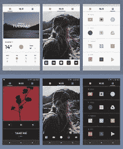

# 主屏幕教程:Oviate(又名 Nova Launcher 的 Aviate 风格)

> 原文：<https://www.xda-developers.com/homescreen-tutorial-oviate-aka-aviate-style-for-nova-launcher/>

如果你有点厌倦了你的 Android 主屏幕，那么这个受飞行员启发的设置可能是你需要的。Aviate Launcher 有一个伟大的想法，许多人至今仍在使用它，但它对定制的固执和被雅虎收购让一些人却步。不过，它唯一拥有的是全新的设置和适应特定条件的能力。由 Andre Zimmerman(又名 Kohlewrrk)设计的 Oviate 给你一个 3 页的主屏幕，不仅看起来清新干净，而且还有些锦囊妙计。

 <picture></picture> 

Dark or light, take your pick.

首先，你可以改变背景和区块的颜色。但它的主要销售功能，即当你的耳机插上电源时，可以切换到一个类似音乐的小工具，使它绝对是一个独特的设置。如果你想在你的安卓手机上设置它，请观看视频或阅读下面的指南。

# 所需的应用和资源

## 应用程序

[**新星发射器**](http://bit.ly/29QFHTl)

[**Kustom 动态壁纸**](http://bit.ly/2saCbJa)

[**Kustom 动态壁纸 Pro 键**](http://bit.ly/2qwxMmD)

## 图标包

[**Delta 图标包**](http://bit.ly/2rB1arY)

[**平铺图标包**](http://bit.ly/2rBlARS)

## Kustom 和 Tasker 资源公司

[**产卵预置**](http://bit.ly/2rjVD8f)

[**气象局**](http://bit.ly/2rgFD4N)

[**Tasker 耳机预设**](http://bit.ly/2r7UWyq)

# Nova 发射器设置

打开 Nova 启动器设置，然后进行以下设置:

1.  **桌面**
    1.  建议使用桌面网格- 9x5，并启用子网格定位
    2.  图标布局-设置图标大小为 115%,禁用主屏幕上的标签。
2.  **停靠** -禁用
3.  **外观和感觉** -图标主题可以设置为 Delta 图标包，以便于放置在主屏幕上
4.  添加 3 个空白主屏幕，因此删除任何应用程序图标和小工具(请注意，您不会有应用程序抽屉，因此在添加新小工具时，可以通过 Nova Launcher 操作添加一个，或者在 Nova Launcher 设置的手势部分将应用程序抽屉设置为向上滑动时打开)。

# Kustom 动态壁纸设置

1.  将 [Oviate 预设](http://bit.ly/2rjVD8f)复制到您的手机上。
2.  通过 Live Wallpapers 或应用程序打开 Kustom (KLWP)，然后选择顶部的齿轮图标打开其编辑设置。
3.  打开后，选择左上方的菜单，然后加载预设。
4.  点击顶部的打开图标，然后选择 Oviate.klwp 预设文件。
5.  选择“导出”选项卡，在该选项卡中可以选择 Oviate 预设。
6.  一旦选定，您可以编辑它的全局变量设置，如颜色和背景图像。
7.  如果您对结果满意，请选择保存图标，并按照屏幕上的提示将该预设设置为您的新壁纸。

如果天气图标显示不正确，尝试重新载入预设几次。如果第一种方法不起作用，天气组件也是可用的。

此外，如果你想看如何让颜色自动昼夜循环变化的视频，请在下面留下评论。

# 图标设置

只需打开你的应用抽屉，将需要的图标拖到最右边的屏幕上。中间主屏幕的图标可以编辑成最大图标包或任何你需要的免费选项。

# 包设置

1.  将[任务预设](http://bit.ly/2r7UWyq)复制到您的手机上。
2.  打开 Tasker，点击配置文件选项卡，然后选择导入。
3.  轻按电话图标，然后找到您保存的位置。xml 预设文件，并选择它。
4.  现在应该会出现耳机配置文件。
5.  你可以通过启动你的音乐应用程序，插入你的耳机，然后拔出来进行测试。最左边的主屏幕应该相应地改变。

仅此而已。如果你有任何问题，我可以在下面的评论区提出来。如果你是 Kustom 和 Android 主屏幕个性化的新手，请查看这个[主屏幕](https://www.xda-developers.com/tutorial-clear-drawer-for-nova-launcher/)和这个[介绍视频](http://bit.ly/2rkuCBs)了解更多细节。